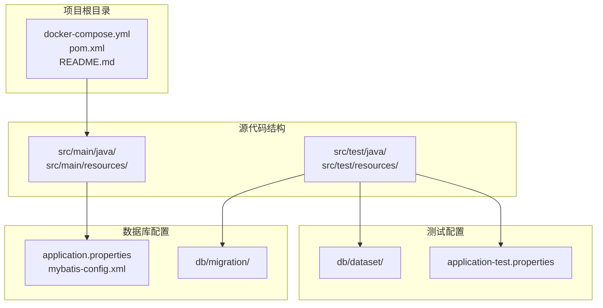
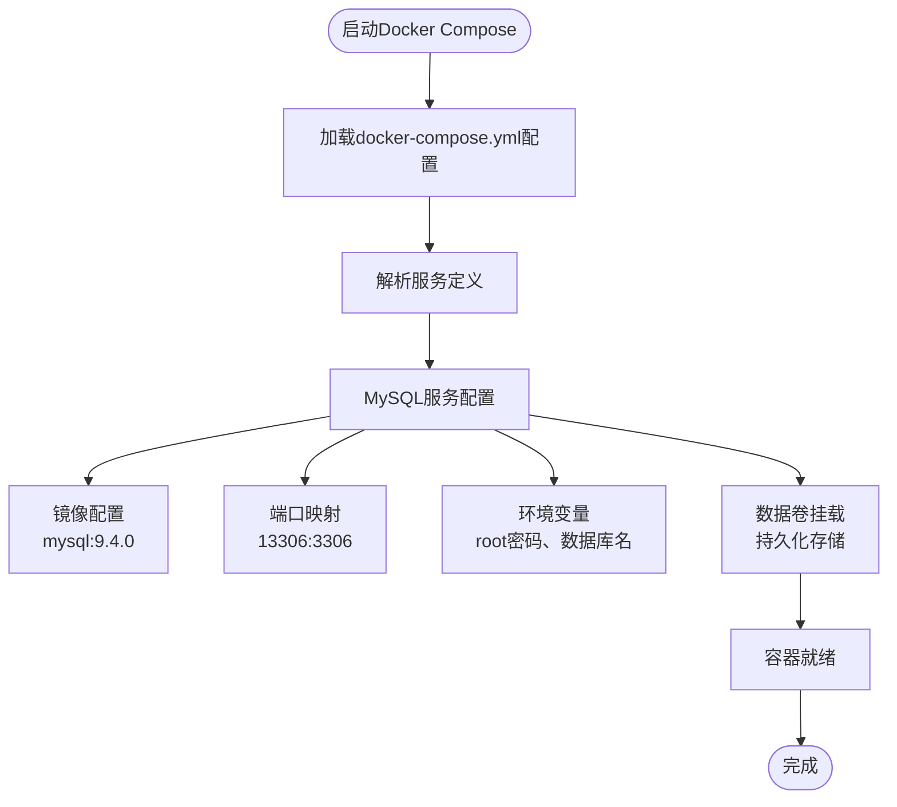
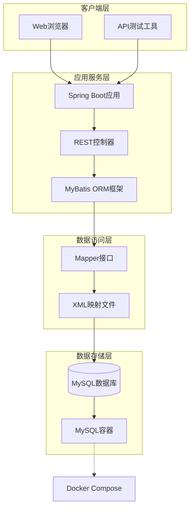
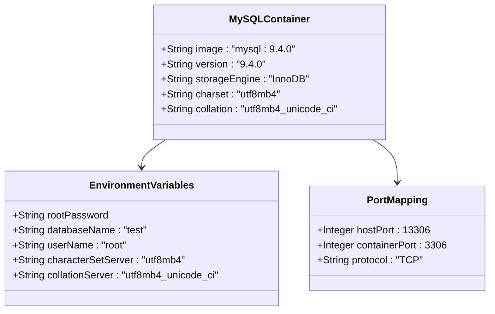
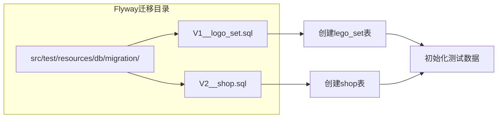
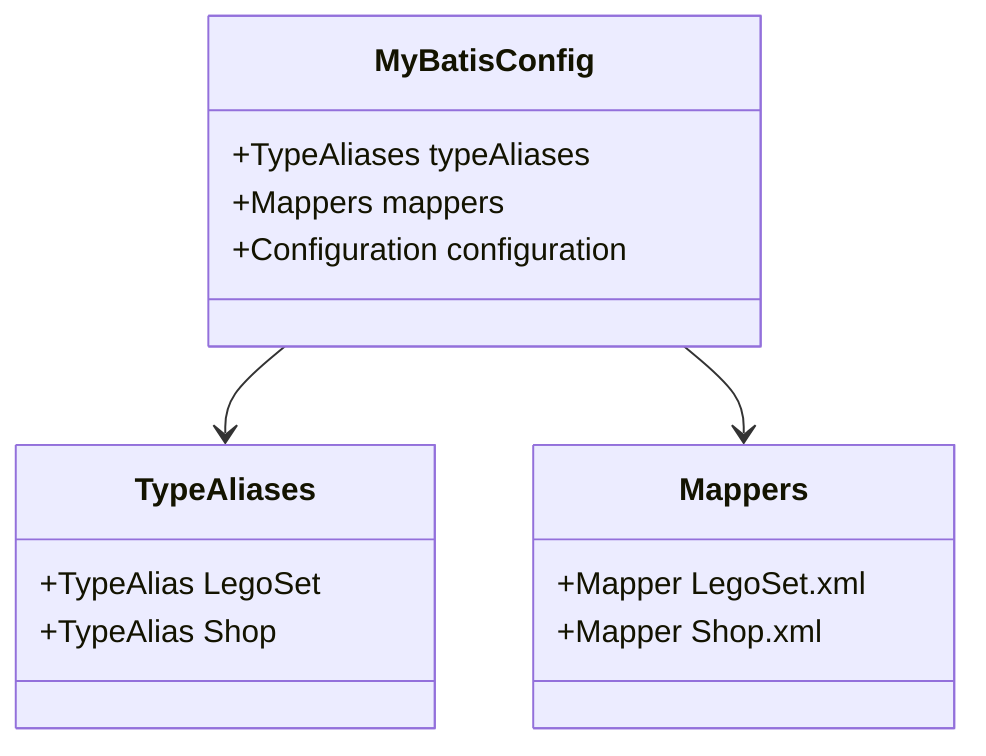
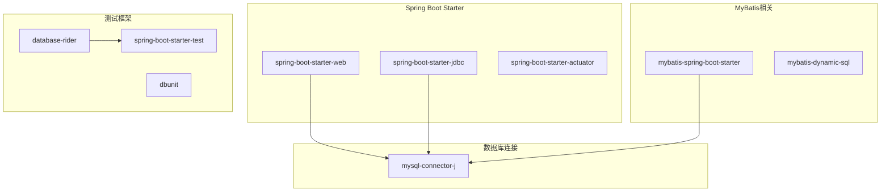
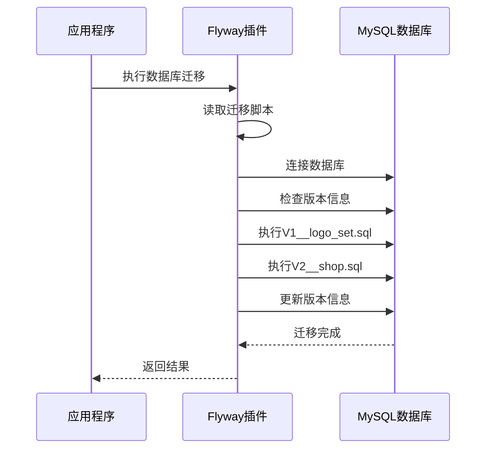

# Docker容器化

<cite>
**本文引用的文件**
- [docker-compose.yml](file://docker-compose.yml)
- [README.md](file://README.md)
- [application.properties](file://src/main/resources/application.properties)
- [pom.xml](file://pom.xml)
- [mybatis-config.xml](file://src/main/resources/mybatis-config.xml)
- [V1__logo_set.sql](file://src/test/resources/db/migration/V1__logo_set.sql)
- [V2__shop.sql](file://src/test/resources/db/migration/V2__shop.sql)
- [LegoSetController.java](file://src/main/java/org/mvnsearch/mybatis/demo/web/LegoSetController.java)
- [LegoSetMapperTest.java](file://src/test/java/org/mvnsearch/mybatis/demo/repo/LegoSetMapperTest.java)
</cite>

## 目录
1. [简介](#简介)
2. [项目结构](#项目结构)
3. [核心组件](#核心组件)
4. [架构概览](#架构概览)
5. [详细组件分析](#详细组件分析)
6. [依赖分析](#依赖分析)
7. [性能考虑](#性能考虑)
8. [故障排除指南](#故障排除指南)
9. [结论](#结论)
10. [附录](#附录)

## 简介

本指南详细说明了基于MyBatis Spring Boot项目的Docker容器化配置和使用方法。该项目演示了如何使用Docker Compose快速搭建开发环境，包括MySQL数据库容器的配置、数据持久化策略以及完整的容器编排最佳实践。

项目采用现代化的技术栈：Java 21、Spring Boot 3.5.7、MyBatis Spring Boot 3.0.5和MySQL数据库，通过Docker容器化实现快速部署和环境一致性。

## 项目结构

该项目采用标准的Maven多模块结构，主要包含以下关键目录：



**图表来源**
- [docker-compose.yml:1-9](file://docker-compose.yml#L1-L9)
- [pom.xml:1-141](file://pom.xml#L1-L141)
- [application.properties:1-11](file://src/main/resources/application.properties#L1-L11)

**章节来源**
- [README.md:13-29](file://README.md#L13-L29)
- [docker-compose.yml:1-9](file://docker-compose.yml#L1-L9)

## 核心组件

### Docker Compose配置

项目的核心容器化配置位于`docker-compose.yml`文件中，当前配置包含一个MySQL数据库服务：



**图表来源**
- [docker-compose.yml:1-9](file://docker-compose.yml#L1-L9)

### 数据库连接配置

应用程序通过`application.properties`文件配置数据库连接：

- **连接URL**: `jdbc:mysql://localhost:13306/test`
- **用户名**: `root`
- **密码**: `123456`
- **驱动类**: `com.mysql.cj.jdbc.Driver`

**章节来源**
- [docker-compose.yml:3-8](file://docker-compose.yml#L3-L8)
- [application.properties:2-4](file://src/main/resources/application.properties#L2-L4)

## 架构概览

项目采用经典的三层架构模式，通过Docker容器化实现服务解耦：



**图表来源**
- [LegoSetController.java:11-21](file://src/main/java/org/mvnsearch/mybatis/demo/web/LegoSetController.java#L11-L21)
- [mybatis-config.xml:6-13](file://src/main/resources/mybatis-config.xml#L6-L13)

## 详细组件分析

### MySQL数据库容器配置

#### 镜像选择与版本管理

项目使用MySQL 9.4.0版本作为基础镜像，该版本提供了最新的安全补丁和性能优化：



**图表来源**
- [docker-compose.yml:3-8](file://docker-compose.yml#L3-L8)

#### 端口映射策略

端口映射采用非标准端口（13306:3306）以避免与本地已运行的MySQL实例冲突：

- **主机端口**: 13306（避免系统默认3306端口占用）
- **容器端口**: 3306（MySQL默认端口）
- **协议**: TCP

#### 环境变量配置

数据库容器通过环境变量进行初始化配置：

| 环境变量 | 值 | 用途 |
|---------|----|------|
| MYSQL_ROOT_PASSWORD | 123456 | root用户密码 |
| MYSQL_DATABASE | test | 默认数据库名称 |
| MYSQL_USER | root | 用户名（可选） |
| MYSQL_PASSWORD | 123456 | 用户密码（可选） |

#### 数据持久化策略

当前配置未包含数据卷挂载，建议在生产环境中添加持久化配置：

```yaml
volumes:
  mysql_data:
    driver: local
```

**章节来源**
- [docker-compose.yml:3-8](file://docker-compose.yml#L3-L8)

### 数据库初始化脚本

项目包含Flyway数据库迁移脚本，用于自动初始化数据库结构：

#### 迁移脚本结构



**图表来源**
- [V1__logo_set.sql:1-6](file://src/test/resources/db/migration/V1__logo_set.sql#L1-L6)
- [V2__shop.sql:1-7](file://src/test/resources/db/migration/V2__shop.sql#L1-L7)

#### 迁移脚本内容分析

**V1__logo_set.sql** 脚本创建了乐高积木表：
- 主键：自增ID
- 字段：名称（VARCHAR 100）
- 编码：UTF-8

**V2__shop.sql** 脚本创建了商店表：
- 主键：自增ID
- 字段：名称（VARCHAR 100）、地址（VARCHAR 200）
- 编码：UTF-8

**章节来源**
- [V1__logo_set.sql:1-6](file://src/test/resources/db/migration/V1__logo_set.sql#L1-L6)
- [V2__shop.sql:1-7](file://src/test/resources/db/migration/V2__shop.sql#L1-L7)

### 应用程序配置

#### MyBatis配置

应用程序通过`mybatis-config.xml`文件配置MyBatis框架：



**图表来源**
- [mybatis-config.xml:6-13](file://src/main/resources/mybatis-config.xml#L6-L13)

#### Spring Boot配置

应用程序通过`application.properties`文件配置数据源和MyBatis：

- **数据源配置**: JDBC URL、用户名、密码、驱动类
- **MyBatis配置**: 映射器位置、类型别名包

**章节来源**
- [mybatis-config.xml:6-13](file://src/main/resources/mybatis-config.xml#L6-L13)
- [application.properties:1-11](file://src/main/resources/application.properties#L1-L11)

## 依赖分析

### Maven依赖关系

项目采用Maven构建工具，核心依赖包括：



**图表来源**
- [pom.xml:30-101](file://pom.xml#L30-L101)

### 数据库迁移配置

项目使用Flyway进行数据库版本管理：



**图表来源**
- [pom.xml:113-136](file://pom.xml#L113-L136)

**章节来源**
- [pom.xml:19-28](file://pom.xml#L19-L28)
- [pom.xml:113-136](file://pom.xml#L113-L136)

## 性能考虑

### 容器性能优化

1. **镜像选择**: 使用官方MySQL镜像确保性能和安全性
2. **资源限制**: 在生产环境中为容器设置CPU和内存限制
3. **连接池配置**: 合理配置数据库连接池大小
4. **缓存策略**: 利用Spring Boot的缓存机制减少数据库查询

### 数据库性能调优

1. **索引优化**: 为常用查询字段建立适当索引
2. **查询优化**: 使用MyBatis动态SQL优化复杂查询
3. **事务管理**: 合理使用事务边界避免长时间锁等待

## 故障排除指南

### 常见问题及解决方案

#### 数据库连接失败

**症状**: 应用程序无法连接到MySQL数据库

**排查步骤**:
1. 检查Docker容器状态：`docker-compose ps`
2. 验证端口映射：`netstat -an | grep 13306`
3. 测试数据库连接：`mysql -h localhost -P 13306 -u root -p`

**解决方案**:
- 确保MySQL容器正在运行
- 检查防火墙设置
- 验证连接参数正确性

#### 数据迁移失败

**症状**: Flyway执行迁移时出现错误

**排查步骤**:
1. 查看迁移日志：`docker-compose logs mysql`
2. 检查SQL语法：确认迁移脚本语法正确
3. 验证数据库权限：确保用户有足够权限执行DDL语句

**解决方案**:
- 修复SQL语法错误
- 授予必要的数据库权限
- 清理损坏的数据库状态

#### 应用程序启动异常

**症状**: Spring Boot应用启动失败

**排查步骤**:
1. 查看应用日志：`docker-compose logs app`
2. 检查依赖注入：验证MyBatis映射器配置
3. 验证数据库连接：确认连接字符串正确

**解决方案**:
- 修复依赖注入配置
- 更新MyBatis映射器路径
- 重新配置数据库连接

**章节来源**
- [README.md:48-59](file://README.md#L48-L59)

## 结论

本Docker容器化配置为MyBatis Spring Boot项目提供了完整的开发环境解决方案。通过标准化的容器编排，实现了环境一致性、快速部署和易于维护的目标。

建议在生产环境中进一步完善配置，包括数据持久化、健康检查、网络隔离和安全加固等措施，以满足企业级应用的需求。

## 附录

### 快速开始指南

1. **启动数据库容器**:
   ```bash
   docker-compose up -d
   ```

2. **构建应用程序**:
   ```bash
   mvn clean package
   ```

3. **运行应用程序**:
   ```bash
   mvn spring-boot:run
   ```

4. **访问应用**:
   ```
   http://localhost:8080
   ```

### 生产环境扩展配置

#### 增强的docker-compose.yml配置

```yaml
version: '3.8'
services:
  mysql:
    image: mysql:9.4.0
    ports:
      - "13306:3306"
    environment:
      MYSQL_ROOT_PASSWORD: ${MYSQL_ROOT_PASSWORD}
      MYSQL_DATABASE: ${MYSQL_DATABASE}
      MYSQL_USER: ${MYSQL_USER}
      MYSQL_PASSWORD: ${MYSQL_PASSWORD}
    volumes:
      - mysql_data:/var/lib/mysql
      - ./init-scripts:/docker-entrypoint-initdb.d
    healthcheck:
      test: ["CMD", "mysqladmin", "ping", "-h", "localhost"]
      timeout: 20s
      retries: 10
    networks:
      - app-network
    restart: unless-stopped

  app:
    build: .
    ports:
      - "8080:8080"
    depends_on:
      mysql:
        condition: service_healthy
    environment:
      SPRING_DATASOURCE_URL: jdbc:mysql://mysql:3306/${MYSQL_DATABASE}
      SPRING_DATASOURCE_USERNAME: ${MYSQL_USER}
      SPRING_DATASOURCE_PASSWORD: ${MYSQL_PASSWORD}
    networks:
      - app-network
    restart: unless-stopped

volumes:
  mysql_data:

networks:
  app-network:
    driver: bridge
```

#### 安全配置建议

1. **环境变量管理**: 使用`.env`文件管理敏感信息
2. **网络隔离**: 将数据库和应用放在不同的网络中
3. **权限控制**: 最小权限原则配置数据库用户
4. **备份策略**: 定期备份数据库和配置文件

#### 监控和日志配置

1. **应用监控**: 启用Spring Boot Actuator端点
2. **日志聚合**: 使用集中式日志管理系统
3. **性能监控**: 集成APM工具监控应用性能
4. **告警机制**: 设置数据库和应用的健康检查告警