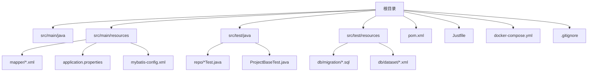
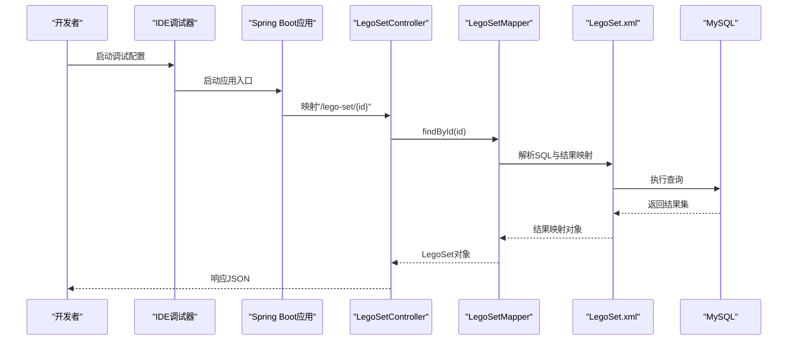
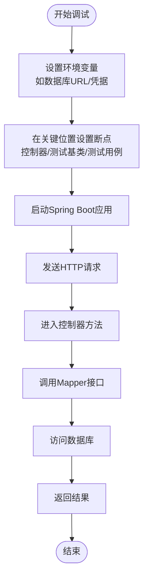
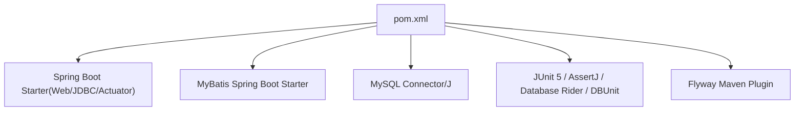

# IDE配置

<cite>
**本文引用的文件**
- [.gitignore](file://.gitignore)
- [pom.xml](file://pom.xml)
- [README.md](file://README.md)
- [AGENTS.md](file://AGENTS.md)
- [Justfile](file://Justfile)
- [docker-compose.yml](file://docker-compose.yml)
- [application.properties](file://src/main/resources/application.properties)
- [mybatis-config.xml](file://src/main/resources/mybatis-config.xml)
- [LegoSet.xml](file://src/main/resources/mapper/LegoSet.xml)
- [MyBatisApp.java](file://src/main/java/org/mvnsearch/mybatis/demo/MyBatisApp.java)
- [LegoSetController.java](file://src/main/java/org/mvnsearch/mybatis/demo/web/LegoSetController.java)
- [ProjectBaseTest.java](file://src/test/java/org/mvnsearch/mybatis/demo/ProjectBaseTest.java)
- [LegoSetMapperTest.java](file://src/test/java/org/mvnsearch/mybatis/demo/repo/LegoSetMapperTest.java)
- [DataBaseTest.java](file://src/test/java/org/mvnsearch/mybatis/demo/DataBaseTest.java)
</cite>

## 目录
1. [简介](#简介)
2. [项目结构](#项目结构)
3. [核心组件](#核心组件)
4. [架构总览](#架构总览)
5. [详细组件分析](#详细组件分析)
6. [依赖分析](#依赖分析)
7. [性能考虑](#性能考虑)
8. [故障排除指南](#故障排除指南)
9. [结论](#结论)
10. [附录](#附录)

## 简介
本指南面向使用IntelliJ IDEA与Eclipse等主流IDE的开发者，围绕本MyBatis Spring Boot演示项目提供完整的IDE配置与开发环境设置建议。内容涵盖：
- 版本控制忽略规则（.gitignore）与IDE生成文件管理
- 代码格式化与检查规则（Google Java Style、Spotless等）
- 代码模板与Live Templates设置
- 调试配置（运行配置、环境变量、断点）
- 版本控制集成（Git工具与提交模板）
- 代码质量工具（静态分析、覆盖率、SonarQube）
- 团队协作编码规范与代码审查流程

## 项目结构
该项目为基于Spring Boot与MyBatis的Java Web应用，采用Maven构建，包含主程序、资源文件、测试与数据库迁移脚本。关键目录与文件如下：
- 源码：src/main/java
- 资源：src/main/resources（含MyBatis映射XML、配置文件）
- 测试：src/test/java与src/test/resources（含数据库迁移脚本与数据集）
- 构建与运行：pom.xml、Justfile、docker-compose.yml
- 配置：application.properties、mybatis-config.xml

图表来源
- [pom.xml](file://pom.xml)
- [Justfile](file://Justfile)
- [docker-compose.yml](file://docker-compose.yml)
- [.gitignore](file://.gitignore)

章节来源
- [README.md](file://README.md)
- [pom.xml](file://pom.xml)
- [Justfile](file://Justfile)
- [docker-compose.yml](file://docker-compose.yml)

## 核心组件
- 应用入口与启动类：用于本地运行与调试
- 控制器层：REST接口定义与路由
- 数据访问层：MyBatis Mapper接口与XML映射
- 配置文件：Spring Boot属性与MyBatis全局配置
- 测试基类与测试用例：基于DBUnit与Database Rider的数据库测试
- 构建与迁移：Maven插件与Flyway数据库迁移

章节来源
- [MyBatisApp.java](file://src/main/java/org/mvnsearch/mybatis/demo/MyBatisApp.java)
- [LegoSetController.java](file://src/main/java/org/mvnsearch/mybatis/demo/web/LegoSetController.java)
- [mybatis-config.xml](file://src/main/resources/mybatis-config.xml)
- [LegoSet.xml](file://src/main/resources/mapper/LegoSet.xml)
- [ProjectBaseTest.java](file://src/test/java/org/mvnsearch/mybatis/demo/ProjectBaseTest.java)
- [LegoSetMapperTest.java](file://src/test/java/org/mvnsearch/mybatis/demo/repo/LegoSetMapperTest.java)
- [pom.xml](file://pom.xml)

## 架构总览
下图展示从IDE调试到数据库的端到端流程，包括应用启动、请求处理、MyBatis查询与数据库交互。

图表来源
- [MyBatisApp.java](file://src/main/java/org/mvnsearch/mybatis/demo/MyBatisApp.java)
- [LegoSetController.java](file://src/main/java/org/mvnsearch/mybatis/demo/web/LegoSetController.java)
- [LegoSet.xml](file://src/main/resources/mapper/LegoSet.xml)
- [application.properties](file://src/main/resources/application.properties)
- [docker-compose.yml](file://docker-compose.yml)

## 详细组件分析

### 版本控制忽略规则（.gitignore）
- 忽略目标：编译产物、日志、IDE特定文件、Maven构建输出、Eclipse生成文件等
- IDE相关：IntelliJ IDEA工作区、任务、字典、数据源、Gradle配置、缓存等；保留团队共享的代码样式与运行配置
- Maven相关：target目录、发布与版本备份文件、Maven wrapper二进制、Eclipse m2e生成文件

建议
- 在团队内统一保留“.idea/codeStyles”与“.idea/runConfigurations”，以共享代码风格与运行配置
- 对于CI/CD场景，确保忽略规则不会误排除必要的构建产物或配置文件

章节来源
- [.gitignore](file://.gitignore)

### 代码格式化与检查规则
- 编译参数：启用参数信息传递，便于调试与文档生成
- 推荐工具：Google Java Style、Spotless Maven/Gradle插件、Checkstyle/SpotBugs/PMD（可选）
- 集成方式：在pom.xml中配置插件，IDE通过Maven导入自动应用规则；或在IDE中安装对应插件并绑定到项目

建议
- 使用Spotless统一格式化与许可头检查，避免因IDE差异导致的格式漂移
- 将格式化与检查作为CI流水线步骤，保证合并前一致性

章节来源
- [pom.xml](file://pom.xml)

### 代码模板与Live Templates
- 建议模板类型：类注释、方法注释、TODO占位、常用导入、测试桩
- 模板变量：作者、日期、包名、类名、方法名、参数列表
- 在IDE中设置模板快捷键，结合Postfix Completion提升效率

说明
- 本节为通用实践建议，不直接引用具体文件

### 调试配置
- 运行配置：以Spring Boot应用入口类为启动目标，设置JVM参数与环境变量
- 环境变量：数据库连接参数（可在application.properties中配置），或在IDE运行配置中覆盖
- 断点策略：在控制器、Mapper接口、测试基类与测试用例中设置断点，定位问题范围

图表来源
- [MyBatisApp.java](file://src/main/java/org/mvnsearch/mybatis/demo/MyBatisApp.java)
- [LegoSetController.java](file://src/main/java/org/mvnsearch/mybatis/demo/web/LegoSetController.java)
- [application.properties](file://src/main/resources/application.properties)
- [docker-compose.yml](file://docker-compose.yml)

章节来源
- [MyBatisApp.java](file://src/main/java/org/mvnsearch/mybatis/demo/MyBatisApp.java)
- [LegoSetController.java](file://src/main/java/org/mvnsearch/mybatis/demo/web/LegoSetController.java)
- [application.properties](file://src/main/resources/application.properties)
- [docker-compose.yml](file://docker-compose.yml)

### 版本控制集成（Git）
- 工具集成：IDE内置Git支持（提交、暂存、分支、合并、冲突解决）
- 提交模板：建议在IDE中配置提交模板，包含“类型: 摘要”、“动机/变更点/影响”等字段
- 分支策略：建议采用功能分支与PR流程，配合代码审查

说明
- 本节为通用实践建议，不直接引用具体文件

### 代码质量工具
- 静态分析：SpotBugs、PMD、Checkstyle（可选）
- 覆盖率：JaCoCo（在pom.xml中配置），IDE中查看覆盖率报告
- SonarQube：在CI中集成，本地可使用SonarLint插件进行实时提示

建议
- 将质量门禁纳入CI，失败时阻断合并
- 定期清理技术债，保持规则阈值稳定

章节来源
- [pom.xml](file://pom.xml)

### 团队协作编码规范与代码审查流程
- 编码规范：统一包结构、命名约定、注释规范、异常处理与日志级别
- 代码审查：PR模板、审查清单（正确性、可读性、性能、安全性、测试覆盖）
- 文档与知识库：在仓库中维护AGENTS.md等文档，沉淀最佳实践

章节来源
- [AGENTS.md](file://AGENTS.md)

## 依赖分析
- Spring Boot父工程提供默认版本与插件管理
- MyBatis Spring Boot Starter与MyBatis动态SQL
- 测试框架：JUnit 5、AssertJ、Database Rider、DBUnit
- 数据库：MySQL Connector/J，Flyway用于数据库迁移

图表来源
- [pom.xml](file://pom.xml)

章节来源
- [pom.xml](file://pom.xml)

## 性能考虑
- 启动优化：仅加载必要模块，延迟初始化非关键Bean
- 查询优化：合理使用MyBatis缓存、分页与索引
- 资源优化：限制日志级别，避免生产环境过度打印
- CI加速：缓存依赖、并行执行测试与质量检查

说明
- 本节提供一般性指导，不直接引用具体文件

## 故障排除指南
- 数据库未启动：确认Docker Compose已启动MySQL服务，端口映射与凭据正确
- 连接失败：核对application.properties中的数据库URL、用户名、密码
- Mapper未找到：确认MyBatis配置文件与Mapper XML路径一致
- 测试失败：检查测试数据集与数据库迁移脚本是否同步

章节来源
- [docker-compose.yml](file://docker-compose.yml)
- [application.properties](file://src/main/resources/application.properties)
- [mybatis-config.xml](file://src/main/resources/mybatis-config.xml)
- [LegoSet.xml](file://src/main/resources/mapper/LegoSet.xml)

## 结论
通过遵循本指南的IDE配置与开发实践，团队可以在IntelliJ IDEA与Eclipse中获得一致、高效的开发体验。结合版本控制、代码质量工具与标准化的代码审查流程，能够持续提升代码质量与交付效率。

## 附录
- 快速启动命令参考（来自Justfile与README）
  - 构建：跳过测试打包
  - 数据库迁移：清理并执行迁移
  - 生成DTD：基于测试数据集生成数据库DTD
  - MySQL CLI：连接本地数据库
  - SBOM生成：生成软件物料清单

章节来源
- [Justfile](file://Justfile)
- [README.md](file://README.md)