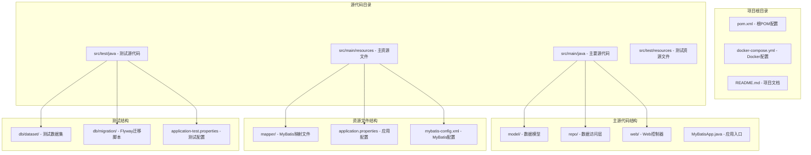
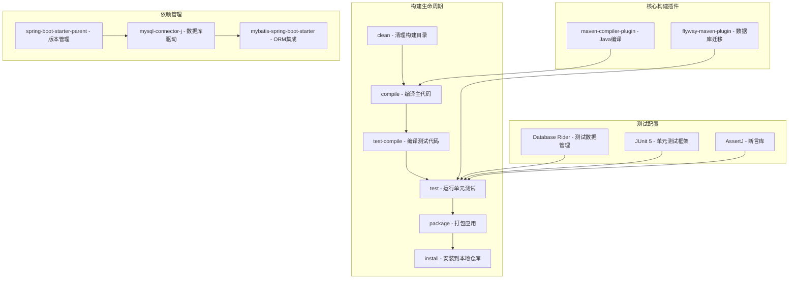
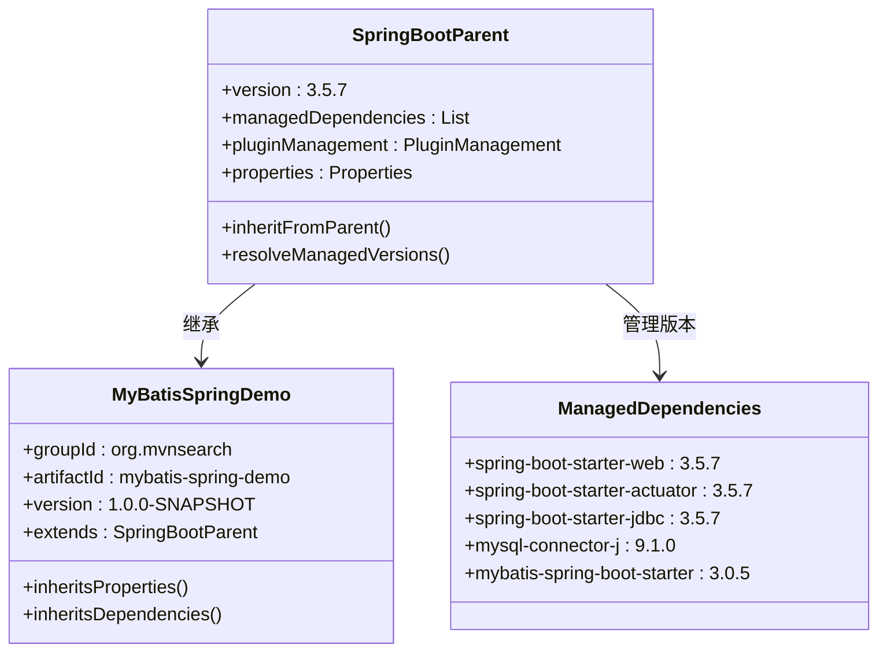
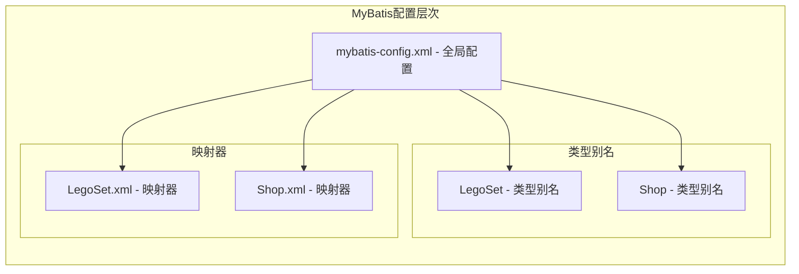
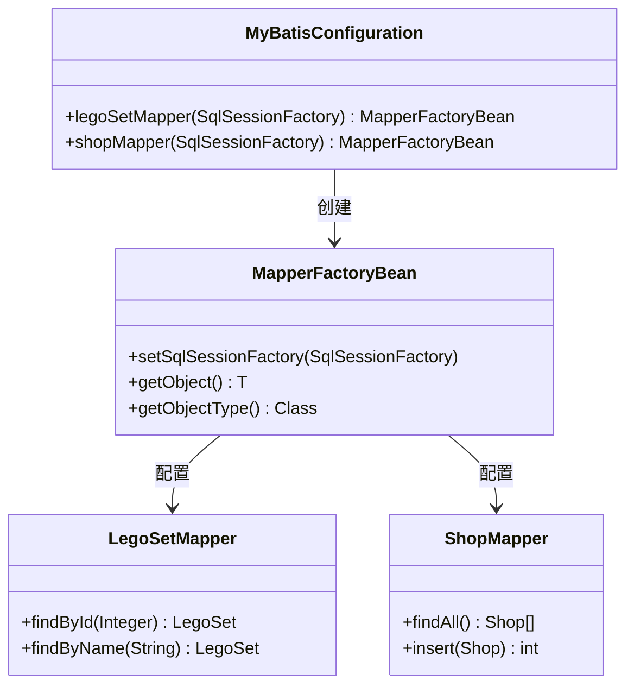
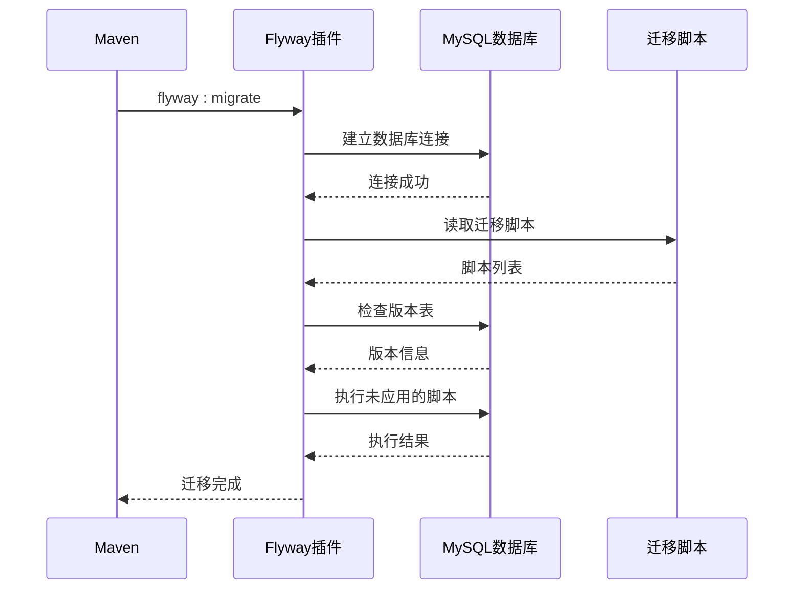
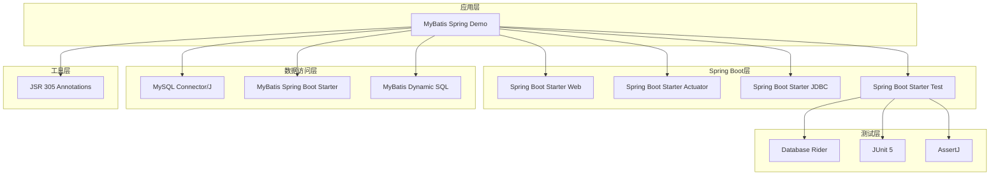

# Maven构建配置

<cite>
**本文档引用的文件**
- [pom.xml](file://pom.xml)
- [application.properties](file://src/main/resources/application.properties)
- [application-test.properties](file://src/test/resources/application-test.properties)
- [mybatis-config.xml](file://src/main/resources/mybatis-config.xml)
- [MyBatisConfiguration.java](file://src/main/java/org/mvnsearch/mybatis/demo/repo/MyBatisConfiguration.java)
- [V1__logo_set.sql](file://src/test/resources/db/migration/V1__logo_set.sql)
- [V2__shop.sql](file://src/test/resources/db/migration/V2__shop.sql)
- [docker-compose.yml](file://docker-compose.yml)
- [DataBaseTest.java](file://src/test/java/org/mvnsearch/mybatis/demo/DataBaseTest.java)
- [LegoSetMapperTest.java](file://src/test/java/org/mvnsearch/mybatis/demo/repo/LegoSetMapperTest.java)
- [ProjectBaseTest.java](file://src/test/java/org/mvnsearch/mybatis/demo/ProjectBaseTest.java)
</cite>

## 目录
1. [简介](#简介)
2. [项目结构](#项目结构)
3. [核心组件](#核心组件)
4. [架构概览](#架构概览)
5. [详细组件分析](#详细组件分析)
6. [依赖关系分析](#依赖关系分析)
7. [性能考虑](#性能考虑)
8. [故障排除指南](#故障排除指南)
9. [结论](#结论)

## 简介

这是一个基于Spring Boot和MyBatis的演示项目，展示了现代Java应用程序的Maven构建配置最佳实践。该项目使用Spring Boot父POM进行版本管理，集成了MySQL数据库、MyBatis ORM框架、Flyway数据库迁移工具以及完整的测试生态系统。

## 项目结构

项目采用标准的Maven多模块结构，包含以下主要目录：



**图表来源**
- [pom.xml:1-141](file://pom.xml#L1-L141)
- [docker-compose.yml:1-9](file://docker-compose.yml#L1-L9)

**章节来源**
- [pom.xml:1-141](file://pom.xml#L1-L141)
- [docker-compose.yml:1-9](file://docker-compose.yml#L1-L9)

## 核心组件

### Spring Boot父POM配置

项目使用Spring Boot 3.5.7版本的父POM，提供了统一的版本管理和依赖管理：

- **版本管理**: 通过`spring-boot-starter-parent`实现
- **Java版本**: 使用Java 21作为默认编译目标
- **自动配置**: 启动器依赖提供开箱即用的功能

### 核心依赖配置

#### Web和监控依赖
- `spring-boot-starter-web`: 提供Web应用开发所需的所有依赖
- `spring-boot-starter-actuator`: 提供生产环境监控和管理功能
- `spring-boot-starter-jdbc`: 提供JDBC数据访问支持

#### 数据库和ORM依赖
- `mysql-connector-j`: MySQL数据库驱动程序
- `mybatis-spring-boot-starter`: MyBatis与Spring Boot的集成启动器
- `mybatis-dynamic-sql`: 动态SQL生成库

#### 开发工具依赖
- `jspecify`: Java空值注解支持

**章节来源**
- [pom.xml:30-101](file://pom.xml#L30-L101)

## 架构概览

项目采用分层架构设计，展示了完整的Maven构建流程：



**图表来源**
- [pom.xml:102-138](file://pom.xml#L102-L138)
- [pom.xml:19-28](file://pom.xml#L19-L28)

## 详细组件分析

### Spring Boot父POM作用机制

Spring Boot父POM通过以下方式提供版本管理：



**图表来源**
- [pom.xml:7-11](file://pom.xml#L7-L11)
- [pom.xml:30-56](file://pom.xml#L30-L56)

#### 版本管理特性

- **统一版本控制**: 所有Spring Boot相关依赖使用相同的版本号
- **传递性依赖管理**: 自动解析和管理传递性依赖
- **插件版本管理**: 统一管理Maven插件版本

**章节来源**
- [pom.xml:7-11](file://pom.xml#L7-L11)
- [pom.xml:19-28](file://pom.xml#L19-L28)

### MyBatis集成配置

#### MyBatis配置文件结构



**图表来源**
- [mybatis-config.xml:6-13](file://src/main/resources/mybatis-config.xml#L6-L13)

#### Java配置替代方案

项目同时提供了基于Java的MyBatis配置：



**图表来源**
- [MyBatisConfiguration.java:8-24](file://src/main/java/org/mvnsearch/mybatis/demo/repo/MyBatisConfiguration.java#L8-L24)

**章节来源**
- [mybatis-config.xml:1-14](file://src/main/resources/mybatis-config.xml#L1-L14)
- [MyBatisConfiguration.java:1-25](file://src/main/java/org/mvnsearch/mybatis/demo/repo/MyBatisConfiguration.java#L1-L25)

### Flyway数据库迁移配置

#### Flyway插件配置详解



**图表来源**
- [pom.xml:112-136](file://pom.xml#L112-L136)

#### 迁移脚本结构

项目包含两个数据库迁移脚本：

| 版本 | 文件名 | 描述 |
|------|--------|------|
| V1 | V1__logo_set.sql | 创建LegoSet表 |
| V2 | V2__shop.sql | 创建Shop表 |

**章节来源**
- [pom.xml:112-136](file://pom.xml#L112-L136)
- [V1__logo_set.sql:1-6](file://src/test/resources/db/migration/V1__logo_set.sql#L1-L6)
- [V2__shop.sql:1-7](file://src/test/resources/db/migration/V2__shop.sql#L1-L7)

### 测试生态系统配置

#### Database Rider集成

```mermaid
graph TB
subgraph "测试配置层次"
BASE_TEST[ProjectBaseTest - 基础测试类]
subgraph "Database Rider配置"
DB_RIDER[@DBRider - 测试数据管理]
DB_UNIT[@DBUnit - DBUnit配置]
ACTIVE_PROFILE[@ActiveProfiles - 测试环境]
end
subgraph "测试数据"
DATASET[DataSet - XML数据集]
DTD[database.dtd - 数据库结构定义]
end
end
BASE_TEST --> DB_RIDER
BASE_TEST --> DB_UNIT
BASE_TEST --> ACTIVE_PROFILE
DB_RIDER --> DATASET
DATASET --> DTD
```

**图表来源**
- [ProjectBaseTest.java:15-21](file://src/test/java/org/mvnsearch/mybatis/demo/ProjectBaseTest.java#L15-L21)

#### 测试依赖结构

| 依赖类型 | 组件 | 版本 | 用途 |
|----------|------|------|------|
| 测试启动器 | spring-boot-starter-test | 管理版本 | Spring Boot测试支持 |
| Database Rider | rider-core | 1.44.0 | 测试数据管理 |
| Database Rider | rider-spring | 1.44.0 | Spring集成 |
| Database Rider | rider-junit5 | 1.44.0 | JUnit 5支持 |
| AssertJ | assertj-core | 测试断言 | 流畅断言API |
| JUnit 5 | junit-jupiter | 测试执行 | 单元测试框架 |

**章节来源**
- [pom.xml:62-100](file://pom.xml#L62-L100)
- [ProjectBaseTest.java:1-22](file://src/test/java/org/mvnsearch/mybatis/demo/ProjectBaseTest.java#L1-L22)

## 依赖关系分析

### 依赖树可视化



**图表来源**
- [pom.xml:30-101](file://pom.xml#L30-L101)

### 版本管理策略

项目采用以下版本管理策略：

1. **父POM版本管理**: 核心Spring Boot依赖由父POM统一管理
2. **属性化版本**: 第三方库版本通过Maven属性进行集中管理
3. **测试依赖隔离**: 测试专用依赖标记为test范围

**章节来源**
- [pom.xml:19-28](file://pom.xml#L19-L28)
- [pom.xml:23-27](file://pom.xml#L23-L27)

## 性能考虑

### 编译性能优化

- **Java版本**: 使用Java 21以获得更好的编译性能
- **编译参数**: 启用参数信息收集以支持反射和调试
- **并行编译**: Maven默认支持并行编译多个模块

### 数据库连接优化

- **连接池**: Spring Boot自动配置HikariCP连接池
- **连接参数**: 通过application.properties配置连接参数
- **懒加载**: MyBatis延迟加载优化查询性能

### 测试性能优化

- **内存管理**: 测试数据集大小适中，避免内存溢出
- **并行测试**: JUnit 5支持测试并行执行
- **缓存策略**: Database Rider缓存测试数据集

## 故障排除指南

### 常见构建问题

#### 数据库连接问题
**症状**: Flyway迁移失败或应用启动时数据库连接异常
**解决方案**:
1. 检查MySQL服务是否运行
2. 验证数据库连接URL、用户名和密码
3. 确认MySQL端口映射正确（13306:3306）

#### MyBatis映射问题
**症状**: MyBatis映射器无法找到或SQL执行失败
**解决方案**:
1. 检查mybatis-config.xml中的映射器路径
2. 验证XML映射文件的命名空间
3. 确认实体类包名与配置一致

#### 测试数据问题
**症状**: 测试执行时数据不一致或测试失败
**解决方案**:
1. 检查XML数据集文件格式
2. 验证数据库结构与数据集匹配
3. 确认测试数据集的依赖顺序

**章节来源**
- [docker-compose.yml:1-9](file://docker-compose.yml#L1-L9)
- [application.properties:1-11](file://src/main/resources/application.properties#L1-L11)

### 调试技巧

#### 启用详细日志
在application.properties中调整日志级别：
- `logging.level.org.springframework.jdbc.core.JdbcTemplate=DEBUG`
- `logging.level.example.springdata.jdbc.mybatis=TRACE`

#### 验证依赖解析
使用Maven命令检查依赖树：
```bash
mvn dependency:tree
mvn dependency:resolve
```

## 结论

这个Maven构建配置展示了现代Java应用程序的最佳实践：

1. **版本管理**: 通过Spring Boot父POM实现统一的版本控制
2. **依赖管理**: 合理的依赖分层和作用域管理
3. **测试策略**: 完整的测试生态系统集成
4. **数据库迁移**: 使用Flyway进行版本化的数据库变更管理
5. **配置管理**: 属性化配置和环境分离

该配置为类似项目提供了可复用的模板，涵盖了从开发到生产的完整构建流程。