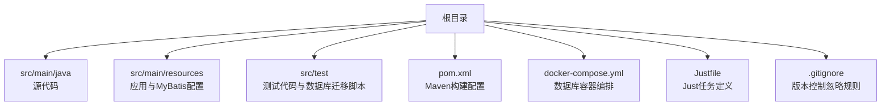
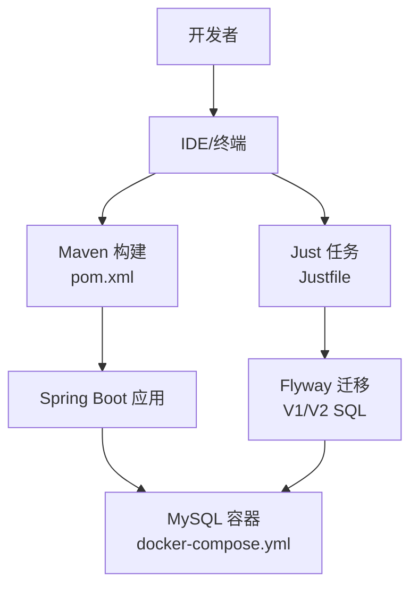
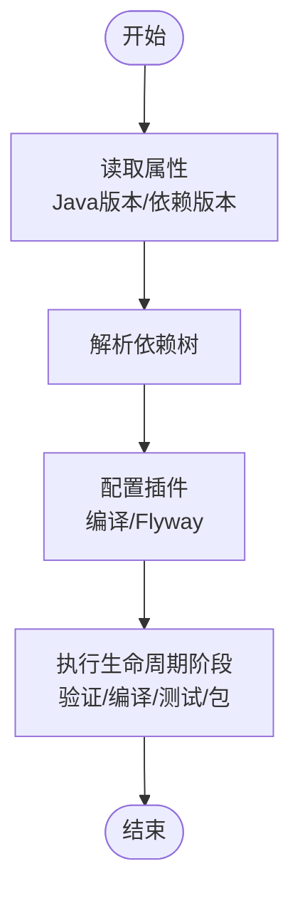
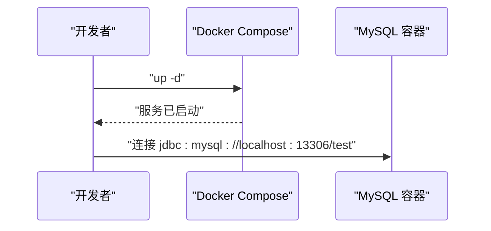
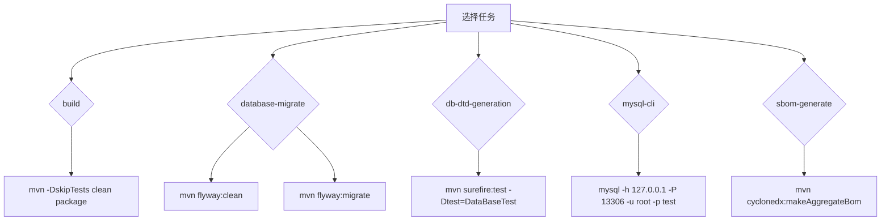
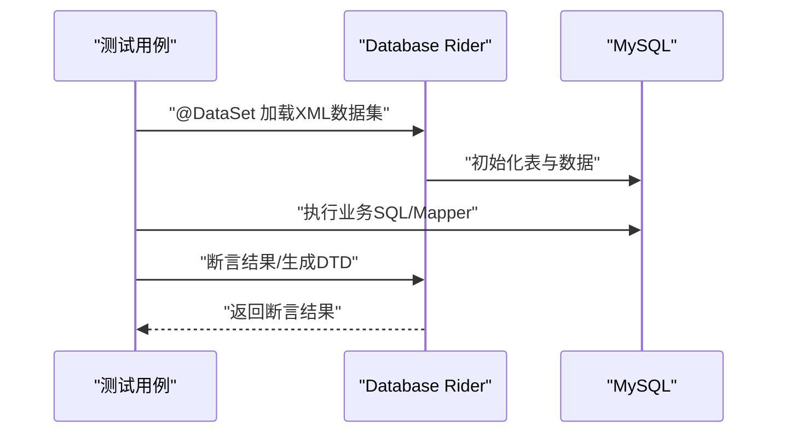
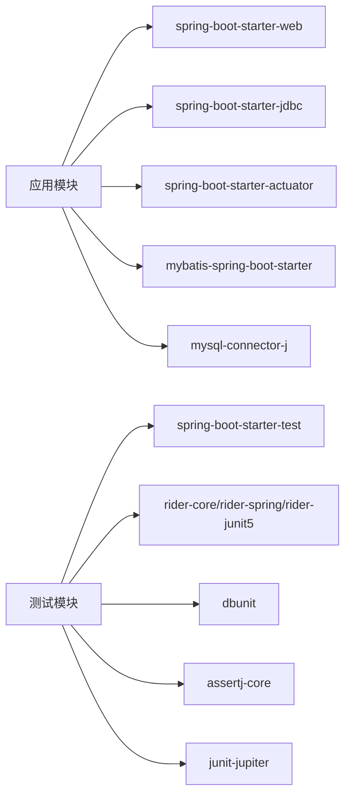

# 开发工具

<cite>
**本文引用的文件**
- [pom.xml](file://pom.xml)
- [docker-compose.yml](file://docker-compose.yml)
- [Justfile](file://Justfile)
- [README.md](file://README.md)
- [AGENTS.md](file://AGENTS.md)
- [.gitignore](file://.gitignore)
- [application.properties](file://src/main/resources/application.properties)
- [mybatis-config.xml](file://src/main/resources/mybatis-config.xml)
- [DataBaseTest.java](file://src/test/java/org/mvnsearch/mybatis/demo/DataBaseTest.java)
- [application-test.properties](file://src/test/resources/application-test.properties)
- [logback-test.xml](file://src/test/resources/logback-test.xml)
- [V1__logo_set.sql](file://src/test/resources/db/migration/V1__logo_set.sql)
- [V2__shop.sql](file://src/test/resources/db/migration/V2__shop.sql)
</cite>

## 目录
1. [简介](#简介)
2. [项目结构](#项目结构)
3. [核心组件](#核心组件)
4. [架构总览](#架构总览)
5. [详细组件分析](#详细组件分析)
6. [依赖分析](#依赖分析)
7. [性能考虑](#性能考虑)
8. [故障排查指南](#故障排查指南)
9. [结论](#结论)
10. [附录](#附录)

## 简介
本指南面向使用该 MyBatis + Spring Boot 示例项目的开发者，系统讲解开发与辅助工具的使用方法，涵盖以下主题：
- Maven 构建配置：依赖管理、插件配置与构建生命周期要点
- Docker Compose 使用：容器编排、网络与数据持久化
- Justfile 自动化：构建任务、Flyway 数据库迁移、SBOM 生成与 MySQL CLI
- IDE 配置与代码格式化：基于仓库忽略规则与项目风格建议
- Git 工作流与分支策略：结合忽略规则与团队协作最佳实践
- 调试技巧、性能分析与监控：日志级别与 Actuator 指标
- 代码质量工具集成：单元测试、断言库、数据库测试与 DTD 生成
- 开发环境标准化与团队协作最佳实践

## 项目结构
该项目采用标准 Maven 结构，包含源码、资源、测试与数据库迁移脚本。关键配置集中在根目录的构建与编排文件中。

图表来源
- [pom.xml](file://pom.xml)
- [docker-compose.yml](file://docker-compose.yml)
- [Justfile](file://Justfile)
- [.gitignore](file://.gitignore)

章节来源
- [README.md](file://README.md)
- [AGENTS.md](file://AGENTS.md)

## 核心组件
- Maven 构建与依赖
  - 继承 Spring Boot 起步父工程，统一版本与插件默认行为
  - 核心依赖：Spring Web、Actuator、JDBC、MyBatis Spring Boot 启动器、MySQL Connector、数据库测试支持（Database Rider、DBUnit、AssertJ、JUnit5）
  - 构建插件：编译插件启用参数信息；Flyway 插件用于数据库迁移，配置了迁移脚本位置与凭据
- Docker Compose 编排
  - 提供 MySQL 服务，映射端口与设置 root 密码及默认数据库
- Justfile 任务
  - 构建打包、Flyway 迁移、数据库 DTD 生成、MySQL CLI、SBOM 生成
- 应用配置
  - application.properties：数据源、MyBatis 配置、日志级别
  - mybatis-config.xml：类型别名与 Mapper XML 映射注册
- 测试与数据库
  - 测试配置：application-test.properties、logback-test.xml
  - 数据库迁移脚本：V1__logo_set.sql、V2__shop.sql
  - 数据集与 DTD 生成：DataBaseTest 中使用 DBUnit 与 Database Rider

章节来源
- [pom.xml](file://pom.xml)
- [docker-compose.yml](file://docker-compose.yml)
- [Justfile](file://Justfile)
- [application.properties](file://src/main/resources/application.properties)
- [mybatis-config.xml](file://src/main/resources/mybatis-config.xml)
- [DataBaseTest.java](file://src/test/java/org/mvnsearch/mybatis/demo/DataBaseTest.java)
- [application-test.properties](file://src/test/resources/application-test.properties)
- [logback-test.xml](file://src/test/resources/logback-test.xml)
- [V1__logo_set.sql](file://src/test/resources/db/migration/V1__logo_set.sql)
- [V2__shop.sql](file://src/test/resources/db/migration/V2__shop.sql)

## 架构总览
下图展示本地开发时的典型交互：IDE/命令行通过 Maven 打包运行，Justfile 协调 Flyway 迁移与 SBOM 生成；Spring Boot 应用连接 Docker Compose 提供的 MySQL 实例。

图表来源
- [pom.xml](file://pom.xml)
- [Justfile](file://Justfile)
- [docker-compose.yml](file://docker-compose.yml)
- [V1__logo_set.sql](file://src/test/resources/db/migration/V1__logo_set.sql)
- [V2__shop.sql](file://src/test/resources/db/migration/V2__shop.sql)

## 详细组件分析

### Maven 构建配置
- 版本与继承
  - 继承 Spring Boot 起步父工程，简化依赖与插件版本管理
  - Java 版本属性统一到 21
- 依赖管理
  - Web、Actuator、JDBC、MyBatis 启动器、MySQL Connector
  - 测试依赖：Spring Boot Test、Database Rider、DBUnit、AssertJ、JUnit5
- 构建插件
  - 编译插件：启用参数信息以提升反射与工具链兼容性
  - Flyway 插件：配置 JDBC 连接、迁移脚本位置（文件系统），允许清理
- 构建生命周期要点
  - 常用命令：跳过测试打包、运行 Spring Boot 应用
  - 迁移命令：先清理后迁移，确保数据库状态与脚本一致

图表来源
- [pom.xml](file://pom.xml)

章节来源
- [pom.xml](file://pom.xml)
- [README.md](file://README.md)

### Docker Compose 使用
- 服务定义
  - MySQL 9.4.0 镜像，端口映射 13306:3306，设置 root 密码与默认数据库
- 网络与数据持久化
  - 默认桥接网络，容器内访问宿主机端口即可连接
  - 可按需挂载卷实现数据持久化（当前配置未显式声明卷）
- 快速启动
  - 后台启动数据库容器，随后可进行构建与迁移

图表来源
- [docker-compose.yml](file://docker-compose.yml)

章节来源
- [docker-compose.yml](file://docker-compose.yml)
- [application.properties](file://src/main/resources/application.properties)

### Justfile 自动化
- 构建任务
  - build：跳过测试打包，快速产出可运行包
- 数据库迁移
  - database-migrate：先清理后迁移，确保脚本一致性
  - db-dtd-generation：在迁移后执行测试生成 DTD 文件
- MySQL CLI
  - mysql-cli：便捷连接本地 MySQL 容器
- SBOM 生成
  - sbom-generate：使用 CycloneDX 插件生成软件物料清单

图表来源
- [Justfile](file://Justfile)

章节来源
- [Justfile](file://Justfile)

### IDE 配置与代码格式化
- 版本控制忽略
  - .gitignore 排除了类文件、日志、Maven 构建输出、IDE 生成文件与敏感配置
  - 团队共享应仅保留代码风格与运行配置，避免提交 IDE 专有元数据
- 代码风格建议
  - 使用 jspecify 注解明确空值语义
  - 使用 SLF4J 记录日志
  - 优先使用 AssertJ 断言库
- 运行与调试
  - 使用 Spring Boot 插件或直接运行 Jar 包
  - 在 IDE 中设置断点于控制器与 Mapper 层，结合日志级别定位问题

章节来源
- [.gitignore](file://.gitignore)
- [AGENTS.md](file://AGENTS.md)
- [application.properties](file://src/main/resources/application.properties)

### Git 工作流与分支管理
- 忽略规则
  - .gitignore 已覆盖 Maven、Java、JetBrains IDE 生成产物与日志
- 分支策略建议
  - 主干保护：master/main 仅接受经审查的合并请求
  - 功能分支：feature/*，修复分支：fix/*，发布分支：release/*
  - 提交规范：简明标题 + 详细描述，关联 Issue
- 团队协作
  - 统一 IDE 设置与代码风格，减少 CI 失败
  - 将构建与测试脚本纳入 Justfile，降低环境差异

章节来源
- [.gitignore](file://.gitignore)
- [AGENTS.md](file://AGENTS.md)

### 调试技巧、性能分析与监控
- 日志级别
  - application.properties 中已配置多层级日志，便于定位 JDBC、MyBatis 与业务层问题
- Actuator 指标
  - 引入 Spring Boot Actuator，可用于健康检查与运行指标导出
- 性能分析
  - 使用 JVM 分析工具（如 JProfiler、Async Profiler）对慢查询与热点方法进行剖析
  - 关注 MyBatis 的 SQL 执行时间与缓存命中率

章节来源
- [application.properties](file://src/main/resources/application.properties)
- [pom.xml](file://pom.xml)

### 代码质量工具集成
- 单元测试与断言
  - JUnit5 + AssertJ，提供流畅断言体验
- 数据库测试
  - Database Rider + DBUnit：基于 XML 数据集初始化与校验数据库状态
  - 数据 DTD 生成：通过测试用例从数据库导出 DTD，辅助文档与校验
- 构建与安全
  - CycloneDX 插件：生成 SBOM，满足供应链安全审计需求

图表来源
- [DataBaseTest.java](file://src/test/java/org/mvnsearch/mybatis/demo/DataBaseTest.java)
- [V1__logo_set.sql](file://src/test/resources/db/migration/V1__logo_set.sql)
- [V2__shop.sql](file://src/test/resources/db/migration/V2__shop.sql)

章节来源
- [DataBaseTest.java](file://src/test/java/org/mvnsearch/mybatis/demo/DataBaseTest.java)
- [application-test.properties](file://src/test/resources/application-test.properties)
- [logback-test.xml](file://src/test/resources/logback-test.xml)
- [Justfile](file://Justfile)

## 依赖分析
- 组件耦合
  - 应用依赖 Spring Boot、MyBatis、MySQL Connector
  - 测试依赖 Database Rider、DBUnit、AssertJ、JUnit5
- 外部依赖
  - Flyway 用于数据库迁移，脚本位于测试资源目录
- 潜在循环
  - 当前模块为单体应用，无明显循环依赖

图表来源
- [pom.xml](file://pom.xml)

章节来源
- [pom.xml](file://pom.xml)

## 性能考虑
- 数据库层
  - 使用 Flyway 管理迁移，确保测试与生产数据库结构一致
  - 在测试中使用小数据集与 DTD 生成，避免全量数据带来的初始化开销
- 应用层
  - 合理设置日志级别，避免在生产开启过细粒度日志
  - 利用 Actuator 暴露关键指标，结合外部监控系统进行告警
- 构建与交付
  - 使用 Justfile 统一任务入口，减少手工操作误差
  - 通过 SBOM 保障供应链透明度

## 故障排查指南
- 数据库连接失败
  - 确认 Docker Compose 已启动且端口映射正确
  - 检查 application.properties 中的 JDBC URL、用户名与密码
- 迁移失败
  - 先执行清理再迁移，确保脚本顺序与版本号正确
  - 查看迁移脚本是否与目标数据库兼容
- 测试异常
  - 使用 logback-test.xml 控制测试日志级别
  - 确保测试数据集与 DTD 生成路径正确
- 构建失败
  - 检查 Maven 插件版本与依赖是否匹配
  - 使用 Justfile 的预置任务快速复现问题

章节来源
- [application.properties](file://src/main/resources/application.properties)
- [docker-compose.yml](file://docker-compose.yml)
- [Justfile](file://Justfile)
- [logback-test.xml](file://src/test/resources/logback-test.xml)

## 结论
本指南围绕 Maven、Docker Compose、Justfile 与测试工具链，给出了可落地的开发与运维实践。通过统一的任务入口、严格的忽略规则与测试策略，可显著提升团队协作效率与交付质量。建议在现有基础上持续引入静态分析与覆盖率工具，并完善 CI/CD 流水线以实现端到端的质量保障。

## 附录
- 快速上手步骤
  - 启动数据库：docker-compose up -d
  - 构建应用：mvn clean package 或 Justfile 的 build 任务
  - 运行应用：mvn spring-boot:run 或直接运行 Jar 包
  - 数据迁移：Justfile 的 database-migrate 任务
  - 生成 DTD：Justfile 的 db-dtd-generation 任务
  - 生成 SBOM：Justfile 的 sbom-generate 任务
- 配置参考
  - 应用配置：application.properties
  - MyBatis 配置：mybatis-config.xml
  - 测试配置：application-test.properties、logback-test.xml
  - 迁移脚本：src/test/resources/db/migration/V1__logo_set.sql、V2__shop.sql

章节来源
- [README.md](file://README.md)
- [application.properties](file://src/main/resources/application.properties)
- [mybatis-config.xml](file://src/main/resources/mybatis-config.xml)
- [application-test.properties](file://src/test/resources/application-test.properties)
- [logback-test.xml](file://src/test/resources/logback-test.xml)
- [V1__logo_set.sql](file://src/test/resources/db/migration/V1__logo_set.sql)
- [V2__shop.sql](file://src/test/resources/db/migration/V2__shop.sql)