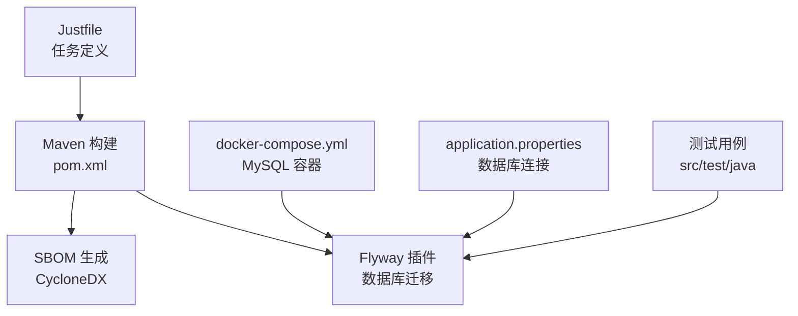
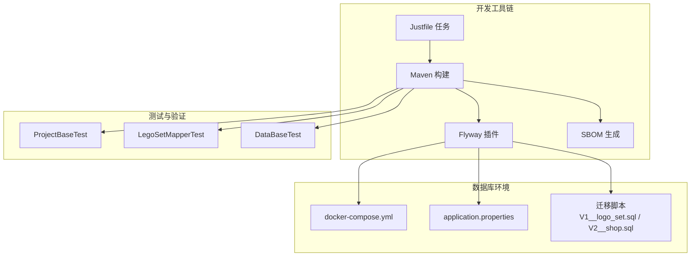
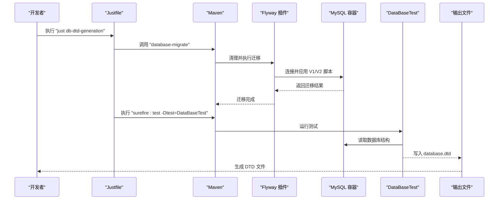
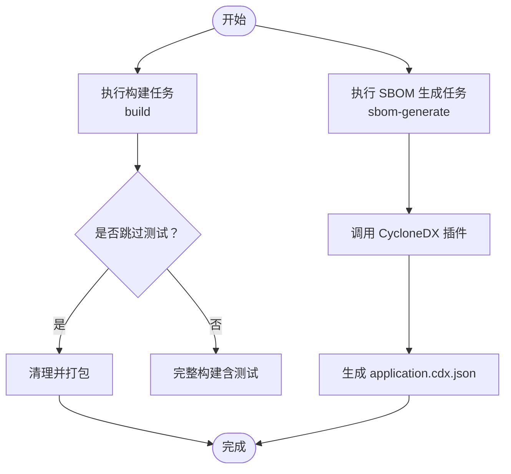
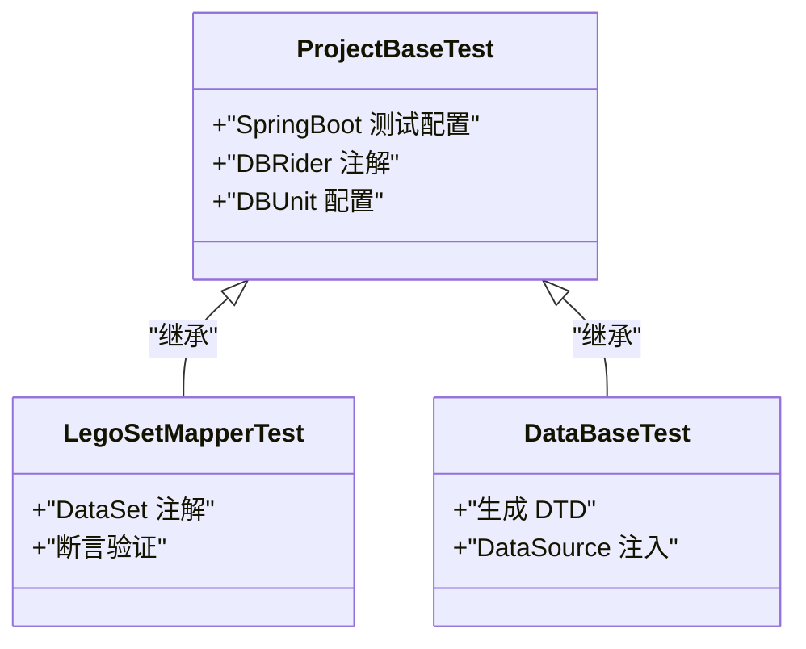
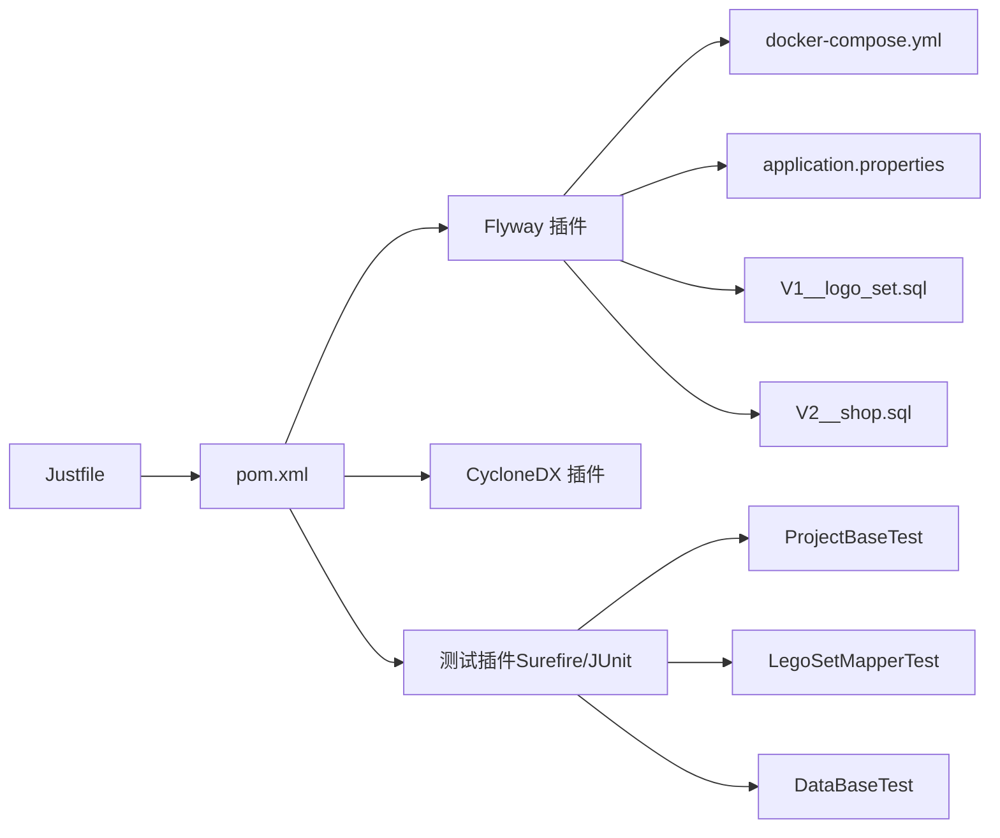

# 自动化脚本

<cite>
**本文引用的文件**
- [Justfile](file://Justfile)
- [README.md](file://README.md)
- [pom.xml](file://pom.xml)
- [docker-compose.yml](file://docker-compose.yml)
- [src/main/resources/application.properties](file://src/main/resources/application.properties)
- [src/test/java/org/mvnsearch/mybatis/demo/DataBaseTest.java](file://src/test/java/org/mvnsearch/mybatis/demo/DataBaseTest.java)
- [src/test/java/org/mvnsearch/mybatis/demo/ProjectBaseTest.java](file://src/test/java/org/mvnsearch/mybatis/demo/ProjectBaseTest.java)
- [src/test/java/org/mvnsearch/mybatis/demo/repo/LegoSetMapperTest.java](file://src/test/java/org/mvnsearch/mybatis/demo/repo/LegoSetMapperTest.java)
- [src/test/resources/db/migration/V1__logo_set.sql](file://src/test/resources/db/migration/V1__logo_set.sql)
- [src/test/resources/db/migration/V2__shop.sql](file://src/test/resources/db/migration/V2__shop.sql)
</cite>

## 目录
1. [简介](#简介)
2. [项目结构](#项目结构)
3. [核心组件](#核心组件)
4. [架构总览](#架构总览)
5. [详细组件分析](#详细组件分析)
6. [依赖关系分析](#依赖关系分析)
7. [性能考虑](#性能考虑)
8. [故障排查指南](#故障排查指南)
9. [结论](#结论)
10. [附录](#附录)

## 简介
本指南面向使用本项目进行开发与运维的工程师，系统讲解基于 Just 的自动化脚本与构建任务，覆盖以下主题：
- Justfile 中的构建任务与命令定义
- 开发流程自动化：编译、测试、数据库迁移、清理与SBOM生成
- 使用 Just 命令简化日常操作（别名与组合）
- 扩展与自定义：新增任务、修改现有任务
- CI/CD 集成最佳实践
- 调试技巧与常见问题解决
- 跨平台兼容性与替代方案

## 项目结构
该项目采用标准的 Spring Boot + MyBatis 工程布局，配合 Maven 构建与 Flyway 数据库迁移，使用 Justfile 统一管理常用开发任务。关键目录与文件如下：
- src/main/resources：应用配置与 MyBatis 配置
- src/test/resources/db/migration：Flyway 迁移脚本
- src/test/java：集成测试与数据集
- docker-compose.yml：本地 MySQL 容器编排
- pom.xml：Maven 依赖与插件配置（含 Flyway 插件）
- Justfile：Just 构建任务定义

图表来源
- [Justfile](file://Justfile)
- [pom.xml](file://pom.xml)
- [docker-compose.yml](file://docker-compose.yml)
- [src/main/resources/application.properties](file://src/main/resources/application.properties)

章节来源
- [README.md](file://README.md)
- [Justfile](file://Justfile)
- [pom.xml](file://pom.xml)
- [docker-compose.yml](file://docker-compose.yml)
- [src/main/resources/application.properties](file://src/main/resources/application.properties)

## 核心组件
本节聚焦 Justfile 中的任务定义与职责划分，以及它们与 Maven、Flyway、SBOM 生成的关系。

- 构建任务（build）
  - 目标：跳过测试执行，清理并打包项目
  - 适用场景：快速产出可运行包，不触发测试阶段
  - 参考路径：[构建任务定义](file://Justfile)

- 数据库迁移（database-migrate）
  - 目标：先清理后迁移，确保数据库结构与迁移脚本一致
  - 适用场景：初始化或更新测试数据库结构
  - 参考路径：[迁移任务定义](file://Justfile)
  - 依赖：Flyway 插件在 pom.xml 中已配置，迁移脚本位于 src/test/resources/db/migration
  - 参考路径：[V1 迁移脚本](file://src/test/resources/db/migration/V1__logo_set.sql)，[V2 迁移脚本](file://src/test/resources/db/migration/V2__shop.sql)

- DTD 生成（db-dtd-generation）
  - 目标：在完成数据库迁移后，执行特定测试以生成 DTD 文件
  - 适用场景：从数据库导出结构描述，便于数据集校验
  - 参考路径：[DTD 生成任务定义](file://Justfile)
  - 测试入口：[DataBaseTest](file://src/test/java/org/mvnsearch/mybatis/demo/DataBaseTest.java)

- MySQL CLI（mysql-cli）
  - 目标：通过本地 MySQL 客户端连接容器内数据库
  - 适用场景：手动检查表结构与数据
  - 参考路径：[MySQL CLI 任务定义](file://Justfile)
  - 连接信息来自 docker-compose.yml 与 application.properties
  - 参考路径：[docker-compose.yml](file://docker-compose.yml)，[application.properties](file://src/main/resources/application.properties)

- SBOM 生成（sbom-generate）
  - 目标：生成 CycloneDX 格式的软件物料清单（SBOM）
  - 适用场景：合规审计与供应链安全
  - 参考路径：[SBOM 任务定义](file://Justfile)

章节来源
- [Justfile](file://Justfile)
- [pom.xml](file://pom.xml)
- [src/test/resources/db/migration/V1__logo_set.sql](file://src/test/resources/db/migration/V1__logo_set.sql)
- [src/test/resources/db/migration/V2__shop.sql](file://src/test/resources/db/migration/V2__shop.sql)
- [src/test/java/org/mvnsearch/mybatis/demo/DataBaseTest.java](file://src/test/java/org/mvnsearch/mybatis/demo/DataBaseTest.java)
- [docker-compose.yml](file://docker-compose.yml)
- [src/main/resources/application.properties](file://src/main/resources/application.properties)

## 架构总览
下图展示 Justfile 任务与 Maven、Flyway、SBOM 生成及数据库容器之间的交互关系。

图表来源
- [Justfile](file://Justfile)
- [pom.xml](file://pom.xml)
- [docker-compose.yml](file://docker-compose.yml)
- [src/main/resources/application.properties](file://src/main/resources/application.properties)
- [src/test/resources/db/migration/V1__logo_set.sql](file://src/test/resources/db/migration/V1__logo_set.sql)
- [src/test/resources/db/migration/V2__shop.sql](file://src/test/resources/db/migration/V2__shop.sql)
- [src/test/java/org/mvnsearch/mybatis/demo/ProjectBaseTest.java](file://src/test/java/org/mvnsearch/mybatis/demo/ProjectBaseTest.java)
- [src/test/java/org/mvnsearch/mybatis/demo/repo/LegoSetMapperTest.java](file://src/test/java/org/mvnsearch/mybatis/demo/repo/LegoSetMapperTest.java)
- [src/test/java/org/mvnsearch/mybatis/demo/DataBaseTest.java](file://src/test/java/org/mvnsearch/mybatis/demo/DataBaseTest.java)

## 详细组件分析

### 任务序列：数据库迁移与 DTD 生成
该流程演示了“迁移 -> 测试 -> 生成 DTD”的典型顺序，适合在本地或 CI 中自动执行。

图表来源
- [Justfile](file://Justfile)
- [pom.xml](file://pom.xml)
- [docker-compose.yml](file://docker-compose.yml)
- [src/test/java/org/mvnsearch/mybatis/demo/DataBaseTest.java](file://src/test/java/org/mvnsearch/mybatis/demo/DataBaseTest.java)
- [src/test/resources/db/migration/V1__logo_set.sql](file://src/test/resources/db/migration/V1__logo_set.sql)
- [src/test/resources/db/migration/V2__shop.sql](file://src/test/resources/db/migration/V2__shop.sql)

章节来源
- [Justfile](file://Justfile)
- [src/test/java/org/mvnsearch/mybatis/demo/DataBaseTest.java](file://src/test/java/org/mvnsearch/mybatis/demo/DataBaseTest.java)

### 任务流程图：构建与 SBOM 生成
构建与 SBOM 生成是两个相对独立的任务，可按需单独执行。

图表来源
- [Justfile](file://Justfile)
- [pom.xml](file://pom.xml)

章节来源
- [Justfile](file://Justfile)
- [pom.xml](file://pom.xml)

### 类关系与测试基类
测试体系由统一的基类与具体测试组成，体现良好的可维护性与可扩展性。

图表来源
- [src/test/java/org/mvnsearch/mybatis/demo/ProjectBaseTest.java](file://src/test/java/org/mvnsearch/mybatis/demo/ProjectBaseTest.java)
- [src/test/java/org/mvnsearch/mybatis/demo/repo/LegoSetMapperTest.java](file://src/test/java/org/mvnsearch/mybatis/demo/repo/LegoSetMapperTest.java)
- [src/test/java/org/mvnsearch/mybatis/demo/DataBaseTest.java](file://src/test/java/org/mvnsearch/mybatis/demo/DataBaseTest.java)

章节来源
- [src/test/java/org/mvnsearch/mybatis/demo/ProjectBaseTest.java](file://src/test/java/org/mvnsearch/mybatis/demo/ProjectBaseTest.java)
- [src/test/java/org/mvnsearch/mybatis/demo/repo/LegoSetMapperTest.java](file://src/test/java/org/mvnsearch/mybatis/demo/repo/LegoSetMapperTest.java)
- [src/test/java/org/mvnsearch/mybatis/demo/DataBaseTest.java](file://src/test/java/org/mvnsearch/mybatis/demo/DataBaseTest.java)

## 依赖关系分析
- Justfile 依赖 Maven 生命周期与插件生态（Flyway、Surefire、CycloneDX）
- Flyway 迁移依赖 docker-compose 提供的 MySQL 容器与 application.properties 中的连接参数
- 测试用例依赖 DBUnit 与 Database Rider，用于数据集注入与断言
- 迁移脚本位于 src/test/resources/db/migration，确保测试环境一致性

图表来源
- [Justfile](file://Justfile)
- [pom.xml](file://pom.xml)
- [docker-compose.yml](file://docker-compose.yml)
- [src/main/resources/application.properties](file://src/main/resources/application.properties)
- [src/test/resources/db/migration/V1__logo_set.sql](file://src/test/resources/db/migration/V1__logo_set.sql)
- [src/test/resources/db/migration/V2__shop.sql](file://src/test/resources/db/migration/V2__shop.sql)
- [src/test/java/org/mvnsearch/mybatis/demo/ProjectBaseTest.java](file://src/test/java/org/mvnsearch/mybatis/demo/ProjectBaseTest.java)
- [src/test/java/org/mvnsearch/mybatis/demo/repo/LegoSetMapperTest.java](file://src/test/java/org/mvnsearch/mybatis/demo/repo/LegoSetMapperTest.java)
- [src/test/java/org/mvnsearch/mybatis/demo/DataBaseTest.java](file://src/test/java/org/mvnsearch/mybatis/demo/DataBaseTest.java)

章节来源
- [Justfile](file://Justfile)
- [pom.xml](file://pom.xml)
- [docker-compose.yml](file://docker-compose.yml)
- [src/main/resources/application.properties](file://src/main/resources/application.properties)
- [src/test/resources/db/migration/V1__logo_set.sql](file://src/test/resources/db/migration/V1__logo_set.sql)
- [src/test/resources/db/migration/V2__shop.sql](file://src/test/resources/db/migration/V2__shop.sql)
- [src/test/java/org/mvnsearch/mybatis/demo/ProjectBaseTest.java](file://src/test/java/org/mvnsearch/mybatis/demo/ProjectBaseTest.java)
- [src/test/java/org/mvnsearch/mybatis/demo/repo/LegoSetMapperTest.java](file://src/test/java/org/mvnsearch/mybatis/demo/repo/LegoSetMapperTest.java)
- [src/test/java/org/mvnsearch/mybatis/demo/DataBaseTest.java](file://src/test/java/org/mvnsearch/mybatis/demo/DataBaseTest.java)

## 性能考虑
- 跳过测试的构建任务适用于快速迭代与预览，但不建议在发布前省略测试
- 数据库迁移与测试串联时，应确保数据库容器启动完成后再执行迁移，避免连接超时
- SBOM 生成会引入额外的依赖解析时间，可在 CI 中按需启用
- 使用 Docker Compose 启动数据库服务时，注意端口冲突与资源占用

## 故障排查指南
- 数据库连接失败
  - 检查 docker-compose 是否正常运行，确认端口映射与凭据
  - 参考路径：[docker-compose.yml](file://docker-compose.yml)，[application.properties](file://src/main/resources/application.properties)
- 迁移未生效
  - 确认 Flyway 插件配置与迁移脚本位置正确
  - 参考路径：[pom.xml](file://pom.xml)，[V1 迁移脚本](file://src/test/resources/db/migration/V1__logo_set.sql)，[V2 迁移脚本](file://src/test/resources/db/migration/V2__shop.sql)
- DTD 生成失败
  - 确保迁移成功且测试能访问数据库
  - 参考路径：[DataBaseTest](file://src/test/java/org/mvnsearch/mybatis/demo/DataBaseTest.java)
- SBOM 生成异常
  - 检查 CycloneDX 插件版本与 Maven 版本兼容性
  - 参考路径：[pom.xml](file://pom.xml)，[Justfile](file://Justfile)

章节来源
- [docker-compose.yml](file://docker-compose.yml)
- [src/main/resources/application.properties](file://src/main/resources/application.properties)
- [pom.xml](file://pom.xml)
- [src/test/resources/db/migration/V1__logo_set.sql](file://src/test/resources/db/migration/V1__logo_set.sql)
- [src/test/resources/db/migration/V2__shop.sql](file://src/test/resources/db/migration/V2__shop.sql)
- [src/test/java/org/mvnsearch/mybatis/demo/DataBaseTest.java](file://src/test/java/org/mvnsearch/mybatis/demo/DataBaseTest.java)
- [Justfile](file://Justfile)

## 结论
本项目通过 Justfile 将常见的开发任务标准化、自动化，结合 Maven 插件生态与 Flyway 迁移，形成从构建到测试再到合规的闭环。建议在团队中统一使用 Just 命令，减少环境差异带来的摩擦，并在 CI 中复用相同任务，提升交付效率与质量。

## 附录

### 使用 Just 命令简化开发流程
- 快速构建（跳过测试）
  - 命令：just build
  - 适用场景：快速打包产物，不执行测试
  - 参考路径：[Justfile](file://Justfile)
- 数据库迁移
  - 命令：just database-migrate
  - 适用场景：初始化或更新测试数据库结构
  - 参考路径：[Justfile](file://Justfile)，[pom.xml](file://pom.xml)
- 生成 DTD
  - 命令：just db-dtd-generation
  - 适用场景：从数据库导出结构描述
  - 参考路径：[Justfile](file://Justfile)，[DataBaseTest](file://src/test/java/org/mvnsearch/mybatis/demo/DataBaseTest.java)
- 连接 MySQL
  - 命令：just mysql-cli
  - 适用场景：手动检查数据库状态
  - 参考路径：[Justfile](file://Justfile)，[docker-compose.yml](file://docker-compose.yml)，[application.properties](file://src/main/resources/application.properties)
- 生成 SBOM
  - 命令：just sbom-generate
  - 适用场景：合规与供应链安全
  - 参考路径：[Justfile](file://Justfile)，[pom.xml](file://pom.xml)

### 扩展与自定义
- 新增构建任务
  - 在 Justfile 中添加新任务条目，遵循现有命名规范与缩进
  - 参考路径：[Justfile](file://Justfile)
- 修改现有任务
  - 更新命令行参数或串联步骤，确保与 Maven 插件版本兼容
  - 参考路径：[pom.xml](file://pom.xml)，[Justfile](file://Justfile)
- 添加新的数据库迁移
  - 在 src/test/resources/db/migration 下新增命名规范的 SQL 文件
  - 参考路径：[V1 迁移脚本](file://src/test/resources/db/migration/V1__logo_set.sql)，[V2 迁移脚本](file://src/test/resources/db/migration/V2__shop.sql)
- 集成新的测试
  - 在 src/test/java 下新增测试类，继承 ProjectBaseTest 并使用 DataSet 注解
  - 参考路径：[ProjectBaseTest](file://src/test/java/org/mvnsearch/mybatis/demo/ProjectBaseTest.java)，[LegoSetMapperTest](file://src/test/java/org/mvnsearch/mybatis/demo/repo/LegoSetMapperTest.java)

### CI/CD 集成最佳实践
- 使用 Just 命令作为流水线入口，统一本地与 CI 的执行逻辑
- 在 CI 中缓存 Maven 依赖，缩短构建时间
- 将数据库迁移与测试放在同一作业中，确保环境一致性
- 对 SBOM 生成与上传进行条件控制，仅在发布分支执行
- 参考路径：[Justfile](file://Justfile)，[pom.xml](file://pom.xml)，[docker-compose.yml](file://docker-compose.yml)

### 调试技巧
- 逐步执行：先单独运行数据库迁移，再运行测试，最后生成 DTD
- 查看日志：调整 application.properties 中的日志级别以定位问题
- 端口与凭据：核对 docker-compose 与 application.properties 的配置一致性
- 参考路径：[application.properties](file://src/main/resources/application.properties)，[docker-compose.yml](file://docker-compose.yml)

### 跨平台兼容性与替代方案
- Windows 用户
  - 使用 WSL2 运行 Docker 与 MySQL，避免端口冲突
  - 在 PowerShell 或 Git Bash 中执行 Just 命令
- macOS/Linux 用户
  - 确保 Docker 与 MySQL 客户端可用
  - 如需替代 Just，可将任务映射为 Makefile 或 Shell 脚本
- 替代方案参考
  - Makefile：将 Justfile 中的任务转换为 Make 规则
  - Shell 脚本：将常用命令封装为可执行脚本，便于跨平台分发
- 参考路径：[Justfile](file://Justfile)，[docker-compose.yml](file://docker-compose.yml)