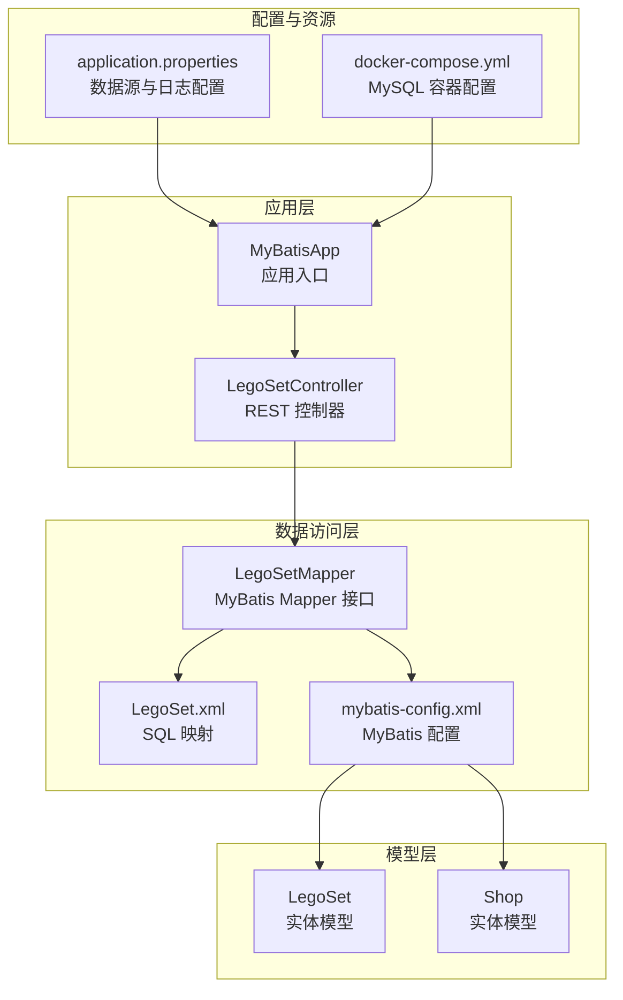
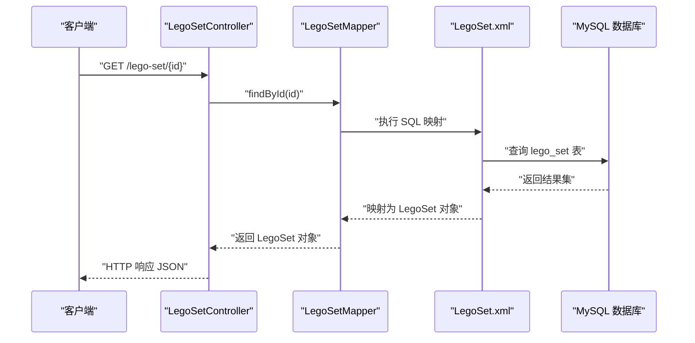
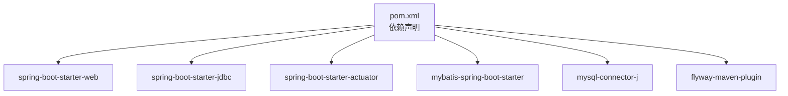

# 快速开始

<cite>
**本文引用的文件**
- [README.md](file://README.md)
- [pom.xml](file://pom.xml)
- [docker-compose.yml](file://docker-compose.yml)
- [application.properties](file://src/main/resources/application.properties)
- [MyBatisApp.java](file://src/main/java/org/mvnsearch/mybatis/demo/MyBatisApp.java)
- [mybatis-config.xml](file://src/main/resources/mybatis-config.xml)
- [LegoSetController.java](file://src/main/java/org/mvnsearch/mybatis/demo/web/LegoSetController.java)
- [LegoSetMapper.java](file://src/main/java/org/mvnsearch/mybatis/demo/repo/LegoSetMapper.java)
- [LegoSet.xml](file://src/main/resources/mapper/LegoSet.xml)
- [LegoSet.java](file://src/main/java/org/mvnsearch/mybatis/demo/model/LegoSet.java)
- [Shop.java](file://src/main/java/org/mvnsearch/mybatis/demo/model/Shop.java)
- [index.http](file://index.http)
- [Justfile](file://Justfile)
- [ProjectBaseTest.java](file://src/test/java/org/mvnsearch/mybatis/demo/ProjectBaseTest.java)
</cite>

## 目录
1. [简介](#简介)
2. [系统要求与环境准备](#系统要求与环境准备)
3. [项目结构概览](#项目结构概览)
4. [Docker Compose 启动 MySQL 数据库](#docker-compose-启动-mysql-数据库)
5. [本地 MySQL 安装（可选）](#本地-mysql-安装可选)
6. [项目构建与运行](#项目构建与运行)
7. [默认数据库配置与修改](#默认数据库配置与修改)
8. [API 测试示例](#api-测试示例)
9. [常见启动问题排查](#常见启动问题排查)
10. [架构概览](#架构概览)
11. [依赖关系分析](#依赖关系分析)
12. [性能与最佳实践](#性能与最佳实践)
13. [故障排除指南](#故障排除指南)
14. [结语](#结语)

## 简介
本指南面向希望快速搭建并运行 MyBatis Spring Demo 的开发者，涵盖系统要求、环境准备、依赖安装、Docker Compose 启动 MySQL、本地 MySQL 替代方案、Maven 构建与 Spring Boot 运行、直接 JAR 包运行方式、默认数据库配置与修改、常见启动问题排查，以及使用 curl 或 Postman 调用 REST API 的示例。

## 系统要求与环境准备
- Java：21 或更高版本
- Maven：3.6 及以上
- MySQL：8.0 及以上（推荐使用 Docker Compose）
- 可选：Docker 与 Docker Compose（用于一键启动 MySQL）

章节来源
- [README.md:40-44](file://README.md#L40-L44)

## 项目结构概览
该项目采用 Spring Boot + MyBatis 的典型分层结构：
- 主程序入口位于应用根包下，负责启动 Spring Boot 应用
- 控制器层提供 REST 接口
- 数据访问层通过 MyBatis Mapper 访问数据库
- 配置文件位于 resources 下，包含数据源、MyBatis 映射与日志级别等

图表来源
- [MyBatisApp.java:11-16](file://src/main/java/org/mvnsearch/mybatis/demo/MyBatisApp.java#L11-L16)
- [LegoSetController.java:11-21](file://src/main/java/org/mvnsearch/mybatis/demo/web/LegoSetController.java#L11-L21)
- [LegoSetMapper.java:12-20](file://src/main/java/org/mvnsearch/mybatis/demo/repo/LegoSetMapper.java#L12-L20)
- [LegoSet.xml:3-22](file://src/main/resources/mapper/LegoSet.xml#L3-L22)
- [mybatis-config.xml:6-13](file://src/main/resources/mybatis-config.xml#L6-L13)
- [application.properties:1-11](file://src/main/resources/application.properties#L1-L11)
- [docker-compose.yml:1-9](file://docker-compose.yml#L1-L9)

章节来源
- [README.md:13-29](file://README.md#L13-L29)
- [pom.xml:19-28](file://pom.xml#L19-L28)

## Docker Compose 启动 MySQL 数据库
使用 Docker Compose 可以一键拉起 MySQL 服务，默认映射端口为 13306，数据库名为 test，root 用户密码为 123456。

- 启动命令
  - 在项目根目录执行：docker-compose up -d
- 停止命令
  - docker-compose down
- 端口映射
  - 主机端口 13306 -> 容器端口 3306
- 环境变量
  - MYSQL_ROOT_PASSWORD：root 密码
  - MYSQL_DATABASE：默认数据库名

章节来源
- [docker-compose.yml:1-9](file://docker-compose.yml#L1-L9)
- [README.md:49-50](file://README.md#L49-L50)

## 本地 MySQL 安装（可选）
若不使用 Docker，可在本地安装 MySQL 8.0+，确保满足以下条件：
- 数据库版本：8.0 及以上
- 默认端口：3306（如需自定义，请同步修改应用配置）
- 创建数据库：test
- 用户权限：root 用户，密码 123456（或按需修改）

章节来源
- [README.md:42-44](file://README.md#L42-L44)

## 项目构建与运行
支持多种运行方式，任选其一即可启动应用。

- 使用 Maven 构建
  - mvn clean package
- 使用 Spring Boot 插件启动
  - mvn spring-boot:run
- 直接运行 JAR 包
  - java -jar target/mybatis-spring-demo-1.0.0-SNAPSHOT.jar

应用启动后默认监听端口 8080，可通过浏览器或工具访问。

章节来源
- [README.md:52-58](file://README.md#L52-L58)
- [pom.xml:102-138](file://pom.xml#L102-L138)

## 默认数据库配置与修改
默认数据源配置如下（可在 application.properties 中修改）：
- JDBC URL：jdbc:mysql://localhost:13306/test
- 用户名：root
- 密码：123456
- 驱动类名：com.mysql.cj.jdbc.Driver
- MyBatis 配置文件位置：classpath:/mybatis-config.xml

修改步骤建议：
1. 打开 application.properties
2. 修改 spring.datasource.url、spring.datasource.username、spring.datasource.password
3. 如需切换驱动或 MyBatis 配置文件路径，相应调整对应属性
4. 重启应用使配置生效

章节来源
- [application.properties:1-11](file://src/main/resources/application.properties#L1-L11)
- [README.md:63-69](file://README.md#L63-L69)

## API 测试示例
应用提供一个简单的 REST 接口用于查询乐高套装信息。

- 接口地址
  - GET /lego-set/{id}
- 示例请求
  - curl -i http://localhost:8080/lego-set/1
  - 或在 Postman 中发送 GET 请求到 http://localhost:8080/lego-set/1
- 返回值
  - 返回 LegoSet 实体对象（包含 id 与 name 字段）

章节来源
- [LegoSetController.java:17-20](file://src/main/java/org/mvnsearch/mybatis/demo/web/LegoSetController.java#L17-L20)
- [index.http:1](file://index.http#L1)

## 常见启动问题排查
- 数据库连接失败
  - 检查 MySQL 是否已启动（Docker Compose 或本地）
  - 校验 application.properties 中的 URL、用户名与密码是否正确
  - 确认端口未被占用（默认 13306）
- MyBatis 映射未加载
  - 确认 mybatis-config.xml 中的 Mapper XML 路径与命名空间一致
  - 检查 Mapper 接口是否标注 @Mapper 注解
- 端口冲突
  - 修改 application.properties 中的 server.port 或停止占用端口的服务
- 依赖缺失或版本不兼容
  - 清理并重新构建：mvn clean install
  - 确保 Java 21 与 Maven 版本满足要求

章节来源
- [application.properties:1-11](file://src/main/resources/application.properties#L1-L11)
- [mybatis-config.xml:6-13](file://src/main/resources/mybatis-config.xml#L6-L13)
- [LegoSetMapper.java:12-20](file://src/main/java/org/mvnsearch/mybatis/demo/repo/LegoSetMapper.java#L12-L20)

## 架构概览
下面的时序图展示了从客户端发起请求到数据库查询返回的完整流程。

图表来源
- [LegoSetController.java:17-20](file://src/main/java/org/mvnsearch/mybatis/demo/web/LegoSetController.java#L17-L20)
- [LegoSetMapper.java:15-16](file://src/main/java/org/mvnsearch/mybatis/demo/repo/LegoSetMapper.java#L15-L16)
- [LegoSet.xml:10-14](file://src/main/resources/mapper/LegoSet.xml#L10-L14)

## 依赖关系分析
项目使用 Maven 管理依赖，核心依赖包括：
- Spring Boot Starter Web：提供 Web 支持
- Spring Boot Starter JDBC：提供 JDBC 数据源能力
- MyBatis Spring Boot Starter：集成 MyBatis
- MySQL Connector/J：MySQL 驱动
- Flyway Maven Plugin：数据库迁移工具（测试与构建阶段使用）

图表来源
- [pom.xml:30-101](file://pom.xml#L30-L101)

章节来源
- [pom.xml:30-101](file://pom.xml#L30-L101)

## 性能与最佳实践
- 使用连接池：Spring Boot 默认启用 HikariCP，建议保持默认配置或根据业务规模微调
- SQL 优化：合理使用 MyBatis 结果映射与缓存策略，避免 N+1 查询
- 日志级别：开发阶段可开启 DEBUG/TRACE，生产环境建议降低日志级别
- 数据库迁移：使用 Flyway 管理数据库版本，确保团队一致性

## 故障排除指南
- 启动失败：检查 Java 与 Maven 版本是否满足要求
- 数据库无法连接：确认 Docker Compose 已启动且端口映射正确；或本地 MySQL 已启动
- Mapper 未扫描：确保 Mapper 接口标注 @Mapper，且 MyBatis 配置文件中声明了对应 Mapper XML
- 单元测试异常：检查测试配置文件与数据库迁移脚本是否正确

章节来源
- [ProjectBaseTest.java:15-21](file://src/test/java/org/mvnsearch/mybatis/demo/ProjectBaseTest.java#L15-L21)

## 结语
通过本指南，您可以在几分钟内完成 MyBatis Spring Demo 的环境准备、数据库启动、项目构建与运行，并成功调用 REST API。遇到问题时，可参考“常见启动问题排查”与“故障排除指南”。祝开发顺利！