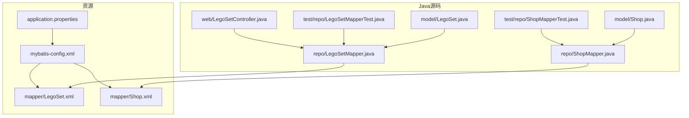
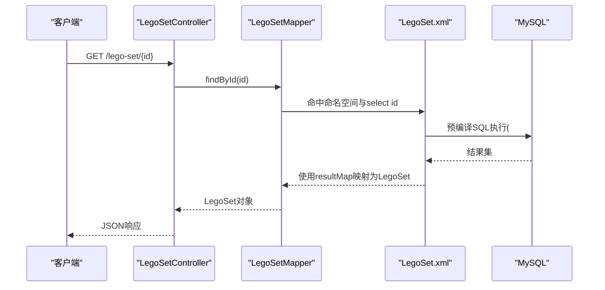
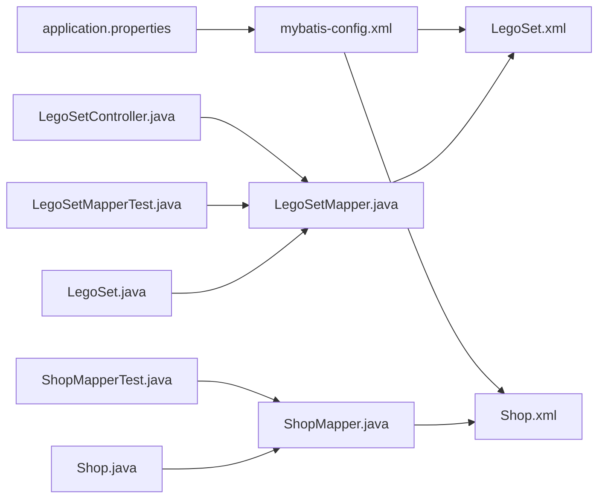

# MyBatis映射配置

<cite>
**本文引用的文件**
- [mybatis-config.xml](file://src/main/resources/mybatis-config.xml)
- [application.properties](file://src/main/resources/application.properties)
- [LegoSet.xml](file://src/main/resources/mapper/LegoSet.xml)
- [Shop.xml](file://src/main/resources/mapper/Shop.xml)
- [LegoSetMapper.java](file://src/main/java/org/mvnsearch/mybatis/demo/repo/LegoSetMapper.java)
- [ShopMapper.java](file://src/main/java/org/mvnsearch/mybatis/demo/repo/ShopMapper.java)
- [MyBatisConfiguration.java](file://src/main/java/org/mvnsearch/mybatis/demo/repo/MyBatisConfiguration.java)
- [LegoSet.java](file://src/main/java/org/mvnsearch/mybatis/demo/model/LegoSet.java)
- [Shop.java](file://src/main/java/org/mvnsearch/mybatis/demo/model/Shop.java)
- [LegoSetController.java](file://src/main/java/org/mvnsearch/mybatis/demo/web/LegoSetController.java)
- [LegoSetMapperTest.java](file://src/test/java/org/mvnsearch/mybatis/demo/repo/LegoSetMapperTest.java)
- [ShopMapperTest.java](file://src/test/java/org/mvnsearch/mybatis/demo/repo/ShopMapperTest.java)
- [V1__logo_set.sql](file://src/test/resources/db/migration/V1__logo_set.sql)
- [V2__shop.sql](file://src/test/resources/db/migration/V2__shop.sql)
- [pom.xml](file://pom.xml)
</cite>

## 目录
1. [简介](#简介)
2. [项目结构](#项目结构)
3. [核心组件](#核心组件)
4. [架构总览](#架构总览)
5. [详细组件分析](#详细组件分析)
6. [依赖分析](#依赖分析)
7. [性能考虑](#性能考虑)
8. [故障排查指南](#故障排查指南)
9. [结论](#结论)
10. [附录](#附录)

## 简介
本文件系统性梳理该Spring Boot + MyBatis示例工程中的映射配置与使用方式，重点覆盖以下主题：
- XML映射文件的结构与配置要点
- resultMap的定义、字段映射规则与类型处理
- SQL语句编写规范（参数绑定、动态SQL与预编译）
- Mapper接口与XML映射文件的对应关系
- 类型别名与全局MyBatis设置
- 查询优化与性能考量
- 错误处理与调试方法
- MyBatis缓存机制与二级缓存配置
- 实际示例与最佳实践

## 项目结构
该项目采用标准的Spring Boot目录布局，MyBatis相关配置集中在resources目录下，Mapper接口与实体模型分别位于repo与model包中。

图表来源
- [mybatis-config.xml:1-14](file://src/main/resources/mybatis-config.xml#L1-L14)
- [application.properties:1-11](file://src/main/resources/application.properties#L1-L11)
- [LegoSet.xml:1-22](file://src/main/resources/mapper/LegoSet.xml#L1-L22)
- [Shop.xml:1-24](file://src/main/resources/mapper/Shop.xml#L1-L24)
- [LegoSetMapper.java:1-21](file://src/main/java/org/mvnsearch/mybatis/demo/repo/LegoSetMapper.java#L1-L21)
- [ShopMapper.java:1-21](file://src/main/java/org/mvnsearch/mybatis/demo/repo/ShopMapper.java#L1-L21)
- [LegoSet.java:1-23](file://src/main/java/org/mvnsearch/mybatis/demo/model/LegoSet.java#L1-L23)
- [Shop.java:1-32](file://src/main/java/org/mvnsearch/mybatis/demo/model/Shop.java#L1-L32)
- [LegoSetController.java:1-22](file://src/main/java/org/mvnsearch/mybatis/demo/web/LegoSetController.java#L1-L22)
- [LegoSetMapperTest.java:1-45](file://src/test/java/org/mvnsearch/mybatis/demo/repo/LegoSetMapperTest.java#L1-L45)
- [ShopMapperTest.java:1-30](file://src/test/java/org/mvnsearch/mybatis/demo/repo/ShopMapperTest.java#L1-L30)

章节来源
- [mybatis-config.xml:1-14](file://src/main/resources/mybatis-config.xml#L1-L14)
- [application.properties:1-11](file://src/main/resources/application.properties#L1-L11)

## 核心组件
- 全局配置：通过mybatis-config.xml集中声明类型别名与Mapper加载路径，简化XML映射文件中的类型引用。
- 映射文件：LegoSet.xml与Shop.xml分别定义各自的resultMap与查询语句，并通过namespace与Mapper接口建立绑定。
- Mapper接口：LegoSetMapper与ShopMapper定义方法签名，配合XML映射文件执行SQL。
- 实体模型：LegoSet与Shop作为结果映射的目标对象，提供标准的getter/setter。
- Web层：LegoSetController演示如何注入Mapper并对外提供REST接口。
- 测试层：LegoSetMapperTest与ShopMapperTest验证Mapper行为，配合Flyway迁移脚本初始化表结构。

章节来源
- [mybatis-config.xml:6-13](file://src/main/resources/mybatis-config.xml#L6-L13)
- [LegoSet.xml:3-22](file://src/main/resources/mapper/LegoSet.xml#L3-L22)
- [Shop.xml:3-24](file://src/main/resources/marker/Shop.xml#L3-L24)
- [LegoSetMapper.java:12-20](file://src/main/java/org/mvnsearch/mybatis/demo/repo/LegoSetMapper.java#L12-L20)
- [ShopMapper.java:12-20](file://src/main/java/org/mvnsearch/mybatis/demo/repo/ShopMapper.java#L12-L20)
- [LegoSet.java:3-23](file://src/main/java/org/mvnsearch/mybatis/demo/model/LegoSet.java#L3-L23)
- [Shop.java:3-32](file://src/main/java/org/mvnsearch/mybatis/demo/model/Shop.java#L3-L32)
- [LegoSetController.java:11-21](file://src/main/java/org/mvnsearch/mybatis/demo/web/LegoSetController.java#L11-L21)
- [LegoSetMapperTest.java:26-44](file://src/test/java/org/mvnsearch/mybatis/demo/repo/LegoSetMapperTest.java#L26-L44)
- [ShopMapperTest.java:11-29](file://src/test/java/org/mvnsearch/mybatis/demo/repo/ShopMapperTest.java#L11-L29)

## 架构总览
下图展示从Web请求到数据库查询的整体流程，以及MyBatis配置、Mapper接口与XML映射文件之间的关系。

图表来源
- [LegoSetController.java:17-20](file://src/main/java/org/mvnsearch/mybatis/demo/web/LegoSetController.java#L17-L20)
- [LegoSetMapper.java:15-16](file://src/main/java/org/mvnsearch/mybatis/demo/repo/LegoSetMapper.java#L15-L16)
- [LegoSet.xml:10-14](file://src/main/resources/mapper/LegoSet.xml#L10-L14)
- [LegoSet.java:3-23](file://src/main/java/org/mvnsearch/mybatis/demo/model/LegoSet.java#L3-L23)

## 详细组件分析

### 全局MyBatis配置（mybatis-config.xml）
- 类型别名：通过typeAlias为实体类LegoSet与Shop注册简短别名，便于在XML映射文件中直接引用，避免全限定类名冗长。
- Mapper加载：通过mappers节点按资源路径加载LegoSet.xml与Shop.xml，确保MyBatis启动时完成映射注册。

章节来源
- [mybatis-config.xml:6-13](file://src/main/resources/mybatis-config.xml#L6-L13)

### 应用配置（application.properties）
- 数据源：配置MySQL连接信息与驱动类名。
- MyBatis配置：通过mybatis.config-location指向全局配置文件，使MyBatis读取类型别名与Mapper加载策略。

章节来源
- [application.properties:2-6](file://src/main/resources/application.properties#L2-L6)
- [application.properties:6](file://src/main/resources/application.properties#L6)

### Mapper接口与XML映射文件的对应关系
- LegoSetMapper与ShopMapper均为接口，由MyBatis动态代理生成实现；方法名需与XML中对应的select id一致，且返回类型与参数类型需匹配。
- XML的namespace必须与Mapper接口的全限定名一致，保证方法调用与SQL语句的正确绑定。

章节来源
- [LegoSetMapper.java:12-20](file://src/main/java/org/mvnsearch/mybatis/demo/repo/LegoSetMapper.java#L12-L20)
- [ShopMapper.java:12-20](file://src/main/java/org/mvnsearch/mybatis/demo/repo/ShopMapper.java#L12-L20)
- [LegoSet.xml:3](file://src/main/resources/mapper/LegoSet.xml#L3)
- [Shop.xml:3](file://src/main/resources/mapper/Shop.xml#L3)

### LegoSet映射文件（LegoSet.xml）
- resultMap定义：以LegoSetRS为标识，映射列到LegoSet实体的属性，包含id与name两个字段。
- SQL查询：
  - findById：根据主键查询，参数使用#{id:INTEGER}进行预编译绑定。
  - findByName：根据名称查询，参数使用#{name:VARCHAR}进行预编译绑定。
- 字段映射规则：result标签将数据库列名与实体属性名一一对应，遵循驼峰命名自动映射约定。

章节来源
- [LegoSet.xml:5-8](file://src/main/resources/mapper/LegoSet.xml#L5-L8)
- [LegoSet.xml:10-14](file://src/main/resources/mapper/LegoSet.xml#L10-L14)
- [LegoSet.xml:16-20](file://src/main/resources/mapper/LegoSet.xml#L16-L20)
- [LegoSet.java:3-23](file://src/main/java/org/mvnsearch/mybatis/demo/model/LegoSet.java#L3-L23)

### Shop映射文件（Shop.xml）
- resultMap定义：以ShopRS为标识，映射列到Shop实体的属性，包含id、name与address三个字段。
- SQL查询：
  - findById：根据主键查询，参数使用#{id:INTEGER}进行预编译绑定。
  - findByName：根据名称查询，参数使用#{name:VARCHAR}进行预编译绑定。
- 字段映射规则：result标签将数据库列名与实体属性名一一对应。

章节来源
- [Shop.xml:5-9](file://src/main/resources/mapper/Shop.xml#L5-L9)
- [Shop.xml:11-15](file://src/main/resources/mapper/Shop.xml#L11-L15)
- [Shop.xml:17-21](file://src/main/resources/mapper/Shop.xml#L17-L21)
- [Shop.java:3-32](file://src/main/java/org/mvnsearch/mybatis/demo/model/Shop.java#L3-L32)

### 实体模型（LegoSet与Shop）
- LegoSet：包含id与name两个属性，提供标准getter/setter。
- Shop：包含id、name与address三个属性，提供标准getter/setter。
- 作用：作为resultMap的目标类型，承载查询结果。

章节来源
- [LegoSet.java:3-23](file://src/main/java/org/mvnsearch/mybatis/demo/model/LegoSet.java#L3-L23)
- [Shop.java:3-32](file://src/main/java/org/mvnsearch/mybatis/demo/model/Shop.java#L3-L32)

### Web控制器（LegoSetController）
- 注入LegoSetMapper，提供REST接口GET /lego-set/{id}，内部调用Mapper的findById方法获取数据并返回。

章节来源
- [LegoSetController.java:14-20](file://src/main/java/org/mvnsearch/mybatis/demo/web/LegoSetController.java#L14-L20)

### 测试用例（LegoSetMapperTest与ShopMapperTest）
- 使用@DataSet注解加载测试数据集，验证Mapper的findById与findByName方法是否能正确返回实体对象。
- 验证点：非空断言、打印id等。

章节来源
- [LegoSetMapperTest.java:26-44](file://src/test/java/org/mvnsearch/mybatis/demo/repo/LegoSetMapperTest.java#L26-L44)
- [ShopMapperTest.java:11-29](file://src/test/java/org/mvnsearch/mybatis/demo/repo/ShopMapperTest.java#L11-L29)

### 数据库迁移（Flyway）
- V1__logo_set.sql：创建lego_set表，包含id与name字段。
- V2__shop.sql：创建shop表，包含id、name与address字段。
- 作用：为测试与演示提供稳定的初始数据结构。

章节来源
- [V1__logo_set.sql:1-6](file://src/test/resources/db/migration/V1__logo_set.sql#L1-L6)
- [V2__shop.sql:1-7](file://src/test/resources/db/migration/V2__shop.sql#L1-L7)

### Maven依赖与版本
- 使用mybatis-spring-boot-starter集成MyBatis与Spring Boot。
- 引入mybatis-dynamic-sql用于动态SQL构建（可选）。
- 测试框架与数据库迁移工具：JUnit、AssertJ、Database Rider、Flyway。

章节来源
- [pom.xml:48-56](file://pom.xml#L48-L56)
- [pom.xml:62-100](file://pom.xml#L62-L100)
- [pom.xml:113-136](file://pom.xml#L113-L136)

## 依赖分析
- 组件耦合：Mapper接口与XML映射文件通过namespace与select id强绑定；Web层依赖Mapper接口；测试层依赖Mapper接口与Flyway迁移脚本。
- 外部依赖：MySQL驱动、MyBatis Spring Boot Starter、数据库迁移与测试工具。
- 潜在问题：若namespace或select id不匹配，将导致方法无法绑定到SQL；若resultMap列名与实体属性不一致，可能导致映射失败。

图表来源
- [application.properties:6](file://src/main/resources/application.properties#L6)
- [mybatis-config.xml:10-13](file://src/main/resources/mybatis-config.xml#L10-L13)
- [LegoSet.xml:3](file://src/main/resources/mapper/LegoSet.xml#L3)
- [Shop.xml:3](file://src/main/resources/mapper/Shop.xml#L3)
- [LegoSetMapper.java:12-20](file://src/main/java/org/mvnsearch/mybatis/demo/repo/LegoSetMapper.java#L12-L20)
- [ShopMapper.java:12-20](file://src/main/java/org/mvnsearch/mybatis/demo/repo/ShopMapper.java#L12-L20)
- [LegoSetController.java:14-20](file://src/main/java/org/mvnsearch/mybatis/demo/web/LegoSetController.java#L14-L20)
- [LegoSetMapperTest.java:28-35](file://src/test/java/org/mvnsearch/mybatis/demo/repo/LegoSetMapperTest.java#L28-L35)
- [ShopMapperTest.java:14-19](file://src/test/java/org/mvnsearch/mybatis/demo/repo/ShopMapperTest.java#L14-L19)

## 性能考虑
- 预编译与参数绑定：使用#{...:TYPE}显式指定JDBC类型，有助于提升执行计划稳定性与避免隐式转换开销。
- 字段映射：尽量保持列名与属性名一致或启用驼峰映射，减少resultMap配置复杂度。
- 动态SQL：在需要条件拼接时使用动态SQL，但应避免不必要的OR逻辑，优先使用IN或EXISTS等高效写法。
- 分页与索引：对高频查询字段建立索引；使用分页参数限制结果集大小。
- 缓存：合理利用一级与二级缓存，避免脏读；对只读查询开启二级缓存可显著降低数据库压力。
- 日志：生产环境谨慎开启MyBatis日志级别，避免I/O开销影响吞吐量。

## 故障排查指南
- 方法未找到或绑定失败：检查Mapper接口方法名与XML中select id是否一致，确认namespace与接口全限定名一致。
- 参数类型不匹配：核对parameterType与实际传入参数类型，必要时在SQL中显式指定JDBC类型。
- 字段映射异常：核对resultMap中column与property是否与数据库列与实体属性一致。
- 数据库连接问题：检查application.properties中的URL、用户名与密码，确认驱动类名正确。
- 测试数据缺失：确保Flyway迁移脚本已执行，测试数据集已加载。

章节来源
- [LegoSet.xml:10-14](file://src/main/resources/mapper/LegoSet.xml#L10-L14)
- [Shop.xml:11-15](file://src/main/resources/mapper/Shop.xml#L11-L15)
- [application.properties:2-6](file://src/main/resources/application.properties#L2-L6)

## 结论
本项目展示了基于XML映射的MyBatis配置范式：通过全局配置集中管理类型别名与Mapper加载，借助resultMap实现精确的字段映射，结合预编译参数绑定与清晰的命名空间/方法绑定，形成可维护、可测试的持久层方案。配合动态SQL与缓存策略，可在保证灵活性的同时兼顾性能与稳定性。

## 附录

### SQL语句编写规范与最佳实践
- 参数绑定：统一使用#{...:TYPE}显式指定JDBC类型，避免隐式类型转换带来的性能与兼容性问题。
- 动态SQL：在条件较多时使用动态SQL片段，保持SQL可读性与可维护性。
- 预编译：所有外部输入均应通过占位符绑定，杜绝字符串拼接SQL。
- 返回类型：接口方法返回类型与XML中resultMap/type一致，避免类型不匹配。

章节来源
- [LegoSet.xml:13](file://src/main/resources/mapper/LegoSet.xml#L13)
- [LegoSet.xml:19](file://src/main/resources/mapper/LegoSet.xml#L19)
- [Shop.xml:14](file://src/main/resources/mapper/Shop.xml#L14)
- [Shop.xml:20](file://src/main/resources/mapper/Shop.xml#L20)

### 类型别名与全局设置
- 类型别名：在mybatis-config.xml中为常用实体类注册别名，简化XML映射文件书写。
- 全局设置：通过application.properties设置MyBatis配置文件位置，确保启动时加载。

章节来源
- [mybatis-config.xml:6-9](file://src/main/resources/mybatis-config.xml#L6-L9)
- [application.properties:6](file://src/main/resources/application.properties#L6)

### 缓存机制与二级缓存配置
- 一级缓存：默认开启，作用于同一SqlSession生命周期内，适合单请求内的重复查询。
- 二级缓存：可跨SqlSession共享，适用于只读或低频更新的数据表；建议在需要的Mapper上按需开启并配置刷新策略。
- 脏读防护：对频繁更新的数据表谨慎开启二级缓存，或设置合适的刷新时机。

[本节为通用指导，不直接分析具体文件]

### 实际示例与测试验证
- 示例入口：LegoSetController提供REST接口，内部调用LegoSetMapper的findById方法。
- 测试验证：LegoSetMapperTest与ShopMapperTest分别验证findById与findByName方法的行为，确保映射与SQL正确。

章节来源
- [LegoSetController.java:17-20](file://src/main/java/org/mvnsearch/mybatis/demo/web/LegoSetController.java#L17-L20)
- [LegoSetMapperTest.java:32-42](file://src/test/java/org/mvnsearch/mybatis/demo/repo/LegoSetMapperTest.java#L32-L42)
- [ShopMapperTest.java:17-27](file://src/test/java/org/mvnsearch/mybatis/demo/repo/ShopMapperTest.java#L17-L27)