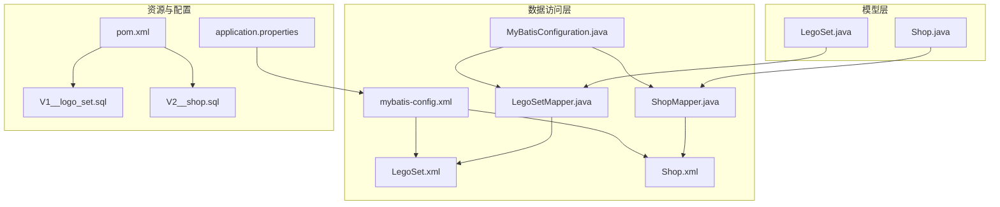
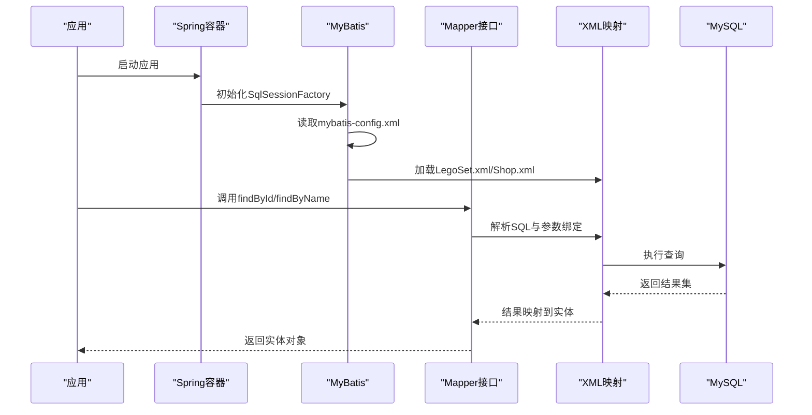
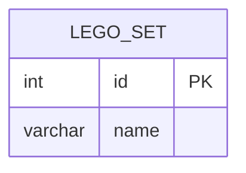
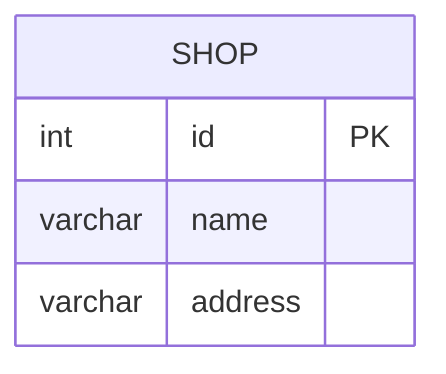
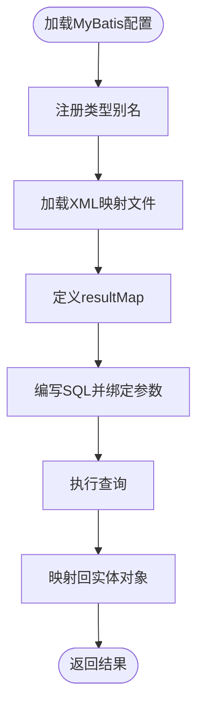
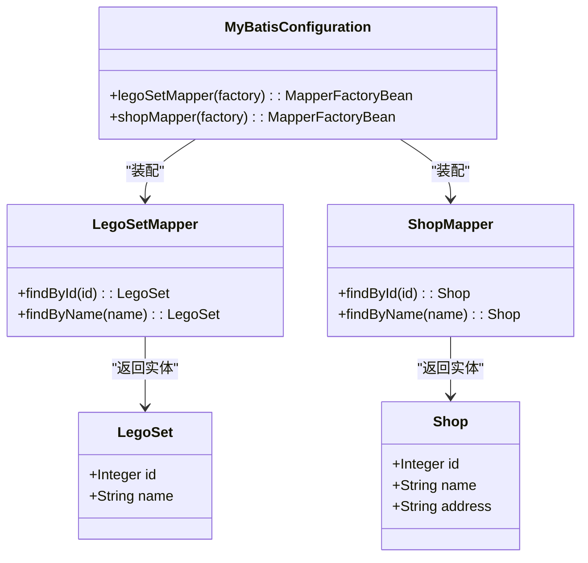
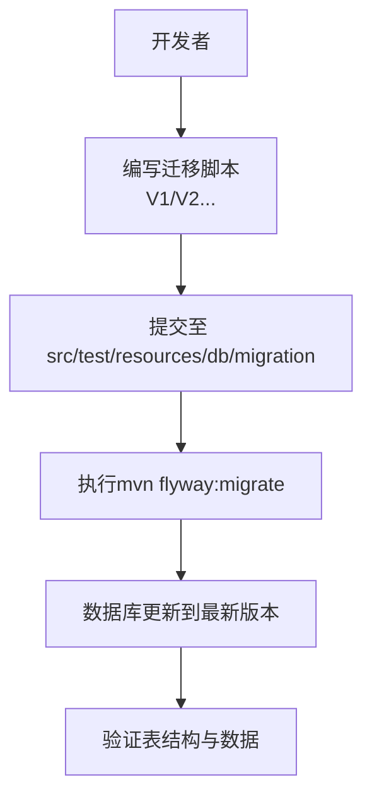
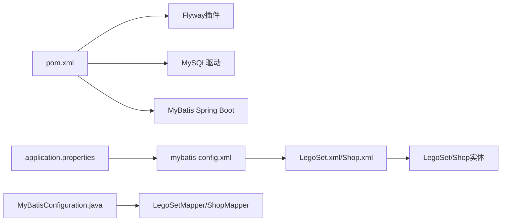

# 数据库设计

<cite>
**本文引用的文件**
- [LegoSet.java](file://src/main/java/org/mvnsearch/mybatis/demo/model/LegoSet.java)
- [Shop.java](file://src/main/java/org/mvnsearch/mybatis/demo/model/Shop.java)
- [LegoSetMapper.java](file://src/main/java/org/mvnsearch/mybatis/demo/repo/LegoSetMapper.java)
- [ShopMapper.java](file://src/main/java/org/mvnsearch/mybatis/demo/repo/ShopMapper.java)
- [MyBatisConfiguration.java](file://src/main/java/org/mvnsearch/mybatis/demo/repo/MyBatisConfiguration.java)
- [LegoSet.xml](file://src/main/resources/mapper/LegoSet.xml)
- [Shop.xml](file://src/main/resources/mapper/Shop.xml)
- [mybatis-config.xml](file://src/main/resources/mybatis-config.xml)
- [application.properties](file://src/main/resources/application.properties)
- [V1__logo_set.sql](file://src/test/resources/db/migration/V1__logo_set.sql)
- [V2__shop.sql](file://src/test/resources/db/migration/V2__shop.sql)
- [pom.xml](file://pom.xml)
</cite>

## 目录
1. [简介](#简介)
2. [项目结构](#项目结构)
3. [核心组件](#核心组件)
4. [架构总览](#架构总览)
5. [详细组件分析](#详细组件分析)
6. [依赖分析](#依赖分析)
7. [性能考量](#性能考量)
8. [故障排查指南](#故障排查指南)
9. [结论](#结论)
10. [附录](#附录)

## 简介
本文件为“MyBatis Spring Demo”项目的数据库设计与数据访问实现文档，聚焦以下目标：
- 表结构与字段定义：LegoSet 与 Shop 的列、数据类型与约束
- 实体模型与映射：Java 模型类与 MyBatis XML 映射的关系
- 数据访问层：Mapper 接口、XML SQL 语句、参数绑定与结果映射
- 迁移策略：Flyway 使用与版本管理（基于 Maven 插件）
- 类型别名与全局设置：MyBatis 配置与应用属性
- Schema 图与 ER 图：可视化展示表结构与关系
- 性能与缓存：查询优化与缓存策略建议
- 测试数据与数据集：Database Rider 集成与数据准备
- 最佳实践与常见陷阱：开发与运维建议

## 项目结构
该项目采用 Spring Boot + MyBatis 的分层组织方式：
- model 层：Java 实体类（LegoSet、Shop）
- repo 层：Mapper 接口与 MyBatis 配置
- resources/mapper：XML 映射文件
- resources/mybatis-config.xml：MyBatis 全局配置
- resources/application.properties：Spring 应用配置
- src/test/resources/db/migration：Flyway 迁移脚本
- pom.xml：Maven 构建与 Flyway 插件配置

**图表来源**
- [LegoSet.java:1-23](file://src/main/java/org/mvnsearch/mybatis/demo/model/LegoSet.java#L1-L23)
- [Shop.java:1-32](file://src/main/java/org/mvnsearch/mybatis/demo/model/Shop.java#L1-L32)
- [LegoSetMapper.java:1-21](file://src/main/java/org/mvnsearch/mybatis/demo/repo/LegoSetMapper.java#L1-L21)
- [ShopMapper.java:1-21](file://src/main/java/org/mvnsearch/mybatis/demo/repo/ShopMapper.java#L1-L21)
- [MyBatisConfiguration.java:1-25](file://src/main/java/org/mvnsearch/mybatis/demo/repo/MyBatisConfiguration.java#L1-L25)
- [LegoSet.xml:1-22](file://src/main/resources/mapper/LegoSet.xml#L1-L22)
- [Shop.xml:1-24](file://src/main/resources/mapper/Shop.xml#L1-L24)
- [mybatis-config.xml:1-14](file://src/main/resources/mybatis-config.xml#L1-L14)
- [application.properties:1-11](file://src/main/resources/application.properties#L1-L11)
- [V1__logo_set.sql:1-6](file://src/test/resources/db/migration/V1__logo_set.sql#L1-L6)
- [V2__shop.sql:1-7](file://src/test/resources/db/migration/V2__shop.sql#L1-L7)
- [pom.xml:112-136](file://pom.xml#L112-L136)

**章节来源**
- [LegoSet.java:1-23](file://src/main/java/org/mvnsearch/mybatis/demo/model/LegoSet.java#L1-L23)
- [Shop.java:1-32](file://src/main/java/org/mvnsearch/mybatis/demo/model/Shop.java#L1-L32)
- [LegoSetMapper.java:1-21](file://src/main/java/org/mvnsearch/mybatis/demo/repo/LegoSetMapper.java#L1-L21)
- [ShopMapper.java:1-21](file://src/main/java/org/mvnsearch/mybatis/demo/repo/ShopMapper.java#L1-L21)
- [MyBatisConfiguration.java:1-25](file://src/main/java/org/mvnsearch/mybatis/demo/repo/MyBatisConfiguration.java#L1-L25)
- [LegoSet.xml:1-22](file://src/main/resources/mapper/LegoSet.xml#L1-L22)
- [Shop.xml:1-24](file://src/main/resources/mapper/Shop.xml#L1-L24)
- [mybatis-config.xml:1-14](file://src/main/resources/mybatis-config.xml#L1-L14)
- [application.properties:1-11](file://src/main/resources/application.properties#L1-L11)
- [V1__logo_set.sql:1-6](file://src/test/resources/db/migration/V1__logo_set.sql#L1-L6)
- [V2__shop.sql:1-7](file://src/test/resources/db/migration/V2__shop.sql#L1-L7)
- [pom.xml:112-136](file://pom.xml#L112-L136)

## 核心组件
- LegoSet 实体：包含 id（整数）、name（字符串）两个字段
- Shop 实体：包含 id（整数）、name（字符串）、address（字符串）三个字段
- LegoSetMapper/ShopMapper：定义按 id 与按 name 查询的方法
- MyBatis 配置：通过 mybatis-config.xml 声明类型别名与映射文件加载
- XML 映射：在 LegoSet.xml 与 Shop.xml 中定义 resultMap 与 SQL 查询
- 应用配置：application.properties 指定数据源与 MyBatis 配置位置
- 迁移脚本：V1__logo_set.sql 与 V2__shop.sql 定义 lego_set 与 shop 表结构

**章节来源**
- [LegoSet.java:3-22](file://src/main/java/org/mvnsearch/mybatis/demo/model/LegoSet.java#L3-L22)
- [Shop.java:3-31](file://src/main/java/org/mvnsearch/mybatis/demo/model/Shop.java#L3-L31)
- [LegoSetMapper.java:12-20](file://src/main/java/org/mvnsearch/mybatis/demo/repo/LegoSetMapper.java#L12-L20)
- [ShopMapper.java:12-20](file://src/main/java/org/mvnsearch/mybatis/demo/repo/ShopMapper.java#L12-L20)
- [mybatis-config.xml:6-13](file://src/main/resources/mybatis-config.xml#L6-L13)
- [LegoSet.xml:5-20](file://src/main/resources/mapper/LegoSet.xml#L5-L20)
- [Shop.xml:5-21](file://src/main/resources/mapper/Shop.xml#L5-L21)
- [application.properties:1-11](file://src/main/resources/application.properties#L1-L11)
- [V1__logo_set.sql:1-6](file://src/test/resources/db/migration/V1__logo_set.sql#L1-L6)
- [V2__shop.sql:1-7](file://src/test/resources/db/migration/V2__shop.sql#L1-L7)

## 架构总览
下图展示了从应用到数据库的端到端流程：Spring Boot 启动 -> MyBatis 加载配置与映射 -> Mapper 调用 -> SQL 执行 -> 结果映射回实体。

**图表来源**
- [application.properties](file://src/main/resources/application.properties#L6)
- [mybatis-config.xml:10-13](file://src/main/resources/mybatis-config.xml#L10-L13)
- [LegoSet.xml:10-20](file://src/main/resources/mapper/LegoSet.xml#L10-L20)
- [Shop.xml:11-21](file://src/main/resources/mapper/Shop.xml#L11-L21)
- [LegoSetMapper.java:15-19](file://src/main/java/org/mvnsearch/mybatis/demo/repo/LegoSetMapper.java#L15-L19)
- [ShopMapper.java:15-19](file://src/main/java/org/mvnsearch/mybatis/demo/repo/ShopMapper.java#L15-L19)

## 详细组件分析

### LegoSet 表与实体映射
- 表结构（来自迁移脚本）：
  - id：整数，主键，自增
  - name：可变长度字符串，最大长度依据迁移脚本定义
- 实体字段：
  - id：Integer
  - name：String
- 映射关系：
  - XML 中通过 resultMap 将列名映射到实体属性
  - 提供按 id 与按 name 的查询方法

**图表来源**
- [V1__logo_set.sql:2-5](file://src/test/resources/db/migration/V1__logo_set.sql#L2-L5)
- [LegoSet.xml:5-8](file://src/main/resources/mapper/LegoSet.xml#L5-L8)
- [LegoSet.java:4-6](file://src/main/java/org/mvnsearch/mybatis/demo/model/LegoSet.java#L4-L6)

**章节来源**
- [V1__logo_set.sql:1-6](file://src/test/resources/db/migration/V1__logo_set.sql#L1-L6)
- [LegoSet.xml:5-20](file://src/main/resources/mapper/LegoSet.xml#L5-L20)
- [LegoSet.java:3-22](file://src/main/java/org/mvnsearch/mybatis/demo/model/LegoSet.java#L3-L22)

### Shop 表与实体映射
- 表结构（来自迁移脚本）：
  - id：整数，主键，自增
  - name：可变长度字符串
  - address：可变长度字符串
- 实体字段：
  - id：Integer
  - name：String
  - address：String
- 映射关系：
  - XML 中通过 resultMap 将列名映射到实体属性
  - 提供按 id 与按 name 的查询方法

**图表来源**
- [V2__shop.sql:2-6](file://src/test/resources/db/migration/V2__shop.sql#L2-L6)
- [Shop.xml:5-9](file://src/main/resources/mapper/Shop.xml#L5-L9)
- [Shop.java:4-6](file://src/main/java/org/mvnsearch/mybatis/demo/model/Shop.java#L4-L6)

**章节来源**
- [V2__shop.sql:1-7](file://src/test/resources/db/migration/V2__shop.sql#L1-L7)
- [Shop.xml:5-21](file://src/main/resources/mapper/Shop.xml#L5-L21)
- [Shop.java:3-31](file://src/main/java/org/mvnsearch/mybatis/demo/model/Shop.java#L3-L31)

### MyBatis XML 映射与参数绑定
- 类型别名：
  - 在 mybatis-config.xml 中为 LegoSet 与 Shop 注册别名，简化 XML 中的类型引用
- 结果映射：
  - LegoSet.xml/Shop.xml 分别定义 resultMap，将 SQL 列与 Java 属性一一对应
- 参数绑定：
  - SQL 使用命名参数占位符进行绑定，并在 XML 中声明参数类型
- 映射文件加载：
  - mybatis-config.xml 中通过 mappers 节点加载 XML 文件

**图表来源**
- [mybatis-config.xml:6-13](file://src/main/resources/mybatis-config.xml#L6-L13)
- [LegoSet.xml:5-20](file://src/main/resources/mapper/LegoSet.xml#L5-L20)
- [Shop.xml:5-21](file://src/main/resources/mapper/Shop.xml#L5-L21)

**章节来源**
- [mybatis-config.xml:6-13](file://src/main/resources/mybatis-config.xml#L6-L13)
- [LegoSet.xml:5-20](file://src/main/resources/mapper/LegoSet.xml#L5-L20)
- [Shop.xml:5-21](file://src/main/resources/mapper/Shop.xml#L5-L21)

### 数据访问层与配置
- Mapper 接口：
  - LegoSetMapper/ShopMapper 定义 findById 与 findByName 方法
  - 使用 @Mapper 注解由 Spring 自动发现
- 工厂 Bean 配置：
  - MyBatisConfiguration 通过 MapperFactoryBean 将 SqlSessionFactory 注入到 Mapper
- 应用配置：
  - application.properties 指定数据源、驱动与 MyBatis 配置文件位置

**图表来源**
- [LegoSet.java:3-22](file://src/main/java/org/mvnsearch/mybatis/demo/model/LegoSet.java#L3-L22)
- [Shop.java:3-31](file://src/main/java/org/mvnsearch/mybatis/demo/model/Shop.java#L3-L31)
- [LegoSetMapper.java:12-20](file://src/main/java/org/mvnsearch/mybatis/demo/repo/LegoSetMapper.java#L12-L20)
- [ShopMapper.java:12-20](file://src/main/java/org/mvnsearch/mybatis/demo/repo/ShopMapper.java#L12-L20)
- [MyBatisConfiguration.java:11-23](file://src/main/java/org/mvnsearch/mybatis/demo/repo/MyBatisConfiguration.java#L11-L23)

**章节来源**
- [LegoSetMapper.java:12-20](file://src/main/java/org/mvnsearch/mybatis/demo/repo/LegoSetMapper.java#L12-L20)
- [ShopMapper.java:12-20](file://src/main/java/org/mvnsearch/mybatis/demo/repo/ShopMapper.java#L12-L20)
- [MyBatisConfiguration.java:8-24](file://src/main/java/org/mvnsearch/mybatis/demo/repo/MyBatisConfiguration.java#L8-L24)
- [application.properties:1-11](file://src/main/resources/application.properties#L1-L11)

### 数据库迁移策略（Flyway）
- 插件配置：
  - pom.xml 中配置 flyway-maven-plugin，指定 JDBC 连接信息与迁移脚本目录
  - 迁移脚本位于 src/test/resources/db/migration
- 版本管理：
  - V1__logo_set.sql 创建 lego_set 表
  - V2__shop.sql 创建 shop 表
- 清理策略：
  - cleanDisabled=false，允许清理环境以确保迁移一致性

**图表来源**
- [pom.xml:112-136](file://pom.xml#L112-L136)
- [V1__logo_set.sql:1-6](file://src/test/resources/db/migration/V1__logo_set.sql#L1-L6)
- [V2__shop.sql:1-7](file://src/test/resources/db/migration/V2__shop.sql#L1-L7)

**章节来源**
- [pom.xml:112-136](file://pom.xml#L112-L136)
- [V1__logo_set.sql:1-6](file://src/test/resources/db/migration/V1__logo_set.sql#L1-L6)
- [V2__shop.sql:1-7](file://src/test/resources/db/migration/V2__shop.sql#L1-L7)

### 类型别名与全局 MyBatis 设置
- 类型别名：
  - mybatis-config.xml 中为 LegoSet 与 Shop 注册别名，便于在 XML 中直接使用
- 映射文件加载：
  - 通过 mappers 节点加载 LegoSet.xml 与 Shop.xml
- 应用侧配置：
  - application.properties 指定 mybatis.config-location，使 Spring Boot 加载自定义配置

**章节来源**
- [mybatis-config.xml:6-13](file://src/main/resources/mybatis-config.xml#L6-L13)
- [application.properties](file://src/main/resources/application.properties#L6)

## 依赖分析
- 组件耦合：
  - Mapper 接口依赖实体类；XML 映射依赖 Mapper 接口命名空间与方法 ID
  - MyBatisConfiguration 通过工厂 Bean 将 SqlSessionFactory 注入到 Mapper
- 外部依赖：
  - MySQL Connector/J、MyBatis Spring Boot Starter、Flyway Maven 插件
- 迁移脚本依赖：
  - V1/V2 脚本顺序执行，确保表结构演进

**图表来源**
- [pom.xml:30-101](file://pom.xml#L30-L101)
- [application.properties](file://src/main/resources/application.properties#L6)
- [mybatis-config.xml:10-13](file://src/main/resources/mybatis-config.xml#L10-L13)
- [LegoSet.xml](file://src/main/resources/mapper/LegoSet.xml#L3)
- [Shop.xml](file://src/main/resources/mapper/Shop.xml#L3)
- [MyBatisConfiguration.java:11-23](file://src/main/java/org/mvnsearch/mybatis/demo/repo/MyBatisConfiguration.java#L11-L23)

**章节来源**
- [pom.xml:30-101](file://pom.xml#L30-L101)
- [application.properties](file://src/main/resources/application.properties#L6)
- [mybatis-config.xml:10-13](file://src/main/resources/mybatis-config.xml#L10-L13)
- [MyBatisConfiguration.java:11-23](file://src/main/java/org/mvnsearch/mybatis/demo/repo/MyBatisConfiguration.java#L11-L23)

## 性能考量
- 查询优化建议：
  - 为常用过滤列（如 name）建立索引，提升 LIKE 或等值查询性能
  - 避免 SELECT *，仅选择必要列，减少网络与解析开销
- 缓存策略：
  - 开启二级缓存（需在 XML 中启用），适合只读或低频更新场景
  - 对热点数据可结合应用层缓存（如 Redis）实现多级缓存
- 连接与会话：
  - 控制连接池大小与超时时间，避免连接泄漏
  - 合理复用 SqlSession，避免长时间持有
- 日志与监控：
  - 通过日志级别观察 SQL 执行情况，定位慢查询
  - 结合数据库性能分析工具（如 EXPLAIN）优化复杂查询

## 故障排查指南
- 常见问题与处理：
  - 类型不匹配：检查 XML 中 parameterType 与实体类型是否一致
  - 列名不匹配：确认 resultMap 中 column 与数据库列名一致
  - 空指针：Mapper 方法返回值标注 @Nullable，调用方需判空
  - 迁移失败：核对 Flyway 连接信息与脚本路径，确保 cleanDisabled 配置正确
- 日志定位：
  - application.properties 中已开启 JDBC 与 MyBatis 相关日志级别，便于调试

**章节来源**
- [application.properties:7-11](file://src/main/resources/application.properties#L7-L11)
- [LegoSet.xml:10-20](file://src/main/resources/mapper/LegoSet.xml#L10-L20)
- [Shop.xml:11-21](file://src/main/resources/mapper/Shop.xml#L11-L21)
- [LegoSetMapper.java:15-19](file://src/main/java/org/mvnsearch/mybatis/demo/repo/LegoSetMapper.java#L15-L19)
- [ShopMapper.java:15-19](file://src/main/java/org/mvnsearch/mybatis/demo/repo/ShopMapper.java#L15-L19)
- [pom.xml:112-136](file://pom.xml#L112-L136)

## 结论
本项目通过清晰的实体模型、简洁的 XML 映射与标准的 Flyway 迁移，构建了可维护的数据库层。借助类型别名与全局配置，降低了 XML 写作复杂度；通过接口化的 Mapper 设计，实现了良好的可测试性与扩展性。建议在生产环境中进一步完善索引策略、缓存机制与监控告警，持续提升系统稳定性与性能。

## 附录
- 测试数据与数据集：
  - 项目使用 Database Rider 与 DBUnit 进行测试数据管理，测试资源位于 src/test/resources/db/dataset
- 最佳实践清单：
  - 始终显式声明 parameterType
  - 保持 resultMap 与表结构同步
  - 使用 Flyway 管理迁移，禁止手工修改生产库
  - 对高频查询建立索引，避免全表扫描
  - 合理使用缓存，注意数据一致性