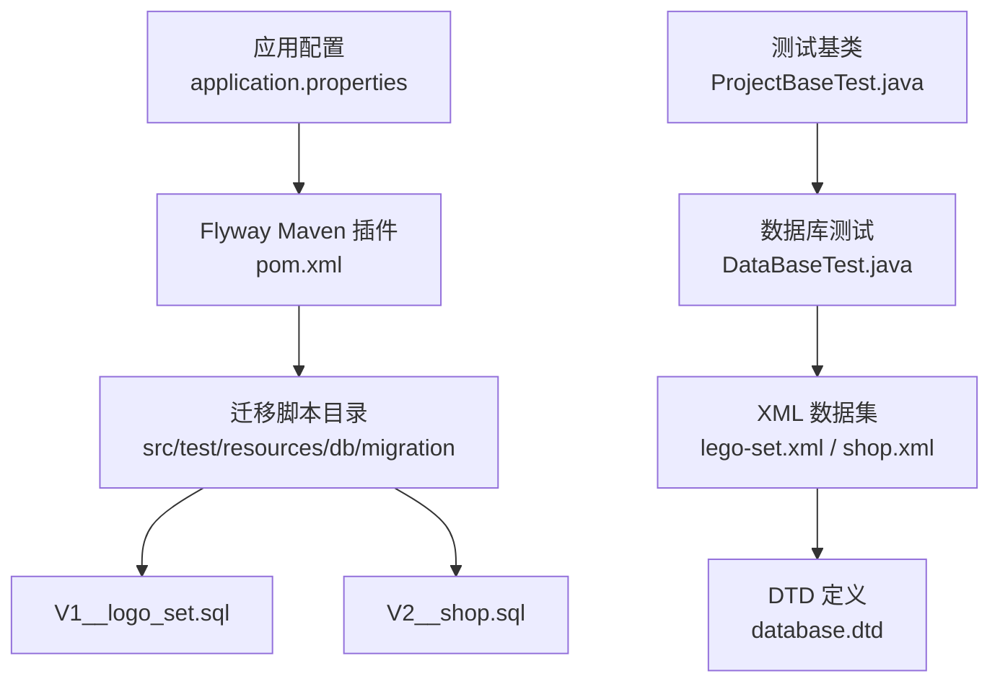
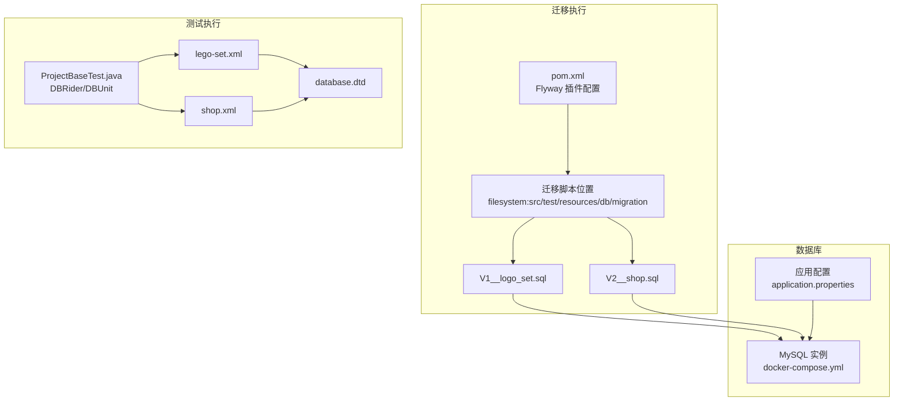
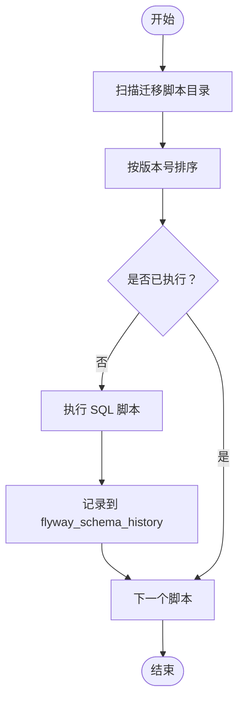
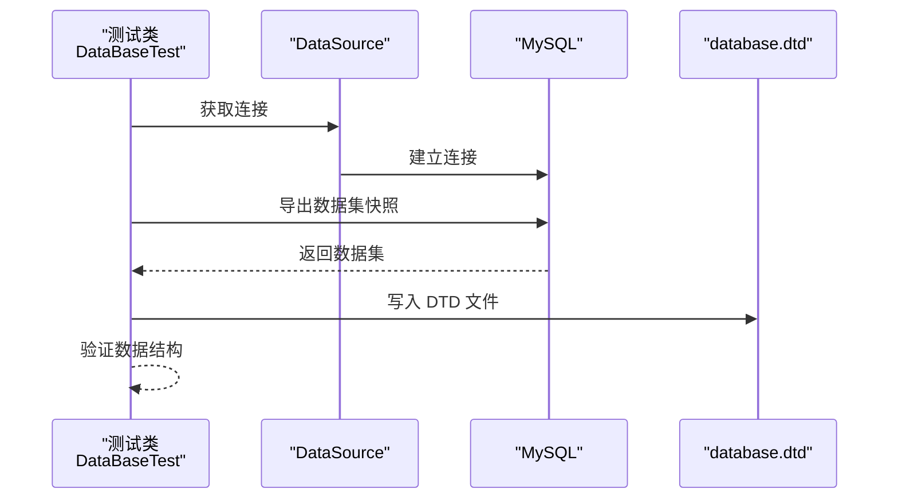
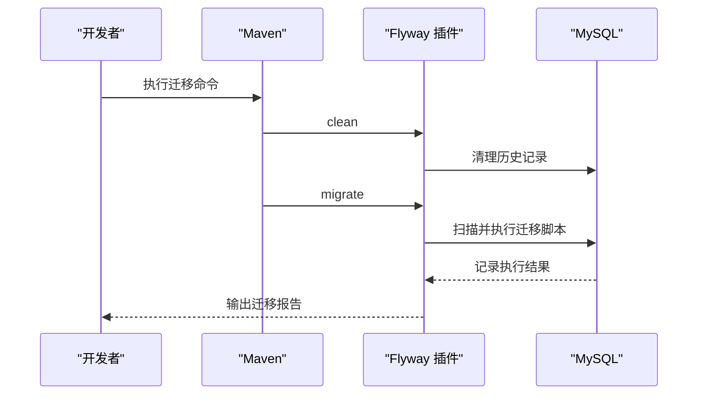
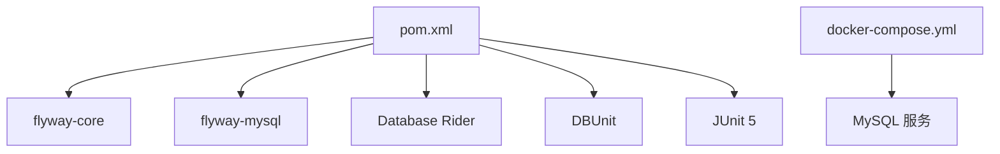

# 数据库迁移

<cite>
**本文引用的文件**
- [pom.xml](file://pom.xml)
- [application.properties](file://src/main/resources/application.properties)
- [V1__logo_set.sql](file://src/test/resources/db/migration/V1__logo_set.sql)
- [V2__shop.sql](file://src/test/resources/db/migration/V2__shop.sql)
- [database.dtd](file://database.dtd)
- [src/test/resources/db/dataset/database.dtd](file://src/test/resources/db/dataset/database.dtd)
- [lego-set.xml](file://src/test/resources/db/dataset/lego-set.xml)
- [shop.xml](file://src/test/resources/db/dataset/shop.xml)
- [docker-compose.yml](file://docker-compose.yml)
- [Justfile](file://Justfile)
- [README.md](file://README.md)
- [AGENTS.md](file://AGENTS.md)
- [DataBaseTest.java](file://src/test/java/org/mvnsearch/mybatis/demo/DataBaseTest.java)
- [ProjectBaseTest.java](file://src/test/java/org/mvnsearch/mybatis/demo/ProjectBaseTest.java)
</cite>

## 目录
1. [简介](#简介)
2. [项目结构](#项目结构)
3. [核心组件](#核心组件)
4. [架构总览](#架构总览)
5. [详细组件分析](#详细组件分析)
6. [依赖分析](#依赖分析)
7. [性能考虑](#性能考虑)
8. [故障排除指南](#故障排除指南)
9. [结论](#结论)
10. [附录](#附录)

## 简介
本项目采用 Flyway 进行数据库迁移与版本管理，结合 Maven 插件在测试环境中自动执行迁移脚本。迁移脚本位于测试资源目录中，通过 Flyway 的 Maven 插件加载并执行，确保数据库结构与应用一致。同时，项目使用 DBUnit（配合 Database Rider）进行数据库测试，通过 XML 数据集与 DTD 定义，保证测试数据的一致性与可验证性。

## 项目结构
- 迁移脚本位置：测试资源目录下的 db/migration，包含 V1__logo_set.sql、V2__shop.sql。
- 应用配置：application.properties 中定义了 MySQL 数据源连接信息。
- 测试配置：ProjectBaseTest 使用 DBRider 与 DBUnit，启用 MySQL 测试环境；DataBaseTest 提供 DTD 生成能力。
- 构建与迁移：pom.xml 配置 Flyway Maven 插件，指定迁移脚本位置为测试资源目录；Justfile 提供一键迁移命令。

**图表来源**
- [pom.xml:112-136](file://pom.xml#L112-L136)
- [application.properties:1-11](file://src/main/resources/application.properties#L1-L11)
- [V1__logo_set.sql:1-6](file://src/test/resources/db/migration/V1__logo_set.sql#L1-L6)
- [V2__shop.sql:1-7](file://src/test/resources/db/migration/V2__shop.sql#L1-L7)
- [ProjectBaseTest.java:15-21](file://src/test/java/org/mvnsearch/mybatis/demo/ProjectBaseTest.java#L15-L21)
- [DataBaseTest.java:12-26](file://src/test/java/org/mvnsearch/mybatis/demo/DataBaseTest.java#L12-L26)
- [lego-set.xml:1-7](file://src/test/resources/db/dataset/lego-set.xml#L1-L7)
- [shop.xml:1-8](file://src/test/resources/db/dataset/shop.xml#L1-L8)
- [database.dtd:1-24](file://database.dtd#L1-L24)

**章节来源**
- [pom.xml:112-136](file://pom.xml#L112-L136)
- [application.properties:1-11](file://src/main/resources/application.properties#L1-L11)
- [V1__logo_set.sql:1-6](file://src/test/resources/db/migration/V1__logo_set.sql#L1-L6)
- [V2__shop.sql:1-7](file://src/test/resources/db/migration/V2__shop.sql#L1-L7)
- [ProjectBaseTest.java:15-21](file://src/test/java/org/mvnsearch/mybatis/demo/ProjectBaseTest.java#L15-L21)
- [DataBaseTest.java:12-26](file://src/test/java/org/mvnsearch/mybatis/demo/DataBaseTest.java#L12-L26)
- [lego-set.xml:1-7](file://src/test/resources/db/dataset/lego-set.xml#L1-L7)
- [shop.xml:1-8](file://src/test/resources/db/dataset/shop.xml#L1-L8)
- [database.dtd:1-24](file://database.dtd#L1-L24)

## 核心组件
- Flyway Maven 插件：在构建过程中自动清理与执行迁移脚本，配置了 JDBC 连接参数与迁移脚本位置。
- 迁移脚本：以 V<版本>__<描述>.sql 命名，按版本号顺序执行。
- 测试环境配置：通过 application.properties 指定 MySQL 连接；ProjectBaseTest 启用 DBRider 与 DBUnit。
- 数据集与 DTD：lego-set.xml、shop.xml 作为测试数据集，database.dtd 描述数据模型与 flyway_schema_history 结构。

**章节来源**
- [pom.xml:112-136](file://pom.xml#L112-L136)
- [application.properties:1-11](file://src/main/resources/application.properties#L1-L11)
- [ProjectBaseTest.java:15-21](file://src/test/java/org/mvnsearch/mybatis/demo/ProjectBaseTest.java#L15-L21)
- [lego-set.xml:1-7](file://src/test/resources/db/dataset/lego-set.xml#L1-L7)
- [shop.xml:1-8](file://src/test/resources/db/dataset/shop.xml#L1-L8)
- [database.dtd:1-24](file://database.dtd#L1-L24)

## 架构总览
Flyway 在测试阶段自动扫描并执行迁移脚本，确保数据库结构与脚本一致。测试运行时，DBRider 与 DBUnit 负责数据集装载与断言，同时通过 DTD 生成工具输出数据库结构快照，便于回归验证。

**图表来源**
- [pom.xml:112-136](file://pom.xml#L112-L136)
- [application.properties:1-11](file://src/main/resources/application.properties#L1-L11)
- [docker-compose.yml:1-9](file://docker-compose.yml#L1-L9)
- [ProjectBaseTest.java:15-21](file://src/test/java/org/mvnsearch/mybatis/demo/ProjectBaseTest.java#L15-L21)
- [lego-set.xml:1-7](file://src/test/resources/db/dataset/lego-set.xml#L1-L7)
- [shop.xml:1-8](file://src/test/resources/db/dataset/shop.xml#L1-L8)
- [database.dtd:1-24](file://database.dtd#L1-L24)

## 详细组件分析

### 迁移脚本与命名规范
- 版本命名：V<版本号>__<描述>.sql，版本号递增，描述用于语义化标识。
- 执行顺序：Flyway 按版本号升序执行，先 V1 再 V2。
- 可重复执行：脚本应幂等，避免重复执行导致的数据不一致。

**图表来源**
- [pom.xml:131-133](file://pom.xml#L131-L133)
- [V1__logo_set.sql:1-6](file://src/test/resources/db/migration/V1__logo_set.sql#L1-L6)
- [V2__shop.sql:1-7](file://src/test/resources/db/migration/V2__shop.sql#L1-L7)
- [database.dtd:5-17](file://database.dtd#L5-L17)

**章节来源**
- [pom.xml:131-133](file://pom.xml#L131-L133)
- [V1__logo_set.sql:1-6](file://src/test/resources/db/migration/V1__logo_set.sql#L1-L6)
- [V2__shop.sql:1-7](file://src/test/resources/db/migration/V2__shop.sql#L1-L7)
- [database.dtd:5-17](file://database.dtd#L5-L17)

### 测试与数据集
- 数据集装载：通过 @DataSet 注解加载 XML 数据集，支持多表数据初始化。
- DTD 生成：使用 DatabaseConnection 生成数据库结构快照，写入项目根目录与测试资源目录。
- 断言与验证：基于 DBUnit 与 Database Rider 的数据集断言机制，验证迁移后数据一致性。

**图表来源**
- [DataBaseTest.java:20-25](file://src/test/java/org/mvnsearch/mybatis/demo/DataBaseTest.java#L20-L25)
- [lego-set.xml:1-7](file://src/test/resources/db/dataset/lego-set.xml#L1-L7)
- [shop.xml:1-8](file://src/test/resources/db/dataset/shop.xml#L1-L8)
- [database.dtd:1-24](file://database.dtd#L1-L24)

**章节来源**
- [DataBaseTest.java:12-26](file://src/test/java/org/mvnsearch/mybatis/demo/DataBaseTest.java#L12-L26)
- [lego-set.xml:1-7](file://src/test/resources/db/dataset/lego-set.xml#L1-L7)
- [shop.xml:1-8](file://src/test/resources/db/dataset/shop.xml#L1-L8)
- [database.dtd:1-24](file://database.dtd#L1-L24)

### 迁移执行流程
- 清理与迁移：通过 Justfile 提供的命令依次执行 clean 与 migrate，确保迁移状态与脚本一致。
- 连接配置：pom.xml 中 Flyway 插件读取 JDBC URL、用户名与密码，连接目标数据库。
- 脚本位置：迁移脚本位于测试资源目录，便于在测试环境中快速验证。

**图表来源**
- [Justfile:6-8](file://Justfile#L6-L8)
- [pom.xml:112-136](file://pom.xml#L112-L136)
- [application.properties:1-11](file://src/main/resources/application.properties#L1-L11)

**章节来源**
- [Justfile:6-8](file://Justfile#L6-L8)
- [pom.xml:112-136](file://pom.xml#L112-L136)
- [application.properties:1-11](file://src/main/resources/application.properties#L1-L11)

## 依赖分析
- Flyway 插件依赖：pom.xml 中声明 flyway-core 与 flyway-mysql，确保对 MySQL 的支持。
- 测试依赖：Database Rider、DBUnit 与 JUnit 5，提供数据库测试能力。
- 数据库实例：docker-compose 提供本地 MySQL 服务，默认端口映射与数据库名称。

**图表来源**
- [pom.xml:115-125](file://pom.xml#L115-L125)
- [docker-compose.yml:1-9](file://docker-compose.yml#L1-9)

**章节来源**
- [pom.xml:115-125](file://pom.xml#L115-L125)
- [docker-compose.yml:1-9](file://docker-compose.yml#L1-9)

## 性能考虑
- 迁移脚本幂等性：确保重复执行不会产生副作用，减少回滚与重试成本。
- 数据集规模：测试数据集应精简，避免影响迁移与测试执行时间。
- 并发与锁：在高并发场景下，合理拆分迁移任务，避免长事务与表级锁争用。
- 缓存与索引：迁移后及时重建或优化索引，提升查询性能。

## 故障排除指南
- 迁移失败
  - 检查 JDBC 连接参数与数据库可达性。
  - 查看 Flyway 历史记录表，确认失败脚本与错误信息。
  - 修复脚本后重新执行 migrate。
- 测试数据不一致
  - 使用 DTD 生成工具导出当前数据库结构，比对预期模型。
  - 检查 XML 数据集字段与 DTD 定义是否匹配。
- 环境差异
  - 开发与测试环境使用相同脚本目录；生产环境建议独立脚本与更严格的审批流程。
  - 使用 Justfile 统一迁移命令，避免手工误操作。

**章节来源**
- [pom.xml:127-135](file://pom.xml#L127-L135)
- [application.properties:1-11](file://src/main/resources/application.properties#L1-L11)
- [DataBaseTest.java:20-25](file://src/test/java/org/mvnsearch/mybatis/demo/DataBaseTest.java#L20-L25)
- [database.dtd:1-24](file://database.dtd#L1-L24)

## 结论
本项目通过 Flyway 与 Maven 插件实现了自动化数据库迁移，结合 DBUnit 与 Database Rider 提供了可靠的测试验证机制。迁移脚本遵循 V<版本>__<描述>.sql 命名规范，按版本号顺序执行。测试环境通过 Justfile 提供统一的迁移命令，确保开发与测试一致性。建议在生产环境引入更严格的审批与回滚策略，并持续优化迁移脚本的幂等性与性能。

## 附录

### 迁移脚本编写规范与命名约定
- 版本号：使用整数递增，如 V1、V2。
- 描述：使用下划线分隔的语义化描述，如 __logo_set、__shop。
- 幂等性：确保重复执行不会破坏数据库一致性。
- 依赖：尽量避免跨版本依赖，保持脚本独立。

**章节来源**
- [V1__logo_set.sql:1-6](file://src/test/resources/db/migration/V1__logo_set.sql#L1-L6)
- [V2__shop.sql:1-7](file://src/test/resources/db/migration/V2__shop.sql#L1-L7)

### 迁移执行顺序与依赖关系
- 执行顺序：按版本号升序执行，先 V1 再 V2。
- 依赖关系：脚本之间无隐式依赖，建议显式处理依赖表与约束。

**章节来源**
- [pom.xml:131-133](file://pom.xml#L131-L133)
- [V1__logo_set.sql:1-6](file://src/test/resources/db/migration/V1__logo_set.sql#L1-L6)
- [V2__shop.sql:1-7](file://src/test/resources/db/migration/V2__shop.sql#L1-L7)

### 数据库版本控制与回滚策略
- 版本控制：通过 flyway_schema_history 表记录每次迁移的版本、描述、执行时间与结果。
- 回滚：优先使用“向前迁移”替代回滚；若必须回滚，编写对应的降级脚本并严格测试。

**章节来源**
- [database.dtd:5-17](file://database.dtd#L5-L17)
- [src/test/resources/db/dataset/database.dtd:5-17](file://src/test/resources/db/dataset/database.dtd#L5-L17)

### 迁移脚本测试方法与验证步骤
- 加载数据集：使用 @DataSet 注解加载 XML 数据集。
- 生成 DTD：导出数据库结构快照，校验数据模型。
- 断言验证：基于 DBUnit 与 Database Rider 的断言机制验证迁移结果。

**章节来源**
- [ProjectBaseTest.java:15-21](file://src/test/java/org/mvnsearch/mybatis/demo/ProjectBaseTest.java#L15-L21)
- [DataBaseTest.java:12-26](file://src/test/java/org/mvnsearch/mybatis/demo/DataBaseTest.java#L12-L26)
- [lego-set.xml:1-7](file://src/test/resources/db/dataset/lego-set.xml#L1-L7)
- [shop.xml:1-8](file://src/test/resources/db/dataset/shop.xml#L1-L8)
- [database.dtd:1-24](file://database.dtd#L1-L24)

### 生产环境与开发环境差异
- 开发/测试：迁移脚本位于测试资源目录，便于快速迭代。
- 生产：建议使用独立脚本目录与 CI/CD 审批流程，限制直接修改权限。

**章节来源**
- [pom.xml:131-133](file://pom.xml#L131-L133)
- [AGENTS.md:22-25](file://AGENTS.md#L22-L25)

### 迁移过程中的数据备份与恢复策略
- 备份：在执行重大迁移前，导出数据库结构与数据快照。
- 恢复：使用备份快照快速恢复至迁移前状态，降低风险。

**章节来源**
- [docker-compose.yml:1-9](file://docker-compose.yml#L1-9)
- [application.properties:1-11](file://src/main/resources/application.properties#L1-L11)

### 迁移失败处理与故障排除
- 检查连接与凭据：确认 JDBC URL、用户名与密码正确。
- 查看历史记录：定位失败脚本与错误原因。
- 修复并重试：修正脚本后重新执行 migrate。

**章节来源**
- [pom.xml:127-135](file://pom.xml#L127-L135)
- [Justfile:6-8](file://Justfile#L6-L8)

### 最佳实践与常见问题
- 最佳实践
  - 迁移脚本幂等且可逆。
  - 使用测试数据集与 DTD 验证结构一致性。
  - 在生产环境引入审批与灰度发布。
- 常见问题
  - 脚本依赖未满足：显式处理外键与索引。
  - 数据类型不兼容：统一字符集与排序规则。
  - 权限不足：确保迁移用户具备必要权限。

**章节来源**
- [pom.xml:115-125](file://pom.xml#L115-L125)
- [README.md:63-83](file://README.md#L63-L83)
- [AGENTS.md:22-25](file://AGENTS.md#L22-L25)