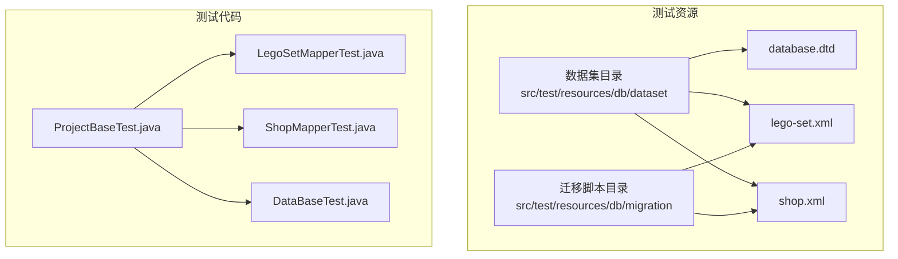
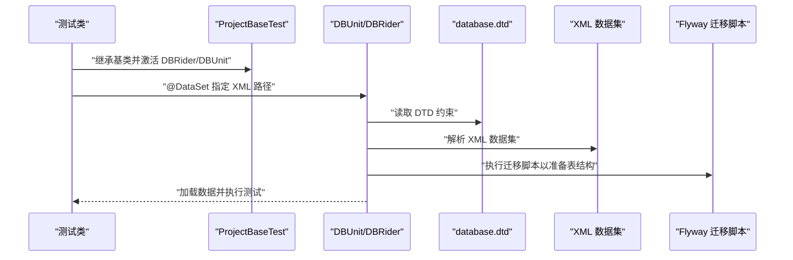
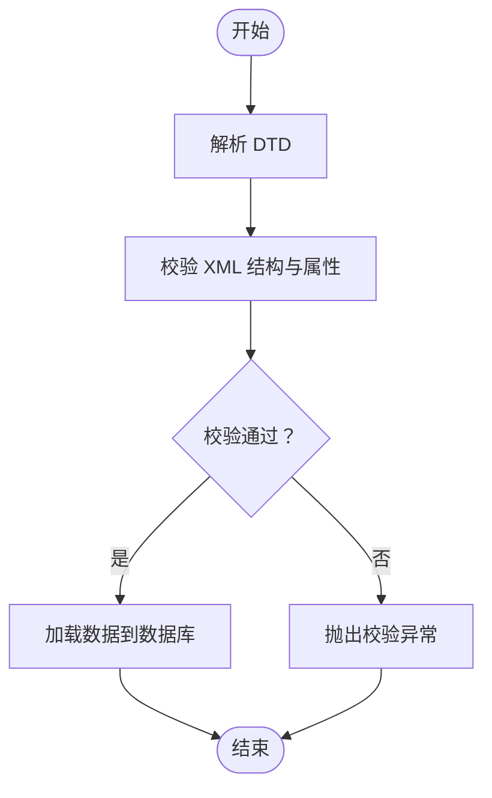
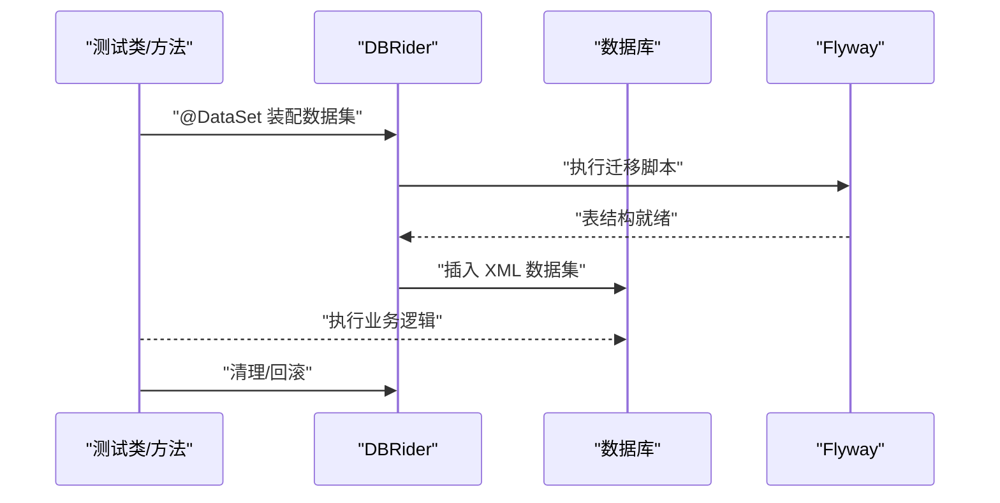
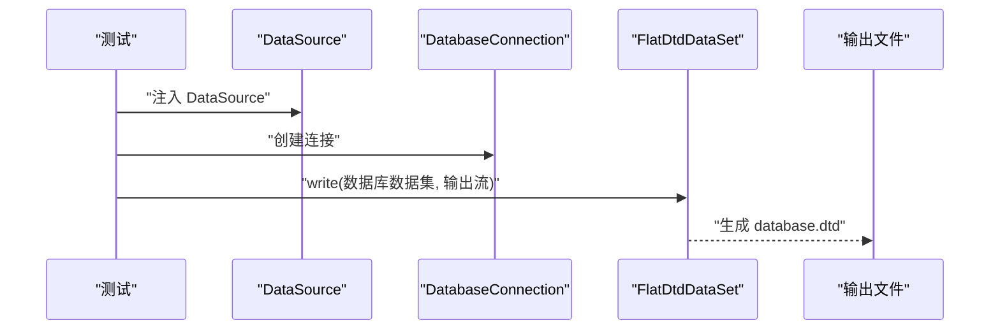
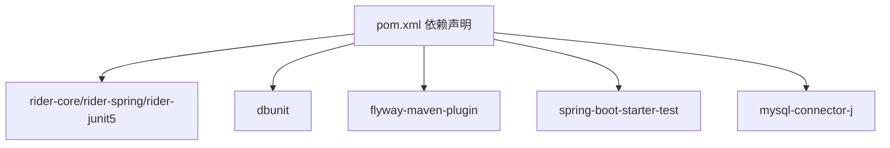

# 测试数据管理

<cite>
**本文引用的文件**
- [pom.xml](file://pom.xml)
- [application.properties](file://src/main/resources/application.properties)
- [application-test.properties](file://src/test/resources/application-test.properties)
- [ProjectBaseTest.java](file://src/test/java/org/mvnsearch/mybatis/demo/ProjectBaseTest.java)
- [DataBaseTest.java](file://src/test/java/org/mvnsearch/mybatis/demo/DataBaseTest.java)
- [LegoSetMapperTest.java](file://src/test/java/org/mvnsearch/mybatis/demo/repo/LegoSetMapperTest.java)
- [ShopMapperTest.java](file://src/test/java/org/mvnsearch/mybatis/demo/repo/ShopMapperTest.java)
- [database.dtd](file://src/test/resources/db/dataset/database.dtd)
- [lego-set.xml](file://src/test/resources/db/dataset/lego-set.xml)
- [shop.xml](file://src/test/resources/db/dataset/shop.xml)
- [V1__logo_set.sql](file://src/test/resources/db/migration/V1__logo_set.sql)
- [V2__shop.sql](file://src/test/resources/db/migration/V2__shop.sql)
- [MyBatisConfiguration.java](file://src/main/java/org/mvnsearch/mybatis/demo/repo/MyBatisConfiguration.java)
</cite>

## 目录
1. [引言](#引言)
2. [项目结构](#项目结构)
3. [核心组件](#核心组件)
4. [架构总览](#架构总览)
5. [详细组件分析](#详细组件分析)
6. [依赖分析](#依赖分析)
7. [性能考虑](#性能考虑)
8. [故障排查指南](#故障排查指南)
9. [结论](#结论)
10. [附录](#附录)

## 引言
本文件系统性阐述本项目的测试数据管理方案，围绕 Database Rider 的使用与数据集配置展开，覆盖以下主题：
- XML 数据集文件的结构与数据格式
- DTD 文件的作用与验证机制
- 测试数据的加载与清理策略
- 数据集的组织结构与命名规范
- 测试隔离与数据依赖管理
- 测试数据的维护与更新流程
- 不同测试场景下的数据需求与配置
- 最佳实践与性能优化建议

## 项目结构
测试数据相关的关键位置如下：
- 测试资源目录：src/test/resources/db/dataset
  - DTD 定义：database.dtd
  - 数据集：lego-set.xml、shop.xml
- 数据库迁移脚本：src/test/resources/db/migration
  - V1__logo_set.sql（创建 lego_set 表）
  - V2__shop.sql（创建 shop 表）
- 测试基类与测试用例：
  - ProjectBaseTest（DBUnit/DBRider 配置）
  - LegoSetMapperTest、ShopMapperTest（数据集装配）
  - DataBaseTest（DTD 生成示例）

图表来源
- [lego-set.xml:1-7](file://src/test/resources/db/dataset/lego-set.xml#L1-L7)
- [shop.xml:1-8](file://src/test/resources/db/dataset/shop.xml#L1-L8)
- [database.dtd:1-25](file://src/test/resources/db/dataset/database.dtd#L1-L25)
- [V1__logo_set.sql:1-6](file://src/test/resources/db/migration/V1__logo_set.sql#L1-L6)
- [V2__shop.sql:1-7](file://src/test/resources/db/migration/V2__shop.sql#L1-L7)
- [ProjectBaseTest.java:15-21](file://src/test/java/org/mvnsearch/mybatis/demo/ProjectBaseTest.java#L15-L21)
- [LegoSetMapperTest.java:26-27](file://src/test/java/org/mvnsearch/mybatis/demo/repo/LegoSetMapperTest.java#L26-L27)
- [ShopMapperTest.java:11-12](file://src/test/java/org/mvnsearch/mybatis/demo/repo/ShopMapperTest.java#L11-L12)
- [DataBaseTest.java:12-26](file://src/test/java/org/mvnsearch/mybatis/demo/DataBaseTest.java#L12-L26)

章节来源
- [lego-set.xml:1-7](file://src/test/resources/db/dataset/lego-set.xml#L1-L7)
- [shop.xml:1-8](file://src/test/resources/db/dataset/shop.xml#L1-L8)
- [database.dtd:1-25](file://src/test/resources/db/dataset/database.dtd#L1-L25)
- [V1__logo_set.sql:1-6](file://src/test/resources/db/migration/V1__logo_set.sql#L1-L6)
- [V2__shop.sql:1-7](file://src/test/resources/db/migration/V2__shop.sql#L1-L7)
- [ProjectBaseTest.java:15-21](file://src/test/java/org/mvnsearch/mybatis/demo/ProjectBaseTest.java#L15-L21)
- [LegoSetMapperTest.java:26-27](file://src/test/java/org/mvnsearch/mybatis/demo/repo/LegoSetMapperTest.java#L26-L27)
- [ShopMapperTest.java:11-12](file://src/test/java/org/mvnsearch/mybatis/demo/repo/ShopMapperTest.java#L11-L12)
- [DataBaseTest.java:12-26](file://src/test/java/org/mvnsearch/mybatis/demo/DataBaseTest.java#L12-L26)

## 核心组件
- 测试基类 ProjectBaseTest
  - 负责启用 DBRider 与 DBUnit，设置 schema、禁用序列过滤、指定 MySQL 类型等
  - 统一为所有测试提供数据集装配能力
- 数据集装配注解
  - 在测试类或方法上通过 @DataSet 指定 XML 数据集路径
  - 支持按需加载特定表的数据，实现测试隔离
- DTD 验证
  - 使用 DTD 约束 XML 数据集的元素与属性，确保数据集结构正确
- DTD 生成工具
  - 通过 DatabaseConnection 与 FlatDtdDataSet 动态生成 DTD，便于维护一致性

章节来源
- [ProjectBaseTest.java:15-21](file://src/test/java/org/mvnsearch/mybatis/demo/ProjectBaseTest.java#L15-L21)
- [LegoSetMapperTest.java:26-27](file://src/test/java/org/mvnsearch/mybatis/demo/repo/LegoSetMapperTest.java#L26-L27)
- [ShopMapperTest.java:11-12](file://src/test/java/org/mvnsearch/mybatis/demo/repo/ShopMapperTest.java#L11-L12)
- [DataBaseTest.java:14-25](file://src/test/java/org/mvnsearch/mybatis/demo/DataBaseTest.java#L14-L25)
- [database.dtd:1-25](file://src/test/resources/db/dataset/database.dtd#L1-L25)

## 架构总览
下图展示测试数据从迁移脚本到数据集再到测试执行的整体流程。

图表来源
- [ProjectBaseTest.java:15-21](file://src/test/java/org/mvnsearch/mybatis/demo/ProjectBaseTest.java#L15-L21)
- [LegoSetMapperTest.java:26-27](file://src/test/java/org/mvnsearch/mybatis/demo/repo/LegoSetMapperTest.java#L26-L27)
- [ShopMapperTest.java:11-12](file://src/test/java/org/mvnsearch/mybatis/demo/repo/ShopMapperTest.java#L11-L12)
- [lego-set.xml:1-7](file://src/test/resources/db/dataset/lego-set.xml#L1-L7)
- [shop.xml:1-8](file://src/test/resources/db/dataset/shop.xml#L1-L8)
- [database.dtd:1-25](file://src/test/resources/db/dataset/database.dtd#L1-L25)
- [V1__logo_set.sql:1-6](file://src/test/resources/db/migration/V1__logo_set.sql#L1-L6)
- [V2__shop.sql:1-7](file://src/test/resources/db/migration/V2__shop.sql#L1-L7)

## 详细组件分析

### XML 数据集与 DTD 验证
- 结构与格式
  - 每个 XML 数据集均声明 DTD 引用，根元素为 dataset，包含若干表元素
  - 表元素对应数据库表名（如 lego_set），属性与列一致
- DTD 的作用
  - 定义 dataset 子元素集合与表元素的属性列表
  - 保证 XML 数据集与数据库结构一致，避免拼写错误与字段缺失
- 验证机制
  - 解析时依据 DTD 进行结构校验；属性缺失或类型不匹配会导致失败
  - 建议在 CI 中开启严格模式，确保数据集质量

图表来源
- [database.dtd:1-25](file://src/test/resources/db/dataset/database.dtd#L1-L25)
- [lego-set.xml:1-7](file://src/test/resources/db/dataset/lego-set.xml#L1-L7)
- [shop.xml:1-8](file://src/test/resources/db/dataset/shop.xml#L1-L8)

章节来源
- [database.dtd:1-25](file://src/test/resources/db/dataset/database.dtd#L1-L25)
- [lego-set.xml:1-7](file://src/test/resources/db/dataset/lego-set.xml#L1-L7)
- [shop.xml:1-8](file://src/test/resources/db/dataset/shop.xml#L1-L8)

### 数据集装配与加载策略
- 装配方式
  - 在测试类级别使用 @DataSet 指定数据集路径，支持相对路径（从 classpath 根）或绝对路径
  - 可在方法级别叠加 @DataSet，实现更细粒度的数据控制
- 加载顺序
  - 先执行 Flyway 迁移脚本准备表结构，再加载数据集
  - DBRider 默认会根据 DTD 与 XML 内容进行数据插入
- 清理策略
  - 建议使用 DBRider 的数据清理策略（如每次测试后回滚或删除），避免跨测试污染
  - 可结合 @UsingDataSet 的参数控制清理时机与范围

图表来源
- [LegoSetMapperTest.java:26-27](file://src/test/java/org/mvnsearch/mybatis/demo/repo/LegoSetMapperTest.java#L26-L27)
- [ShopMapperTest.java:11-12](file://src/test/java/org/mvnsearch/mybatis/demo/repo/ShopMapperTest.java#L11-L12)
- [V1__logo_set.sql:1-6](file://src/test/resources/db/migration/V1__logo_set.sql#L1-L6)
- [V2__shop.sql:1-7](file://src/test/resources/db/migration/V2__shop.sql#L1-L7)

章节来源
- [LegoSetMapperTest.java:26-27](file://src/test/java/org/mvnsearch/mybatis/demo/repo/LegoSetMapperTest.java#L26-L27)
- [ShopMapperTest.java:11-12](file://src/test/java/org/mvnsearch/mybatis/demo/repo/ShopMapperTest.java#L11-L12)
- [V1__logo_set.sql:1-6](file://src/test/resources/db/migration/V1__logo_set.sql#L1-L6)
- [V2__shop.sql:1-7](file://src/test/resources/db/migration/V2__shop.sql#L1-L7)

### DTD 生成与维护
- 手工编写 DTD
  - 适用于已有稳定表结构的场景，便于版本控制与审查
- 动态生成 DTD
  - 通过 DatabaseConnection 与 FlatDtdDataSet 将当前数据库结构导出为 DTD
  - 适合表结构频繁变更或新环境初始化时快速对齐

图表来源
- [DataBaseTest.java:20-25](file://src/test/java/org/mvnsearch/mybatis/demo/DataBaseTest.java#L20-L25)

章节来源
- [DataBaseTest.java:20-25](file://src/test/java/org/mvnsearch/mybatis/demo/DataBaseTest.java#L20-L25)

### 测试隔离与数据依赖管理
- 隔离策略
  - 每个测试仅加载所需数据集，避免共享状态
  - 使用 schema 或测试专用库，减少跨测试影响
- 依赖管理
  - 明确数据集之间的依赖关系（如先迁移后加载）
  - 对于多表关联，优先在单测中构造最小依赖集，避免复杂外键链

章节来源
- [ProjectBaseTest.java:15-21](file://src/test/java/org/mvnsearch/mybatis/demo/ProjectBaseTest.java#L15-L21)
- [V1__logo_set.sql:1-6](file://src/test/resources/db/migration/V1__logo_set.sql#L1-L6)
- [V2__shop.sql:1-7](file://src/test/resources/db/migration/V2__shop.sql#L1-L7)

### 数据集组织结构与命名规范
- 目录结构
  - src/test/resources/db/dataset：存放 DTD 与 XML 数据集
  - src/test/resources/db/migration：存放 Flyway 迁移脚本
- 命名规范
  - DTD：database.dtd
  - 数据集：表名.xml（如 lego-set.xml、shop.xml）
  - 迁移脚本：V<版本>__<描述>.sql（如 V1__logo_set.sql、V2__shop.sql）
- 路径约定
  - @DataSet 中使用 classpath 相对路径（例如 db/dataset/xxx.xml）

章节来源
- [database.dtd:1-25](file://src/test/resources/db/dataset/database.dtd#L1-L25)
- [lego-set.xml:1-7](file://src/test/resources/db/dataset/lego-set.xml#L1-L7)
- [shop.xml:1-8](file://src/test/resources/db/dataset/shop.xml#L1-L8)
- [V1__logo_set.sql:1-6](file://src/test/resources/db/migration/V1__logo_set.sql#L1-L6)
- [V2__shop.sql:1-7](file://src/test/resources/db/migration/V2__shop.sql#L1-L7)

### 不同测试场景下的数据需求与配置
- 单元测试（查询/条件检索）
  - 仅加载必要记录，避免冗余数据
  - 示例：LegoSetMapperTest、ShopMapperTest
- 回归测试（多表关联）
  - 构造最小关联数据集，确保外键约束满足
- 性能测试（批量数据）
  - 控制数据规模，避免影响测试执行时间
  - 建议拆分数据集，按需加载

章节来源
- [LegoSetMapperTest.java:26-27](file://src/test/java/org/mvnsearch/mybatis/demo/repo/LegoSetMapperTest.java#L26-L27)
- [ShopMapperTest.java:11-12](file://src/test/java/org/mvnsearch/mybatis/demo/repo/ShopMapperTest.java#L11-L12)

## 依赖分析
- Maven 依赖
  - Database Rider 核心与 Spring/JUnit5 集成
  - DBUnit 用于底层数据库操作
  - Flyway 用于迁移脚本执行
- 运行时依赖
  - Spring Boot 测试启动器
  - MySQL Connector/J
  - AssertJ、JUnit Jupiter

图表来源
- [pom.xml:62-100](file://pom.xml#L62-L100)

章节来源
- [pom.xml:62-100](file://pom.xml#L62-L100)

## 性能考虑
- 减少数据量
  - 仅加载必要的测试数据，避免大表全量导入
- 并行执行
  - 合理划分测试套件，避免并发写入同一表导致锁竞争
- 清理策略
  - 使用事务回滚或按需清理，降低重复加载成本
- 迁移脚本
  - 将耗时迁移前置，尽量复用已存在的表结构

## 故障排查指南
- DTD 与 XML 不匹配
  - 症状：解析失败或字段缺失
  - 处理：核对 DTD 与 XML 属性是否一致，必要时重新生成 DTD
- 表结构未就绪
  - 症状：插入时报错（表不存在）
  - 处理：确认 Flyway 迁移脚本已执行，或在测试前显式调用迁移
- 数据库连接问题
  - 症状：无法连接或权限不足
  - 处理：检查 application.properties 与 application-test.properties 中的 JDBC 配置
- 清理策略不当
  - 症状：测试间数据互相污染
  - 处理：调整 DBRider 清理策略，确保每次测试后恢复干净状态

章节来源
- [application.properties:1-11](file://src/main/resources/application.properties#L1-L11)
- [application-test.properties:1-1](file://src/test/resources/application-test.properties#L1-L1)
- [ProjectBaseTest.java:15-21](file://src/test/java/org/mvnsearch/mybatis/demo/ProjectBaseTest.java#L15-L21)
- [DataBaseTest.java:20-25](file://src/test/java/org/mvnsearch/mybatis/demo/DataBaseTest.java#L20-L25)

## 结论
本项目通过 Database Rider 与 Flyway 的组合，实现了可维护、可扩展的测试数据管理方案。借助 DTD 与 XML 数据集，确保了数据结构的一致性与可读性；通过合理的组织结构与命名规范，提升了团队协作效率。建议在后续迭代中持续完善清理策略与数据集规模控制，以获得更稳定的测试体验。

## 附录
- 关键配置与文件索引
  - 数据集与 DTD：src/test/resources/db/dataset
  - 迁移脚本：src/test/resources/db/migration
  - 测试基类：ProjectBaseTest.java
  - 测试用例：LegoSetMapperTest.java、ShopMapperTest.java
  - 依赖声明：pom.xml
  - 数据源配置：application.properties、application-test.properties
  - MyBatis 映射器配置：MyBatisConfiguration.java

章节来源
- [MyBatisConfiguration.java:1-25](file://src/main/java/org/mvnsearch/mybatis/demo/repo/MyBatisConfiguration.java#L1-L25)