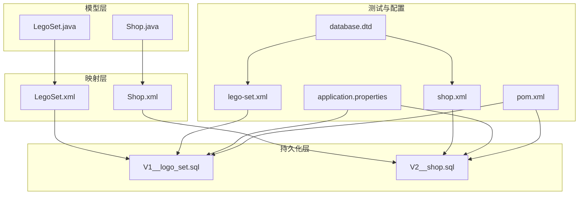
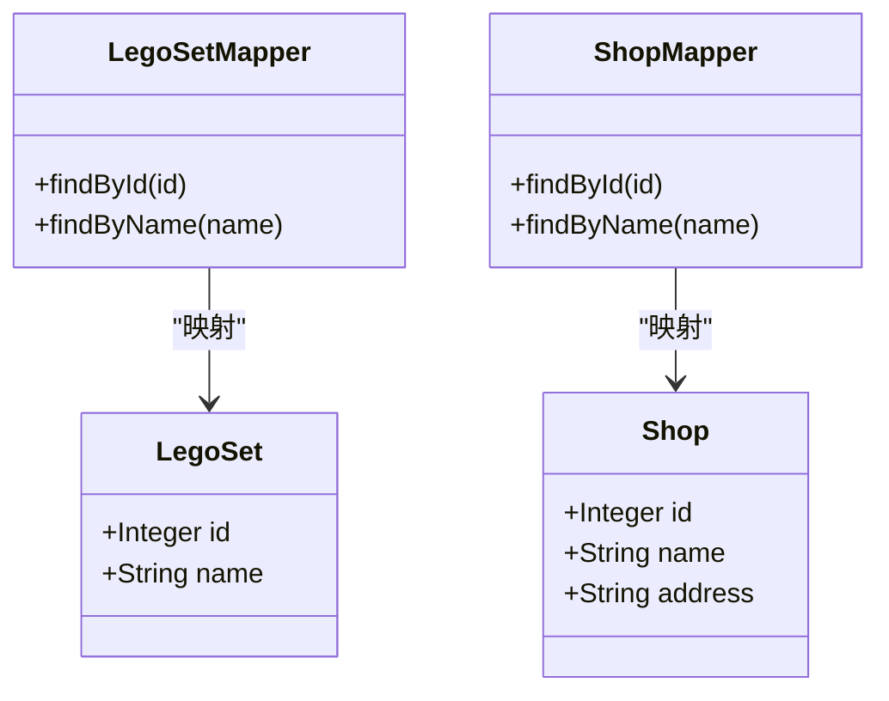
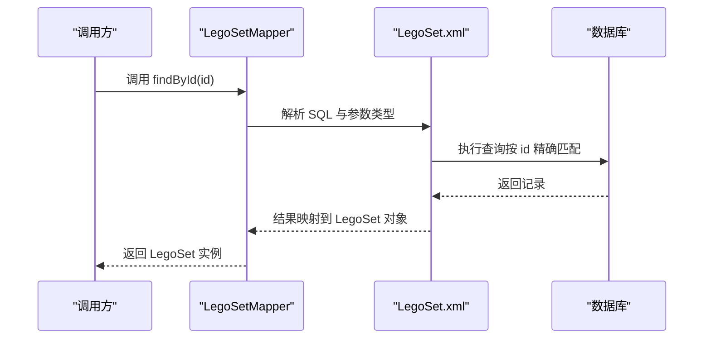
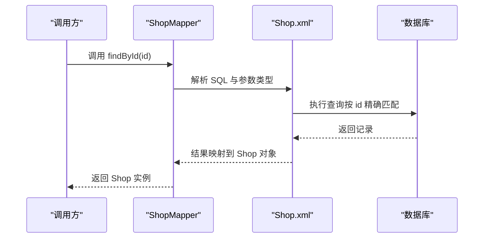
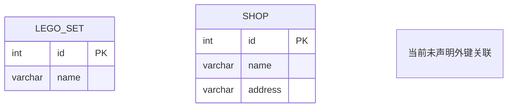
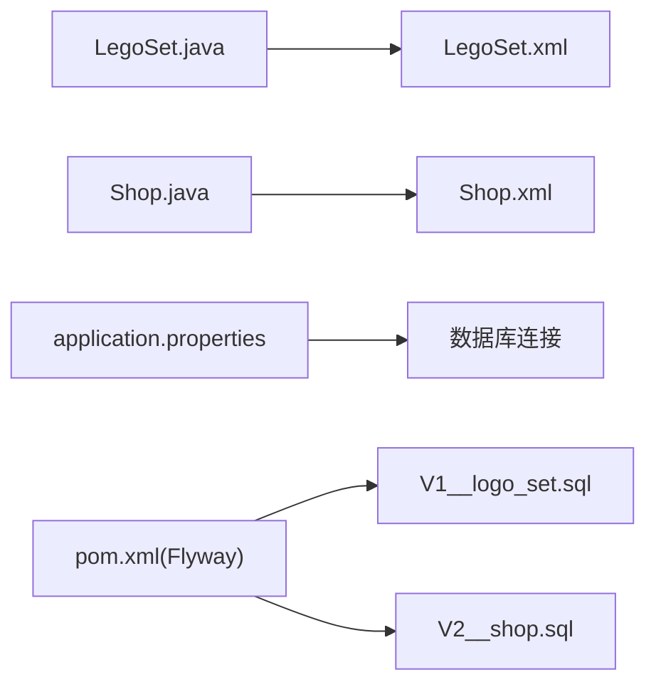

# 表结构设计

<cite>
**本文引用的文件**
- [LegoSet.java](file://src/main/java/org/mvnsearch/mybatis/demo/model/LegoSet.java)
- [Shop.java](file://src/main/java/org/mvnsearch/mybatis/demo/model/Shop.java)
- [LegoSet.xml](file://src/main/resources/mapper/LegoSet.xml)
- [Shop.xml](file://src/main/resources/mapper/Shop.xml)
- [V1__logo_set.sql](file://src/test/resources/db/migration/V1__logo_set.sql)
- [V2__shop.sql](file://src/test/resources/db/migration/V2__shop.sql)
- [lego-set.xml](file://src/test/resources/db/dataset/lego-set.xml)
- [shop.xml](file://src/test/resources/db/dataset/shop.xml)
- [application.properties](file://src/main/resources/application.properties)
- [pom.xml](file://pom.xml)
- [database.dtd](file://database.dtd)
</cite>

## 目录
1. [简介](#简介)
2. [项目结构](#项目结构)
3. [核心组件](#核心组件)
4. [架构总览](#架构总览)
5. [详细组件分析](#详细组件分析)
6. [依赖分析](#依赖分析)
7. [性能考虑](#性能考虑)
8. [故障排查指南](#故障排查指南)
9. [结论](#结论)
10. [附录](#附录)

## 简介
本文件聚焦于项目中LegoSet与Shop两张表的表结构设计，基于实际的数据库迁移脚本、MyBatis映射配置以及测试数据集进行梳理与说明。文档涵盖字段定义、数据类型、约束与索引、实体关系、命名规范、数据字典、初始状态、业务背景与技术考量，并提供ER图与实体关系图，最后给出表结构变更历史与版本管理策略建议。

## 项目结构
围绕表结构设计的相关文件组织如下：
- 模型类：位于Java包内，用于承载数据库记录到对象的映射
- MyBatis映射：XML映射文件定义查询语句与结果映射
- 数据库迁移：Flyway迁移脚本定义表结构
- 测试数据集：XML数据集用于初始化测试数据
- 配置文件：应用配置与数据库连接信息

**图表来源**
- [LegoSet.java](file://src/main/java/org/mvnsearch/mybatis/demo/model/LegoSet.java)
- [Shop.java](file://src/main/java/org/mvnsearch/mybatis/demo/model/Shop.java)
- [LegoSet.xml](file://src/main/resources/mapper/LegoSet.xml)
- [Shop.xml](file://src/main/resources/mapper/Shop.xml)
- [V1__logo_set.sql](file://src/test/resources/db/migration/V1__logo_set.sql)
- [V2__shop.sql](file://src/test/resources/db/migration/V2__shop.sql)
- [lego-set.xml](file://src/test/resources/db/dataset/lego-set.xml)
- [shop.xml](file://src/test/resources/db/dataset/shop.xml)
- [application.properties](file://src/main/resources/application.properties)
- [pom.xml](file://pom.xml)
- [database.dtd](file://database.dtd)

**章节来源**
- [LegoSet.java](file://src/main/java/org/mvnsearch/mybatis/demo/model/LegoSet.java)
- [Shop.java](file://src/main/java/org/mvnsearch/mybatis/demo/model/Shop.java)
- [LegoSet.xml](file://src/main/resources/mapper/LegoSet.xml)
- [Shop.xml](file://src/main/resources/mapper/Shop.xml)
- [V1__logo_set.sql](file://src/test/resources/db/migration/V1__logo_set.sql)
- [V2__shop.sql](file://src/test/resources/db/migration/V2__shop.sql)
- [lego-set.xml](file://src/test/resources/db/dataset/lego-set.xml)
- [shop.xml](file://src/test/resources/db/dataset/shop.xml)
- [application.properties](file://src/main/resources/application.properties)
- [pom.xml](file://pom.xml)
- [database.dtd](file://database.dtd)

## 核心组件
- LegoSet表：包含标识与名称字段，用于存储乐高套装的基本信息
- Shop表：包含标识、名称与地址字段，用于存储商店信息

两表在当前代码库中未声明显式的外键关联，因此它们是独立的实体表。

**章节来源**
- [V1__logo_set.sql](file://src/test/resources/db/migration/V1__logo_set.sql)
- [V2__shop.sql](file://src/test/resources/db/migration/V2__shop.sql)
- [LegoSet.java](file://src/main/java/org/mvnsearch/mybatis/demo/model/LegoSet.java)
- [Shop.java](file://src/main/java/org/mvnsearch/mybatis/demo/model/Shop.java)

## 架构总览
下图展示实体与数据库表之间的映射关系，以及查询路径：

**图表来源**
- [LegoSet.java](file://src/main/java/org/mvnsearch/mybatis/demo/model/LegoSet.java)
- [Shop.java](file://src/main/java/org/mvnsearch/mybatis/demo/model/Shop.java)
- [LegoSet.xml](file://src/main/resources/mapper/LegoSet.xml)
- [Shop.xml](file://src/main/resources/mapper/Shop.xml)

## 详细组件分析

### LegoSet 表结构
- 表名：lego_set
- 字段定义
  - id：整数类型，非空，主键，自增
  - name：可变长度字符串，最大长度依据迁移脚本定义
- 约束与索引
  - 主键约束：id为唯一标识
  - 唯一性：当前未定义唯一索引；如需按名称去重，可在后续版本添加唯一索引
- 数据类型选择原因
  - id使用整数类型以保证高性能与最小存储开销
  - name使用可变长度字符串以适配不同长度的名称
- 初始状态与数据字典
  - 初始状态由测试数据集提供两条记录
  - 数据字典示例：id=1,name=“Small Car 001”；id=2,name=“Sports Car 007”
- 业务背景与技术考量
  - 作为基础实体，支持按id与名称检索
  - 当前未发现与其他表的外键关联，属于独立实体

**章节来源**
- [V1__logo_set.sql](file://src/test/resources/db/migration/V1__logo_set.sql)
- [lego-set.xml](file://src/test/resources/db/dataset/lego-set.xml)
- [LegoSet.xml](file://src/main/resources/mapper/LegoSet.xml)
- [LegoSet.java](file://src/main/java/org/mvnsearch/mybatis/demo/model/LegoSet.java)

### Shop 表结构
- 表名：shop
- 字段定义
  - id：整数类型，非空，主键，自增
  - name：可变长度字符串，最大长度依据迁移脚本定义
  - address：可变长度字符串，最大长度依据迁移脚本定义
- 约束与索引
  - 主键约束：id为唯一标识
  - 唯一性：当前未定义唯一索引；如需按名称去重，可在后续版本添加唯一索引
- 数据类型选择原因
  - id使用整数类型以保证高性能与最小存储开销
  - name与address使用可变长度字符串以适配不同长度的文本
- 初始状态与数据字典
  - 初始状态由测试数据集提供两条记录
  - 数据字典示例：id=1,name=“Shop A”,address=“123 Main St”；id=2,name=“Shop B”,address=“456 Oak Ave”
- 业务背景与技术考量
  - 作为基础实体，支持按id与名称检索
  - 当前未发现与其他表的外键关联，属于独立实体

**章节来源**
- [V2__shop.sql](file://src/test/resources/db/migration/V2__shop.sql)
- [shop.xml](file://src/test/resources/db/dataset/shop.xml)
- [Shop.xml](file://src/main/resources/mapper/Shop.xml)
- [Shop.java](file://src/main/java/org/mvnsearch/mybatis/demo/model/Shop.java)

### 查询流程（以LegoSet为例）

**图表来源**
- [LegoSet.xml](file://src/main/resources/mapper/LegoSet.xml)
- [LegoSet.java](file://src/main/java/org/mvnsearch/mybatis/demo/model/LegoSet.java)

### 查询流程（以Shop为例）

**图表来源**
- [Shop.xml](file://src/main/resources/mapper/Shop.xml)
- [Shop.java](file://src/main/java/org/mvnsearch/mybatis/demo/model/Shop.java)

### 表关系与ER图
- 当前两张表之间未声明外键关系，因此在ER图中不建立连线
- 若未来需要引入关联（例如LegoSet与Shop存在某种业务关联），可在迁移脚本中增加外键约束

**图表来源**
- [V1__logo_set.sql](file://src/test/resources/db/migration/V1__logo_set.sql)
- [V2__shop.sql](file://src/test/resources/db/migration/V2__shop.sql)

## 依赖分析
- 模型类与映射文件的耦合
  - LegoSet.java 与 LegoSet.xml 的字段映射保持一致
  - Shop.java 与 Shop.xml 的字段映射保持一致
- 运行时依赖
  - 应用通过Spring Boot与MyBatis启动，数据库驱动与连接配置在应用属性中定义
  - Flyway插件负责迁移脚本的执行与版本管理

**图表来源**
- [LegoSet.java](file://src/main/java/org/mvnsearch/mybatis/demo/model/LegoSet.java)
- [LegoSet.xml](file://src/main/resources/mapper/LegoSet.xml)
- [Shop.java](file://src/main/java/org/mvnsearch/mybatis/demo/model/Shop.java)
- [Shop.xml](file://src/main/resources/mapper/Shop.xml)
- [application.properties](file://src/main/resources/application.properties)
- [pom.xml](file://pom.xml)
- [V1__logo_set.sql](file://src/test/resources/db/migration/V1__logo_set.sql)
- [V2__shop.sql](file://src/test/resources/db/migration/V2__shop.sql)

**章节来源**
- [LegoSet.java](file://src/main/java/org/mvnsearch/mybatis/demo/model/LegoSet.java)
- [Shop.java](file://src/main/java/org/mvnsearch/mybatis/demo/model/Shop.java)
- [LegoSet.xml](file://src/main/resources/mapper/LegoSet.xml)
- [Shop.xml](file://src/main/resources/mapper/Shop.xml)
- [application.properties](file://src/main/resources/application.properties)
- [pom.xml](file://pom.xml)

## 性能考虑
- 主键与自增
  - 两张表均采用自增主键，有利于插入性能与索引稳定性
- 查询模式
  - 当前映射文件提供按id与名称的查询，建议在高频查询列上评估是否需要索引（如name列）
- 编码与字符集
  - 迁移脚本指定字符集，确保中文等多字节字符正确存储与检索

[本节为通用指导，无需列出具体文件来源]

## 故障排查指南
- 字段映射不一致
  - 现象：查询返回对象字段为空或类型不匹配
  - 排查：核对模型类与映射文件中的字段名称与类型是否一致
- 参数类型不匹配
  - 现象：SQL执行报错或无法命中预期查询
  - 排查：确认映射文件中参数类型与传入参数一致
- 连接与驱动问题
  - 现象：应用无法连接数据库
  - 排查：检查应用属性中的数据库URL、用户名、密码与驱动类名
- 迁移脚本未执行
  - 现象：表不存在或结构不符
  - 排查：确认Flyway插件配置与迁移脚本位置，执行迁移命令

**章节来源**
- [LegoSet.xml](file://src/main/resources/mapper/LegoSet.xml)
- [Shop.xml](file://src/main/resources/mapper/Shop.xml)
- [application.properties](file://src/main/resources/application.properties)
- [pom.xml](file://pom.xml)

## 结论
- LegoSet与Shop表当前为独立实体，结构简洁、职责单一
- 字段命名遵循直观性与一致性原则，数据类型选择满足业务需求
- 建议在未来引入业务关联时，补充外键约束与必要的唯一索引，以增强数据完整性与查询效率
- 通过Flyway实现迁移脚本的版本化管理，配合测试数据集保障开发与测试环境的一致性

[本节为总结性内容，无需列出具体文件来源]

## 附录

### 字段命名规范与数据类型选择说明
- 命名规范
  - 使用小写与下划线组合，保持与数据库命名风格一致
  - 字段名简洁明确，避免缩写，提升可读性
- 数据类型选择
  - 整数主键：占用空间小、索引效率高
  - 可变长度字符串：根据实际业务长度设置上限，兼顾存储与灵活性
- 字符集
  - 统一使用UTF-8字符集，支持多语言与特殊字符

**章节来源**
- [V1__logo_set.sql](file://src/test/resources/db/migration/V1__logo_set.sql)
- [V2__shop.sql](file://src/test/resources/db/migration/V2__shop.sql)

### 初始状态与数据字典
- LegoSet初始数据
  - 记录1：id=1,name=“Small Car 001”
  - 记录2：id=2,name=“Sports Car 007”
- Shop初始数据
  - 记录1：id=1,name=“Shop A”,address=“123 Main St”
  - 记录2：id=2,name=“Shop B”,address=“456 Oak Ave”

**章节来源**
- [lego-set.xml](file://src/test/resources/db/dataset/lego-set.xml)
- [shop.xml](file://src/test/resources/db/dataset/shop.xml)

### 表结构变更历史与版本管理策略
- 迁移脚本版本
  - V1__logo_set.sql：创建LegoSet表
  - V2__shop.sql：创建Shop表
- 版本管理策略建议
  - 使用Flyway进行迁移脚本的顺序化与幂等化管理
  - 新增或修改表结构时，新增独立迁移脚本，避免直接修改既有脚本
  - 在团队协作中，统一约定脚本命名与变更说明，确保可追溯性

**章节来源**
- [V1__logo_set.sql](file://src/test/resources/db/migration/V1__logo_set.sql)
- [V2__shop.sql](file://src/test/resources/db/migration/V2__shop.sql)
- [pom.xml](file://pom.xml)