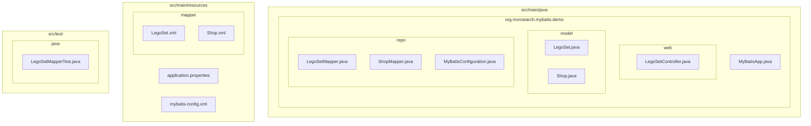
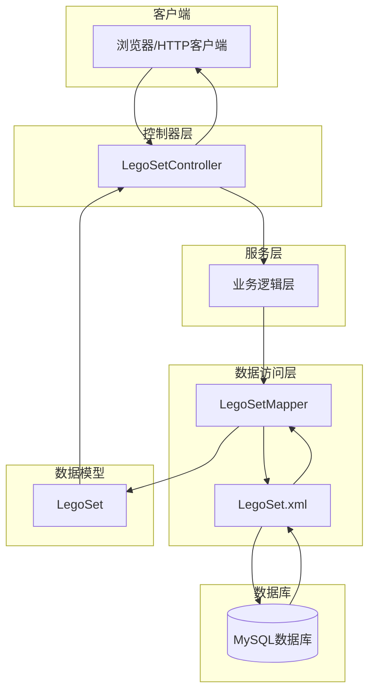
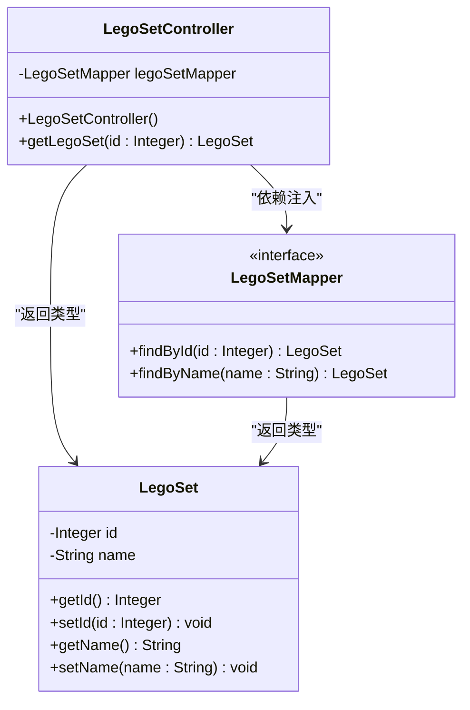
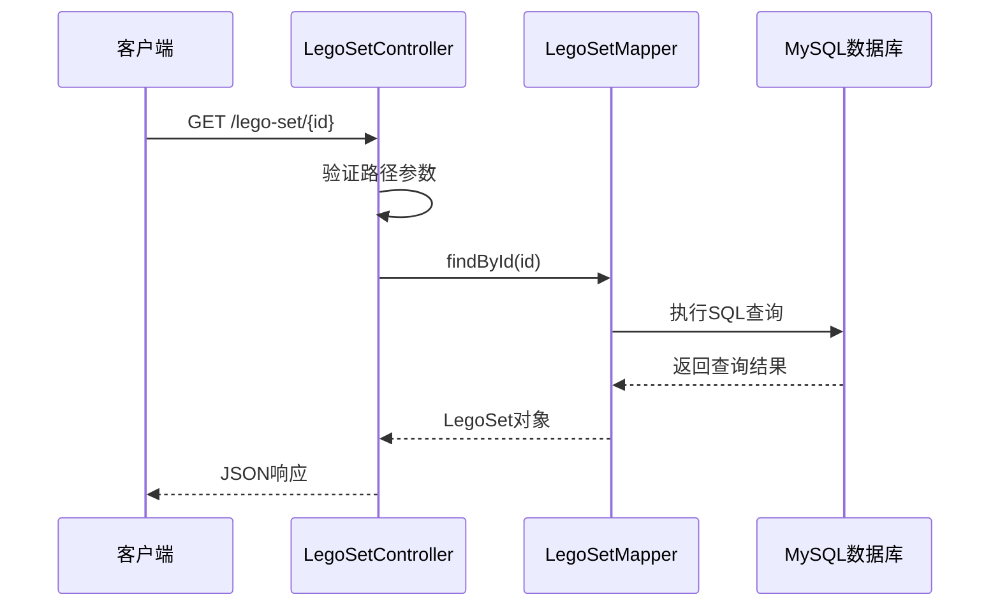
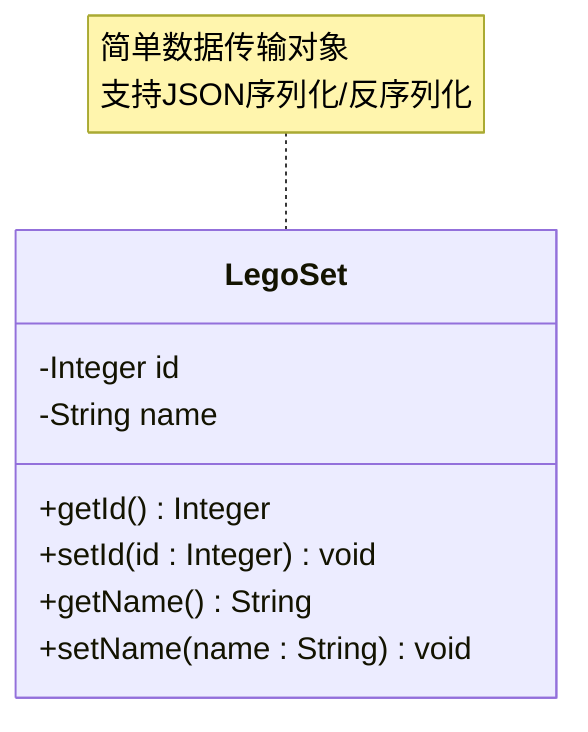
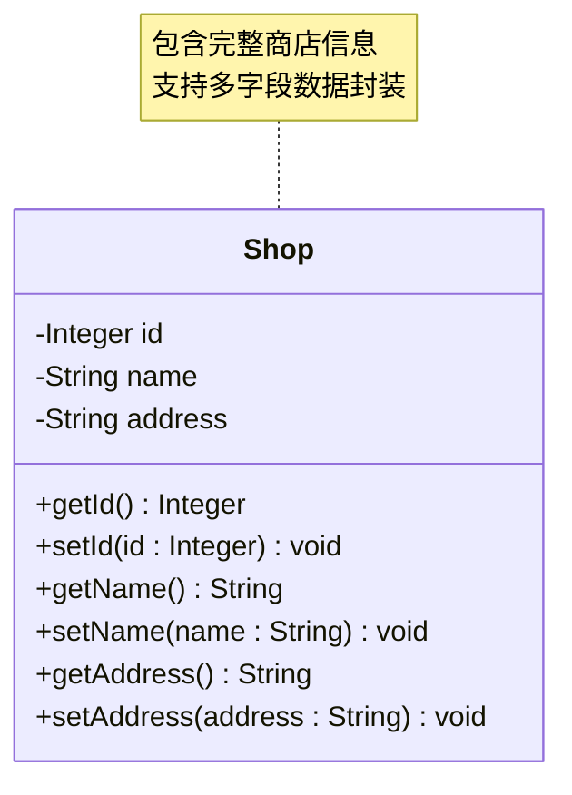
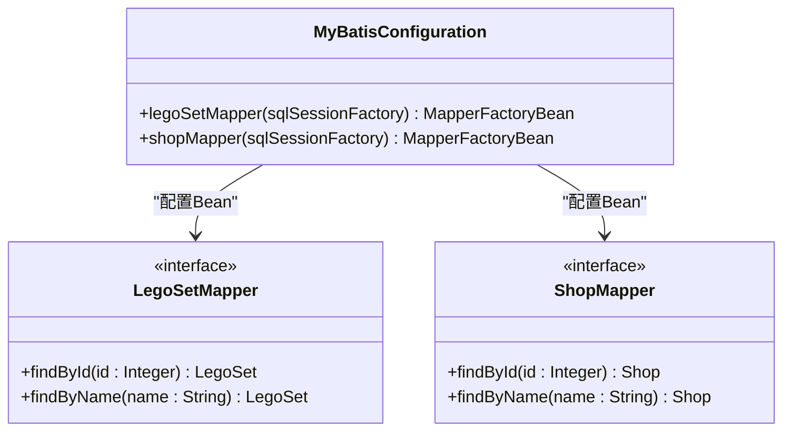
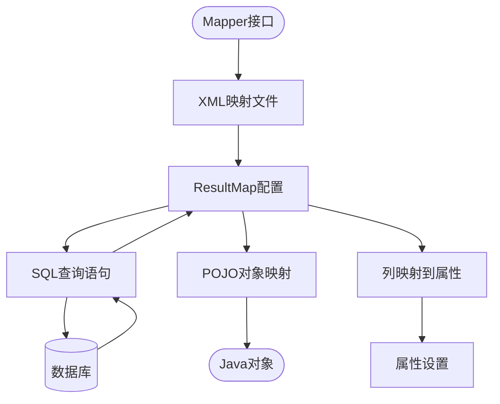
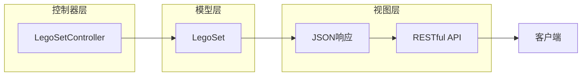
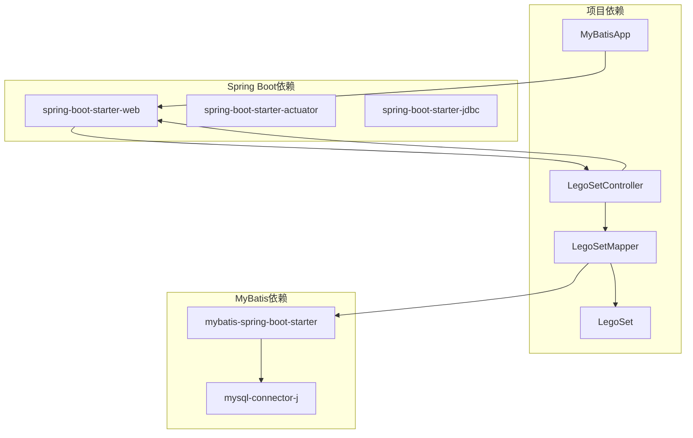

# MVC架构模式

<cite>
**本文档引用的文件**
- [LegoSetController.java](file://src/main/java/org/mvnsearch/mybatis/demo/web/LegoSetController.java)
- [LegoSet.java](file://src/main/java/org/mvnsearch/mybatis/demo/model/LegoSet.java)
- [Shop.java](file://src/main/java/org/mvnsearch/mybatis/demo/model/Shop.java)
- [LegoSetMapper.java](file://src/main/java/org/mvnsearch/mybatis/demo/repo/LegoSetMapper.java)
- [ShopMapper.java](file://src/main/java/org/mvnsearch/mybatis/demo/repo/ShopMapper.java)
- [MyBatisConfiguration.java](file://src/main/java/org/mvnsearch/mybatis/demo/repo/MyBatisConfiguration.java)
- [LegoSet.xml](file://src/main/resources/mapper/LegoSet.xml)
- [Shop.xml](file://src/main/resources/mapper/Shop.xml)
- [MyBatisApp.java](file://src/main/java/org/mvnsearch/mybatis/demo/MyBatisApp.java)
- [application.properties](file://src/main/resources/application.properties)
- [mybatis-config.xml](file://src/main/resources/mybatis-config.xml)
- [pom.xml](file://pom.xml)
- [LegoSetMapperTest.java](file://src/test/java/org/mvnsearch/mybatis/demo/repo/LegoSetMapperTest.java)
- [index.http](file://index.http)
</cite>

## 目录
1. [简介](#简介)
2. [项目结构](#项目结构)
3. [核心组件](#核心组件)
4. [架构概览](#架构概览)
5. [详细组件分析](#详细组件分析)
6. [依赖关系分析](#依赖关系分析)
7. [性能考虑](#性能考虑)
8. [故障排除指南](#故障排除指南)
9. [结论](#结论)

## 简介

MyBatis Spring Demo项目是一个基于Spring Boot和MyBatis的Web应用程序，展示了经典的MVC（Model-View-Controller）架构模式的实现。该项目通过清晰的分层设计，将业务逻辑、数据访问和用户界面分离，提供了可维护和可扩展的软件架构。

该演示项目专注于Lego Set（乐高套装）管理功能，通过RESTful API提供数据查询服务。项目使用Spring MVC作为控制器层，MyBatis作为数据访问层，Java实体类作为模型层，实现了完整的MVC架构模式。

## 项目结构

项目采用标准的Maven目录结构，按照功能模块进行组织：

**图表来源**
- [MyBatisApp.java:1-17](file://src/main/java/org/mvnsearch/mybatis/demo/MyBatisApp.java#L1-L17)
- [LegoSetController.java:1-22](file://src/main/java/org/mvnsearch/mybatis/demo/web/LegoSetController.java#L1-L22)
- [LegoSet.java:1-23](file://src/main/java/org/mvnsearch/mybatis/demo/model/LegoSet.java#L1-L23)

**章节来源**
- [pom.xml:1-141](file://pom.xml#L1-L141)
- [application.properties:1-11](file://src/main/resources/application.properties#L1-L11)

## 核心组件

### 控制器层（Controller Layer）

控制器层负责处理HTTP请求和响应，是MVC架构的入口点。在本项目中，`LegoSetController`类承担了主要的控制职责。

### 模型层（Model Layer）

模型层包含数据实体类，用于封装业务数据。项目中有两个主要的模型类：
- `LegoSet`：表示乐高套装的基本信息
- `Shop`：表示商店的相关信息

### 数据访问层（Data Access Layer）

数据访问层负责与数据库交互，使用MyBatis框架实现SQL映射。包含两个主要的Mapper接口：
- `LegoSetMapper`：提供乐高套装的数据库操作方法
- `ShopMapper`：提供商店的数据库操作方法

**章节来源**
- [LegoSetController.java:11-21](file://src/main/java/org/mvnsearch/mybatis/demo/web/LegoSetController.java#L11-L21)
- [LegoSet.java:3-22](file://src/main/java/org/mvnsearch/mybatis/demo/model/LegoSet.java#L3-L22)
- [LegoSetMapper.java:12-20](file://src/main/java/org/mvnsearch/mybatis/demo/repo/LegoSetMapper.java#L12-L20)

## 架构概览

MyBatis Spring Demo项目遵循经典的MVC架构模式，各层之间职责明确，耦合度低，便于维护和扩展。

**图表来源**
- [LegoSetController.java:17-20](file://src/main/java/org/mvnsearch/mybatis/demo/web/LegoSetController.java#L17-L20)
- [LegoSetMapper.java:15-19](file://src/main/java/org/mvnsearch/mybatis/demo/repo/LegoSetMapper.java#L15-L19)
- [LegoSet.xml:10-14](file://src/main/resources/mapper/LegoSet.xml#L10-L14)

## 详细组件分析

### 控制器组件分析

#### LegoSetController 设计

`LegoSetController`是Spring MVC的核心控制器，采用了@RestController注解，提供了RESTful API接口。

**图表来源**
- [LegoSetController.java:14-20](file://src/main/java/org/mvnsearch/mybatis/demo/web/LegoSetController.java#L14-L20)
- [LegoSetMapper.java:15-19](file://src/main/java/org/mvnsearch/mybatis/demo/repo/LegoSetMapper.java#L15-L19)
- [LegoSet.java:4-21](file://src/main/java/org/mvnsearch/mybatis/demo/model/LegoSet.java#L4-L21)

#### HTTP请求处理流程

控制器通过Spring MVC的注解机制处理HTTP请求：

**图表来源**
- [LegoSetController.java:17-20](file://src/main/java/org/mvnsearch/mybatis/demo/web/LegoSetController.java#L17-L20)
- [LegoSet.xml:10-14](file://src/main/resources/mapper/LegoSet.xml#L10-L14)

**章节来源**
- [LegoSetController.java:11-21](file://src/main/java/org/mvnsearch/mybatis/demo/web/LegoSetController.java#L11-L21)

### 模型组件分析

#### LegoSet 实体类设计

`LegoSet`类是一个简单的Java Bean，遵循JavaBean规范，提供了标准的getter和setter方法。

**图表来源**
- [LegoSet.java:3-22](file://src/main/java/org/mvnsearch/mybatis/demo/model/LegoSet.java#L3-L22)

#### Shop 实体类设计

`Shop`类提供了更丰富的商店信息，包含地址字段。

**图表来源**
- [Shop.java:3-31](file://src/main/java/org/mvnsearch/mybatis/demo/model/Shop.java#L3-L31)

**章节来源**
- [LegoSet.java:1-23](file://src/main/java/org/mvnsearch/mybatis/demo/model/LegoSet.java#L1-L23)
- [Shop.java:1-32](file://src/main/java/org/mvnsearch/mybatis/demo/model/Shop.java#L1-L32)

### 数据访问层组件分析

#### Mapper 接口设计

MyBatis通过Mapper接口定义数据库操作方法，使用注解或XML配置SQL语句。

**图表来源**
- [LegoSetMapper.java:12-20](file://src/main/java/org/mvnsearch/mybatis/demo/repo/LegoSetMapper.java#L12-L20)
- [ShopMapper.java:12-20](file://src/main/java/org/mvnsearch/mybatis/demo/repo/ShopMapper.java#L12-L20)
- [MyBatisConfiguration.java:12-23](file://src/main/java/org/mvnsearch/mybatis/demo/repo/MyBatisConfiguration.java#L12-L23)

#### XML映射文件设计

每个Mapper接口都有对应的XML映射文件，定义了SQL查询和结果映射。

**图表来源**
- [LegoSet.xml:5-8](file://src/main/resources/mapper/LegoSet.xml#L5-L8)
- [LegoSet.xml:10-14](file://src/main/resources/mapper/LegoSet.xml#L10-L14)

**章节来源**
- [LegoSetMapper.java:1-21](file://src/main/java/org/mvnsearch/mybatis/demo/repo/LegoSetMapper.java#L1-L21)
- [ShopMapper.java:1-21](file://src/main/java/org/mvnsearch/mybatis/demo/repo/ShopMapper.java#L1-L21)
- [LegoSet.xml:1-22](file://src/main/resources/mapper/LegoSet.xml#L1-L22)
- [Shop.xml:1-24](file://src/main/resources/mapper/Shop.xml#L1-L24)

### 视图层实现

在本项目中，视图层采用了Spring MVC的RESTful设计，直接返回JSON格式的数据，而不是传统的模板视图。

**图表来源**
- [LegoSetController.java:17-20](file://src/main/java/org/mvnsearch/mybatis/demo/web/LegoSetController.java#L17-L20)

## 依赖关系分析

项目使用Maven进行依赖管理，核心依赖包括Spring Boot Web、MyBatis以及数据库连接器。

**图表来源**
- [pom.xml:30-51](file://pom.xml#L30-L51)
- [MyBatisApp.java:11-15](file://src/main/java/org/mvnsearch/mybatis/demo/MyBatisApp.java#L11-L15)

**章节来源**
- [pom.xml:19-28](file://pom.xml#L19-L28)
- [application.properties:1-11](file://src/main/resources/application.properties#L1-L11)

## 性能考虑

### 数据库连接池优化

项目配置了MySQL数据库连接，建议根据实际负载调整连接池参数：
- 最大连接数：根据并发请求数量设置
- 连接超时时间：避免长时间占用连接
- 查询超时时间：防止慢查询影响系统性能

### MyBatis缓存策略

可以考虑启用MyBatis的一级和二级缓存：
- 一级缓存：默认开启，基于SqlSession生命周期
- 二级缓存：跨SqlSession共享，适合只读数据

### SQL查询优化

- 使用合适的索引覆盖查询条件
- 避免SELECT *
- 合理使用LIMIT限制结果集大小

## 故障排除指南

### 常见问题诊断

#### 数据库连接问题
- 检查数据库URL、用户名和密码配置
- 验证MySQL服务状态
- 确认网络连接正常

#### Mapper接口未找到
- 确认Mapper接口上标注了@Mapper注解
- 检查XML映射文件路径配置
- 验证MyBatis配置文件中的mappers节点

#### JSON序列化问题
- 确保实体类提供标准的getter/setter方法
- 检查Lombok等注解处理器配置
- 验证Jackson依赖是否正确引入

**章节来源**
- [application.properties:2-5](file://src/main/resources/application.properties#L2-L5)
- [MyBatisConfiguration.java:12-23](file://src/main/java/org/mvnsearch/mybatis/demo/repo/MyBatisConfiguration.java#L12-L23)

## 结论

MyBatis Spring Demo项目成功展示了MVC架构模式在实际项目中的应用。通过清晰的分层设计，项目实现了：

### 架构优势

1. **职责分离**：控制器、模型和数据访问层职责明确，便于维护
2. **可扩展性**：新增功能只需在对应层次添加代码，不影响其他层次
3. **可测试性**：每层都可以独立测试，单元测试覆盖率高
4. **技术栈成熟**：Spring Boot和MyBatis都是经过验证的技术选择

### 适用场景

该架构模式特别适用于：
- 中小型Web应用开发
- 需要精确SQL控制的业务场景
- 需要快速原型开发的项目
- 团队协作开发的项目

### 改进建议

1. **增加异常处理**：在控制器层添加全局异常处理机制
2. **添加输入验证**：对请求参数进行验证和过滤
3. **实现分页查询**：对于大量数据的查询添加分页支持
4. **添加日志记录**：记录关键业务操作的日志信息

通过这些改进，项目可以进一步提升健壮性和用户体验，更好地满足生产环境的需求。