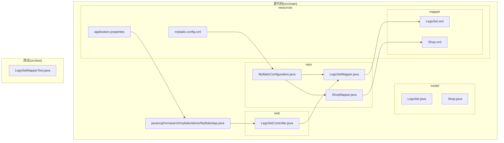
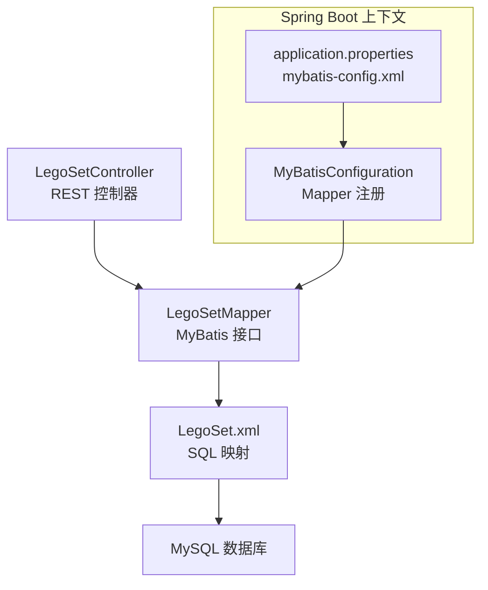
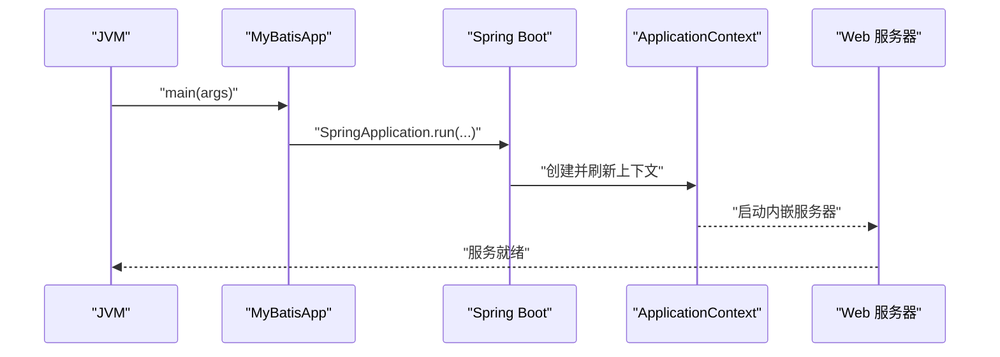
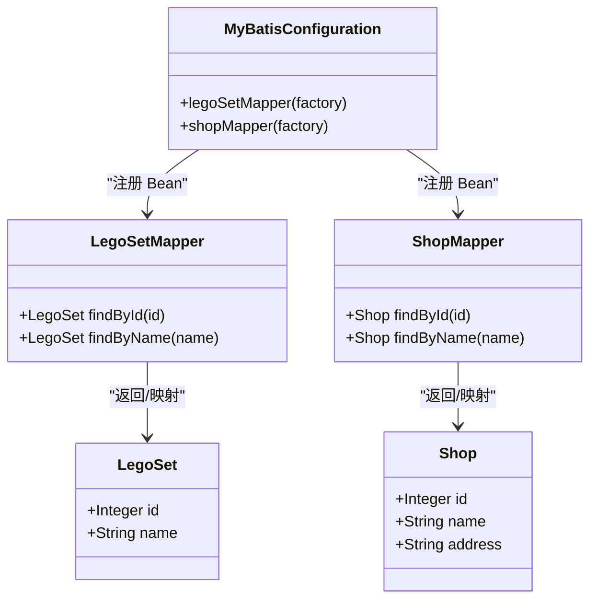
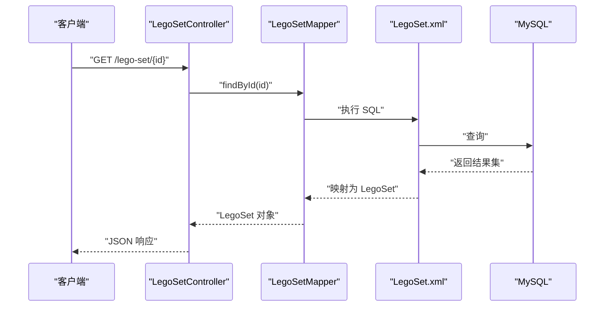
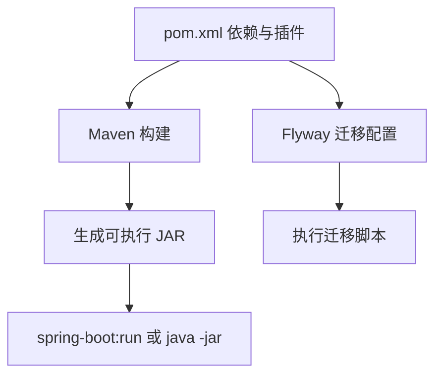
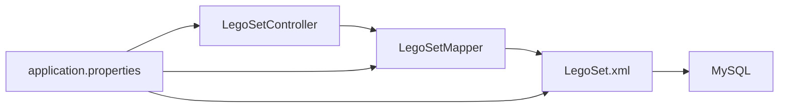

# 整体架构

<cite>
**本文引用的文件**
- [pom.xml](file://pom.xml)
- [MyBatisApp.java](file://src/main/java/org/mvnsearch/mybatis/demo/MyBatisApp.java)
- [application.properties](file://src/main/resources/application.properties)
- [mybatis-config.xml](file://src/main/resources/mybatis-config.xml)
- [MyBatisConfiguration.java](file://src/main/java/org/mvnsearch/mybatis/demo/repo/MyBatisConfiguration.java)
- [LegoSet.java](file://src/main/java/org/mvnsearch/mybatis/demo/model/LegoSet.java)
- [Shop.java](file://src/main/java/org/mvnsearch/mybatis/demo/model/Shop.java)
- [LegoSetMapper.java](file://src/main/java/org/mvnsearch/mybatis/demo/repo/LegoSetMapper.java)
- [ShopMapper.java](file://src/main/java/org/mvnsearch/mybatis/demo/repo/ShopMapper.java)
- [LegoSetController.java](file://src/main/java/org/mvnsearch/mybatis/demo/web/LegoSetController.java)
- [LegoSet.xml](file://src/main/resources/mapper/LegoSet.xml)
- [Shop.xml](file://src/main/resources/mapper/Shop.xml)
- [LegoSetMapperTest.java](file://src/test/java/org/mvnsearch/mybatis/demo/repo/LegoSetMapperTest.java)
- [docker-compose.yml](file://docker-compose.yml)
- [README.md](file://README.md)
</cite>

## 目录
1. [引言](#引言)
2. [项目结构](#项目结构)
3. [核心组件](#核心组件)
4. [架构总览](#架构总览)
5. [详细组件分析](#详细组件分析)
6. [依赖分析](#依赖分析)
7. [性能考虑](#性能考虑)
8. [故障排查指南](#故障排查指南)
9. [结论](#结论)
10. [附录](#附录)

## 引言
本项目是一个基于 Spring Boot 与 MyBatis 的示例应用，演示了如何在 Spring Boot 中集成 MyBatis 作为 ORM 框架。项目采用分层架构：表现层（Web 控制器）、业务接口层（Mapper 接口）、数据访问层（MyBatis 映射 XML）。通过 Maven 管理依赖与构建，使用 Flyway 进行数据库迁移，配合 Docker Compose 快速搭建本地 MySQL 环境。

## 项目结构
项目遵循标准的 Maven 多模块风格，源代码位于 src/main 下，测试代码位于 src/test 下。资源文件（MyBatis 映射 XML、Spring 配置）位于 src/main/resources。关键目录与文件如下：
- 应用入口类：MyBatisApp.java
- 配置文件：application.properties、mybatis-config.xml
- 数据模型：LegoSet.java、Shop.java
- 数据访问层：LegoSetMapper.java、ShopMapper.java 及对应的 XML 映射文件
- 表现层：LegoSetController.java
- 测试：LegoSetMapperTest.java 及数据库迁移脚本
- 构建与运行：pom.xml、docker-compose.yml

**图示来源**
- [MyBatisApp.java:1-17](file://src/main/java/org/mvnsearch/mybatis/demo/MyBatisApp.java#L1-L17)
- [LegoSetController.java:1-22](file://src/main/java/org/mvnsearch/mybatis/demo/web/LegoSetController.java#L1-L22)
- [LegoSetMapper.java:1-21](file://src/main/java/org/mvnsearch/mybatis/demo/repo/LegoSetMapper.java#L1-L21)
- [ShopMapper.java:1-21](file://src/main/java/org/mvnsearch/mybatis/demo/repo/ShopMapper.java#L1-L21)
- [MyBatisConfiguration.java:1-25](file://src/main/java/org/mvnsearch/mybatis/demo/repo/MyBatisConfiguration.java#L1-L25)
- [application.properties:1-11](file://src/main/resources/application.properties#L1-L11)
- [mybatis-config.xml:1-14](file://src/main/resources/mybatis-config.xml#L1-L14)
- [LegoSet.xml:1-22](file://src/main/resources/mapper/LegoSet.xml#L1-L22)
- [Shop.xml:1-24](file://src/main/resources/mapper/Shop.xml#L1-L24)

**章节来源**
- [README.md:13-29](file://README.md#L13-L29)
- [pom.xml:1-141](file://pom.xml#L1-L141)

## 核心组件
- 应用入口与自动配置
  - @SpringBootApplication 注解整合了 Spring Boot 的自动配置、组件扫描与条件装配能力，使应用能够快速启动并加载相关配置。
  - 启动类负责调用 SpringApplication.run(...) 完成上下文初始化与 Web 服务器启动。
- 数据库与 MyBatis 配置
  - application.properties 提供数据源连接信息与 MyBatis 基础配置项。
  - mybatis-config.xml 定义类型别名与映射器注册，简化 XML 中的类型书写与加载。
  - MyBatisConfiguration.java 通过 @Configuration 与 @Bean 手动注册 MapperFactoryBean，显式声明 Mapper 实例。
- 数据模型与映射
  - LegoSet.java、Shop.java 为实体类，对应数据库表结构。
  - LegoSetMapper.java、ShopMapper.java 为数据访问接口，结合各自 XML 文件完成 SQL 映射。
- 表现层
  - LegoSetController.java 提供 REST 接口，注入 Mapper 并返回查询结果。

**章节来源**
- [MyBatisApp.java:11-16](file://src/main/java/org/mvnsearch/mybatis/demo/MyBatisApp.java#L11-L16)
- [application.properties:1-11](file://src/main/resources/application.properties#L1-L11)
- [mybatis-config.xml:1-14](file://src/main/resources/mybatis-config.xml#L1-L14)
- [MyBatisConfiguration.java:8-24](file://src/main/java/org/mvnsearch/mybatis/demo/repo/MyBatisConfiguration.java#L8-L24)
- [LegoSet.java:1-23](file://src/main/java/org/mvnsearch/mybatis/demo/model/LegoSet.java#L1-L23)
- [Shop.java:1-32](file://src/main/java/org/mvnsearch/mybatis/demo/model/Shop.java#L1-L32)
- [LegoSetMapper.java:1-21](file://src/main/java/org/mvnsearch/mybatis/demo/repo/LegoSetMapper.java#L1-L21)
- [ShopMapper.java:1-21](file://src/main/java/org/mvnsearch/mybatis/demo/repo/ShopMapper.java#L1-L21)
- [LegoSetController.java:1-22](file://src/main/java/org/mvnsearch/mybatis/demo/web/LegoSetController.java#L1-L22)

## 架构总览
该应用采用经典的分层架构：
- 表现层：REST 控制器接收请求，调用数据访问层。
- 业务层：本示例中业务逻辑简单，直接由控制器调用 Mapper；若需要可引入 Service 层进行封装。
- 数据访问层：MyBatis Mapper 接口与 XML 映射文件负责 SQL 执行与结果映射。
- 基础设施：Spring Boot 自动配置、数据源、MyBatis 配置、日志与 Actuator 监控。

**图示来源**
- [LegoSetController.java:1-22](file://src/main/java/org/mvnsearch/mybatis/demo/web/LegoSetController.java#L1-L22)
- [LegoSetMapper.java:1-21](file://src/main/java/org/mvnsearch/mybatis/demo/repo/LegoSetMapper.java#L1-L21)
- [LegoSet.xml:1-22](file://src/main/resources/mapper/LegoSet.xml#L1-L22)
- [application.properties:1-11](file://src/main/resources/application.properties#L1-L11)
- [mybatis-config.xml:1-14](file://src/main/resources/mybatis-config.xml#L1-L14)
- [MyBatisConfiguration.java:1-25](file://src/main/java/org/mvnsearch/mybatis/demo/repo/MyBatisConfiguration.java#L1-L25)

## 详细组件分析

### 组件一：应用启动与自动配置
- 职责
  - MyBatisApp 作为应用入口，启用 Spring Boot 自动配置与组件扫描。
  - 自动配置会根据依赖与配置加载数据源、MyBatis、Web MVC、Actuator 等组件。
- 启动流程
  - JVM 启动 -> 加载 @SpringBootApplication -> 扫描组件 -> 初始化 ApplicationContext -> 启动 Web 服务器 -> 暴露 REST 接口。

**图示来源**
- [MyBatisApp.java:11-16](file://src/main/java/org/mvnsearch/mybatis/demo/MyBatisApp.java#L11-L16)

**章节来源**
- [MyBatisApp.java:11-16](file://src/main/java/org/mvnsearch/mybatis/demo/MyBatisApp.java#L11-L16)
- [application.properties:1-11](file://src/main/resources/application.properties#L1-L11)

### 组件二：数据访问层（MyBatis）
- Mapper 接口与 XML
  - LegoSetMapper、ShopMapper 使用 @Mapper 注解标识为 MyBatis Mapper。
  - 对应 XML 文件定义命名空间、结果映射与 SQL 查询。
- 类型别名与映射注册
  - mybatis-config.xml 中注册类型别名与映射器，简化 XML 编写。
  - MyBatisConfiguration.java 通过 MapperFactoryBean 显式注册 Mapper Bean，确保容器中存在可用实例。
- 数据模型
  - LegoSet、Shop 为简单实体类，包含基本字段与 getter/setter。

**图示来源**
- [LegoSet.java:1-23](file://src/main/java/org/mvnsearch/mybatis/demo/model/LegoSet.java#L1-L23)
- [Shop.java:1-32](file://src/main/java/org/mvnsearch/mybatis/demo/model/Shop.java#L1-L32)
- [LegoSetMapper.java:1-21](file://src/main/java/org/mvnsearch/mybatis/demo/repo/LegoSetMapper.java#L1-L21)
- [ShopMapper.java:1-21](file://src/main/java/org/mvnsearch/mybatis/demo/repo/ShopMapper.java#L1-L21)
- [MyBatisConfiguration.java:8-24](file://src/main/java/org/mvnsearch/mybatis/demo/repo/MyBatisConfiguration.java#L8-L24)

**章节来源**
- [LegoSetMapper.java:12-20](file://src/main/java/org/mvnsearch/mybatis/demo/repo/LegoSetMapper.java#L12-L20)
- [ShopMapper.java:12-20](file://src/main/java/org/mvnsearch/mybatis/demo/repo/ShopMapper.java#L12-L20)
- [LegoSet.xml:1-22](file://src/main/resources/mapper/LegoSet.xml#L1-L22)
- [Shop.xml:1-24](file://src/main/resources/mapper/Shop.xml#L1-L24)
- [mybatis-config.xml:6-13](file://src/main/resources/mybatis-config.xml#L6-L13)
- [MyBatisConfiguration.java:11-23](file://src/main/java/org/mvnsearch/mybatis/demo/repo/MyBatisConfiguration.java#L11-L23)

### 组件三：表现层（REST 控制器）
- 职责
  - LegoSetController 提供 /lego-set/{id} GET 接口，从 Mapper 获取数据并返回。
- 依赖注入
  - 使用 @Autowired 注入 LegoSetMapper，Spring 容器负责实例化与装配。

**图示来源**
- [LegoSetController.java:17-20](file://src/main/java/org/mvnsearch/mybatis/demo/web/LegoSetController.java#L17-L20)
- [LegoSetMapper.java](file://src/main/java/org/mvnsearch/mybatis/demo/repo/LegoSetMapper.java#L16)
- [LegoSet.xml:10-14](file://src/main/resources/mapper/LegoSet.xml#L10-L14)

**章节来源**
- [LegoSetController.java:1-22](file://src/main/java/org/mvnsearch/mybatis/demo/web/LegoSetController.java#L1-L22)

### 组件四：配置与依赖管理
- Maven 依赖
  - spring-boot-starter-web、spring-boot-starter-actuator、spring-boot-starter-jdbc、mybatis-spring-boot-starter、MySQL Connector/J、Flyway 插件等。
- 构建与迁移
  - Flyway 插件配置了迁移脚本位置与数据库连接参数，支持自动化迁移。
- 运行环境
  - docker-compose.yml 提供 MySQL 服务，默认端口映射与数据库初始化。

**图示来源**
- [pom.xml:30-101](file://pom.xml#L30-L101)
- [pom.xml:112-136](file://pom.xml#L112-L136)
- [docker-compose.yml:1-9](file://docker-compose.yml#L1-L9)

**章节来源**
- [pom.xml:1-141](file://pom.xml#L1-L141)
- [docker-compose.yml:1-9](file://docker-compose.yml#L1-L9)

## 依赖分析
- 内聚性与耦合度
  - 控制器仅依赖 Mapper 接口，低耦合；Mapper 依赖 XML 映射，职责清晰。
- 外部依赖
  - MySQL 数据库、Spring 生态（Web、JDBC、Actuator）、MyBatis 生态（Spring Boot Starter、Dynamic SQL）。
- 循环依赖
  - 当前结构无循环依赖，组件单向依赖。

**图示来源**
- [LegoSetController.java:1-22](file://src/main/java/org/mvnsearch/mybatis/demo/web/LegoSetController.java#L1-L22)
- [LegoSetMapper.java:1-21](file://src/main/java/org/mvnsearch/mybatis/demo/repo/LegoSetMapper.java#L1-L21)
- [LegoSet.xml:1-22](file://src/main/resources/mapper/LegoSet.xml#L1-L22)
- [application.properties:1-11](file://src/main/resources/application.properties#L1-L11)

**章节来源**
- [pom.xml:30-101](file://pom.xml#L30-L101)

## 性能考虑
- 连接池与数据源
  - 使用 Spring Boot Starter JDBC 默认连接池，建议在生产环境配置连接池参数以优化吞吐量与延迟。
- SQL 优化
  - 在 XML 中为高频查询添加索引列、避免 N+1 查询，必要时使用批量查询或缓存。
- 日志与监控
  - application.properties 已开启部分调试日志，建议按需调整级别；Actuator 提供健康检查与指标暴露。
- 序列化与传输
  - 控制器返回对象时注意字段数量与层级，避免过度序列化。

## 故障排查指南
- 启动失败
  - 检查 application.properties 中数据库连接参数是否正确。
  - 确认 MySQL 服务已启动（docker-compose）。
- Mapper 未找到
  - 确认 @Mapper 注解与 XML 命名空间一致，或使用 MyBatisConfiguration 显式注册 Bean。
- SQL 执行异常
  - 查看 SQL 日志与异常堆栈，核对参数类型与列名。
- 单元测试
  - 使用 Database Rider 与 DBUnit 准备测试数据，确保迁移脚本已执行。

**章节来源**
- [application.properties:1-11](file://src/main/resources/application.properties#L1-L11)
- [docker-compose.yml:1-9](file://docker-compose.yml#L1-L9)
- [LegoSetMapperTest.java:26-44](file://src/test/java/org/mvnsearch/mybatis/demo/repo/LegoSetMapperTest.java#L26-L44)

## 结论
本项目以 Spring Boot 为基础，MyBatis 为核心数据访问框架，实现了清晰的分层架构与简洁的依赖管理。通过自动配置与显式注册相结合的方式，既保证了开发效率，又提供了足够的灵活性。建议在生产环境中进一步完善连接池、缓存与监控策略，并持续优化 SQL 与实体设计。

## 附录
- 快速运行步骤
  - 使用 docker-compose 启动 MySQL。
  - 执行 mvn spring-boot:run 或打包后 java -jar 运行。
- 数据库迁移
  - 使用 Flyway 插件执行 src/test/resources/db/migration 下的脚本。

**章节来源**
- [README.md:46-61](file://README.md#L46-L61)
- [pom.xml:112-136](file://pom.xml#L112-L136)