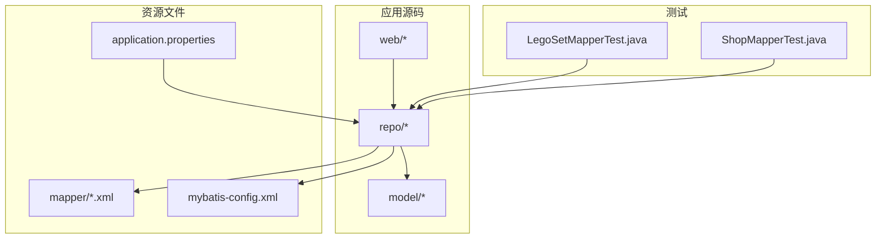
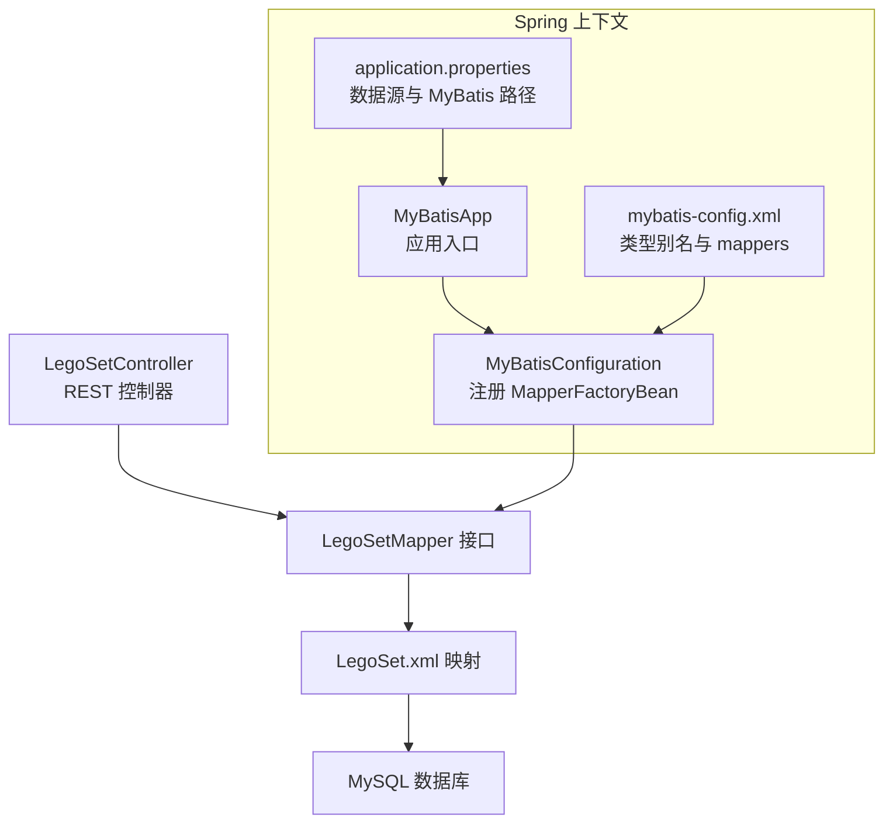
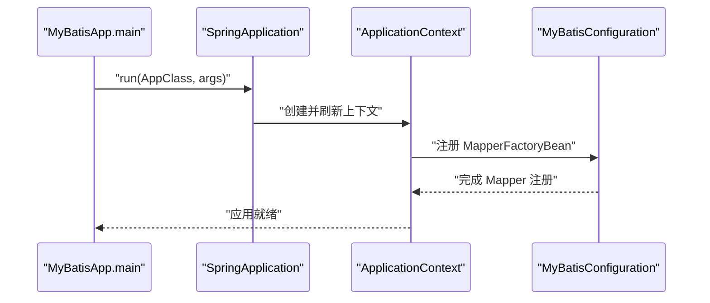
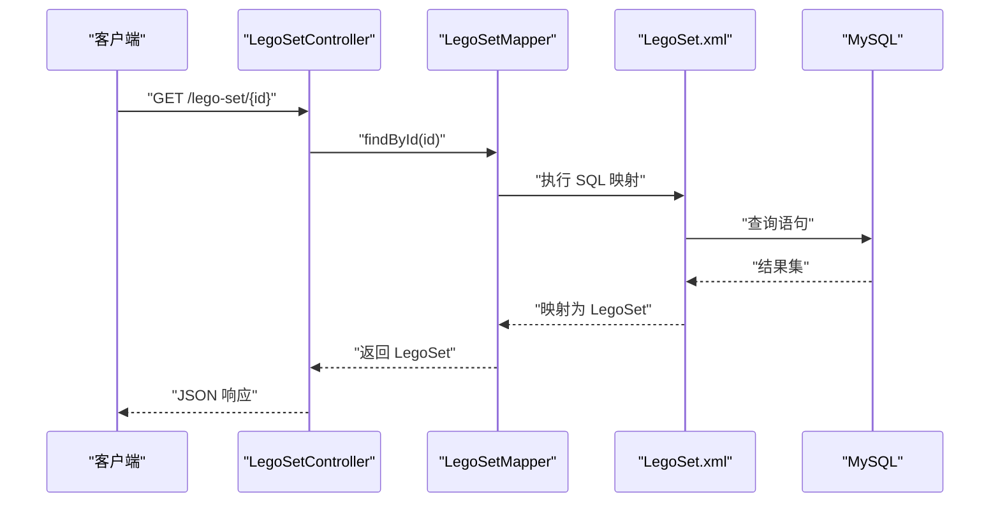
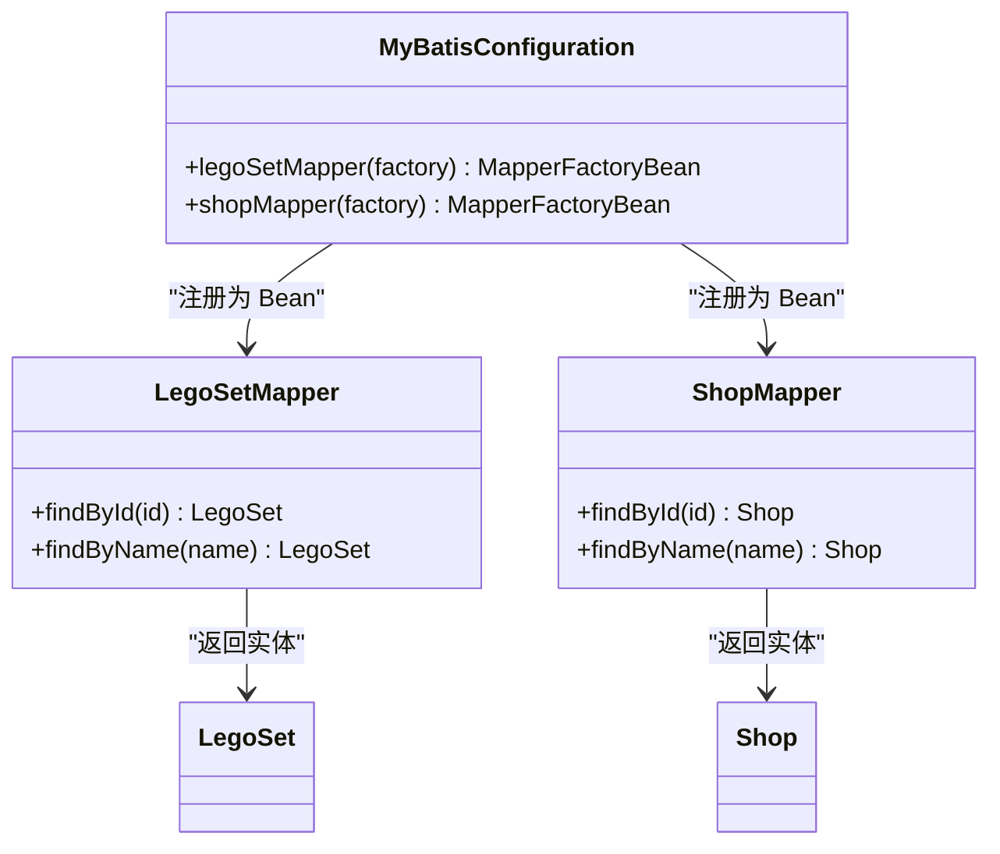
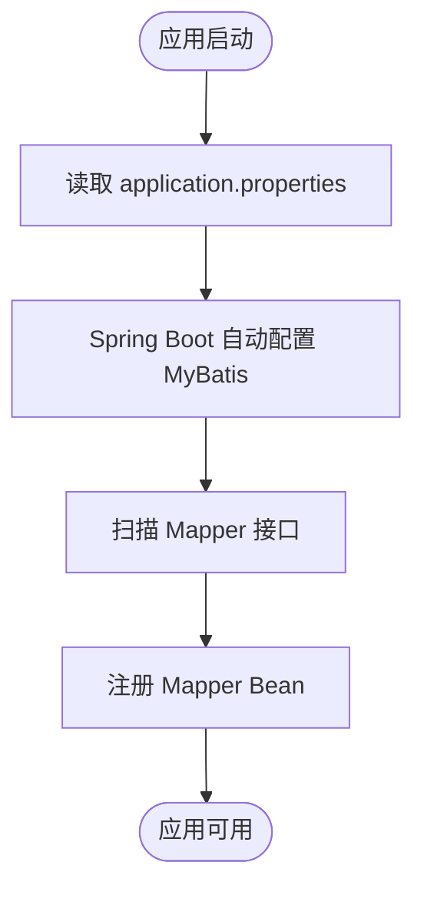
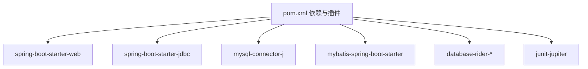

# 架构设计

<cite>
**本文引用的文件**
- [MyBatisApp.java](file://src/main/java/org/mvnsearch/mybatis/demo/MyBatisApp.java)
- [MyBatisConfiguration.java](file://src/main/java/org/mvnsearch/mybatis/demo/repo/MyBatisConfiguration.java)
- [LegoSetController.java](file://src/main/java/org/mvnsearch/mybatis/demo/web/LegoSetController.java)
- [LegoSetMapper.java](file://src/main/java/org/mvnsearch/mybatis/demo/repo/LegoSetMapper.java)
- [ShopMapper.java](file://src/main/java/org/mvnsearch/mybatis/demo/repo/ShopMapper.java)
- [LegoSet.java](file://src/main/java/org/mvnsearch/mybatis/demo/model/LegoSet.java)
- [Shop.java](file://src/main/java/org/mvnsearch/mybatis/demo/model/Shop.java)
- [application.properties](file://src/main/resources/application.properties)
- [mybatis-config.xml](file://src/main/resources/mybatis-config.xml)
- [LegoSet.xml](file://src/main/resources/mapper/LegoSet.xml)
- [Shop.xml](file://src/main/resources/mapper/Shop.xml)
- [pom.xml](file://pom.xml)
- [README.md](file://README.md)
- [LegoSetMapperTest.java](file://src/test/java/org/mvnsearch/mybatis/demo/repo/LegoSetMapperTest.java)
- [ShopMapperTest.java](file://src/test/java/org/mvnsearch/mybatis/demo/repo/ShopMapperTest.java)
</cite>

## 目录
1. [简介](#简介)
2. [项目结构](#项目结构)
3. [核心组件](#核心组件)
4. [架构总览](#架构总览)
5. [详细组件分析](#详细组件分析)
6. [依赖分析](#依赖分析)
7. [性能考量](#性能考量)
8. [故障排查指南](#故障排查指南)
9. [结论](#结论)
10. [附录](#附录)

## 简介
本项目是一个基于 Spring Boot 与 MyBatis 的示例应用，演示了如何在 Spring 生态系统中集成 MyBatis 作为 ORM 框架。项目采用 MVC 分层架构：Web 层通过控制器暴露 REST 接口；数据访问层使用 MyBatis Mapper 接口与 XML 映射文件进行数据库操作；模型层包含简单的实体对象；配置层通过 Spring Boot 自动配置与 MyBatis 配置文件协同工作。

## 项目结构
项目采用标准的 Maven 多模块风格（尽管当前为单模块），按功能域组织代码：
- src/main/java：应用源码
  - model：领域模型
  - repo：数据访问接口与配置
  - web：Web 控制器
- src/main/resources：资源文件
  - mapper：MyBatis XML 映射
  - application.properties：Spring Boot 应用配置
  - mybatis-config.xml：MyBatis 核心配置
- src/test：测试代码与数据库迁移脚本

**章节来源**
- [README.md:13-29](file://README.md#L13-L29)

## 核心组件
- 应用入口：MyBatisApp 使用 Spring Boot 注解启动应用上下文。
- Web 控制器：LegoSetController 提供 REST 接口，注入 LegoSetMapper 执行查询。
- 数据访问接口：LegoSetMapper、ShopMapper 声明查询方法，由 MyBatis 动态代理实现。
- 实体模型：LegoSet、Shop 为简单 Java Bean。
- MyBatis 配置：MyBatisConfiguration 通过 MapperFactoryBean 注册 Mapper；mybatis-config.xml 定义类型别名与映射文件位置。
- 应用配置：application.properties 提供数据源与 MyBatis 路径配置。

**章节来源**
- [MyBatisApp.java:11-16](file://src/main/java/org/mvnsearch/mybatis/demo/MyBatisApp.java#L11-L16)
- [LegoSetController.java:11-21](file://src/main/java/org/mvnsearch/mybatis/demo/web/LegoSetController.java#L11-L21)
- [LegoSetMapper.java:12-20](file://src/main/java/org/mvnsearch/mybatis/demo/repo/LegoSetMapper.java#L12-L20)
- [ShopMapper.java:12-20](file://src/main/java/org/mvnsearch/mybatis/demo/repo/ShopMapper.java#L12-L20)
- [LegoSet.java:3-22](file://src/main/java/org/mvnsearch/mybatis/demo/model/LegoSet.java#L3-L22)
- [Shop.java:3-31](file://src/main/java/org/mvnsearch/mybatis/demo/model/Shop.java#L3-L31)
- [MyBatisConfiguration.java:8-24](file://src/main/java/org/mvnsearch/mybatis/demo/repo/MyBatisConfiguration.java#L8-L24)
- [mybatis-config.xml:6-13](file://src/main/resources/mybatis-config.xml#L6-L13)
- [application.properties:1-11](file://src/main/resources/application.properties#L1-L11)

## 架构总览
系统遵循 MVC 分层与 Repository/Mapper 模式：
- 表现层（Web）：REST 控制器接收请求，调用数据访问层。
- 领域层（Model）：实体对象承载业务数据。
- 数据访问层（Repository/Mapper）：Mapper 接口声明查询方法，XML 映射文件定义 SQL 与结果映射。
- 配置层：Spring Boot 自动配置加载 MyBatis Starter，application.properties 与 mybatis-config.xml 提供运行时配置。

**图表来源**
- [LegoSetController.java:14-20](file://src/main/java/org/mvnsearch/mybatis/demo/web/LegoSetController.java#L14-L20)
- [LegoSetMapper.java:12-20](file://src/main/java/org/mvnsearch/mybatis/demo/repo/LegoSetMapper.java#L12-L20)
- [LegoSet.xml:3-22](file://src/main/resources/mapper/LegoSet.xml#L3-L22)
- [MyBatisConfiguration.java:11-16](file://src/main/java/org/mvnsearch/mybatis/demo/repo/MyBatisConfiguration.java#L11-L16)
- [application.properties:2-6](file://src/main/resources/application.properties#L2-L6)
- [mybatis-config.xml:6-13](file://src/main/resources/mybatis-config.xml#L6-L13)

**章节来源**
- [MyBatisApp.java:11-16](file://src/main/java/org/mvnsearch/mybatis/demo/MyBatisApp.java#L11-L16)
- [MyBatisConfiguration.java:8-24](file://src/main/java/org/mvnsearch/mybatis/demo/repo/MyBatisConfiguration.java#L8-L24)
- [application.properties:6-10](file://src/main/resources/application.properties#L6-L10)
- [mybatis-config.xml:6-13](file://src/main/resources/mybatis-config.xml#L6-L13)

## 详细组件分析

### 应用入口与启动流程
- MyBatisApp 使用 Spring Boot 启动器注解，作为应用主类。
- Spring Boot 自动扫描组件并初始化上下文，加载 application.properties 与 MyBatis 配置。

**图表来源**
- [MyBatisApp.java:13-15](file://src/main/java/org/mvnsearch/mybatis/demo/MyBatisApp.java#L13-L15)
- [MyBatisConfiguration.java:11-16](file://src/main/java/org/mvnsearch/mybatis/demo/repo/MyBatisConfiguration.java#L11-L16)

**章节来源**
- [MyBatisApp.java:11-16](file://src/main/java/org/mvnsearch/mybatis/demo/MyBatisApp.java#L11-L16)

### 控制器与数据访问交互
- LegoSetController 注入 LegoSetMapper，通过 GET /lego-set/{id} 查询 LegoSet。
- 控制器不直接操作数据库，职责清晰地分离到 Mapper。

**图表来源**
- [LegoSetController.java:17-20](file://src/main/java/org/mvnsearch/mybatis/demo/web/LegoSetController.java#L17-L20)
- [LegoSetMapper.java:15-16](file://src/main/java/org/mvnsearch/mybatis/demo/repo/LegoSetMapper.java#L15-L16)
- [LegoSet.xml:10-14](file://src/main/resources/mapper/LegoSet.xml#L10-L14)

**章节来源**
- [LegoSetController.java:14-20](file://src/main/java/org/mvnsearch/mybatis/demo/web/LegoSetController.java#L14-L20)
- [LegoSetMapper.java:12-20](file://src/main/java/org/mvnsearch/mybatis/demo/repo/LegoSetMapper.java#L12-L20)
- [LegoSet.xml:3-22](file://src/main/resources/mapper/LegoSet.xml#L3-L22)

### 数据访问层与 MyBatis 集成
- Mapper 接口使用注解声明方法，由 MyBatis 动态代理实现。
- MyBatisConfiguration 通过 MapperFactoryBean 将接口注册为 Spring Bean，并绑定 SqlSessionFactory。
- mybatis-config.xml 定义类型别名与 mappers，简化 XML 中的类型引用。

**图表来源**
- [LegoSetMapper.java:12-20](file://src/main/java/org/mvnsearch/mybatis/demo/repo/LegoSetMapper.java#L12-L20)
- [ShopMapper.java:12-20](file://src/main/java/org/mvnsearch/mybatis/demo/repo/ShopMapper.java#L12-L20)
- [MyBatisConfiguration.java:11-23](file://src/main/java/org/mvnsearch/mybatis/demo/repo/MyBatisConfiguration.java#L11-L23)
- [LegoSet.java:3-22](file://src/main/java/org/mvnsearch/mybatis/demo/model/LegoSet.java#L3-L22)
- [Shop.java:3-31](file://src/main/java/org/mvnsearch/mybatis/demo/model/Shop.java#L3-L31)

**章节来源**
- [MyBatisConfiguration.java:8-24](file://src/main/java/org/mvnsearch/mybatis/demo/repo/MyBatisConfiguration.java#L8-L24)
- [mybatis-config.xml:6-13](file://src/main/resources/mybatis-config.xml#L6-L13)

### 配置与自动装配
- application.properties 提供数据源与 MyBatis 配置项，Spring Boot 自动装配生效。
- pom.xml 引入 mybatis-spring-boot-starter，简化 MyBatis 在 Spring Boot 中的集成。

**图表来源**
- [application.properties:2-6](file://src/main/resources/application.properties#L2-L6)
- [pom.xml:48-51](file://pom.xml#L48-L51)

**章节来源**
- [application.properties:1-11](file://src/main/resources/application.properties#L1-L11)
- [pom.xml:19-28](file://pom.xml#L19-L28)

## 依赖分析
- 运行时依赖：Spring Boot Web、JDBC、MySQL Connector、MyBatis Spring Boot Starter。
- 测试依赖：Spring Boot Test、Database Rider、AssertJ、JUnit 5。
- 构建插件：maven-compiler-plugin、flyway-maven-plugin。

**图表来源**
- [pom.xml:30-101](file://pom.xml#L30-L101)

**章节来源**
- [pom.xml:30-101](file://pom.xml#L30-L101)

## 性能考量
- SQL 映射优化：在 XML 中明确字段选择与条件过滤，避免 N+1 查询。
- 结果映射：使用 resultMap 精确映射列与属性，减少不必要的转换。
- 缓存策略：可在 MyBatis 配置中启用二级缓存或结合 Spring Cache 使用。
- 连接池与超时：通过 application.properties 调整连接池参数与查询超时。
- 日志级别：合理设置日志级别以平衡可观测性与性能。

## 故障排查指南
- 数据库连接失败：检查 application.properties 中的 JDBC URL、用户名与密码是否正确。
- Mapper 未注册：确认 MyBatisConfiguration 是否正确注册 MapperFactoryBean，或使用注解扫描。
- 类型别名或映射文件路径错误：核对 mybatis-config.xml 中的类型别名与 mappers 路径。
- 单元测试数据集：使用 Database Rider 的 @DataSet 注解确保测试数据一致性。

**章节来源**
- [application.properties:2-6](file://src/main/resources/application.properties#L2-L6)
- [MyBatisConfiguration.java:11-16](file://src/main/java/org/mvnsearch/mybatis/demo/repo/MyBatisConfiguration.java#L11-L16)
- [mybatis-config.xml:6-13](file://src/main/resources/mybatis-config.xml#L6-L13)
- [LegoSetMapperTest.java:26](file://src/test/java/org/mvnsearch/mybatis/demo/repo/LegoSetMapperTest.java#L26)
- [ShopMapperTest.java:11](file://src/test/java/org/mvnsearch/mybatis/demo/repo/ShopMapperTest.java#L11)

## 结论
本项目展示了在 Spring Boot 中集成 MyBatis 的简洁方案：通过自动配置与最小化手工配置，实现清晰的 MVC 分层与 Repository/Mapper 模式。MyBatisConfiguration 提供了可扩展的自定义注册点，便于引入更多 Mapper 或定制化配置。整体架构具备良好的可维护性与扩展性，适合进一步演进为更复杂的业务场景。

## 附录
- 快速启动：使用 Docker Compose 启动 MySQL，执行 mvn spring-boot:run 启动应用。
- 访问地址：应用启动后可通过 http://localhost:8080 访问。

**章节来源**
- [README.md:48-61](file://README.md#L48-L61)