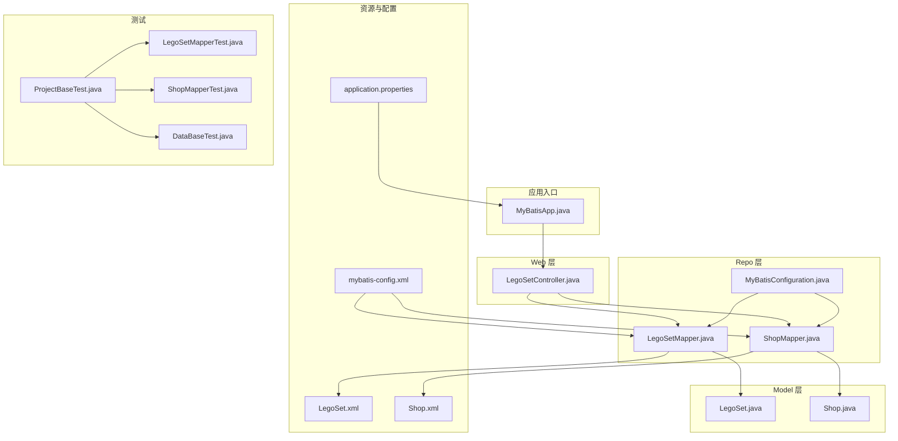
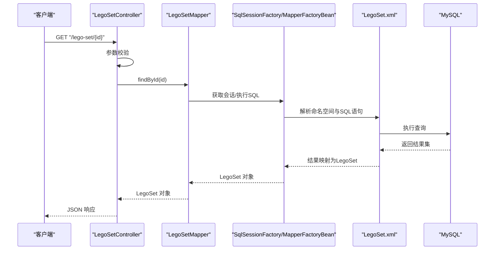
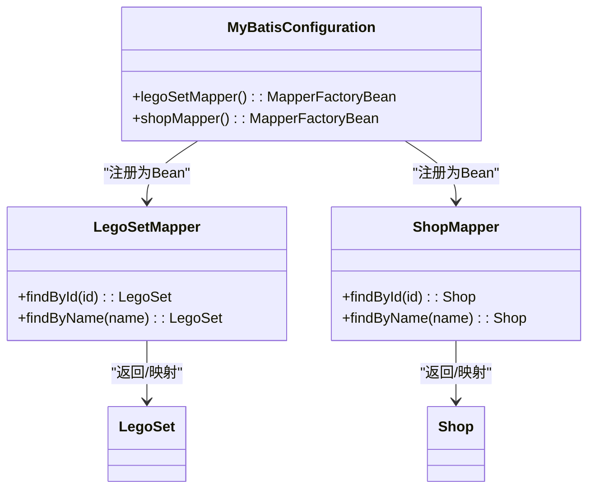
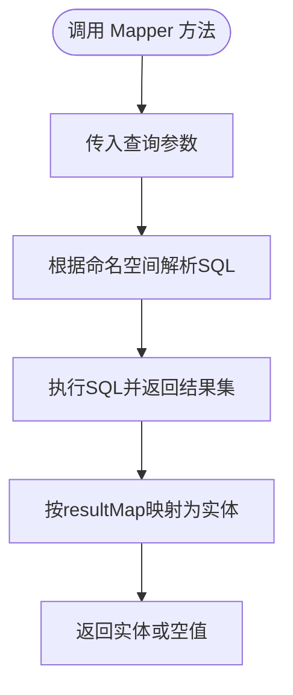
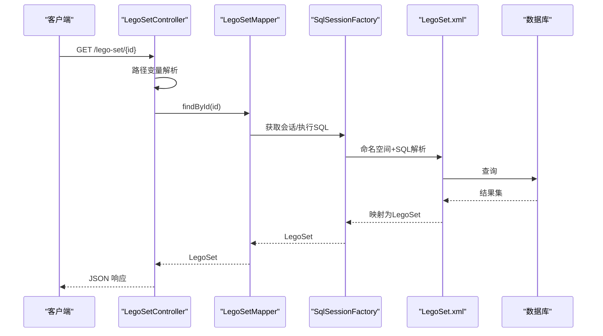
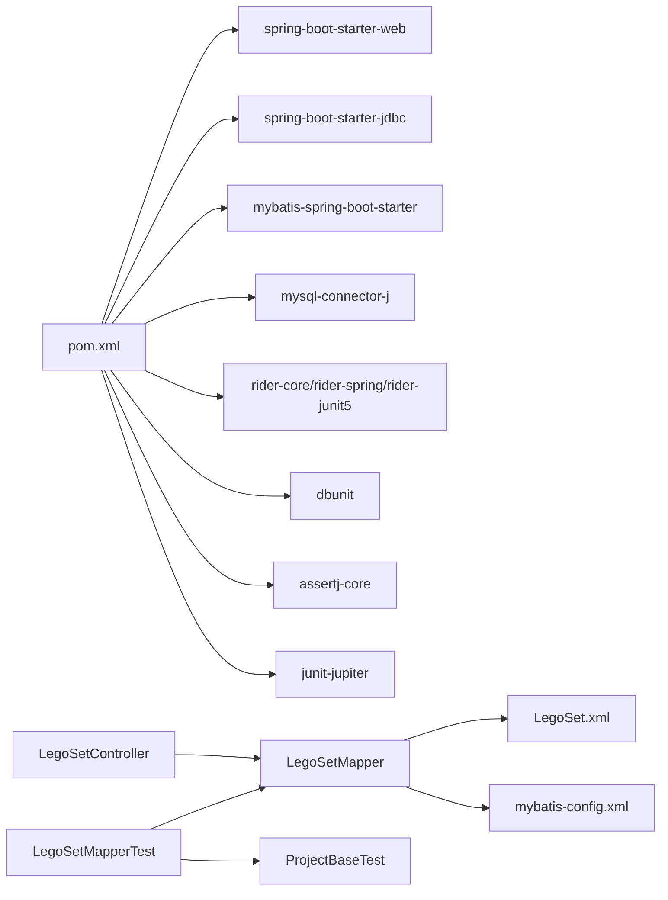

# 设计模式应用

<cite>
**本文引用的文件**
- [MyBatisApp.java](file://src/main/java/org/mvnsearch/mybatis/demo/MyBatisApp.java)
- [LegoSetMapper.java](file://src/main/java/org/mvnsearch/mybatis/demo/repo/LegoSetMapper.java)
- [ShopMapper.java](file://src/main/java/org/mvnsearch/mybatis/demo/repo/ShopMapper.java)
- [MyBatisConfiguration.java](file://src/main/java/org/mvnsearch/mybatis/demo/repo/MyBatisConfiguration.java)
- [LegoSetController.java](file://src/main/java/org/mvnsearch/mybatis/demo/web/LegoSetController.java)
- [LegoSet.java](file://src/main/java/org/mvnsearch/mybatis/demo/model/LegoSet.java)
- [Shop.java](file://src/main/java/org/mvnsearch/mybatis/demo/model/Shop.java)
- [application.properties](file://src/main/resources/application.properties)
- [mybatis-config.xml](file://src/main/resources/mybatis-config.xml)
- [LegoSet.xml](file://src/main/resources/mapper/LegoSet.xml)
- [Shop.xml](file://src/main/resources/mapper/Shop.xml)
- [LegoSetMapperTest.java](file://src/test/java/org/mvnsearch/mybatis/demo/repo/LegoSetMapperTest.java)
- [ShopMapperTest.java](file://src/test/java/org/mvnsearch/mybatis/demo/repo/ShopMapperTest.java)
- [ProjectBaseTest.java](file://src/test/java/org/mvnsearch/mybatis/demo/ProjectBaseTest.java)
- [DataBaseTest.java](file://src/test/java/org/mvnsearch/mybatis/demo/DataBaseTest.java)
- [pom.xml](file://pom.xml)
</cite>

## 目录
1. [引言](#引言)
2. [项目结构](#项目结构)
3. [核心组件](#核心组件)
4. [架构总览](#架构总览)
5. [详细组件分析](#详细组件分析)
6. [依赖分析](#依赖分析)
7. [性能考虑](#性能考虑)
8. [故障排查指南](#故障排查指南)
9. [结论](#结论)
10. [附录](#附录)

## 引言
本文件聚焦于 MyBatis Spring Demo 项目中的设计模式应用，系统梳理并解释以下要点：
- Repository 模式与 Mapper 模式的实现与职责边界
- LegoSetMapper 与 ShopMapper 的设计理念与接口抽象
- 控制器层如何体现 MVC 模式
- 接口抽象与实现分离的设计原则
- 依赖注入与控制反转（IoC）在项目中的具体体现
- 设计模式对可维护性与可测试性的提升
- 针对模式选择的技术考量与权衡

## 项目结构
该项目采用基于功能域的分层组织方式：web 层负责请求入口与响应封装；repo 层定义数据访问接口（Mapper）；model 层承载领域对象；resources 下包含 MyBatis 映射配置与 Spring Boot 配置；test 目录提供基于数据库骑手（DBUnit/Rider）的数据集驱动测试。

图表来源
- [MyBatisApp.java:11-16](file://src/main/java/org/mvnsearch/mybatis/demo/MyBatisApp.java#L11-L16)
- [LegoSetController.java:11-21](file://src/main/java/org/mvnsearch/mybatis/demo/web/LegoSetController.java#L11-L21)
- [LegoSetMapper.java:12-20](file://src/main/java/org/mvnsearch/mybatis/demo/repo/LegoSetMapper.java#L12-L20)
- [ShopMapper.java:12-20](file://src/main/java/org/mvnsearch/mybatis/demo/repo/ShopMapper.java#L12-L20)
- [MyBatisConfiguration.java:8-24](file://src/main/java/org/mvnsearch/mybatis/demo/repo/MyBatisConfiguration.java#L8-L24)
- [LegoSet.java:3-22](file://src/main/java/org/mvnsearch/mybatis/demo/model/LegoSet.java#L3-L22)
- [Shop.java:3-31](file://src/main/java/org/mvnsearch/mybatis/demo/model/Shop.java#L3-L31)
- [application.properties:1-11](file://src/main/resources/application.properties#L1-L11)
- [mybatis-config.xml:1-14](file://src/main/resources/mybatis-config.xml#L1-L14)
- [LegoSet.xml:1-22](file://src/main/resources/mapper/LegoSet.xml#L1-L22)
- [Shop.xml:1-24](file://src/main/resources/mapper/Shop.xml#L1-L24)
- [ProjectBaseTest.java:15-21](file://src/test/java/org/mvnsearch/mybatis/demo/ProjectBaseTest.java#L15-L21)
- [LegoSetMapperTest.java:26-44](file://src/test/java/org/mvnsearch/mybatis/demo/repo/LegoSetMapperTest.java#L26-L44)
- [ShopMapperTest.java:11-29](file://src/test/java/org/mvnsearch/mybatis/demo/repo/ShopMapperTest.java#L11-L29)
- [DataBaseTest.java:12-26](file://src/test/java/org/mvnsearch/mybatis/demo/DataBaseTest.java#L12-L26)

章节来源
- [MyBatisApp.java:11-16](file://src/main/java/org/mvnsearch/mybatis/demo/MyBatisApp.java#L11-L16)
- [application.properties:1-11](file://src/main/resources/application.properties#L1-L11)
- [mybatis-config.xml:6-13](file://src/main/resources/mybatis-config.xml#L6-L13)

## 核心组件
- 应用入口与启动：通过 Spring Boot 启动类引导应用上下文。
- 控制器层：REST 控制器暴露 HTTP 接口，使用依赖注入获取 Mapper 实例，完成业务编排与结果返回。
- 数据访问层：以 Mapper 接口定义查询契约，结合 XML 映射文件实现 SQL 与实体映射。
- 领域模型：轻量级 POJO 承载数据结构，便于跨层传递。
- 配置层：MyBatis 全局配置与 Mapper 工厂 Bean 注册，确保接口被容器管理并生成代理。

章节来源
- [MyBatisApp.java:11-16](file://src/main/java/org/mvnsearch/mybatis/demo/MyBatisApp.java#L11-L16)
- [LegoSetController.java:14-20](file://src/main/java/org/mvnsearch/mybatis/demo/web/LegoSetController.java#L14-L20)
- [LegoSetMapper.java:12-20](file://src/main/java/org/mvnsearch/mybatis/demo/repo/LegoSetMapper.java#L12-L20)
- [ShopMapper.java:12-20](file://src/main/java/org/mvnsearch/mybatis/demo/repo/ShopMapper.java#L12-L20)
- [LegoSet.java:3-22](file://src/main/java/org/mvnsearch/mybatis/demo/model/LegoSet.java#L3-L22)
- [Shop.java:3-31](file://src/main/java/org/mvnsearch/mybatis/demo/model/Shop.java#L3-L31)
- [MyBatisConfiguration.java:11-23](file://src/main/java/org/mvnsearch/mybatis/demo/repo/MyBatisConfiguration.java#L11-L23)
- [mybatis-config.xml:6-13](file://src/main/resources/mybatis-config.xml#L6-L13)

## 架构总览
下图展示了从 Web 请求到数据访问的端到端流程，以及依赖注入与 MyBatis 映射的关系。

图表来源
- [LegoSetController.java:17-20](file://src/main/java/org/mvnsearch/mybatis/demo/web/LegoSetController.java#L17-L20)
- [LegoSetMapper.java:16](file://src/main/java/org/mvnsearch/mybatis/demo/repo/LegoSetMapper.java#L16)
- [MyBatisConfiguration.java:11-16](file://src/main/java/org/mvnsearch/mybatis/demo/repo/MyBatisConfiguration.java#L11-L16)
- [LegoSet.xml:10-14](file://src/main/resources/mapper/LegoSet.xml#L10-L14)
- [application.properties:6](file://src/main/resources/application.properties#L6)
- [mybatis-config.xml:10-13](file://src/main/resources/mybatis-config.xml#L10-L13)

## 详细组件分析

### 组件一：Repository 模式与 Mapper 模式的职责划分
- Repository 模式：在本项目中，Repository 的职责由 Mapper 接口承担，负责定义面向领域的数据访问方法（如按主键或名称查询），屏蔽底层 SQL 与连接细节。
- Mapper 模式：MyBatis 的 Mapper 接口作为数据映射器，通过注解或 XML 映射文件声明 SQL 与结果映射，实现领域对象与关系表之间的转换。
- 职责边界：
  - 接口层（Mapper）：仅声明查询契约，不包含实现逻辑。
  - 配置层（MyBatisConfiguration）：注册 MapperFactoryBean，使接口由 Spring 管理并生成动态代理。
  - 映射层（XML）：提供 SQL、参数类型与结果映射，保证查询行为与数据库交互一致。
  - 控制器层：通过依赖注入获取 Mapper，完成请求处理与响应封装。

图表来源
- [LegoSetMapper.java:12-20](file://src/main/java/org/mvnsearch/mybatis/demo/repo/LegoSetMapper.java#L12-L20)
- [ShopMapper.java:12-20](file://src/main/java/org/mvnsearch/mybatis/demo/repo/ShopMapper.java#L12-L20)
- [LegoSet.java:3-22](file://src/main/java/org/mvnsearch/mybatis/demo/model/LegoSet.java#L3-L22)
- [Shop.java:3-31](file://src/main/java/org/mvnsearch/mybatis/demo/model/Shop.java#L3-L31)
- [MyBatisConfiguration.java:11-23](file://src/main/java/org/mvnsearch/mybatis/demo/repo/MyBatisConfiguration.java#L11-L23)

章节来源
- [LegoSetMapper.java:12-20](file://src/main/java/org/mvnsearch/mybatis/demo/repo/LegoSetMapper.java#L12-L20)
- [ShopMapper.java:12-20](file://src/main/java/org/mvnsearch/mybatis/demo/repo/ShopMapper.java#L12-L20)
- [MyBatisConfiguration.java:11-23](file://src/main/java/org/mvnsearch/mybatis/demo/repo/MyBatisConfiguration.java#L11-L23)
- [LegoSet.xml:5-8](file://src/main/resources/mapper/LegoSet.xml#L5-L8)
- [Shop.xml:5-9](file://src/main/resources/mapper/Shop.xml#L5-L9)

### 组件二：LegoSetMapper 与 ShopMapper 的设计理念
- LegoSetMapper：
  - 提供按主键与名称查询 LegoSet 的方法，返回可空结果，体现“查询即用”的简洁性。
  - 与 LegoSet.xml 的命名空间一致，确保运行时能正确解析 SQL。
- ShopMapper：
  - 提供按主键与名称查询 Shop 的方法，返回可空结果，保持与 LegoSetMapper 一致的契约风格。
  - 与 Shop.xml 的命名空间一致，确保运行时能正确解析 SQL。
- 设计要点：
  - 接口方法名即查询意图，避免冗余注释，提升可读性。
  - 可空返回类型明确表示可能无结果，便于上层处理。
  - 两个 Mapper 在结构与职责上高度对称，便于扩展与维护。

图表来源
- [LegoSetMapper.java:16-19](file://src/main/java/org/mvnsearch/mybatis/demo/repo/LegoSetMapper.java#L16-L19)
- [ShopMapper.java:16-19](file://src/main/java/org/mvnsearch/mybatis/demo/repo/ShopMapper.java#L16-L19)
- [LegoSet.xml:10-20](file://src/main/resources/mapper/LegoSet.xml#L10-L20)
- [Shop.xml:11-21](file://src/main/resources/mapper/Shop.xml#L11-L21)

章节来源
- [LegoSetMapper.java:12-20](file://src/main/java/org/mvnsearch/mybatis/demo/repo/LegoSetMapper.java#L12-L20)
- [ShopMapper.java:12-20](file://src/main/java/org/mvnsearch/mybatis/demo/repo/ShopMapper.java#L12-L20)
- [LegoSet.xml:3](file://src/main/resources/mapper/LegoSet.xml#L3)
- [Shop.xml:3](file://src/main/resources/mapper/Shop.xml#L3)

### 组件三：控制器层的 MVC 应用
- 角色定位：
  - Model：领域对象 LegoSet、Shop。
  - View：由 Spring MVC 自动序列化为 JSON。
  - Controller：LegoSetController 处理 HTTP 请求，依赖注入 LegoSetMapper 完成数据查询。
- 控制流程：
  - 控制器接收路径变量 id，调用 Mapper 的 findById 方法。
  - Mapper 通过 MyBatis 执行 SQL 并返回实体。
  - 控制器直接返回实体，由 Spring MVC 序列化为响应体。

图表来源
- [LegoSetController.java:17-20](file://src/main/java/org/mvnsearch/mybatis/demo/web/LegoSetController.java#L17-L20)
- [LegoSetMapper.java:16](file://src/main/java/org/mvnsearch/mybatis/demo/repo/LegoSetMapper.java#L16)
- [LegoSet.xml:10-14](file://src/main/resources/mapper/LegoSet.xml#L10-L14)

章节来源
- [LegoSetController.java:11-21](file://src/main/java/org/mvnsearch/mybatis/demo/web/LegoSetController.java#L11-L21)
- [LegoSetController.java:14-20](file://src/main/java/org/mvnsearch/mybatis/demo/web/LegoSetController.java#L14-L20)

### 组件四：接口抽象与实现分离
- 抽象层：Mapper 接口定义查询契约，不包含实现细节。
- 实现层：MyBatis 通过 MapperFactoryBean 生成动态代理，XML 文件提供 SQL 实现与映射规则。
- 分离优势：
  - 接口稳定，实现可替换（例如切换不同 SQL 方言或缓存策略）。
  - 测试时可用 Mock 或内存实现替换真实 Mapper，提升单元测试效率。

章节来源
- [MyBatisConfiguration.java:11-23](file://src/main/java/org/mvnsearch/mybatis/demo/repo/MyBatisConfiguration.java#L11-L23)
- [LegoSet.xml:3](file://src/main/resources/mapper/LegoSet.xml#L3)
- [Shop.xml:3](file://src/main/resources/mapper/Shop.xml#L3)

### 组件五：依赖注入与控制反转（IoC）
- 控制反转：
  - 控制器不再直接创建 Mapper，而是通过 @Autowired 由 Spring 容器注入。
  - Mapper 的生命周期与代理由 Spring/MyBatis 管理，降低耦合度。
- 依赖注入实例：
  - LegoSetController 中注入 LegoSetMapper。
  - MyBatisConfiguration 中通过 MapperFactoryBean 将接口注册为 Bean，并注入 SqlSessionFactory。
- 效果：
  - 便于替换实现、增强可测试性（可在测试中替换注入的 Bean）。
  - 降低模块间耦合，提升可维护性。

章节来源
- [LegoSetController.java:14](file://src/main/java/org/mvnsearch/mybatis/demo/web/LegoSetController.java#L14)
- [MyBatisConfiguration.java:11-16](file://src/main/java/org/mvnsearch/mybatis/demo/repo/MyBatisConfiguration.java#L11-L16)
- [MyBatisConfiguration.java:18-23](file://src/main/java/org/mvnsearch/mybatis/demo/repo/MyBatisConfiguration.java#L18-L23)

### 组件六：可维护性与可测试性提升
- 可维护性：
  - 接口与实现分离，变更集中在 XML 或实现类，不影响调用方。
  - 对称的 LegoSetMapper 与 ShopMapper 结构，便于扩展新的实体。
- 可测试性：
  - 单元测试通过 @Autowired 注入 Mapper，结合数据库骑手加载数据集，验证查询逻辑。
  - 测试基类统一配置 Spring 上下文与数据库环境，减少重复配置。

章节来源
- [LegoSetMapperTest.java:26-44](file://src/test/java/org/mvnsearch/mybatis/demo/repo/LegoSetMapperTest.java#L26-L44)
- [ShopMapperTest.java:11-29](file://src/test/java/org/mvnsearch/mybatis/demo/repo/ShopMapperTest.java#L11-L29)
- [ProjectBaseTest.java:15-21](file://src/test/java/org/mvnsearch/mybatis/demo/ProjectBaseTest.java#L15-L21)

## 依赖分析
- 外部依赖：
  - Spring Boot Starter Web、JDBC、MyBatis Spring Boot Starter、MySQL Connector。
  - 数据库测试工具链：Database Rider、DBUnit、AssertJ、JUnit。
- 内部依赖：
  - 控制器依赖 Mapper 接口。
  - Mapper 接口依赖 MyBatis 配置与 XML 映射。
  - 测试依赖 Spring Test 与数据库骑手，加载数据集进行断言。

图表来源
- [pom.xml:30-100](file://pom.xml#L30-L100)
- [LegoSetController.java:4](file://src/main/java/org/mvnsearch/mybatis/demo/web/LegoSetController.java#L4)
- [LegoSet.xml:3](file://src/main/resources/mapper/LegoSet.xml#L3)
- [mybatis-config.xml:6-13](file://src/main/resources/mybatis-config.xml#L6-L13)
- [LegoSetMapperTest.java:22-29](file://src/test/java/org/mvnsearch/mybatis/demo/repo/LegoSetMapperTest.java#L22-L29)
- [ProjectBaseTest.java:15-19](file://src/test/java/org/mvnsearch/mybatis/demo/ProjectBaseTest.java#L15-L19)

章节来源
- [pom.xml:30-100](file://pom.xml#L30-L100)

## 性能考虑
- SQL 与映射：
  - 使用 resultMap 精准映射字段，避免 N+1 查询问题。
  - 通过命名空间与 SQL ID 精确匹配，减少解析开销。
- 连接与会话：
  - 由 MyBatis 与 Spring 管理 SqlSessionFactory，建议复用会话，避免频繁创建销毁。
- 测试与开发：
  - 使用数据集快速准备测试数据，缩短回归时间。
  - 日志级别合理配置，避免生产环境过度日志输出。

## 故障排查指南
- 常见问题与定位：
  - 命名空间不匹配：检查 Mapper 接口的包名与 XML 的 namespace 是否一致。
  - 结果映射失败：确认 resultMap 的列名与 SQL 字段一致，或使用列别名。
  - 注入失败：确认 @Mapper 注解或 MapperFactoryBean 已注册，且 SqlSessionFactory 正常。
  - 数据库连接异常：核对 application.properties 中的连接信息与驱动版本。
- 测试辅助：
  - 使用数据库骑手生成 DTD，确保数据集结构与数据库一致。
  - 在测试中打印实体属性，辅助定位映射问题。

章节来源
- [LegoSet.xml:3](file://src/main/resources/mapper/LegoSet.xml#L3)
- [Shop.xml:3](file://src/main/resources/mapper/Shop.xml#L3)
- [mybatis-config.xml:6-13](file://src/main/resources/mybatis-config.xml#L6-L13)
- [application.properties:2-6](file://src/main/resources/application.properties#L2-L6)
- [DataBaseTest.java:21-25](file://src/test/java/org/mvnsearch/mybatis/demo/DataBaseTest.java#L21-L25)

## 结论
本项目通过清晰的分层与接口抽象，将 Repository 与 Mapper 模式有机结合，借助 Spring 与 MyBatis 的 IoC 与动态代理机制，实现了低耦合、高内聚的数据访问层。控制器层遵循 MVC 思想，专注于请求处理与响应封装。接口与实现分离、依赖注入与控制反转的应用显著提升了系统的可维护性与可测试性。针对模式选择的技术考量在于：以最小侵入的方式获得强类型与可测试性，同时保持 SQL 与映射的灵活性。

## 附录
- 关键实现参考路径（用于查阅具体代码片段）：
  - [应用启动类:11-16](file://src/main/java/org/mvnsearch/mybatis/demo/MyBatisApp.java#L11-L16)
  - [LegoSetMapper 接口:12-20](file://src/main/java/org/mvnsearch/mybatis/demo/repo/LegoSetMapper.java#L12-L20)
  - [ShopMapper 接口:12-20](file://src/main/java/org/mvnsearch/mybatis/demo/repo/ShopMapper.java#L12-L20)
  - [MyBatis 配置与 Mapper 注册:11-23](file://src/main/java/org/mvnsearch/mybatis/demo/repo/MyBatisConfiguration.java#L11-L23)
  - [LegoSetController 控制器:14-20](file://src/main/java/org/mvnsearch/mybatis/demo/web/LegoSetController.java#L14-L20)
  - [LegoSet 实体:3-22](file://src/main/java/org/mvnsearch/mybatis/demo/model/LegoSet.java#L3-L22)
  - [Shop 实体:3-31](file://src/main/java/org/mvnsearch/mybatis/demo/model/Shop.java#L3-L31)
  - [MyBatis 全局配置:6-13](file://src/main/resources/mybatis-config.xml#L6-L13)
  - [LegoSet XML 映射:10-20](file://src/main/resources/mapper/LegoSet.xml#L10-L20)
  - [Shop XML 映射:11-21](file://src/main/resources/mapper/Shop.xml#L11-L21)
  - [LegoSet Mapper 测试:32-42](file://src/test/java/org/mvnsearch/mybatis/demo/repo/LegoSetMapperTest.java#L32-L42)
  - [Shop Mapper 测试:17-26](file://src/test/java/org/mvnsearch/mybatis/demo/repo/ShopMapperTest.java#L17-L26)
  - [测试基类:15-21](file://src/test/java/org/mvnsearch/mybatis/demo/ProjectBaseTest.java#L15-L21)
  - [数据库测试与 DTD 生成:21-25](file://src/test/java/org/mvnsearch/mybatis/demo/DataBaseTest.java#L21-L25)
  - [应用配置:2-6](file://src/main/resources/application.properties#L2-L6)
  - [项目依赖:30-100](file://pom.xml#L30-L100)