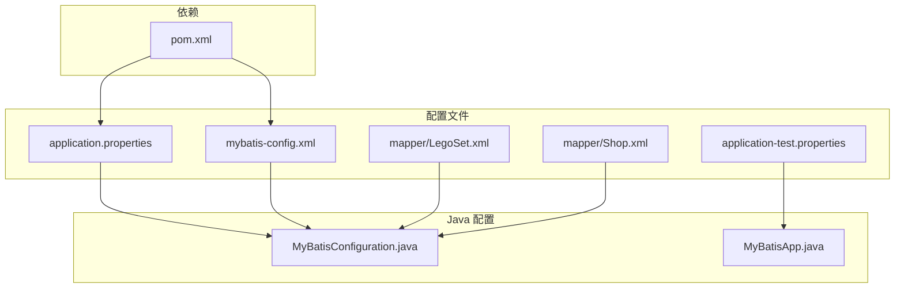
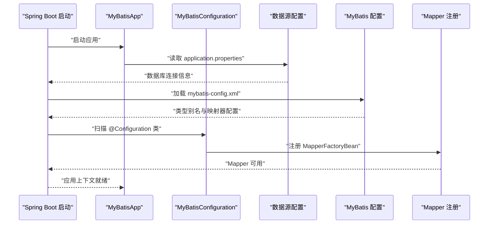
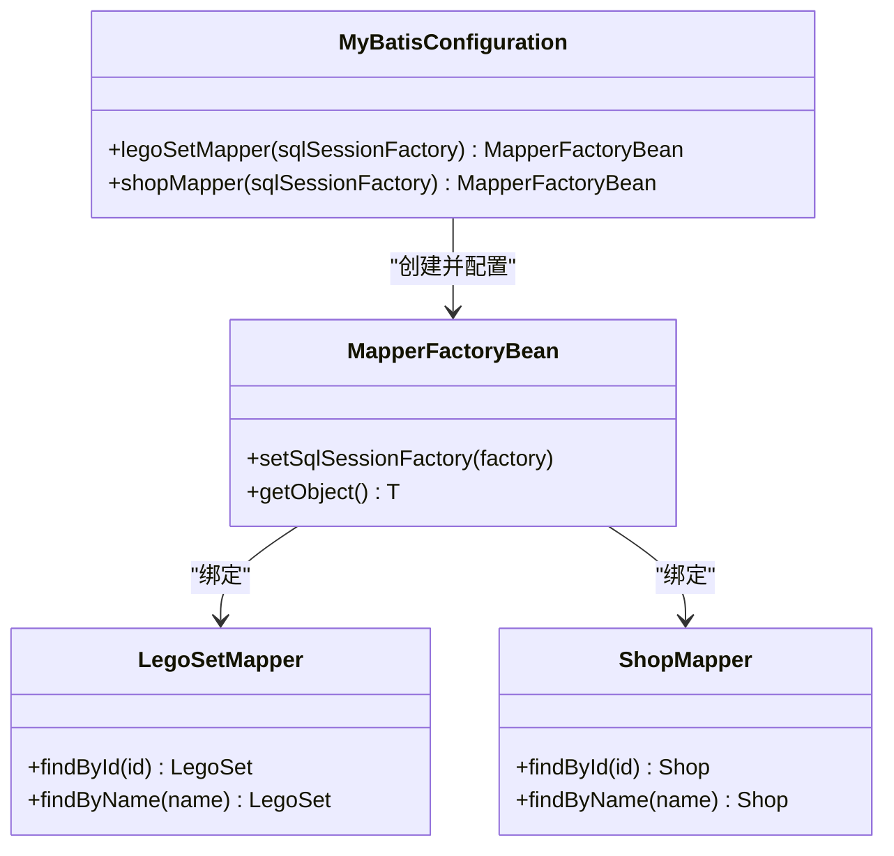
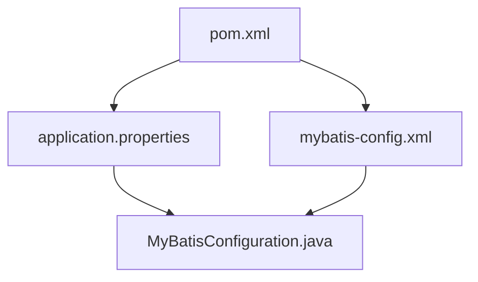

# 配置管理

<cite>
**本文档引用的文件**
- [MyBatisConfiguration.java](file://src/main/java/org/mvnsearch/mybatis/demo/repo/MyBatisConfiguration.java)
- [application.properties](file://src/main/resources/application.properties)
- [application-test.properties](file://src/test/resources/application-test.properties)
- [mybatis-config.xml](file://src/main/resources/mybatis-config.xml)
- [LegoSetMapper.java](file://src/main/java/org/mvnsearch/mybatis/demo/repo/LegoSetMapper.java)
- [ShopMapper.java](file://src/main/java/org/mvnsearch/mybatis/demo/repo/ShopMapper.java)
- [LegoSet.xml](file://src/main/resources/mapper/LegoSet.xml)
- [Shop.xml](file://src/main/resources/mapper/Shop.xml)
- [MyBatisApp.java](file://src/main/java/org/mvnsearch/mybatis/demo/MyBatisApp.java)
- [pom.xml](file://pom.xml)
</cite>

## 目录
1. [简介](#简介)
2. [项目结构](#项目结构)
3. [核心组件](#核心组件)
4. [架构总览](#架构总览)
5. [详细组件分析](#详细组件分析)
6. [依赖分析](#依赖分析)
7. [性能考虑](#性能考虑)
8. [故障排除指南](#故障排除指南)
9. [结论](#结论)
10. [附录](#附录)

## 简介
本项目是一个基于 Spring Boot 的 MyBatis 示例应用，展示了如何在 Spring Boot 中集成 MyBatis，并通过手动配置与自动配置相结合的方式实现数据访问层。本文档聚焦于配置管理，详细说明以下内容：
- MyBatisConfiguration 中自定义配置的作用与实现细节
- application.properties 中的关键配置项及其含义
- mybatis-config.xml 中的全局配置选项
- Spring Boot 自动配置与手动配置的结合方式
- 数据库连接配置、MyBatis 属性配置与应用运行参数
- 配置文件的加载顺序与优先级规则
- 配置最佳实践与常见错误的解决方案
- 如何扩展和定制配置以满足特定需求

## 项目结构
该项目采用标准的 Maven 结构，主要配置文件位于 resources 目录下，Java 源码位于 src/main/java 下。关键配置文件包括：
- application.properties：Spring Boot 应用的主要配置文件
- mybatis-config.xml：MyBatis 的全局配置文件
- mapper/*.xml：MyBatis 映射器 XML 文件
- MyBatisConfiguration.java：手动配置类，用于注册 Mapper

图表来源
- [application.properties:1-11](file://src/main/resources/application.properties#L1-L11)
- [mybatis-config.xml:1-14](file://src/main/resources/mybatis-config.xml#L1-L14)
- [MyBatisConfiguration.java:1-25](file://src/main/java/org/mvnsearch/mybatis/demo/repo/MyBatisConfiguration.java#L1-L25)
- [MyBatisApp.java:1-17](file://src/main/java/org/mvnsearch/mybatis/demo/MyBatisApp.java#L1-L17)
- [pom.xml:1-141](file://pom.xml#L1-L141)

章节来源
- [application.properties:1-11](file://src/main/resources/application.properties#L1-L11)
- [mybatis-config.xml:1-14](file://src/main/resources/mybatis-config.xml#L1-L14)
- [MyBatisConfiguration.java:1-25](file://src/main/java/org/mvnsearch/mybatis/demo/repo/MyBatisConfiguration.java#L1-L25)
- [MyBatisApp.java:1-17](file://src/main/java/org/mvnsearch/mybatis/demo/MyBatisApp.java#L1-L17)
- [pom.xml:1-141](file://pom.xml#L1-L141)

## 核心组件
本节概述与配置管理直接相关的三个核心组件：
- MyBatisConfiguration：手动配置类，负责注册 Mapper 接口到 Spring 容器
- application.properties：Spring Boot 应用配置文件，包含数据库连接与日志级别等设置
- mybatis-config.xml：MyBatis 全局配置文件，定义类型别名与映射器位置

这些组件共同决定了应用启动时的数据源初始化、MyBatis 会话工厂构建以及 Mapper 的可用性。

章节来源
- [MyBatisConfiguration.java:8-24](file://src/main/java/org/mvnsearch/mybatis/demo/repo/MyBatisConfiguration.java#L8-L24)
- [application.properties:1-11](file://src/main/resources/application.properties#L1-L11)
- [mybatis-config.xml:5-14](file://src/main/resources/mybatis-config.xml#L5-L14)

## 架构总览
下图展示了配置驱动的应用启动流程，从 Spring Boot 启动到 MyBatis 映射器可用的关键步骤。

图表来源
- [MyBatisApp.java:11-16](file://src/main/java/org/mvnsearch/mybatis/demo/MyBatisApp.java#L11-L16)
- [MyBatisConfiguration.java:8-24](file://src/main/java/org/mvnsearch/mybatis/demo/repo/MyBatisConfiguration.java#L8-L24)
- [application.properties:1-11](file://src/main/resources/application.properties#L1-L11)
- [mybatis-config.xml:5-14](file://src/main/resources/mybatis-config.xml#L5-L14)

## 详细组件分析

### MyBatisConfiguration 分析
MyBatisConfiguration 是一个基于 Java 的配置类，使用 @Configuration 声明为 Spring 配置类。其职责是显式地注册 Mapper 接口到 Spring 容器，确保 MyBatis 能够通过 SqlSessionFactory 创建对应的 Mapper 实例。

- 关键点
  - 使用 @Bean 方法创建 MapperFactoryBean 并绑定到 SqlSessionFactory
  - 为每个 Mapper 接口（如 LegoSetMapper、ShopMapper）分别注册
  - 该方式与基于注解的 @Mapper 扫描不同，属于手动注册模式

- 设计意图
  - 提供对 Mapper 注册过程的细粒度控制
  - 在需要自定义 MapperFactoryBean 行为或进行额外装配时更为灵活

图表来源
- [MyBatisConfiguration.java:11-23](file://src/main/java/org/mvnsearch/mybatis/demo/repo/MyBatisConfiguration.java#L11-L23)
- [LegoSetMapper.java:12-20](file://src/main/java/org/mvnsearch/mybatis/demo/repo/LegoSetMapper.java#L12-L20)
- [ShopMapper.java:12-20](file://src/main/java/org/mvnsearch/mybatis/demo/repo/ShopMapper.java#L12-L20)

章节来源
- [MyBatisConfiguration.java:8-24](file://src/main/java/org/mvnsearch/mybatis/demo/repo/MyBatisConfiguration.java#L8-L24)
- [LegoSetMapper.java:12-20](file://src/main/java/org/mvnsearch/mybatis/demo/repo/LegoSetMapper.java#L12-L20)
- [ShopMapper.java:12-20](file://src/main/java/org/mvnsearch/mybatis/demo/repo/ShopMapper.java#L12-L20)

### application.properties 配置项详解
application.properties 是 Spring Boot 的主配置文件，包含数据库连接、MyBatis 配置与日志级别等关键参数。

- 数据库连接配置
  - spring.datasource.url：数据库连接 URL
  - spring.datasource.username：数据库用户名
  - spring.datasource.password：数据库密码
  - spring.datasource.driver-class-name：JDBC 驱动类名

- MyBatis 配置
  - mybatis.config-location：指定 MyBatis 全局配置文件路径

- 日志配置
  - logging.level.org.springframework.data：Spring Data 日志级别
  - logging.level.org.springframework.jdbc.core.JdbcTemplate：JdbcTemplate 日志级别
  - logging.level.example.springdata.jdbc.mybatis：自定义包的日志级别

- 运行参数
  - 该文件还可能包含其他应用运行所需的参数（如端口、服务器配置等）

章节来源
- [application.properties:1-11](file://src/main/resources/application.properties#L1-L11)

### mybatis-config.xml 全局配置
mybatis-config.xml 是 MyBatis 的全局配置文件，定义了类型别名与映射器的位置，从而简化 SQL 映射中的类型引用并声明映射器。

- 类型别名（typeAliases）
  - 为实体类（如 LegoSet、Shop）设置简短别名，便于在映射器中引用

- 映射器（mappers）
  - 通过 resource 属性引入映射器 XML 文件（如 mapper/LegoSet.xml、mapper/Shop.xml）

- 加载顺序
  - MyBatis 在启动时会读取该配置文件，解析类型别名与映射器列表，随后由 Spring Boot 与 MyBatis 集成模块完成会话工厂的构建

章节来源
- [mybatis-config.xml:5-14](file://src/main/resources/mybatis-config.xml#L5-L14)

### Spring Boot 自动配置与手动配置的结合
本项目采用了“自动配置 + 手动配置”的混合方式：
- 自动配置
  - Spring Boot 通过 mybatis-spring-boot-starter 自动配置数据源、MyBatis 会话工厂与 Mapper 扫描
  - application.properties 中的数据库连接信息由 Spring Boot 自动识别并注入

- 手动配置
  - MyBatisConfiguration 使用 @Configuration 与 @Bean 显式注册 MapperFactoryBean
  - 这种方式提供了对 Mapper 注册过程的精确控制，适合需要特殊装配或自定义行为的场景

- 协同机制
  - 自动配置负责基础设施（数据源、会话工厂），手动配置负责业务接口（Mapper）的装配
  - 两者在启动阶段协同工作，最终形成完整的数据访问层

章节来源
- [MyBatisConfiguration.java:8-24](file://src/main/java/org/mvnsearch/mybatis/demo/repo/MyBatisConfiguration.java#L8-L24)
- [application.properties:6-6](file://src/main/resources/application.properties#L6-L6)
- [pom.xml:47-51](file://pom.xml#L47-L51)

### 数据库连接配置
数据库连接配置由 application.properties 提供，Spring Boot 将其转换为数据源 Bean，供 MyBatis 使用。

- 关键项
  - spring.datasource.url：数据库地址与参数
  - spring.datasource.username/password：认证凭据
  - spring.datasource.driver-class-name：驱动类名

- 注意事项
  - 确保驱动类名与实际使用的数据库一致
  - URL 中的参数需与目标数据库兼容（如字符集、时区处理等）

章节来源
- [application.properties:2-5](file://src/main/resources/application.properties#L2-L5)

### MyBatis 属性配置
MyBatis 的全局属性通过 mybatis-config.xml 配置，主要包括类型别名与映射器位置。

- 类型别名
  - 为实体类设置简短别名，减少映射器中的全限定类名书写

- 映射器位置
  - 通过 resource 引入映射器 XML 文件，确保 MyBatis 能找到对应的 SQL 映射

- 与 Spring Boot 的集成
  - mybatis.config-location 指定全局配置文件路径，Spring Boot 将其传递给 MyBatis 集成模块

章节来源
- [mybatis-config.xml:6-13](file://src/main/resources/mybatis-config.xml#L6-L13)
- [application.properties:6-6](file://src/main/resources/application.properties#L6-L6)

### 应用运行参数
application.properties 中的日志级别配置有助于调试与监控。

- 日志级别
  - org.springframework.data：Spring Data 相关日志
  - org.springframework.jdbc.core.JdbcTemplate：JDBC 操作日志
  - 自定义包：示例中使用了自定义包的日志级别

- 其他参数
  - 可根据需要添加服务器端口、环境变量等运行参数

章节来源
- [application.properties:7-10](file://src/main/resources/application.properties#L7-L10)

## 依赖分析
本节分析配置相关的依赖关系，包括 Maven 依赖与配置文件之间的耦合。

图表来源
- [pom.xml:47-51](file://pom.xml#L47-L51)
- [application.properties:6-6](file://src/main/resources/application.properties#L6-L6)
- [mybatis-config.xml:5-14](file://src/main/resources/mybatis-config.xml#L5-L14)
- [MyBatisConfiguration.java:1-25](file://src/main/java/org/mvnsearch/mybatis/demo/repo/MyBatisConfiguration.java#L1-L25)

章节来源
- [pom.xml:47-51](file://pom.xml#L47-L51)
- [application.properties:6-6](file://src/main/resources/application.properties#L6-L6)
- [mybatis-config.xml:5-14](file://src/main/resources/mybatis-config.xml#L5-L14)
- [MyBatisConfiguration.java:1-25](file://src/main/java/org/mvnsearch/mybatis/demo/repo/MyBatisConfiguration.java#L1-L25)

## 性能考虑
- 日志级别
  - 过高的日志级别会影响性能，建议在生产环境中适当降低日志级别
  - 可针对特定包设置更精细的日志级别，避免全局开启过高的日志

- 数据库连接
  - 合理设置连接池大小与超时时间，避免过多连接导致资源紧张
  - 确保驱动类名与数据库版本匹配，减少连接失败与重试开销

- MyBatis 映射器
  - 类型别名与映射器的合理组织可减少 XML 中的全限定类名长度，提升可读性与维护性

## 故障排除指南
- 配置文件未生效
  - 检查 application.properties 是否位于正确的资源目录
  - 确认 mybatis.config-location 指向的路径是否正确

- 数据库连接失败
  - 核对 spring.datasource.url、username、password 与 driver-class-name
  - 确认数据库服务正常运行且网络可达

- Mapper 无法注入
  - 若使用手动配置，确认 MyBatisConfiguration 中已注册对应 Mapper
  - 若使用注解扫描，确认 @Mapper 与 @MapperScan 的正确使用

- 日志级别问题
  - 检查 logging.level.* 配置是否覆盖了预期的日志输出
  - 确认日志框架（如 Logback）的配置文件未与 Spring Boot 默认配置冲突

章节来源
- [application.properties:1-11](file://src/main/resources/application.properties#L1-L11)
- [mybatis-config.xml:5-14](file://src/main/resources/mybatis-config.xml#L5-L14)
- [MyBatisConfiguration.java:8-24](file://src/main/java/org/mvnsearch/mybatis/demo/repo/MyBatisConfiguration.java#L8-L24)

## 结论
本项目通过“自动配置 + 手动配置”的方式实现了 MyBatis 与 Spring Boot 的无缝集成。application.properties 提供了数据库连接与日志级别的基础配置，mybatis-config.xml 定义了类型别名与映射器位置，而 MyBatisConfiguration 则负责将 Mapper 接口注册到 Spring 容器。理解这些配置的作用与相互关系，有助于在实际项目中快速定位问题并进行优化。

## 附录

### 配置文件加载顺序与优先级规则
- Spring Boot 配置优先级（从高到低）
  - 命令行参数
  - SPRING_APPLICATION_JSON 中的环境变量
  - 系统环境变量
  - 用户主目录下的 .spring-boot-devtools.properties
  - application-{profile}.properties / application-{profile}.yml
  - application.properties / application.yml
  - @PropertySource 注解
  - 默认属性

- MyBatis 配置加载
  - mybatis.config-location 指定的全局配置文件在 MyBatis 初始化时被读取
  - 与 Spring Boot 的 application.properties 形成互补，前者负责 MyBatis 特定配置，后者负责通用应用配置

章节来源
- [application.properties:1-11](file://src/main/resources/application.properties#L1-L11)
- [mybatis-config.xml:5-14](file://src/main/resources/mybatis-config.xml#L5-L14)

### 最佳实践
- 将数据库连接信息集中管理在 application.properties 中，并在不同环境使用 profile 切换
- 使用类型别名简化映射器 XML 中的类型引用
- 对 Mapper 接口采用统一的命名规范，便于扫描与管理
- 合理设置日志级别，避免在生产环境产生过多日志输出
- 在需要自定义 Mapper 行为时，优先考虑使用手动配置类而非注解扫描

### 常见配置错误与解决方案
- 错误：Mapper 无法注入
  - 解决：确认 MyBatisConfiguration 已注册对应 Mapper 或启用 @MapperScan
- 错误：数据库连接失败
  - 解决：检查 URL、用户名、密码与驱动类名是否正确
- 错误：类型别名无效
  - 解决：确认 mybatis-config.xml 中的类型别名与实体类完全匹配
- 错误：日志级别过高影响性能
  - 解决：调整 logging.level.* 配置，仅保留必要的日志级别