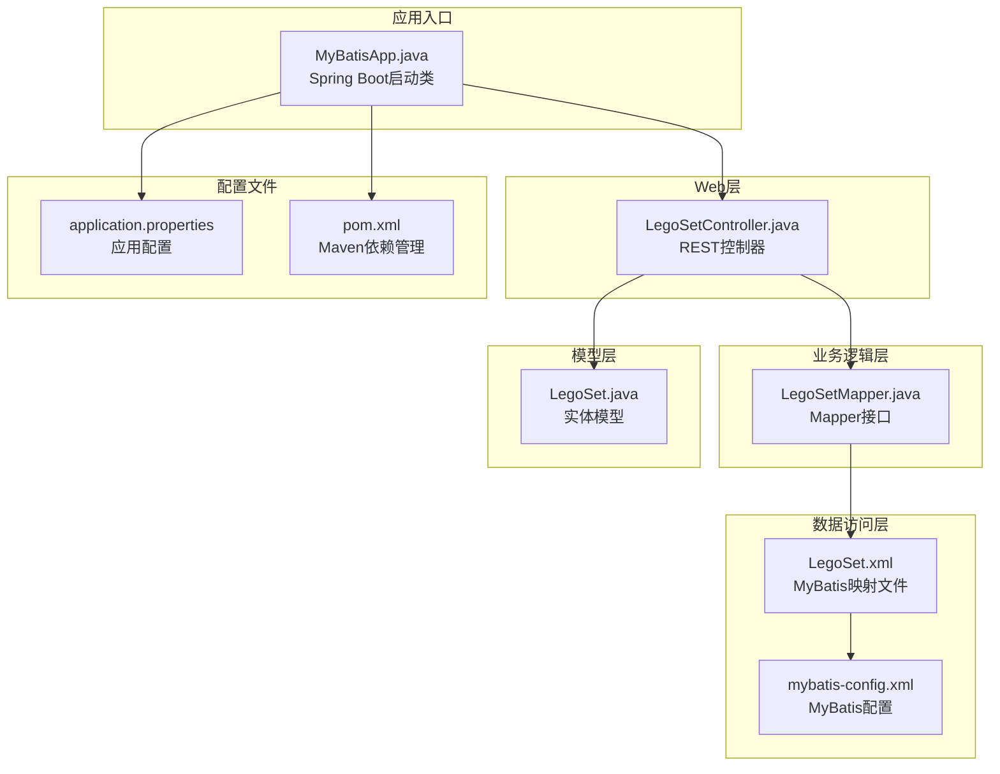
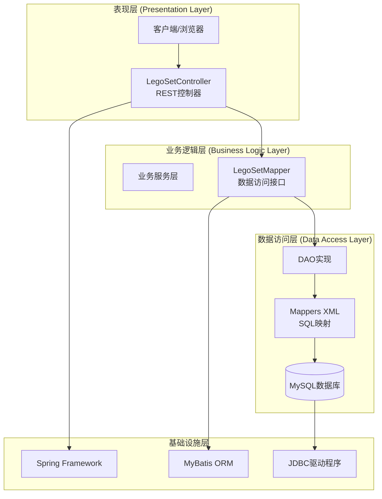
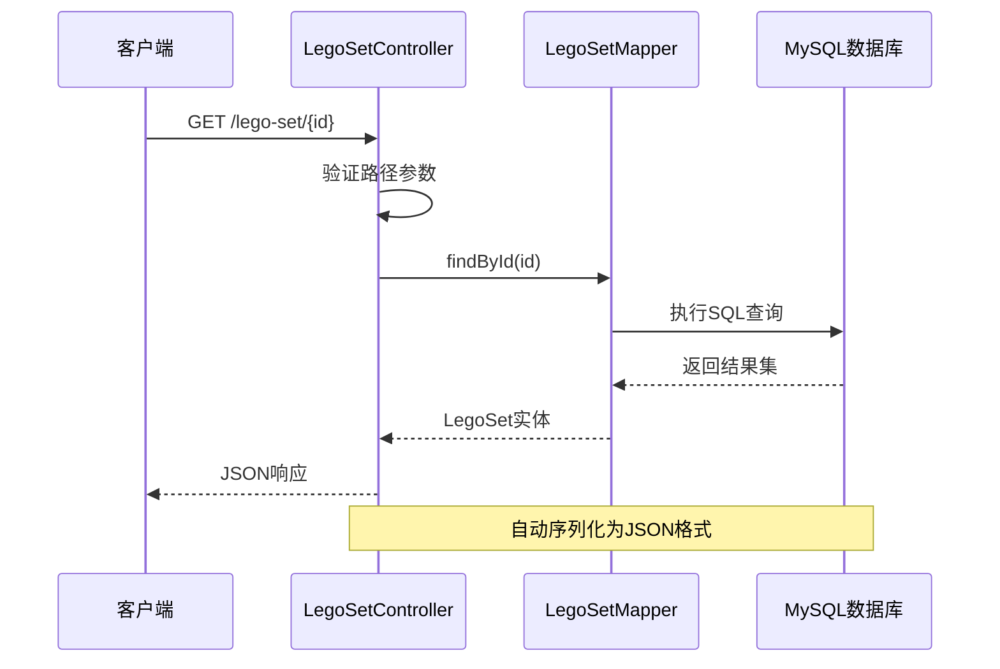
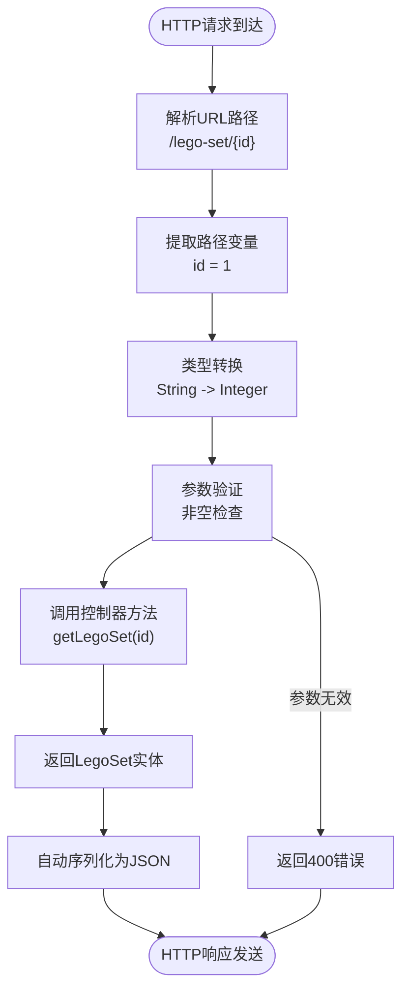
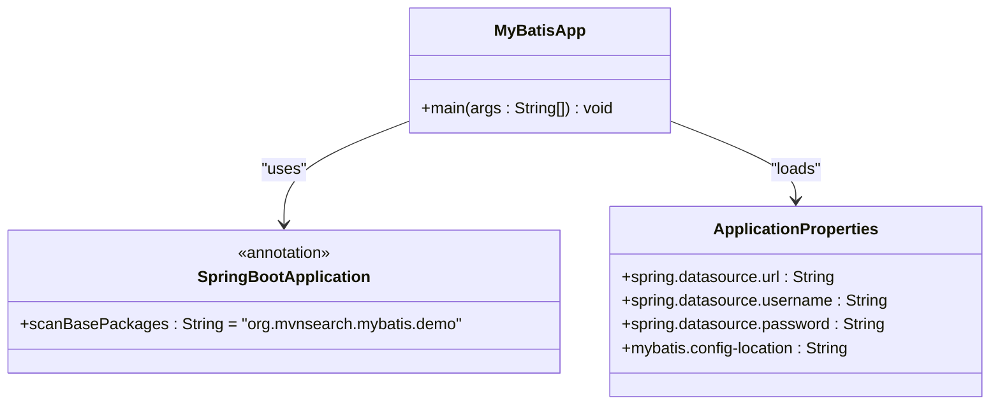
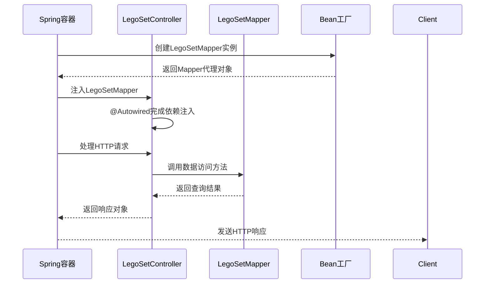
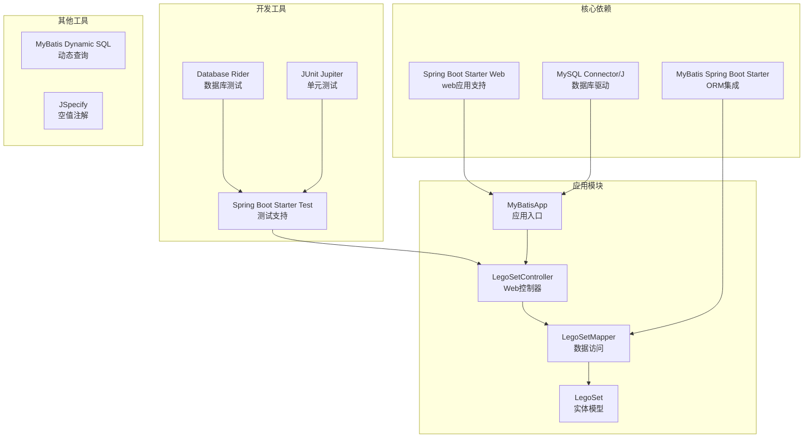
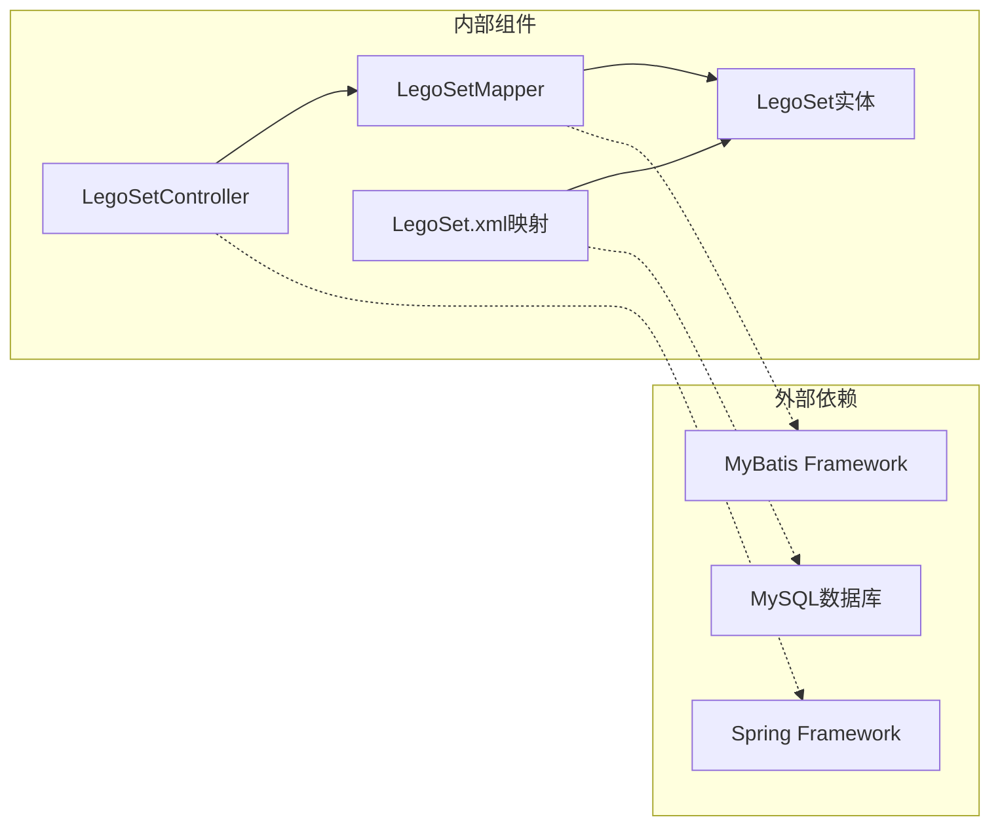
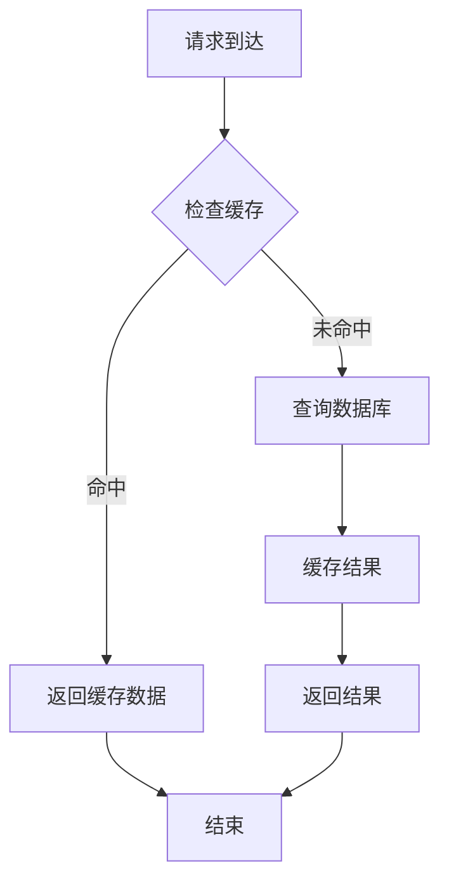

# Web控制器层

<cite>
**本文档引用的文件**
- [LegoSetController.java](file://src/main/java/org/mvnsearch/mybatis/demo/web/LegoSetController.java)
- [LegoSet.java](file://src/main/java/org/mvnsearch/mybatis/demo/model/LegoSet.java)
- [LegoSetMapper.java](file://src/main/java/org/mvnsearch/mybatis/demo/repo/LegoSetMapper.java)
- [LegoSet.xml](file://src/main/resources/mapper/LegoSet.xml)
- [mybatis-config.xml](file://src/main/resources/mybatis-config.xml)
- [application.properties](file://src/main/resources/application.properties)
- [MyBatisApp.java](file://src/main/java/org/mvnsearch/mybatis/demo/MyBatisApp.java)
- [index.http](file://index.http)
- [pom.xml](file://pom.xml)
</cite>

## 目录
1. [简介](#简介)
2. [项目结构](#项目结构)
3. [核心组件](#核心组件)
4. [架构概览](#架构概览)
5. [详细组件分析](#详细组件分析)
6. [依赖分析](#依赖分析)
7. [性能考虑](#性能考虑)
8. [故障排除指南](#故障排除指南)
9. [结论](#结论)

## 简介

本文件专注于MyBatis-Spring Demo项目中的Web控制器层，特别是LegoSetController的REST API设计和实现。该项目展示了如何使用Spring Boot和MyBatis构建一个简单的Web应用程序，其中控制器层负责处理HTTP请求并返回LegoSet实体数据。

该控制器实现了基本的CRUD操作中的读取功能，通过RESTful API提供对乐高套装信息的查询服务。项目采用分层架构设计，包括表示层（Web控制器）、业务逻辑层（Mapper接口）和数据访问层（MyBatis映射器），体现了良好的软件工程实践。

## 项目结构

该项目遵循标准的Maven项目结构，采用分层架构组织代码：



**图表来源**
- [MyBatisApp.java:11-16](file://src/main/java/org/mvnsearch/mybatis/demo/MyBatisApp.java#L11-L16)
- [LegoSetController.java:11-21](file://src/main/java/org/mvnsearch/mybatis/demo/web/LegoSetController.java#L11-L21)
- [LegoSetMapper.java:12-20](file://src/main/java/org/mvnsearch/mybatis/demo/repo/LegoSetMapper.java#L12-L20)

**章节来源**
- [MyBatisApp.java:1-17](file://src/main/java/org/mvnsearch/mybatis/demo/MyBatisApp.java#L1-L17)
- [pom.xml:1-141](file://pom.xml#L1-L141)

## 核心组件

### LegoSetController - REST控制器

LegoSetController是项目的核心Web控制器，负责处理所有与乐高套装相关的HTTP请求。该控制器采用了Spring MVC的现代化注解驱动方式，提供了简洁而强大的API设计。

**主要特性：**
- 使用@RestController注解标识为REST控制器
- 通过@RequestMapping定义基础URL路径"/lego-set"
- 实现单一的GET请求处理方法
- 支持路径变量{id}参数绑定
- 返回LegoSet实体对象

**依赖注入机制：**
控制器通过@Autowired注解自动注入LegoSetMapper实例，实现了控制反转和依赖注入的最佳实践。这种设计使得控制器与具体的数据访问实现解耦，便于测试和维护。

**章节来源**
- [LegoSetController.java:11-21](file://src/main/java/org/mvnsearch/mybatis/demo/web/LegoSetController.java#L11-L21)

### LegoSet - 实体模型

LegoSet是项目的核心数据模型，代表了乐高套装的基本信息。该模型遵循Java Bean规范，提供了标准的getter和setter方法。

**属性结构：**
- id: 整数类型，唯一标识符
- name: 字符串类型，乐高套装名称

**设计特点：**
- 简洁的数据传输对象设计
- 符合JPA实体的标准结构
- 支持JSON序列化和反序列化

**章节来源**
- [LegoSet.java:3-22](file://src/main/java/org/mvnsearch/mybatis/demo/model/LegoSet.java#L3-L22)

### LegoSetMapper - 数据访问接口

LegoSetMapper是MyBatis的核心接口，定义了数据库操作的方法签名。该接口使用@Mapper注解标识，使Spring能够自动扫描并注册为Bean。

**方法定义：**
- findById(Integer id): 根据ID查找乐高套装
- findByName(String name): 根据名称查找乐高套装

**空值处理：**
两个方法都返回@Nullable注解，表明可能返回null值，这为调用方提供了明确的空值处理指导。

**章节来源**
- [LegoSetMapper.java:12-20](file://src/main/java/org/mvnsearch/mybatis/demo/repo/LegoSetMapper.java#L12-L20)

## 架构概览

该项目采用经典的三层架构模式，每层都有明确的职责分工：



**图表来源**
- [LegoSetController.java:14-19](file://src/main/java/org/mvnsearch/mybatis/demo/web/LegoSetController.java#L14-L19)
- [LegoSetMapper.java:12-20](file://src/main/java/org/mvnsearch/mybatis/demo/repo/LegoSetMapper.java#L12-L20)
- [LegoSet.xml:3-22](file://src/main/resources/mapper/LegoSet.xml#L3-L22)

**架构特点：**
- **清晰的分层设计**：每层职责明确，便于维护和扩展
- **依赖注入**：通过Spring容器管理对象生命周期
- **ORM集成**：MyBatis提供强大的数据映射能力
- **RESTful设计**：符合现代Web API设计原则

## 详细组件分析

### REST API设计分析

#### 控制器注解体系

LegoSetController采用了Spring MVC的注解驱动设计模式：

```mermaid
classDiagram
class LegoSetController {
+LegoSetMapper legoSetMapper
+getLegoSet(id : Integer) LegoSet
}
class RestController {
<<annotation>>
+value : String = "/lego-set"
}
class RequestMapping {
<<annotation>>
+value : String = "/lego-set"
}
class GetMapping {
<<annotation>>
+value : String = "/{id}"
}
class PathVariable {
<<annotation>>
+value : String = "id"
}
LegoSetController ..> RestController : "uses"
LegoSetController ..> RequestMapping : "uses"
LegoSetController ..> GetMapping : "uses"
LegoSetController ..> PathVariable : "uses"
```

**图表来源**
- [LegoSetController.java:11-21](file://src/main/java/org/mvnsearch/mybatis/demo/web/LegoSetController.java#L11-L21)

#### HTTP请求处理流程



**图表来源**
- [LegoSetController.java:17-20](file://src/main/java/org/mvnsearch/mybatis/demo/web/LegoSetController.java#L17-L20)
- [LegoSetMapper.java:15-16](file://src/main/java/org/mvnsearch/mybatis/demo/repo/LegoSetMapper.java#L15-L16)

#### 参数绑定机制

控制器使用@PathVariable注解实现URL路径参数到方法参数的自动绑定：



**图表来源**
- [LegoSetController.java:18](file://src/main/java/org/mvnsearch/mybatis/demo/web/LegoSetController.java#L18)

### 数据持久化层分析

#### MyBatis配置架构

```mermaid
graph TB
subgraph "MyBatis配置层次"
CONFIG[mybatis-config.xml<br/>全局配置]
ALIAS[类型别名<br/>LegoSet, Shop]
MAPPERS[映射器注册<br/>LegoSet.xml, Shop.xml]
end
subgraph "Mapper接口层"
INTERFACE[LegoSetMapper.java<br/>接口定义]
ANNOTATION[@Mapper注解<br/>自动扫描注册]
end
subgraph "XML映射层"
XML[LegoSet.xml<br/>SQL映射]
RESULTMAP[resultMap定义<br/>字段映射]
QUERIES[查询语句<br/>findById, findByName]
end
subgraph "数据库层"
TABLE[lego_set表<br/>数据存储]
CONNECTION[数据库连接<br/>MySQL]
end
CONFIG --> ALIAS
CONFIG --> MAPPERS
INTERFACE --> ANNOTATION
XML --> RESULTMAP
XML --> QUERIES
INTERFACE --> XML
XML --> TABLE
TABLE --> CONNECTION
```

**图表来源**
- [mybatis-config.xml:6-13](file://src/main/resources/mybatis-config.xml#L6-L13)
- [LegoSet.xml:5-20](file://src/main/resources/mapper/LegoSet.xml#L5-L20)

#### SQL映射实现

LegoSet.xml文件定义了完整的SQL映射关系：

**resultMap配置：**
- id: "LegoSetRS" - 结果映射标识符
- type: "LegoSet" - 映射到LegoSet实体
- 字段映射：id -> id, name -> name

**查询方法：**
- findById: 根据主键查询单个记录
- findByName: 根据名称模糊查询

**章节来源**
- [LegoSet.xml:3-22](file://src/main/resources/mapper/LegoSet.xml#L3-L22)

### Spring MVC框架集成

#### 应用启动配置

MyBatisApp类作为Spring Boot应用的入口点，配置了完整的应用上下文：



**图表来源**
- [MyBatisApp.java:11-16](file://src/main/java/org/mvnsearch/mybatis/demo/MyBatisApp.java#L11-L16)
- [application.properties:2-6](file://src/main/resources/application.properties#L2-L6)

#### 依赖注入工作原理



**图表来源**
- [LegoSetController.java:14](file://src/main/java/org/mvnsearch/mybatis/demo/web/LegoSetController.java#L14)
- [LegoSetMapper.java:12](file://src/main/java/org/mvnsearch/mybatis/demo/repo/LegoSetMapper.java#L12)

**章节来源**
- [application.properties:1-11](file://src/main/resources/application.properties#L1-L11)

## 依赖分析

### Maven依赖关系

项目采用Spring Boot和MyBatis技术栈，依赖关系如下：



**图表来源**
- [pom.xml:30-101](file://pom.xml#L30-L101)

### 组件间依赖关系



**图表来源**
- [LegoSetController.java:4](file://src/main/java/org/mvnsearch/mybatis/demo/web/LegoSetController.java#L4)
- [LegoSetMapper.java:3](file://src/main/java/org/mvnsearch/mybatis/demo/repo/LegoSetMapper.java#L3)

**依赖特点：**
- **松耦合设计**：通过接口抽象实现解耦
- **自动配置**：Spring Boot自动配置减少样板代码
- **类型安全**：MyBatis类型别名确保类型安全
- **测试友好**：支持单元测试和集成测试

**章节来源**
- [pom.xml:19-28](file://pom.xml#L19-L28)

## 性能考虑

### 查询优化策略

1. **懒加载机制**：MyBatis支持延迟加载，避免不必要的数据加载
2. **结果缓存**：可以配置二级缓存提高重复查询性能
3. **批量操作**：对于多条记录查询，考虑使用批量处理
4. **索引优化**：确保数据库表有适当的索引

### 内存管理

- **实体对象复用**：合理使用实体对象池减少内存分配
- **流式处理**：大数据量时考虑使用流式查询
- **连接池配置**：优化数据库连接池参数

### 缓存策略



## 故障排除指南

### 常见问题诊断

#### 404 Not Found错误
- 检查URL路径是否正确：`/lego-set/{id}`
- 验证控制器注解配置
- 确认应用已正确启动

#### 500 Internal Server Error
- 查看应用日志输出
- 检查数据库连接配置
- 验证实体类属性映射

#### 数据库连接问题
- 确认MySQL服务正常运行
- 检查连接字符串格式
- 验证用户名和密码

### 调试技巧

1. **启用详细日志**：在application.properties中调整日志级别
2. **使用Postman或curl测试**：验证API功能
3. **检查实体映射**：确认resultMap配置正确

**章节来源**
- [application.properties:7-10](file://src/main/resources/application.properties#L7-L10)

## 结论

LegoSetController展示了Spring Boot和MyBatis集成的最佳实践，体现了以下关键优势：

**设计优势：**
- **简洁性**：仅需少量代码即可实现完整的REST API
- **可维护性**：清晰的分层架构便于长期维护
- **可测试性**：依赖注入使单元测试变得简单
- **性能**：MyBatis提供高效的数据库访问

**技术亮点：**
- **注解驱动**：Spring MVC注解简化了Web开发
- **ORM集成**：MyBatis提供灵活的数据映射
- **自动配置**：Spring Boot减少配置复杂度
- **类型安全**：编译时类型检查减少运行时错误

**扩展建议：**
- 添加异常处理机制
- 实现分页查询功能
- 增加数据验证和校验
- 考虑添加缓存层
- 实现完整的CRUD操作

该项目为学习Spring Boot和MyBatis的开发者提供了优秀的参考实现，展示了现代Java Web应用开发的标准做法。