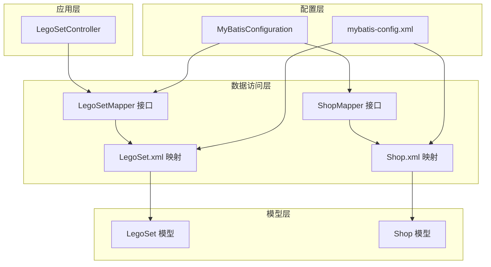
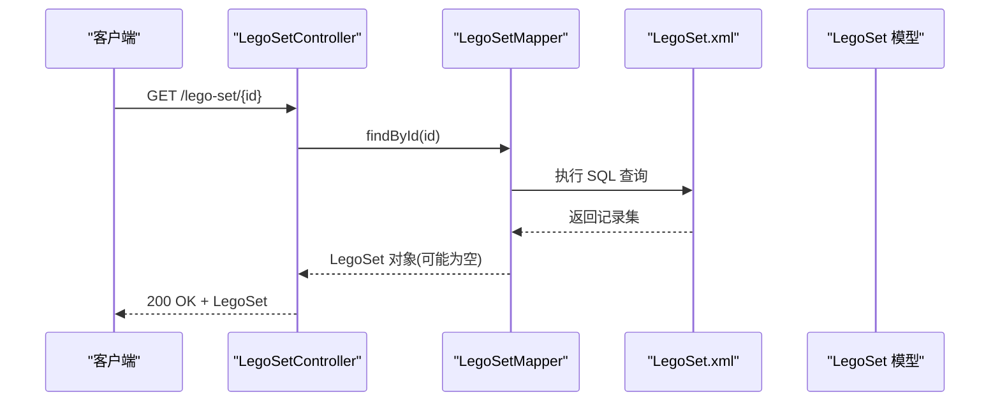
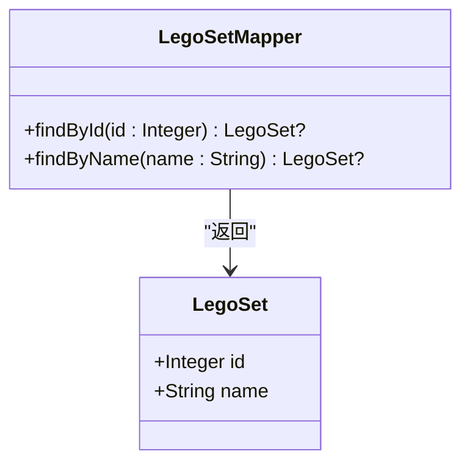
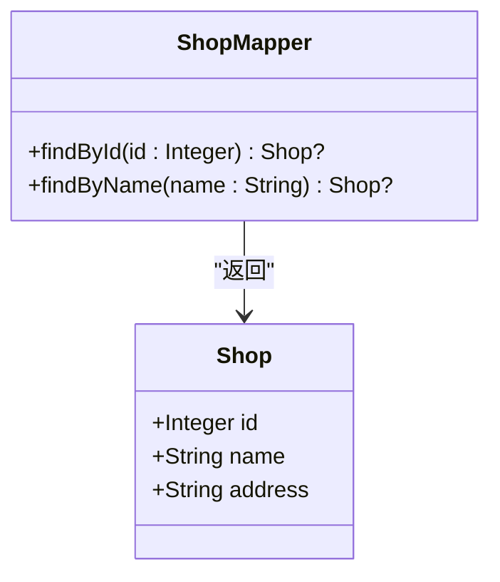
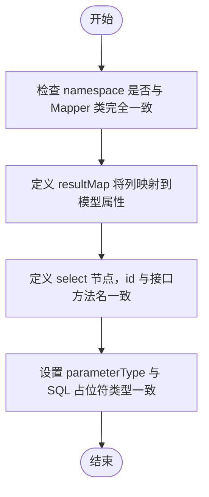
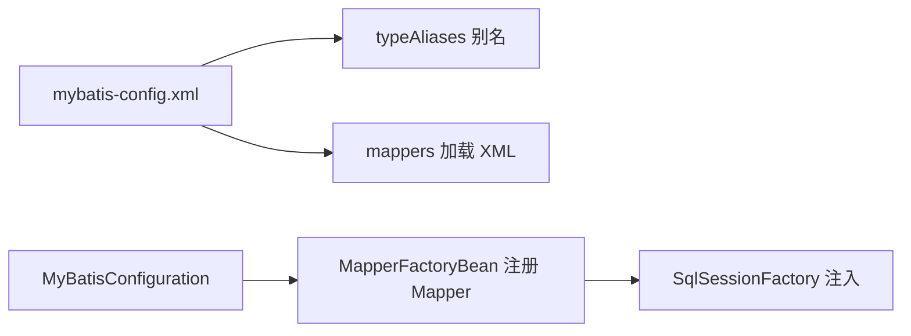
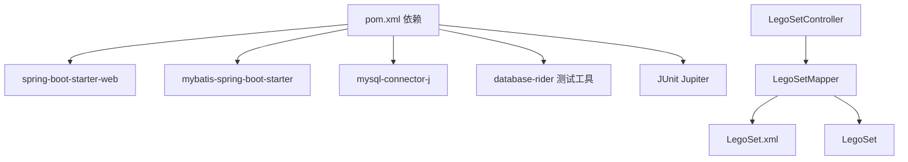

# 数据访问层

<cite>
**本文引用的文件**
- [LegoSetMapper.java](file://src/main/java/org/mvnsearch/mybatis/demo/repo/LegoSetMapper.java)
- [ShopMapper.java](file://src/main/java/org/mvnsearch/mybatis/demo/repo/ShopMapper.java)
- [LegoSet.xml](file://src/main/resources/mapper/LegoSet.xml)
- [Shop.xml](file://src/main/resources/mapper/Shop.xml)
- [MyBatisConfiguration.java](file://src/main/java/org/mvnsearch/mybatis/demo/repo/MyBatisConfiguration.java)
- [mybatis-config.xml](file://src/main/resources/mybatis-config.xml)
- [LegoSet.java](file://src/main/java/org/mvnsearch/mybatis/demo/model/LegoSet.java)
- [Shop.java](file://src/main/java/org/mvnsearch/mybatis/demo/model/Shop.java)
- [LegoSetController.java](file://src/main/java/org/mvnsearch/mybatis/demo/web/LegoSetController.java)
- [LegoSetMapperTest.java](file://src/test/java/org/mvnsearch/mybatis/demo/repo/LegoSetMapperTest.java)
- [ShopMapperTest.java](file://src/test/java/org/mvnsearch/mybatis/demo/repo/ShopMapperTest.java)
- [V1__logo_set.sql](file://src/test/resources/db/migration/V1__logo_set.sql)
- [V2__shop.sql](file://src/test/resources/db/migration/V2__shop.sql)
- [pom.xml](file://pom.xml)
</cite>

## 目录
1. [简介](#简介)
2. [项目结构](#项目结构)
3. [核心组件](#核心组件)
4. [架构总览](#架构总览)
5. [详细组件分析](#详细组件分析)
6. [依赖分析](#依赖分析)
7. [性能考虑](#性能考虑)
8. [故障排查指南](#故障排查指南)
9. [结论](#结论)
10. [附录](#附录)

## 简介
本文件聚焦于数据访问层（DAO）的设计与实现，系统性解析 LegoSetMapper 与 ShopMapper 接口的职责边界、方法签名、返回类型与空值语义；阐述 MyBatis 注解与 XML 映射的使用方式与差异；说明 Mapper 接口与 XML 映射文件之间的协作关系；给出查询方法的参数传递、结果映射与异常处理的最佳实践；并从整体架构视角解释数据访问层与模型层的交互方式及性能优化建议。

## 项目结构
数据访问层位于 repo 包中，采用“接口 + XML 映射”的纯 MyBatis 方式，不使用注解 SQL。模型类位于 model 包，控制器位于 web 包，Spring 配置通过 XML 声明式注册 Mapper。

图表来源
- [LegoSetController.java:1-22](file://src/main/java/org/mvnsearch/mybatis/demo/web/LegoSetController.java#L1-L22)
- [LegoSetMapper.java:1-21](file://src/main/java/org/mvnsearch/mybatis/demo/repo/LegoSetMapper.java#L1-L21)
- [ShopMapper.java:1-21](file://src/main/java/org/mvnsearch/mybatis/demo/repo/ShopMapper.java#L1-L21)
- [LegoSet.xml:1-22](file://src/main/resources/mapper/LegoSet.xml#L1-L22)
- [Shop.xml:1-24](file://src/main/resources/mapper/Shop.xml#L1-L24)
- [MyBatisConfiguration.java:1-25](file://src/main/java/org/mvnsearch/mybatis/demo/repo/MyBatisConfiguration.java#L1-L25)
- [mybatis-config.xml:1-14](file://src/main/resources/mybatis-config.xml#L1-L14)

章节来源
- [LegoSetMapper.java:1-21](file://src/main/java/org/mvnsearch/mybatis/demo/repo/LegoSetMapper.java#L1-L21)
- [ShopMapper.java:1-21](file://src/main/java/org/mvnsearch/mybatis/demo/repo/ShopMapper.java#L1-L21)
- [LegoSet.xml:1-22](file://src/main/resources/mapper/LegoSet.xml#L1-L22)
- [Shop.xml:1-24](file://src/main/resources/mapper/Shop.xml#L1-L24)
- [mybatis-config.xml:1-14](file://src/main/resources/mybatis-config.xml#L1-L14)
- [MyBatisConfiguration.java:1-25](file://src/main/java/org/mvnsearch/mybatis/demo/repo/MyBatisConfiguration.java#L1-L25)

## 核心组件
- LegoSetMapper：定义按主键与名称查询 LegoSet 的方法，返回可空对象，体现“未命中即空”的查询语义。
- ShopMapper：定义按主键与名称查询 Shop 的方法，返回可空对象，保持一致的查询契约。
- XML 映射：为每个 Mapper 提供 SQL 语句、参数类型与结果映射，确保查询行为与数据库表结构对齐。
- 模型类：LegoSet 与 Shop 提供标准的 getter/setter，作为查询结果的承载对象。
- 控制器：LegoSetController 通过注入 LegoSetMapper 实现对外提供 REST 接口。

章节来源
- [LegoSetMapper.java:12-20](file://src/main/java/org/mvnsearch/mybatis/demo/repo/LegoSetMapper.java#L12-L20)
- [ShopMapper.java:12-19](file://src/main/java/org/mvnsearch/mybatis/demo/repo/ShopMapper.java#L12-L19)
- [LegoSet.xml:3-22](file://src/main/resources/mapper/LegoSet.xml#L3-L22)
- [Shop.xml:3-24](file://src/main/resources/mapper/Shop.xml#L3-L24)
- [LegoSet.java:1-23](file://src/main/java/org/mvnsearch/mybatis/demo/model/LegoSet.java#L1-L23)
- [Shop.java:1-32](file://src/main/java/org/mvnsearch/mybatis/demo/model/Shop.java#L1-L32)
- [LegoSetController.java:14-20](file://src/main/java/org/mvnsearch/mybatis/demo/web/LegoSetController.java#L14-L20)

## 架构总览
数据访问层遵循“接口 + XML 映射”的纯 MyBatis 设计，通过 Spring 配置注册 Mapper Bean。控制器通过依赖注入使用 Mapper，完成从数据库到模型对象的映射。

图表来源
- [LegoSetController.java:17-20](file://src/main/java/org/mvnsearch/mybatis/demo/web/LegoSetController.java#L17-L20)
- [LegoSetMapper.java:15-16](file://src/main/java/org/mvnsearch/mybatis/demo/repo/LegoSetMapper.java#L15-L16)
- [LegoSet.xml:10-14](file://src/main/resources/mapper/LegoSet.xml#L10-L14)
- [LegoSet.java:1-23](file://src/main/java/org/mvnsearch/mybatis/demo/model/LegoSet.java#L1-L23)

## 详细组件分析

### LegoSetMapper 分析
- 接口职责：提供按主键与名称查询 LegoSet 的能力，返回可空对象，便于调用方显式处理未命中场景。
- 方法签名与返回类型：
  - findById(Integer): 返回 LegoSet 或 null
  - findByName(String): 返回 LegoSet 或 null
- 空值语义：@Nullable 注解明确返回值可能为空，调用方需进行非空判断。
- 与 XML 的对应关系：XML 中的 select 节点 id 与接口方法名严格一致，参数类型与列名映射由 XML resultMap 定义。

图表来源
- [LegoSetMapper.java:12-20](file://src/main/java/org/mvnsearch/mybatis/demo/repo/LegoSetMapper.java#L12-L20)
- [LegoSet.java:3-22](file://src/main/java/org/mvnsearch/mybatis/demo/model/LegoSet.java#L3-L22)

章节来源
- [LegoSetMapper.java:12-20](file://src/main/java/org/mvnsearch/mybatis/demo/repo/LegoSetMapper.java#L12-L20)
- [LegoSet.xml:3-22](file://src/main/resources/mapper/LegoSet.xml#L3-L22)
- [LegoSet.java:1-23](file://src/main/java/org/mvnsearch/mybatis/demo/model/LegoSet.java#L1-L23)

### ShopMapper 分析
- 接口职责：提供按主键与名称查询 Shop 的能力，返回可空对象，保持与 LegoSetMapper 一致的契约。
- 方法签名与返回类型：
  - findById(Integer): 返回 Shop 或 null
  - findByName(String): 返回 Shop 或 null
- 空值语义：@Nullable 注解明确返回值可能为空，调用方需进行非空判断。
- 与 XML 的对应关系：XML 中的 select 节点 id 与接口方法名严格一致，参数类型与列名映射由 XML resultMap 定义。

图表来源
- [ShopMapper.java:12-19](file://src/main/java/org/mvnsearch/mybatis/demo/repo/ShopMapper.java#L12-L19)
- [Shop.java:3-31](file://src/main/java/org/mvnsearch/mybatis/demo/model/Shop.java#L3-L31)

章节来源
- [ShopMapper.java:12-19](file://src/main/java/org/mvnsearch/mybatis/demo/repo/ShopMapper.java#L12-L19)
- [Shop.xml:3-24](file://src/main/resources/mapper/Shop.xml#L3-L24)
- [Shop.java:1-32](file://src/main/java/org/mvnsearch/mybatis/demo/model/Shop.java#L1-L32)

### XML 映射文件分析
- LegoSet.xml
  - namespace 与 LegoSetMapper 完全一致，确保 MyBatis 能正确关联接口与 SQL。
  - resultMap 定义了列名与属性的映射关系，避免硬编码列别名。
  - select 节点 findById/findByName 与接口方法同名，参数类型与 SQL 参数占位符类型匹配。
- Shop.xml
  - namespace 与 ShopMapper 完全一致，确保 MyBatis 能正确关联接口与 SQL。
  - resultMap 定义了 id/name/address 的列到属性的映射。
  - select 节点 findById/findByName 与接口方法同名，参数类型与 SQL 参数占位符类型匹配。

图表来源
- [LegoSet.xml:3-22](file://src/main/resources/mapper/LegoSet.xml#L3-L22)
- [Shop.xml:3-24](file://src/main/resources/mapper/Shop.xml#L3-L24)

章节来源
- [LegoSet.xml:3-22](file://src/main/resources/mapper/LegoSet.xml#L3-L22)
- [Shop.xml:3-24](file://src/main/resources/mapper/Shop.xml#L3-L24)

### MyBatis 配置与扫描
- mybatis-config.xml
  - 通过 typeAliases 为模型类设置别名，简化 XML 中的类型引用。
  - 通过 mappers 节点声明加载 XML 映射文件，确保 MyBatis 能发现 SQL。
- MyBatisConfiguration
  - 使用 MapperFactoryBean 手动注册 LegoSetMapper 与 ShopMapper，显式注入 SqlSessionFactory。
  - 该方式与基于注解的 @Mapper 扫描不同，强调显式配置。

图表来源
- [mybatis-config.xml:6-13](file://src/main/resources/mybatis-config.xml#L6-L13)
- [MyBatisConfiguration.java:11-23](file://src/main/java/org/mvnsearch/mybatis/demo/repo/MyBatisConfiguration.java#L11-L23)

章节来源
- [mybatis-config.xml:1-14](file://src/main/resources/mybatis-config.xml#L1-L14)
- [MyBatisConfiguration.java:1-25](file://src/main/java/org/mvnsearch/mybatis/demo/repo/MyBatisConfiguration.java#L1-L25)

### 查询方法示例与最佳实践
- 参数传递
  - XML 中使用 #{id:INTEGER} 与 #{name:VARCHAR} 明确 JDBC 类型，避免隐式转换问题。
  - parameterType 与 Java 方法参数类型保持一致，确保 MyBatis 正确绑定。
- 结果映射
  - 通过 resultMap 将数据库列映射到模型属性，避免列名大小写与命名差异导致的映射失败。
- 异常处理
  - Mapper 返回可空对象，调用方需进行非空判断；若需要抛出业务异常，应在上层服务层统一处理。
- 测试验证
  - 单元测试通过 @DataSet 注入测试数据，验证 findById 与 findByName 的正确性。

章节来源
- [LegoSet.xml:10-20](file://src/main/resources/mapper/LegoSet.xml#L10-L20)
- [Shop.xml:11-21](file://src/main/resources/mapper/Shop.xml#L11-L21)
- [LegoSetMapperTest.java:31-42](file://src/test/java/org/mvnsearch/mybatis/demo/repo/LegoSetMapperTest.java#L31-L42)
- [ShopMapperTest.java:16-27](file://src/test/java/org/mvnsearch/mybatis/demo/repo/ShopMapperTest.java#L16-L27)

## 依赖分析
- 组件耦合
  - Mapper 接口与 XML 映射文件强耦合，方法名与 select id 必须一致。
  - 控制器依赖 Mapper 接口，形成清晰的分层。
- 外部依赖
  - Spring Boot Starter 与 MyBatis Spring Boot Starter 提供自动配置与集成。
  - MySQL Connector 提供数据库驱动。
  - Flyway 用于数据库迁移，确保测试环境表结构一致。
- 循环依赖
  - 未发现循环依赖，分层清晰。

图表来源
- [pom.xml:30-101](file://pom.xml#L30-L101)
- [LegoSetController.java:14-20](file://src/main/java/org/mvnsearch/mybatis/demo/web/LegoSetController.java#L14-L20)
- [LegoSetMapper.java:12-20](file://src/main/java/org/mvnsearch/mybatis/demo/repo/LegoSetMapper.java#L12-L20)
- [LegoSet.xml:3-22](file://src/main/resources/mapper/LegoSet.xml#L3-L22)
- [LegoSet.java:1-23](file://src/main/java/org/mvnsearch/mybatis/demo/model/LegoSet.java#L1-L23)

章节来源
- [pom.xml:1-141](file://pom.xml#L1-L141)

## 性能考虑
- SQL 参数类型明确化：在 XML 中为参数指定 JDBC 类型，减少类型推断开销与潜在错误。
- 结果映射复用：通过 resultMap 复用列到属性的映射，降低重复配置与解析成本。
- 最小字段选择：查询时仅选择必要列，减少网络传输与反序列化开销。
- 缓存策略：对于只读查询，可在 XML 中启用二级缓存（需配合合适的缓存策略与失效机制）。
- 连接池与事务：合理配置连接池大小与超时时间，避免长事务占用资源。
- 批量与分页：对于批量查询，优先使用分页查询以控制单次结果集大小。

## 故障排查指南
- “找不到 Mapper”或“无法映射 SQL”
  - 检查 XML namespace 是否与 Mapper 完全一致。
  - 检查 mappers 配置是否正确加载 XML 文件。
  - 检查 MyBatisConfiguration 是否正确注册了 MapperFactoryBean。
- “列名映射失败”
  - 检查 resultMap 中的 column 与 property 是否与数据库列与模型属性一致。
  - 检查数据库列名大小写与命名风格是否与 XML 一致。
- “参数类型不匹配”
  - 检查 XML 中 parameterType 与 Java 方法参数类型是否一致。
  - 检查 SQL 占位符类型声明是否与参数类型匹配。
- “返回空值”
  - Mapper 返回可空对象是预期行为，调用方应进行非空判断。
  - 若期望抛出异常，应在上层服务层统一处理未命中场景。

章节来源
- [mybatis-config.xml:6-13](file://src/main/resources/mybatis-config.xml#L6-L13)
- [LegoSet.xml:3-22](file://src/main/resources/mapper/LegoSet.xml#L3-L22)
- [Shop.xml:3-24](file://src/main/resources/mapper/Shop.xml#L3-L24)
- [MyBatisConfiguration.java:11-23](file://src/main/java/org/mvnsearch/mybatis/demo/repo/MyBatisConfiguration.java#L11-L23)

## 结论
本项目采用“接口 + XML 映射”的纯 MyBatis 设计，LegoSetMapper 与 ShopMapper 通过清晰的方法契约与 XML 映射实现稳定的数据库访问。通过明确的参数类型、结果映射与可空返回语义，结合 Spring 配置与测试验证，形成了可维护、可扩展的数据访问层。建议在实际项目中进一步引入缓存、分页与批量处理等优化手段，并在服务层统一处理异常与业务逻辑。

## 附录
- 表结构参考
  - LegoSet 表包含 id（主键）、name 字段。
  - Shop 表包含 id（主键）、name、address 字段。
- 关键实现路径
  - Mapper 接口：[LegoSetMapper.java:12-20](file://src/main/java/org/mvnsearch/mybatis/demo/repo/LegoSetMapper.java#L12-L20)，[ShopMapper.java:12-19](file://src/main/java/org/mvnsearch/mybatis/demo/repo/ShopMapper.java#L12-L19)
  - XML 映射：[LegoSet.xml:3-22](file://src/main/resources/mapper/LegoSet.xml#L3-L22)，[Shop.xml:3-24](file://src/main/resources/mapper/Shop.xml#L3-L24)
  - 配置文件：[mybatis-config.xml:1-14](file://src/main/resources/mybatis-config.xml#L1-L14)，[MyBatisConfiguration.java:1-25](file://src/main/java/org/mvnsearch/mybatis/demo/repo/MyBatisConfiguration.java#L1-L25)
  - 模型类：[LegoSet.java:1-23](file://src/main/java/org/mvnsearch/mybatis/demo/model/LegoSet.java#L1-L23)，[Shop.java:1-32](file://src/main/java/org/mvnsearch/mybatis/demo/model/Shop.java#L1-L32)
  - 控制器：[LegoSetController.java:1-22](file://src/main/java/org/mvnsearch/mybatis/demo/web/LegoSetController.java#L1-L22)
  - 测试用例：[LegoSetMapperTest.java:1-45](file://src/test/java/org/mvnsearch/mybatis/demo/repo/LegoSetMapperTest.java#L1-L45)，[ShopMapperTest.java:1-30](file://src/test/java/org/mvnsearch/mybatis/demo/repo/ShopMapperTest.java#L1-L30)
  - 数据库迁移：[V1__logo_set.sql:1-6](file://src/test/resources/db/migration/V1__logo_set.sql#L1-L6)，[V2__shop.sql:1-7](file://src/test/resources/db/migration/V2__shop.sql#L1-L7)