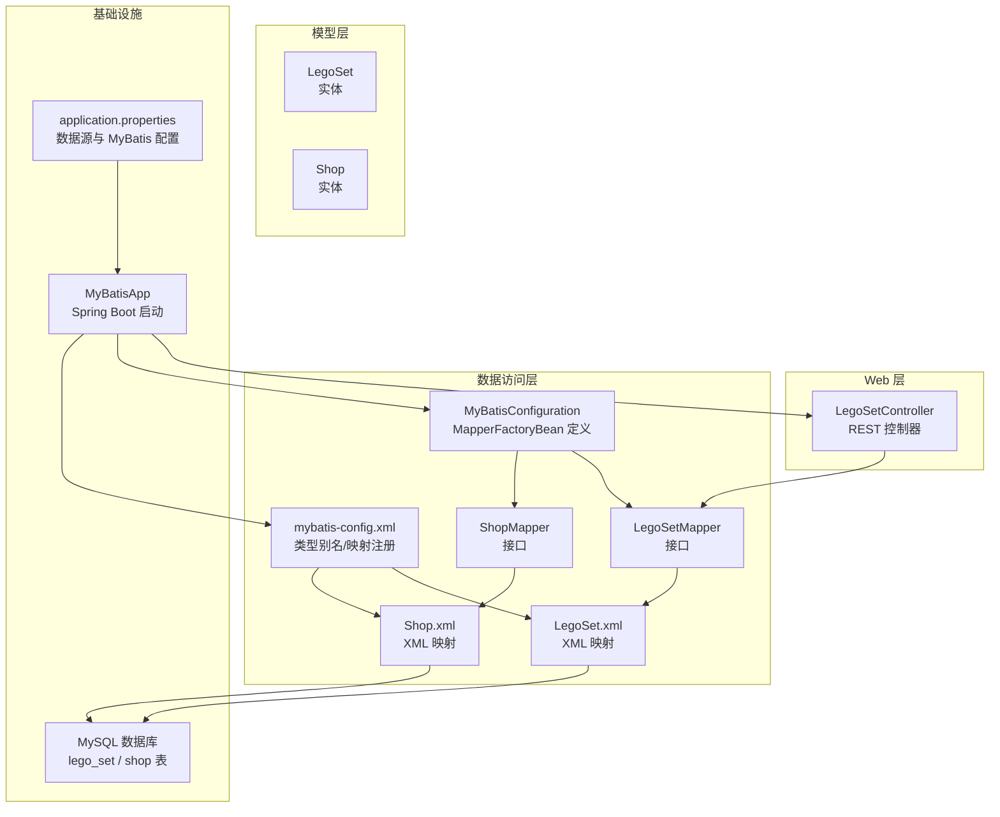
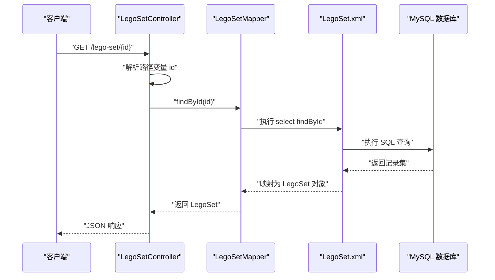
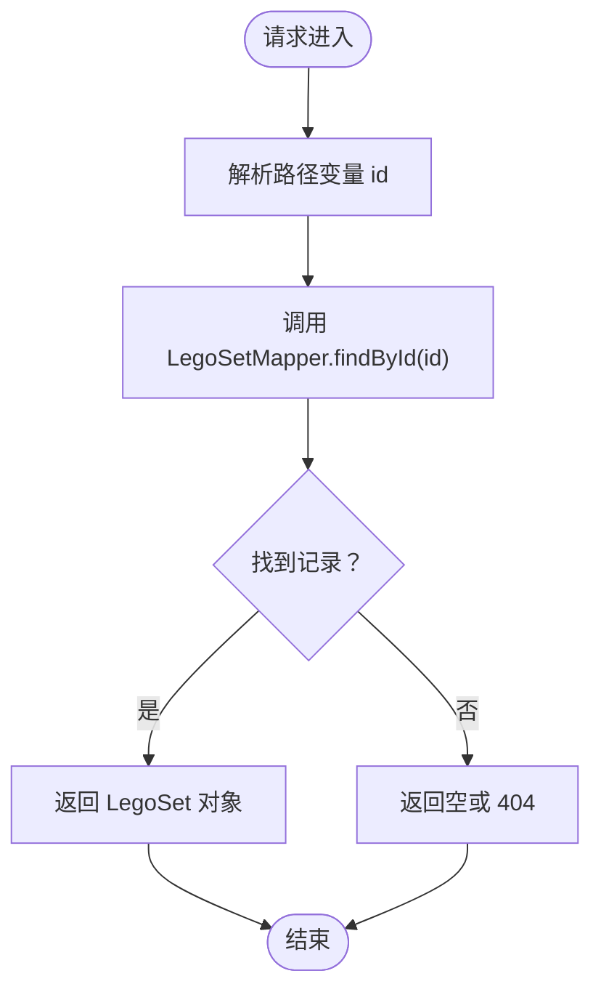
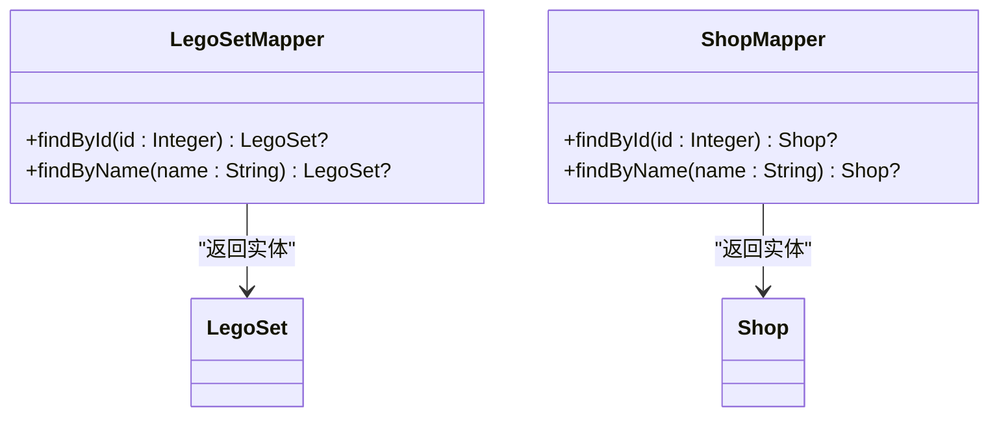
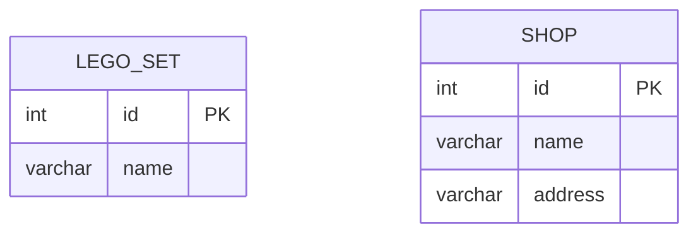
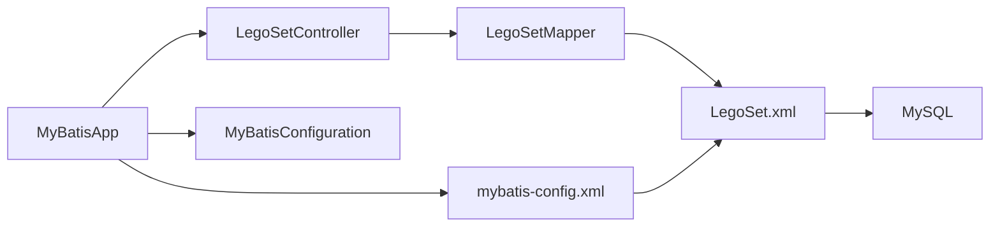

# 核心模块

<cite>
**本文引用的文件**
- [LegoSetController.java](file://src/main/java/org/mvnsearch/mybatis/demo/web/LegoSetController.java)
- [LegoSetMapper.java](file://src/main/java/org/mvnsearch/mybatis/demo/repo/LegoSetMapper.java)
- [ShopMapper.java](file://src/main/java/org/mvnsearch/mybatis/demo/repo/ShopMapper.java)
- [LegoSet.java](file://src/main/java/org/mvnsearch/mybatis/demo/model/LegoSet.java)
- [Shop.java](file://src/main/java/org/mvnsearch/mybatis/demo/model/Shop.java)
- [LegoSet.xml](file://src/main/resources/mapper/LegoSet.xml)
- [Shop.xml](file://src/main/resources/mapper/Shop.xml)
- [mybatis-config.xml](file://src/main/resources/mybatis-config.xml)
- [MyBatisConfiguration.java](file://src/main/java/org/mvnsearch/mybatis/demo/repo/MyBatisConfiguration.java)
- [MyBatisApp.java](file://src/main/java/org/mvnsearch/mybatis/demo/MyBatisApp.java)
- [application.properties](file://src/main/resources/application.properties)
- [LegoSetMapperTest.java](file://src/test/java/org/mvnsearch/mybatis/demo/repo/LegoSetMapperTest.java)
- [ShopMapperTest.java](file://src/test/java/org/mvnsearch/mybatis/demo/repo/ShopMapperTest.java)
- [ProjectBaseTest.java](file://src/test/java/org/mvnsearch/mybatis/demo/ProjectBaseTest.java)
- [V1__logo_set.sql](file://src/test/resources/db/migration/V1__logo_set.sql)
- [V2__shop.sql](file://src/test/resources/db/migration/V2__shop.sql)
- [pom.xml](file://pom.xml)
</cite>

## 目录
1. [简介](#简介)
2. [项目结构](#项目结构)
3. [核心组件](#核心组件)
4. [架构总览](#架构总览)
5. [详细组件分析](#详细组件分析)
6. [依赖分析](#依赖分析)
7. [性能考虑](#性能考虑)
8. [故障排查指南](#故障排查指南)
9. [结论](#结论)
10. [附录](#附录)

## 简介
本文件聚焦于核心模块的三层架构：Web 控制器层、数据访问层与模型层。重点覆盖以下内容：
- Web 层：LegoSetController 的 REST API 设计与实现（HTTP 方法、URL 模式、请求/响应处理）
- 数据访问层：LegoSetMapper 与 ShopMapper 接口的设计原则、数据库操作方法与 MyBatis 注解/XML 映射
- 模型层：LegoSet 与 Shop 实体类的属性映射与业务规则
- 层间依赖与交互方式、错误处理与参数验证建议、性能优化最佳实践
- 提供具体代码示例路径与使用模式，帮助快速理解与扩展

## 项目结构
该项目采用 Spring Boot + MyBatis 的分层组织方式：
- model：领域模型（LegoSet、Shop）
- repo：数据访问接口与 XML 映射、MyBatis 配置与扫描
- web：Spring MVC 控制器（LegoSetController）
- resources：MyBatis 配置、SQL 映射文件、应用配置
- test：集成测试与数据库迁移脚本

图表来源
- [LegoSetController.java:1-22](file://src/main/java/org/mvnsearch/mybatis/demo/web/LegoSetController.java#L1-L22)
- [LegoSetMapper.java:1-21](file://src/main/java/org/mvnsearch/mybatis/demo/repo/LegoSetMapper.java#L1-L21)
- [ShopMapper.java:1-21](file://src/main/java/org/mvnsearch/mybatis/demo/repo/ShopMapper.java#L1-L21)
- [LegoSet.xml:1-22](file://src/main/resources/mapper/LegoSet.xml#L1-L22)
- [Shop.xml:1-24](file://src/main/resources/mapper/Shop.xml#L1-L24)
- [mybatis-config.xml:1-14](file://src/main/resources/mybatis-config.xml#L1-L14)
- [MyBatisConfiguration.java:1-25](file://src/main/java/org/mvnsearch/mybatis/demo/repo/MyBatisConfiguration.java#L1-L25)
- [MyBatisApp.java:1-17](file://src/main/java/org/mvnsearch/mybatis/demo/MyBatisApp.java#L1-L17)
- [application.properties:1-11](file://src/main/resources/application.properties#L1-L11)

章节来源
- [MyBatisApp.java:1-17](file://src/main/java/org/mvnsearch/mybatis/demo/MyBatisApp.java#L1-L17)
- [application.properties:1-11](file://src/main/resources/application.properties#L1-L11)
- [mybatis-config.xml:1-14](file://src/main/resources/mybatis-config.xml#L1-L14)
- [MyBatisConfiguration.java:1-25](file://src/main/java/org/mvnsearch/mybatis/demo/repo/MyBatisConfiguration.java#L1-L25)

## 核心组件
- Web 控制器：LegoSetController 提供基于路径变量的 GET 接口，返回 LegoSet 实体
- 数据访问接口：LegoSetMapper 与 ShopMapper 均为 MyBatis Mapper 接口，定义按主键与名称查询的方法
- XML 映射：LegoSet.xml 与 Shop.xml 定义 resultMap 与 SQL 查询，完成数据库字段到实体属性的映射
- 模型实体：LegoSet 与 Shop 为简单 Java Bean，包含 id、name 及可选 address 字段
- 配置与启动：application.properties 指定数据源与 MyBatis 配置；mybatis-config.xml 注册类型别名与 XML 映射；MyBatisConfiguration 使用 MapperFactoryBean 手工装配 Mapper

章节来源
- [LegoSetController.java:1-22](file://src/main/java/org/mvnsearch/mybatis/demo/web/LegoSetController.java#L1-L22)
- [LegoSetMapper.java:1-21](file://src/main/java/org/mvnsearch/mybatis/demo/repo/LegoSetMapper.java#L1-L21)
- [ShopMapper.java:1-21](file://src/main/java/org/mvnsearch/mybatis/demo/repo/ShopMapper.java#L1-L21)
- [LegoSet.xml:1-22](file://src/main/resources/mapper/LegoSet.xml#L1-L22)
- [Shop.xml:1-24](file://src/main/resources/mapper/Shop.xml#L1-L24)
- [LegoSet.java:1-23](file://src/main/java/org/mvnsearch/mybatis/demo/model/LegoSet.java#L1-L23)
- [Shop.java:1-32](file://src/main/java/org/mvnsearch/mybatis/demo/model/Shop.java#L1-L32)
- [mybatis-config.xml:1-14](file://src/main/resources/mybatis-config.xml#L1-L14)
- [MyBatisConfiguration.java:1-25](file://src/main/java/org/mvnsearch/mybatis/demo/repo/MyBatisConfiguration.java#L1-L25)
- [application.properties:1-11](file://src/main/resources/application.properties#L1-L11)

## 架构总览
下图展示从 Web 请求到数据库查询再到对象返回的整体流程。

图表来源
- [LegoSetController.java:17-20](file://src/main/java/org/mvnsearch/mybatis/demo/web/LegoSetController.java#L17-L20)
- [LegoSetMapper.java:15-16](file://src/main/java/org/mvnsearch/mybatis/demo/repo/LegoSetMapper.java#L15-L16)
- [LegoSet.xml:10-14](file://src/main/resources/mapper/LegoSet.xml#L10-L14)

## 详细组件分析

### Web 控制器层：LegoSetController
- REST 设计
  - 路径前缀：/lego-set
  - 方法：GET
  - 路径变量：id（Integer）
  - 返回值：LegoSet 实体
- 处理流程
  - 控制器接收路径变量 id
  - 调用 LegoSetMapper.findById(id)
  - 将结果直接作为响应体返回（Spring MVC 自动序列化为 JSON）

图表来源
- [LegoSetController.java:17-20](file://src/main/java/org/mvnsearch/mybatis/demo/web/LegoSetController.java#L17-L20)
- [LegoSetMapper.java:15-16](file://src/main/java/org/mvnsearch/mybatis/demo/repo/LegoSetMapper.java#L15-L16)

章节来源
- [LegoSetController.java:1-22](file://src/main/java/org/mvnsearch/mybatis/demo/web/LegoSetController.java#L1-L22)

### 数据访问层：LegoSetMapper 与 ShopMapper
- 设计原则
  - 接口即 Mapper：通过 MyBatis 注解或 XML 映射自动实现
  - 返回类型标注：使用 @Nullable 标注可能返回空值的方法，便于上层处理
  - 方法命名：遵循 findByXxx 惯例，支持按主键与名称查询
- 数据库操作方法
  - LegoSetMapper：findById(Integer)、findByName(String)
  - ShopMapper：findById(Integer)、findByName(String)
- 与 XML 的绑定
  - LegoSet.xml：定义 LegoSet 结果映射与两条查询语句
  - Shop.xml：定义 Shop 结果映射与两条查询语句
- 配置方式
  - mybatis-config.xml 中注册 XML 映射文件
  - MyBatisConfiguration 使用 MapperFactoryBean 手工装配 Mapper Bean

图表来源
- [LegoSetMapper.java:12-20](file://src/main/java/org/mvnsearch/mybatis/demo/repo/LegoSetMapper.java#L12-L20)
- [ShopMapper.java:12-20](file://src/main/java/org/mvnsearch/mybatis/demo/repo/ShopMapper.java#L12-L20)
- [LegoSet.java:1-23](file://src/main/java/org/mvnsearch/mybatis/demo/model/LegoSet.java#L1-L23)
- [Shop.java:1-32](file://src/main/java/org/mvnsearch/mybatis/demo/model/Shop.java#L1-L32)

章节来源
- [LegoSetMapper.java:1-21](file://src/main/java/org/mvnsearch/mybatis/demo/repo/LegoSetMapper.java#L1-L21)
- [ShopMapper.java:1-21](file://src/main/java/org/mvnsearch/mybatis/demo/repo/ShopMapper.java#L1-L21)
- [LegoSet.xml:1-22](file://src/main/resources/mapper/LegoSet.xml#L1-L22)
- [Shop.xml:1-24](file://src/main/resources/mapper/Shop.xml#L1-L24)
- [mybatis-config.xml:1-14](file://src/main/resources/mybatis-config.xml#L1-L14)
- [MyBatisConfiguration.java:1-25](file://src/main/java/org/mvnsearch/mybatis/demo/repo/MyBatisConfiguration.java#L1-L25)

### 模型层：LegoSet 与 Shop
- LegoSet
  - 字段：id（整数主键）、name（字符串）
  - 规则：简单实体，无复杂业务校验逻辑
- Shop
  - 字段：id（整数主键）、name（字符串）、address（字符串）
  - 规则：简单实体，无复杂业务校验逻辑
- 映射关系
  - LegoSet.xml 与 Shop.xml 的 resultMap 将数据库列映射到实体属性
  - 别名在 mybatis-config.xml 中注册，简化 XML 中的类型引用

图表来源
- [LegoSet.xml:5-8](file://src/main/resources/mapper/LegoSet.xml#L5-L8)
- [Shop.xml:5-9](file://src/main/resources/mapper/Shop.xml#L5-L9)
- [mybatis-config.xml:6-9](file://src/main/resources/mybatis-config.xml#L6-L9)

章节来源
- [LegoSet.java:1-23](file://src/main/java/org/mvnsearch/mybatis/demo/model/LegoSet.java#L1-L23)
- [Shop.java:1-32](file://src/main/java/org/mvnsearch/mybatis/demo/model/Shop.java#L1-L32)
- [LegoSet.xml:1-22](file://src/main/resources/mapper/LegoSet.xml#L1-L22)
- [Shop.xml:1-24](file://src/main/resources/mapper/Shop.xml#L1-L24)
- [mybatis-config.xml:1-14](file://src/main/resources/mybatis-config.xml#L1-L14)

### MyBatis 注解与 XML 映射
- 注解方式
  - @Mapper 标记接口为 MyBatis Mapper
  - @Nullable 标注可能返回空值的方法
- XML 映射
  - namespace 与接口全限定名一致
  - resultMap 定义列到属性的映射
  - select 节点定义 SQL 与参数类型
- 类型别名与扫描
  - mybatis-config.xml 中通过 typeAliases 为实体设置别名
  - mappers 节点注册 XML 映射文件
- 手工装配
  - MyBatisConfiguration 使用 MapperFactoryBean 将接口注入到 Spring 容器

章节来源
- [LegoSetMapper.java:12-20](file://src/main/java/org/mvnsearch/mybatis/demo/repo/LegoSetMapper.java#L12-L20)
- [ShopMapper.java:12-20](file://src/main/java/org/mvnsearch/mybatis/demo/repo/ShopMapper.java#L12-L20)
- [LegoSet.xml:3-20](file://src/main/resources/mapper/LegoSet.xml#L3-L20)
- [Shop.xml:3-21](file://src/main/resources/mapper/Shop.xml#L3-L21)
- [mybatis-config.xml:6-13](file://src/main/resources/mybatis-config.xml#L6-L13)
- [MyBatisConfiguration.java:11-23](file://src/main/java/org/mvnsearch/mybatis/demo/repo/MyBatisConfiguration.java#L11-L23)

### 使用模式与示例路径
- Web 层调用示例
  - GET /lego-set/{id}：LegoSetController.getLegoSet
    - 示例路径：[LegoSetController.java:17-20](file://src/main/java/org/mvnsearch/mybatis/demo/web/LegoSetController.java#L17-L20)
- 数据访问层调用示例
  - LegoSetMapper.findById(id)：LegoSet.xml.select[@id="findById"]
    - 示例路径：[LegoSet.xml:10-14](file://src/main/resources/mapper/LegoSet.xml#L10-L14)
  - LegoSetMapper.findByName(name)：LegoSet.xml.select[@id="findByName"]
    - 示例路径：[LegoSet.xml:16-20](file://src/main/resources/mapper/LegoSet.xml#L16-L20)
  - ShopMapper.findById(id)：Shop.xml.select[@id="findById"]
    - 示例路径：[Shop.xml:11-15](file://src/main/resources/mapper/Shop.xml#L11-L15)
  - ShopMapper.findByName(name)：Shop.xml.select[@id="findByName"]
    - 示例路径：[Shop.xml:17-21](file://src/main/resources/mapper/Shop.xml#L17-L21)
- 测试用例参考
  - LegoSetMapperTest：验证 findById 与 findByName
    - 示例路径：[LegoSetMapperTest.java:32-42](file://src/test/java/org/mvnsearch/mybatis/demo/repo/LegoSetMapperTest.java#L32-L42)
  - ShopMapperTest：验证 findById 与 findByName
    - 示例路径：[ShopMapperTest.java:17-27](file://src/test/java/org/mvnsearch/mybatis/demo/repo/ShopMapperTest.java#L17-L27)
- 基础设施配置
  - application.properties：数据源与 MyBatis 配置位置
    - 示例路径：[application.properties:1-11](file://src/main/resources/application.properties#L1-L11)
  - mybatis-config.xml：类型别名与 XML 映射注册
    - 示例路径：[mybatis-config.xml:6-13](file://src/main/resources/mybatis-config.xml#L6-L13)
  - MyBatisConfiguration：MapperFactoryBean 定义
    - 示例路径：[MyBatisConfiguration.java:11-23](file://src/main/java/org/mvnsearch/mybatis/demo/repo/MyBatisConfiguration.java#L11-L23)

章节来源
- [LegoSetController.java:17-20](file://src/main/java/org/mvnsearch/mybatis/demo/web/LegoSetController.java#L17-L20)
- [LegoSetMapper.java:15-19](file://src/main/java/org/mvnsearch/mybatis/demo/repo/LegoSetMapper.java#L15-L19)
- [ShopMapper.java:15-19](file://src/main/java/org/mvnsearch/mybatis/demo/repo/ShopMapper.java#L15-L19)
- [LegoSet.xml:10-20](file://src/main/resources/mapper/LegoSet.xml#L10-L20)
- [Shop.xml:11-21](file://src/main/resources/mapper/Shop.xml#L11-L21)
- [LegoSetMapperTest.java:32-42](file://src/test/java/org/mvnsearch/mybatis/demo/repo/LegoSetMapperTest.java#L32-L42)
- [ShopMapperTest.java:17-27](file://src/test/java/org/mvnsearch/mybatis/demo/repo/ShopMapperTest.java#L17-L27)
- [application.properties:1-11](file://src/main/resources/application.properties#L1-L11)
- [mybatis-config.xml:6-13](file://src/main/resources/mybatis-config.xml#L6-L13)
- [MyBatisConfiguration.java:11-23](file://src/main/java/org/mvnsearch/mybatis/demo/repo/MyBatisConfiguration.java#L11-L23)

## 依赖分析
- 组件耦合
  - LegoSetController 仅依赖 LegoSetMapper 接口，低耦合高内聚
  - LegoSetMapper 与 ShopMapper 依赖各自 XML 映射文件，接口与实现分离清晰
- 直接依赖链
  - 控制器 -> Mapper 接口 -> XML 映射 -> 数据库
  - 配置 -> 类型别名 -> 实体类
- 外部依赖
  - Spring Boot Starter Web、MyBatis Spring Boot Starter、MySQL Connector、Flyway、DBUnit/Rider

图表来源
- [LegoSetController.java:14-15](file://src/main/java/org/mvnsearch/mybatis/demo/web/LegoSetController.java#L14-L15)
- [LegoSetMapper.java:12-16](file://src/main/java/org/mvnsearch/mybatis/demo/repo/LegoSetMapper.java#L12-L16)
- [LegoSet.xml:3-8](file://src/main/resources/mapper/LegoSet.xml#L3-L8)
- [mybatis-config.xml:6-13](file://src/main/resources/mybatis-config.xml#L6-L13)
- [MyBatisConfiguration.java:11-16](file://src/main/java/org/mvnsearch/mybatis/demo/repo/MyBatisConfiguration.java#L11-L16)
- [MyBatisApp.java:11-15](file://src/main/java/org/mvnsearch/mybatis/demo/MyBatisApp.java#L11-L15)

章节来源
- [pom.xml:30-101](file://pom.xml#L30-L101)

## 性能考虑
- SQL 选择性与索引
  - 按主键查询通常高效；如需按 name 查询，建议在数据库表上为 name 字段建立索引
- 结果映射最小化
  - 仅选择需要的列，避免使用 SELECT *
- 缓存策略
  - 可结合 MyBatis 缓存或 Spring Cache 在业务层缓存热点数据
- 分页与批量
  - 对大数据量场景，优先使用分页查询与批量加载
- 连接池与超时
  - 合理配置连接池大小与查询超时，避免长事务占用资源

## 故障排查指南
- 常见问题定位
  - 404/空结果：确认路径变量 id 是否正确传递，Mapper 方法是否存在
  - 500 错误：检查 XML 中的列名与实体属性是否匹配，SQL 语法是否正确
  - 连接失败：核对 application.properties 中的数据源配置
- 单元测试辅助
  - 使用数据库迁移脚本初始化表结构
    - LegoSet 表：[V1__logo_set.sql:1-6](file://src/test/resources/db/migration/V1__logo_set.sql#L1-L6)
    - Shop 表：[V2__shop.sql:1-7](file://src/test/resources/db/migration/V2__shop.sql#L1-L7)
  - 使用 DBUnit/Rider 注入测试数据，验证 Mapper 行为
    - 测试基类：[ProjectBaseTest.java:15-21](file://src/test/java/org/mvnsearch/mybatis/demo/ProjectBaseTest.java#L15-L21)
    - LegoSet 测试：[LegoSetMapperTest.java:26-42](file://src/test/java/org/mvnsearch/mybatis/demo/repo/LegoSetMapperTest.java#L26-L42)
    - Shop 测试：[ShopMapperTest.java:11-27](file://src/test/java/org/mvnsearch/mybatis/demo/repo/ShopMapperTest.java#L11-L27)

章节来源
- [application.properties:1-11](file://src/main/resources/application.properties#L1-L11)
- [V1__logo_set.sql:1-6](file://src/test/resources/db/migration/V1__logo_set.sql#L1-L6)
- [V2__shop.sql:1-7](file://src/test/resources/db/migration/V2__shop.sql#L1-L7)
- [ProjectBaseTest.java:15-21](file://src/test/java/org/mvnsearch/mybatis/demo/ProjectBaseTest.java#L15-L21)
- [LegoSetMapperTest.java:32-42](file://src/test/java/org/mvnsearch/mybatis/demo/repo/LegoSetMapperTest.java#L32-L42)
- [ShopMapperTest.java:17-27](file://src/test/java/org/mvnsearch/mybatis/demo/repo/ShopMapperTest.java#L17-L27)

## 结论
本核心模块以简洁清晰的方式实现了 Web 控制器、数据访问与模型的分层职责。通过 MyBatis 的注解与 XML 映射，实现了接口与 SQL 的解耦，并借助 Spring Boot 的自动配置与手工装配机制，完成了从请求到数据库查询再到对象返回的完整链路。建议在后续迭代中补充参数校验、异常处理与缓存策略，以进一步提升健壮性与性能。

## 附录
- 关键配置与文件清单
  - 应用启动：[MyBatisApp.java:11-15](file://src/main/java/org/mvnsearch/mybatis/demo/MyBatisApp.java#L11-L15)
  - 数据源与 MyBatis 配置：[application.properties:1-11](file://src/main/resources/application.properties#L1-L11)
  - 类型别名与映射注册：[mybatis-config.xml:6-13](file://src/main/resources/mybatis-config.xml#L6-L13)
  - Mapper 工厂装配：[MyBatisConfiguration.java:11-23](file://src/main/java/org/mvnsearch/mybatis/demo/repo/MyBatisConfiguration.java#L11-L23)
  - LegoSet 映射：[LegoSet.xml:3-20](file://src/main/resources/mapper/LegoSet.xml#L3-L20)
  - Shop 映射：[Shop.xml:3-21](file://src/main/resources/mapper/Shop.xml#L3-L21)
  - 测试基类与用例：[ProjectBaseTest.java:15-21](file://src/test/java/org/mvnsearch/mybatis/demo/ProjectBaseTest.java#L15-L21)，[LegoSetMapperTest.java:26-42](file://src/test/java/org/mvnsearch/mybatis/demo/repo/LegoSetMapperTest.java#L26-L42)，[ShopMapperTest.java:11-27](file://src/test/java/org/mvnsearch/mybatis/demo/repo/ShopMapperTest.java#L11-L27)
  - 数据库迁移脚本：[V1__logo_set.sql:1-6](file://src/test/resources/db/migration/V1__logo_set.sql#L1-L6)，[V2__shop.sql:1-7](file://src/test/resources/db/migration/V2__shop.sql#L1-L7)