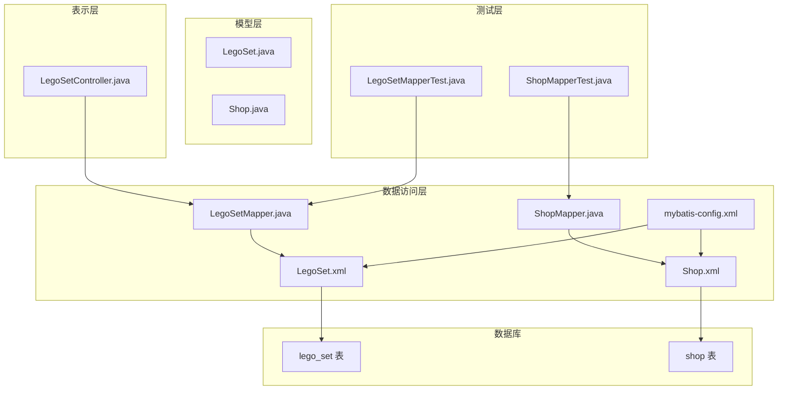
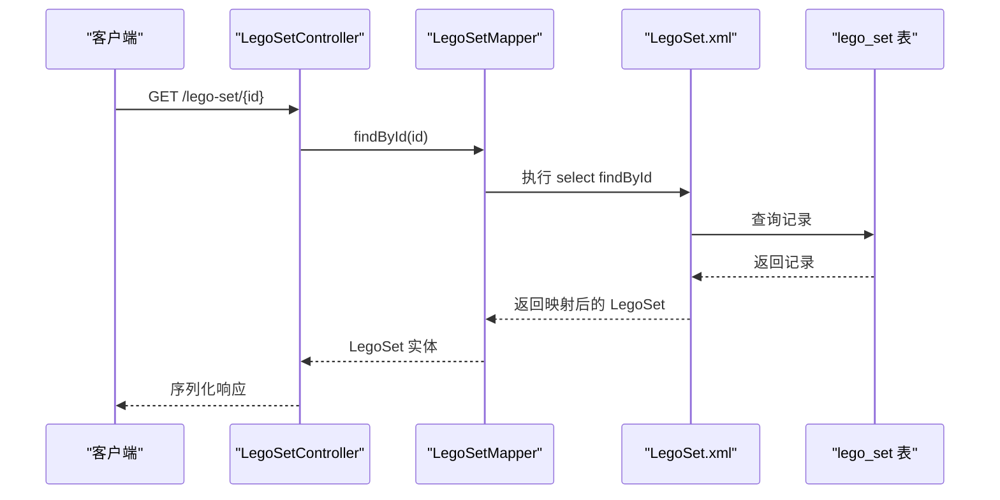
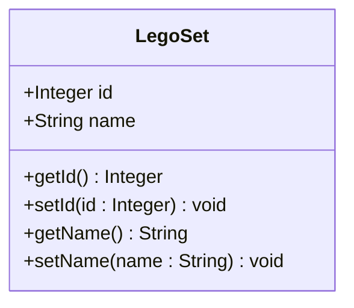
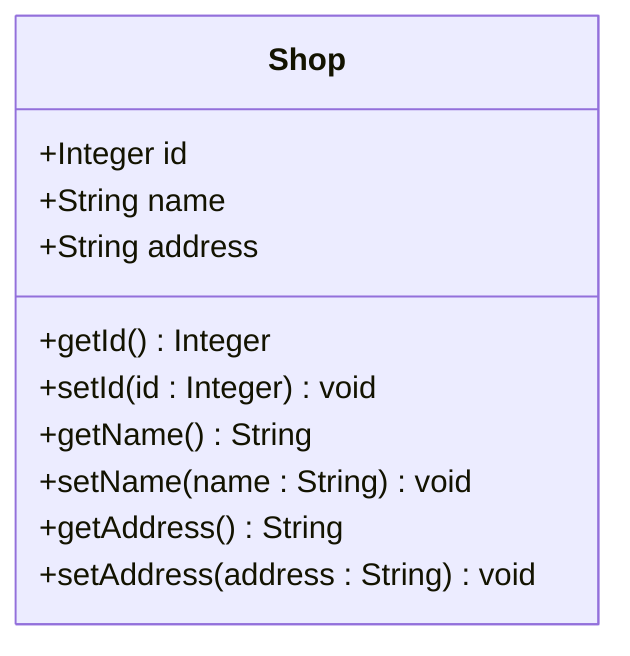
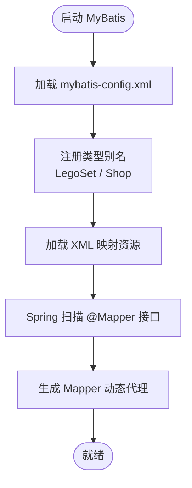
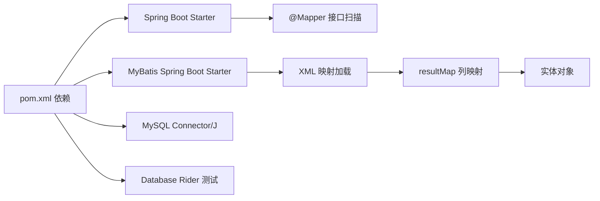

# 模型层

<cite>
**本文引用的文件**
- [LegoSet.java](file://src/main/java/org/mvnsearch/mybatis/demo/model/LegoSet.java)
- [Shop.java](file://src/main/java/org/mvnsearch/mybatis/demo/model/Shop.java)
- [LegoSetMapper.java](file://src/main/java/org/mvnsearch/mybatis/demo/repo/LegoSetMapper.java)
- [ShopMapper.java](file://src/main/java/org/mvnsearch/mybatis/demo/repo/ShopMapper.java)
- [LegoSet.xml](file://src/main/resources/mapper/LegoSet.xml)
- [Shop.xml](file://src/main/resources/mapper/Shop.xml)
- [mybatis-config.xml](file://src/main/resources/mybatis-config.xml)
- [V1__logo_set.sql](file://src/test/resources/db/migration/V1__logo_set.sql)
- [V2__shop.sql](file://src/test/resources/db/migration/V2__shop.sql)
- [LegoSetController.java](file://src/main/java/org/mvnsearch/mybatis/demo/web/LegoSetController.java)
- [LegoSetMapperTest.java](file://src/test/java/org/mvnsearch/mybatis/demo/repo/LegoSetMapperTest.java)
- [ShopMapperTest.java](file://src/test/java/org/mvnsearch/mybatis/demo/repo/ShopMapperTest.java)
- [pom.xml](file://pom.xml)
</cite>

## 目录
1. [简介](#简介)
2. [项目结构](#项目结构)
3. [核心组件](#核心组件)
4. [架构总览](#架构总览)
5. [详细组件分析](#详细组件分析)
6. [依赖分析](#依赖分析)
7. [性能考虑](#性能考虑)
8. [故障排除指南](#故障排除指南)
9. [结论](#结论)
10. [附录](#附录)

## 简介
本文件聚焦于模型层（Model Layer）的设计与实现，围绕两个核心实体类 LegoSet 与 Shop 的属性定义、Getter/Setter 方法、构造函数、MyBatis 注解与 XML 映射、数据库表结构对应关系、ORM 映射机制、使用示例与最佳实践展开。文档同时说明实体类在整个应用架构中的地位与与 Web 层、持久层的交互方式，并给出数据验证、业务封装与序列化处理的建议与落点位置。

## 项目结构
该工程采用 Spring Boot + MyBatis 的分层架构：
- 模型层：实体类（LegoSet、Shop）
- 数据访问层：Mapper 接口（LegoSetMapper、ShopMapper）+ XML 映射
- 表示层：控制器（LegoSetController）
- 配置层：MyBatis 全局配置、Mapper XML 资源注册
- 测试层：基于数据库迁移脚本与数据集的集成测试

图表来源
- [LegoSet.java:1-23](file://src/main/java/org/mvnsearch/mybatis/demo/model/LegoSet.java#L1-L23)
- [Shop.java:1-32](file://src/main/java/org/mvnsearch/mybatis/demo/model/Shop.java#L1-L32)
- [LegoSetMapper.java:1-21](file://src/main/java/org/mvnsearch/mybatis/demo/repo/LegoSetMapper.java#L1-L21)
- [ShopMapper.java:1-21](file://src/main/java/org/mvnsearch/mybatis/demo/repo/ShopMapper.java#L1-L21)
- [LegoSet.xml:1-22](file://src/main/resources/mapper/LegoSet.xml#L1-L22)
- [Shop.xml:1-24](file://src/main/resources/mapper/Shop.xml#L1-L24)
- [mybatis-config.xml:1-14](file://src/main/resources/mybatis-config.xml#L1-L14)
- [V1__logo_set.sql:1-6](file://src/test/resources/db/migration/V1__logo_set.sql#L1-L6)
- [V2__shop.sql:1-7](file://src/test/resources/db/migration/V2__shop.sql#L1-L7)

章节来源
- [LegoSet.java:1-23](file://src/main/java/org/mvnsearch/mybatis/demo/model/LegoSet.java#L1-L23)
- [Shop.java:1-32](file://src/main/java/org/mvnsearch/mybatis/demo/model/Shop.java#L1-L32)
- [LegoSetMapper.java:1-21](file://src/main/java/org/mvnsearch/mybatis/demo/repo/LegoSetMapper.java#L1-L21)
- [ShopMapper.java:1-21](file://src/main/java/org/mvnsearch/mybatis/demo/repo/ShopMapper.java#L1-L21)
- [LegoSet.xml:1-22](file://src/main/resources/mapper/LegoSet.xml#L1-L22)
- [Shop.xml:1-24](file://src/main/resources/mapper/Shop.xml#L1-L24)
- [mybatis-config.xml:1-14](file://src/main/resources/mybatis-config.xml#L1-L14)
- [V1__logo_set.sql:1-6](file://src/test/resources/db/migration/V1__logo_set.sql#L1-L6)
- [V2__shop.sql:1-7](file://src/test/resources/db/migration/V2__shop.sql#L1-L7)

## 核心组件
本项目模型层包含两个实体类：
- LegoSet：代表乐高套装，包含 id、name 字段
- Shop：代表商店，包含 id、name、address 字段

每个实体类均提供标准的 Getter/Setter 方法，用于读取与设置属性值。当前实现未包含显式的构造函数，但可通过默认无参构造函数配合 Setter 使用；若需要参数化构造，可在不改变现有映射与接口的前提下扩展。

章节来源
- [LegoSet.java:3-22](file://src/main/java/org/mvnsearch/mybatis/demo/model/LegoSet.java#L3-L22)
- [Shop.java:3-31](file://src/main/java/org/mvnsearch/mybatis/demo/model/Shop.java#L3-L31)

## 架构总览
模型层在整体架构中承担“数据载体”的职责，负责将数据库记录映射为 Java 对象，并通过 MyBatis 的 XML 映射与注解驱动的 Mapper 接口完成查询与返回。Web 层通过控制器调用 Mapper 获取实体对象，再由 Spring MVC 进行序列化输出。

图表来源
- [LegoSetController.java:17-20](file://src/main/java/org/mvnsearch/mybatis/demo/web/LegoSetController.java#L17-L20)
- [LegoSetMapper.java:15-19](file://src/main/java/org/mvnsearch/mybatis/demo/repo/LegoSetMapper.java#L15-L19)
- [LegoSet.xml:10-14](file://src/main/resources/mapper/LegoSet.xml#L10-L14)
- [V1__logo_set.sql:2-5](file://src/test/resources/db/migration/V1__logo_set.sql#L2-L5)

章节来源
- [LegoSetController.java:1-22](file://src/main/java/org/mvnsearch/mybatis/demo/web/LegoSetController.java#L1-L22)
- [LegoSetMapper.java:1-21](file://src/main/java/org/mvnsearch/mybatis/demo/repo/LegoSetMapper.java#L1-L21)
- [LegoSet.xml:1-22](file://src/main/resources/mapper/LegoSet.xml#L1-L22)
- [mybatis-config.xml:1-14](file://src/main/resources/mybatis-config.xml#L1-L14)

## 详细组件分析

### LegoSet 实体类
- 属性定义
  - id：整型主键，对应数据库自增主键
  - name：字符串名称，对应数据库字符字段
- Getter/Setter
  - 提供 id、name 的读写方法，便于 MyBatis 结果映射与业务层使用
- 构造函数
  - 当前未显式声明构造函数，可使用默认无参构造
- ORM 映射
  - 通过 MyBatis XML 映射文件中的 resultMap 将数据库列映射到属性
  - Mapper 接口提供按 id 与按 name 的查询方法
- 数据库表结构
  - 表名：lego_set
  - 主键：id（自增）
  - 字段：id、name
- 使用示例与最佳实践
  - 在测试中通过 Mapper 查询实体并断言非空
  - 在控制器中通过路径变量传入 id 并返回实体
  - 建议在业务层对 name 进行长度与空值校验，避免非法数据入库
  - 如需序列化，可在上层（Web 层或 DTO 层）进行转换，保持模型层纯净

图表来源
- [LegoSet.java:3-22](file://src/main/java/org/mvnsearch/mybatis/demo/model/LegoSet.java#L3-L22)

章节来源
- [LegoSet.java:1-23](file://src/main/java/org/mvnsearch/mybatis/demo/model/LegoSet.java#L1-L23)
- [LegoSet.xml:5-8](file://src/main/resources/mapper/LegoSet.xml#L5-L8)
- [LegoSetMapper.java:15-19](file://src/main/java/org/mvnsearch/mybatis/demo/repo/LegoSetMapper.java#L15-L19)
- [V1__logo_set.sql:2-5](file://src/test/resources/db/migration/V1__logo_set.sql#L2-L5)
- [LegoSetMapperTest.java:32-42](file://src/test/java/org/mvnsearch/mybatis/demo/repo/LegoSetMapperTest.java#L32-L42)
- [LegoSetController.java:17-20](file://src/main/java/org/mvnsearch/mybatis/demo/web/LegoSetController.java#L17-L20)

### Shop 实体类
- 属性定义
  - id：整型主键
  - name：商店名称
  - address：商店地址
- Getter/Setter
  - 提供 id、name、address 的读写方法
- 构造函数
  - 默认无参构造可用
- ORM 映射
  - XML 中通过 resultMap 完成列到属性的映射
  - Mapper 提供按 id 与按 name 的查询
- 数据库表结构
  - 表名：shop
  - 主键：id（自增）
  - 字段：id、name、address
- 使用示例与最佳实践
  - 测试中验证 findBy 执行后实体非空，并可打印 id
  - 建议在业务层对 name 与 address 的长度与格式进行校验
  - 可在上层进行序列化与视图模型转换

图表来源
- [Shop.java:3-31](file://src/main/java/org/mvnsearch/mybatis/demo/model/Shop.java#L3-L31)

章节来源
- [Shop.java:1-32](file://src/main/java/org/mvnsearch/mybatis/demo/model/Shop.java#L1-L32)
- [Shop.xml:5-9](file://src/main/resources/mapper/Shop.xml#L5-L9)
- [ShopMapper.java:15-19](file://src/main/java/org/mvnsearch/mybatis/demo/repo/ShopMapper.java#L15-L19)
- [V2__shop.sql:2-6](file://src/test/resources/db/migration/V2__shop.sql#L2-L6)
- [ShopMapperTest.java:17-27](file://src/test/java/org/mvnsearch/mybatis/demo/repo/ShopMapperTest.java#L17-L27)

### MyBatis 注解与 XML 映射
- 注解使用
  - Mapper 接口使用 @Mapper 标识，交由 Spring 扫描生成动态代理
  - 返回类型标注 @Nullable，明确可能返回空值
- XML 映射
  - 通过 namespace 指向 Mapper 接口全限定名
  - 使用 <resultMap> 定义列与属性的映射关系
  - 使用 <select> 定义查询语句，绑定参数类型与返回结果映射
- 类型别名与资源注册
  - mybatis-config.xml 中注册类型别名，简化 XML 中的类型书写
  - 通过 <mappers> 节点加载 XML 映射资源

图表来源
- [mybatis-config.xml:6-13](file://src/main/resources/mybatis-config.xml#L6-L13)
- [LegoSet.xml](file://src/main/resources/mapper/LegoSet.xml#L3)
- [Shop.xml](file://src/main/resources/mapper/Shop.xml#L3)
- [LegoSetMapper.java](file://src/main/java/org/mvnsearch/mybatis/demo/repo/LegoSetMapper.java#L12)
- [ShopMapper.java](file://src/main/java/org/mvnsearch/mybatis/demo/repo/ShopMapper.java#L12)

章节来源
- [LegoSetMapper.java:1-21](file://src/main/java/org/mvnsearch/mybatis/demo/repo/LegoSetMapper.java#L1-L21)
- [ShopMapper.java:1-21](file://src/main/java/org/mvnsearch/mybatis/demo/repo/ShopMapper.java#L1-L21)
- [LegoSet.xml:1-22](file://src/main/resources/mapper/LegoSet.xml#L1-L22)
- [Shop.xml:1-24](file://src/main/resources/mapper/Shop.xml#L1-L24)
- [mybatis-config.xml:1-14](file://src/main/resources/mybatis-config.xml#L1-L14)

### 实体类与数据库表结构的对应关系
- LegoSet ↔ lego_set
  - 主键：id（自增）
  - 字段：id、name
- Shop ↔ shop
  - 主键：id（自增）
  - 字段：id、name、address

章节来源
- [V1__logo_set.sql:2-5](file://src/test/resources/db/migration/V1__logo_set.sql#L2-L5)
- [V2__shop.sql:2-6](file://src/test/resources/db/migration/V2__shop.sql#L2-L6)

### ORM 映射的作用与实现
- 作用
  - 将数据库记录转换为 Java 对象，屏蔽底层 SQL 细节
  - 提供类型安全的查询接口，减少拼接错误
- 实现
  - XML 中的 <resultMap> 将列名与属性名一一对应
  - Mapper 接口方法签名与 XML 中的 id 对应
  - MyBatis 自动完成 JDBC 查询、结果集遍历与对象构建

章节来源
- [LegoSet.xml:5-8](file://src/main/resources/mapper/LegoSet.xml#L5-L8)
- [Shop.xml:5-9](file://src/main/resources/mapper/Shop.xml#L5-L9)
- [LegoSetMapper.java:15-19](file://src/main/java/org/mvnsearch/mybatis/demo/repo/LegoSetMapper.java#L15-L19)
- [ShopMapper.java:15-19](file://src/main/java/org/mvnsearch/mybatis/demo/repo/ShopMapper.java#L15-L19)

### 使用示例与最佳实践
- 示例
  - 控制器通过路径变量获取 id，调用 Mapper 查询实体并返回
  - 测试通过数据集加载初始数据，验证查询结果
- 最佳实践
  - 在业务层进行输入校验（长度、格式、必填），避免脏数据进入数据库
  - 在上层（DTO/VO 或 Web 层）进行序列化与视图转换，保持模型层简洁
  - 对于复杂查询，优先使用 XML 映射，保持 SQL 可维护性
  - 对于简单查询，可考虑使用注解方式，但需权衡可读性与扩展性

章节来源
- [LegoSetController.java:17-20](file://src/main/java/org/mvnsearch/mybatis/demo/web/LegoSetController.java#L17-L20)
- [LegoSetMapperTest.java:32-42](file://src/test/java/org/mvnsearch/mybatis/demo/repo/LegoSetMapperTest.java#L32-L42)
- [ShopMapperTest.java:17-27](file://src/test/java/org/mvnsearch/mybatis/demo/repo/ShopMapperTest.java#L17-L27)

## 依赖分析
- 模型层依赖
  - 仅包含基础 Java 类型与标准 Getter/Setter，无外部依赖
- Mapper 与 XML 的耦合
  - Mapper 接口方法名与 XML 中的 id 必须一致
  - resultMap 的 property 与实体类属性名必须一致
- Spring 与 MyBatis 的集成
  - @Mapper 由 Spring 扫描生成代理
  - mybatis-config.xml 注册类型别名与 XML 资源

图表来源
- [pom.xml:30-101](file://pom.xml#L30-L101)
- [mybatis-config.xml:6-13](file://src/main/resources/mybatis-config.xml#L6-L13)

章节来源
- [pom.xml:1-141](file://pom.xml#L1-L141)
- [mybatis-config.xml:1-14](file://src/main/resources/mybatis-config.xml#L1-L14)

## 性能考虑
- 查询优化
  - 仅选择必要列，避免使用 SELECT *
  - 为常用查询字段建立索引（如 name 字段）
- 映射优化
  - 合理使用 <resultMap>，避免重复映射
  - 复杂对象可拆分为多个 resultMap 或使用嵌套查询
- 缓存策略
  - 可结合二级缓存（需额外配置）提升热点数据读取性能
- 线程安全
  - 实体类为不可变对象时更易并发安全，若需修改建议在服务层封装

## 故障排除指南
- 常见问题
  - 列名与属性名不匹配：检查 XML 中的 column 与 property 是否一致
  - Mapper 方法找不到对应 XML：确认 namespace 与方法 id 匹配
  - 返回类型为空：确认数据库是否存在记录，或检查参数类型
- 调试建议
  - 开启 MyBatis 日志，观察 SQL 与参数绑定
  - 使用测试数据集验证初始化数据是否正确
  - 在控制器层打印实体对象，确认序列化是否正常

章节来源
- [LegoSet.xml:10-20](file://src/main/resources/mapper/LegoSet.xml#L10-L20)
- [Shop.xml:11-21](file://src/main/resources/mapper/Shop.xml#L11-L21)
- [LegoSetMapperTest.java:32-42](file://src/test/java/org/mvnsearch/mybatis/demo/repo/LegoSetMapperTest.java#L32-L42)
- [ShopMapperTest.java:17-27](file://src/test/java/org/mvnsearch/mybatis/demo/repo/ShopMapperTest.java#L17-L27)

## 结论
本模型层以简洁的实体类为核心，结合 MyBatis 的 XML 映射与注解驱动的 Mapper 接口，实现了清晰的数据访问层。LegoSet 与 Shop 实体分别对应 lego_set 与 shop 表，具备标准的 Getter/Setter 与可扩展的构造函数能力。通过合理的命名约定与类型别名配置，系统在可维护性与性能之间取得平衡。建议在业务层补充数据验证与序列化处理，在测试层持续完善数据集覆盖，确保模型层的健壮性与一致性。

## 附录
- 数据库迁移脚本
  - lego_set 表：包含 id（主键）、name 字段
  - shop 表：包含 id（主键）、name、address 字段
- 依赖版本
  - Spring Boot 3.5.7
  - MyBatis Spring Boot Starter
  - MySQL Connector/J
  - Database Rider 测试框架

章节来源
- [V1__logo_set.sql:1-6](file://src/test/resources/db/migration/V1__logo_set.sql#L1-L6)
- [V2__shop.sql:1-7](file://src/test/resources/db/migration/V2__shop.sql#L1-L7)
- [pom.xml:7-101](file://pom.xml#L7-L101)