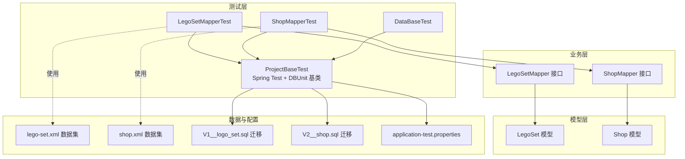
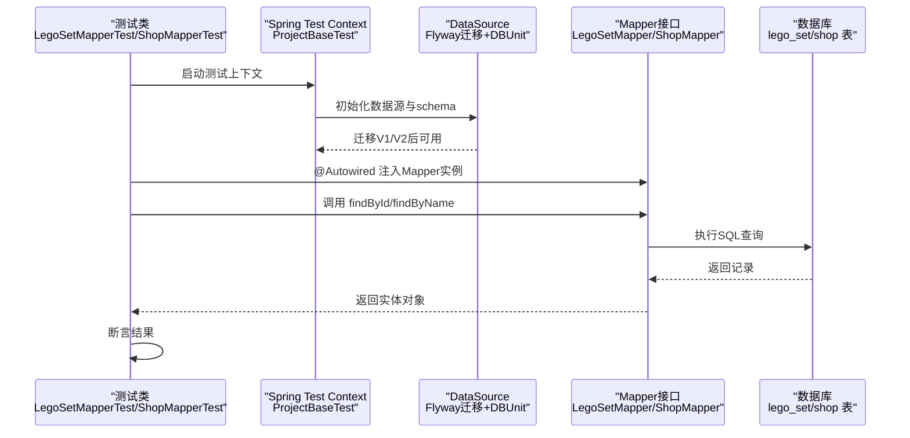
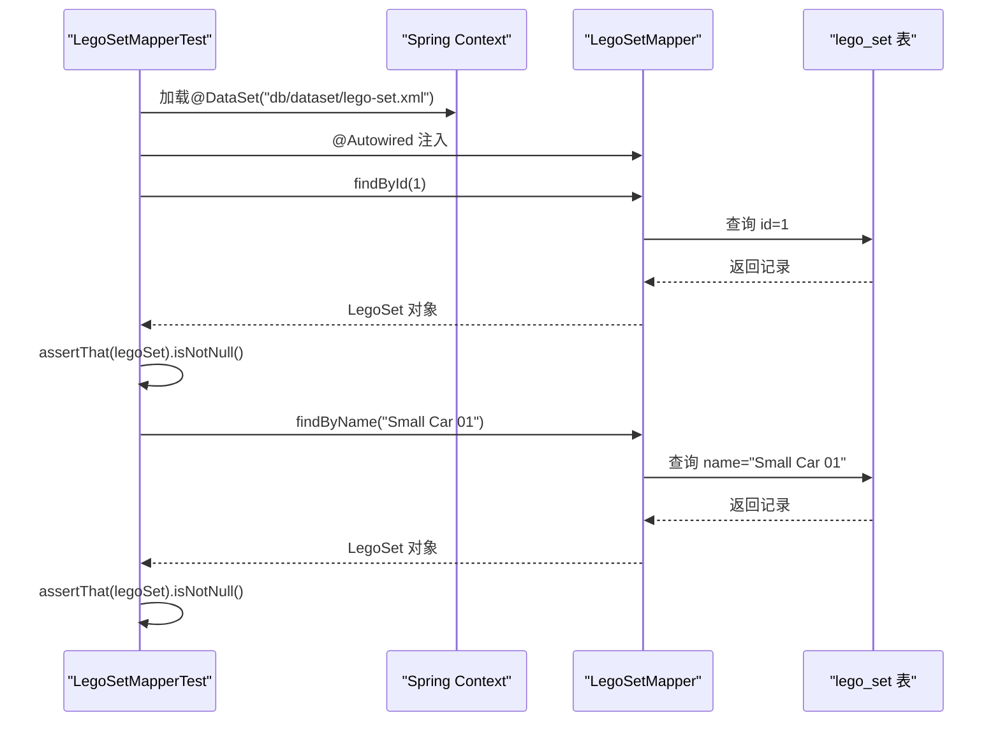
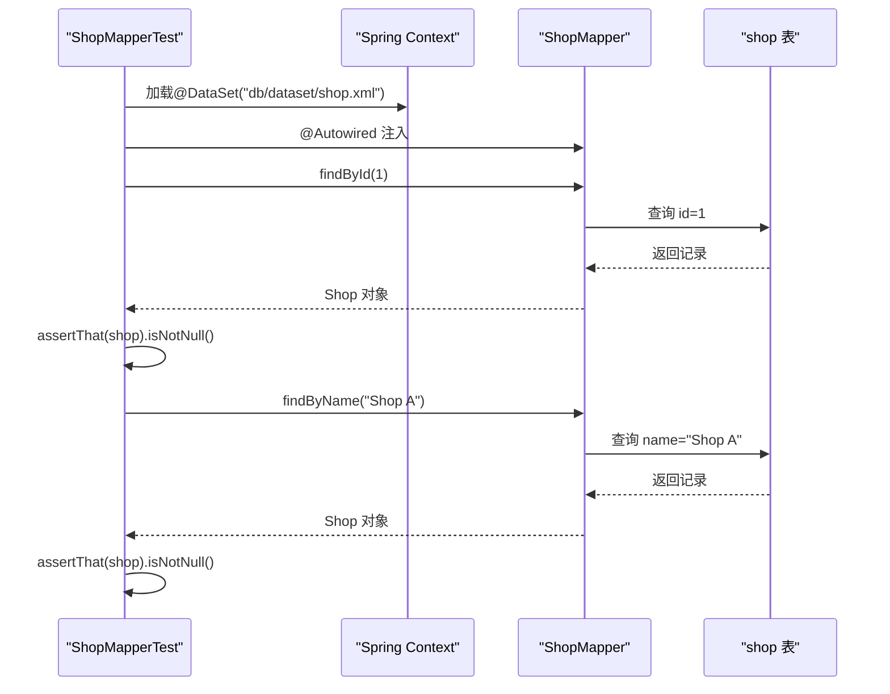
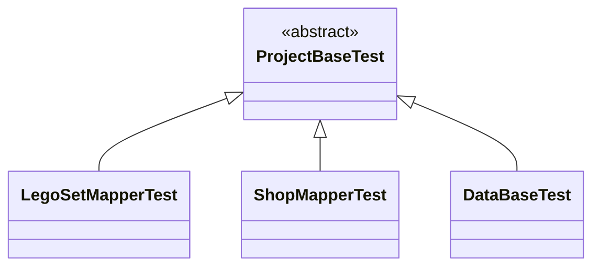
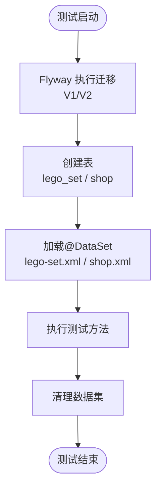
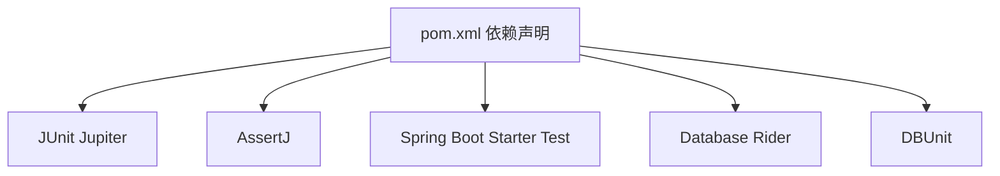

# 单元测试

<cite>
**本文引用的文件**
- [LegoSetMapperTest.java](file://src/test/java/org/mvnsearch/mybatis/demo/repo/LegoSetMapperTest.java)
- [ShopMapperTest.java](file://src/test/java/org/mvnsearch/mybatis/demo/repo/ShopMapperTest.java)
- [ProjectBaseTest.java](file://src/test/java/org/mvnsearch/mybatis/demo/ProjectBaseTest.java)
- [DataBaseTest.java](file://src/test/java/org/mvnsearch/mybatis/demo/DataBaseTest.java)
- [LegoSetMapper.java](file://src/main/java/org/mvnsearch/mybatis/demo/repo/LegoSetMapper.java)
- [ShopMapper.java](file://src/main/java/org/mvnsearch/mybatis/demo/repo/ShopMapper.java)
- [LegoSet.java](file://src/main/java/org/mvnsearch/mybatis/demo/model/LegoSet.java)
- [Shop.java](file://src/main/java/org/mvnsearch/mybatis/demo/model/Shop.java)
- [lego-set.xml](file://src/test/resources/db/dataset/lego-set.xml)
- [shop.xml](file://src/test/resources/db/dataset/shop.xml)
- [application-test.properties](file://src/test/resources/application-test.properties)
- [V1__logo_set.sql](file://src/test/resources/db/migration/V1__logo_set.sql)
- [V2__shop.sql](file://src/test/resources/db/migration/V2__shop.sql)
- [pom.xml](file://pom.xml)
</cite>

## 目录
1. [简介](#简介)
2. [项目结构](#项目结构)
3. [核心组件](#核心组件)
4. [架构总览](#架构总览)
5. [详细组件分析](#详细组件分析)
6. [依赖分析](#依赖分析)
7. [性能考量](#性能考量)
8. [故障排查指南](#故障排查指南)
9. [结论](#结论)
10. [附录](#附录)

## 简介
本文件聚焦于本项目的单元测试实现，系统性解析LegoSetMapperTest与ShopMapperTest的测试模式与策略，涵盖以下主题：
- 使用JUnit 5进行单元测试的方法与断言策略
- 测试方法命名约定与组织结构
- @Autowired在测试中的使用方式
- 通过Spring Test Context获取依赖注入的Mapper实例
- 基于Database Rider的数据集驱动测试
- 具体测试用例编写示例（findById、findByName）
- 单元测试最佳实践：测试隔离性、可重复性与性能优化

## 项目结构
测试相关的关键目录与文件如下：
- 测试基类：ProjectBaseTest，统一配置Spring Test与DBUnit
- Mapper测试类：LegoSetMapperTest、ShopMapperTest
- 数据集：lego-set.xml、shop.xml
- 迁移脚本：V1__logo_set.sql、V2__shop.sql
- 配置：application-test.properties
- 依赖：pom.xml中引入Spring Boot Starter Test、Database Rider、AssertJ、JUnit Jupiter

图表来源
- [ProjectBaseTest.java:15-21](file://src/test/java/org/mvnsearch/mybatis/demo/ProjectBaseTest.java#L15-L21)
- [LegoSetMapperTest.java:26-44](file://src/test/java/org/mvnsearch/mybatis/demo/repo/LegoSetMapperTest.java#L26-L44)
- [ShopMapperTest.java:11-29](file://src/test/java/org/mvnsearch/mybatis/demo/repo/ShopMapperTest.java#L11-L29)
- [LegoSetMapper.java:12-20](file://src/main/java/org/mvnsearch/mybatis/demo/repo/LegoSetMapper.java#L12-L20)
- [ShopMapper.java:12-20](file://src/main/java/org/mvnsearch/mybatis/demo/repo/ShopMapper.java#L12-L20)
- [lego-set.xml:1-7](file://src/test/resources/db/dataset/lego-set.xml#L1-L7)
- [shop.xml:1-8](file://src/test/resources/db/dataset/shop.xml#L1-L8)
- [V1__logo_set.sql:1-6](file://src/test/resources/db/migration/V1__logo_set.sql#L1-L6)
- [V2__shop.sql:1-7](file://src/test/resources/db/migration/V2__shop.sql#L1-L7)

章节来源
- [ProjectBaseTest.java:15-21](file://src/test/java/org/mvnsearch/mybatis/demo/ProjectBaseTest.java#L15-L21)
- [LegoSetMapperTest.java:26-44](file://src/test/java/org/mvnsearch/mybatis/demo/repo/LegoSetMapperTest.java#L26-L44)
- [ShopMapperTest.java:11-29](file://src/test/java/org/mvnsearch/mybatis/demo/repo/ShopMapperTest.java#L11-L29)

## 核心组件
- 测试基类 ProjectBaseTest：通过@SpringJUnitConfig加载应用配置，@SpringBootTest启用Spring Boot测试，@ActiveProfiles("test")激活测试配置，@DBRider与@DBUnit启用DBUnit与Database Rider支持，并配置schema、序列过滤与MySQL类型。
- LegoSetMapperTest：继承ProjectBaseTest，使用@DataSet("db/dataset/lego-set.xml")加载测试数据，注入LegoSetMapper并通过findById与findByName进行断言。
- ShopMapperTest：继承ProjectBaseTest，使用@DataSet("db/dataset/shop.xml")加载测试数据，注入ShopMapper并通过findById与findByName进行断言。
- Mapper接口：LegoSetMapper与ShopMapper定义了findById与findByName方法，返回可空对象，便于验证查询结果。
- 模型类：LegoSet与Shop包含基础字段与getter/setter，用于断言返回对象的属性。
- 数据集与迁移：lego-set.xml与shop.xml提供初始数据；V1__logo_set.sql与V2__shop.sql在Flyway迁移后创建表结构。

章节来源
- [ProjectBaseTest.java:15-21](file://src/test/java/org/mvnsearch/mybatis/demo/ProjectBaseTest.java#L15-L21)
- [LegoSetMapperTest.java:26-44](file://src/test/java/org/mvnsearch/mybatis/demo/repo/LegoSetMapperTest.java#L26-L44)
- [ShopMapperTest.java:11-29](file://src/test/java/org/mvnsearch/mybatis/demo/repo/ShopMapperTest.java#L11-L29)
- [LegoSetMapper.java:12-20](file://src/main/java/org/mvnsearch/mybatis/demo/repo/LegoSetMapper.java#L12-L20)
- [ShopMapper.java:12-20](file://src/main/java/org/mvnsearch/mybatis/demo/repo/ShopMapper.java#L12-L20)
- [LegoSet.java:3-22](file://src/main/java/org/mvnsearch/mybatis/demo/model/LegoSet.java#L3-L22)
- [Shop.java:3-31](file://src/main/java/org/mvnsearch/mybatis/demo/model/Shop.java#L3-L31)
- [lego-set.xml:4-7](file://src/test/resources/db/dataset/lego-set.xml#L4-L7)
- [shop.xml:4-7](file://src/test/resources/db/dataset/shop.xml#L4-L7)
- [V1__logo_set.sql:1-6](file://src/test/resources/db/migration/V1__logo_set.sql#L1-L6)
- [V2__shop.sql:1-7](file://src/test/resources/db/migration/V2__shop.sql#L1-L7)

## 架构总览
下图展示了测试执行时的依赖注入与数据流路径，从测试类到Spring Context再到Mapper与数据库。

图表来源
- [ProjectBaseTest.java:15-21](file://src/test/java/org/mvnsearch/mybatis/demo/ProjectBaseTest.java#L15-L21)
- [LegoSetMapperTest.java:26-44](file://src/test/java/org/mvnsearch/mybatis/demo/repo/LegoSetMapperTest.java#L26-L44)
- [ShopMapperTest.java:11-29](file://src/test/java/org/mvnsearch/mybatis/demo/repo/ShopMapperTest.java#L11-L29)
- [LegoSetMapper.java:12-20](file://src/main/java/org/mvnsearch/mybatis/demo/repo/LegoSetMapper.java#L12-L20)
- [ShopMapper.java:12-20](file://src/main/java/org/mvnsearch/mybatis/demo/repo/ShopMapper.java#L12-L20)
- [V1__logo_set.sql:1-6](file://src/test/resources/db/migration/V1__logo_set.sql#L1-L6)
- [V2__shop.sql:1-7](file://src/test/resources/db/migration/V2__shop.sql#L1-L7)

## 详细组件分析

### LegoSetMapperTest 分析
- 继承关系：继承ProjectBaseTest，复用Spring Test与DBUnit配置。
- 数据集：使用@DataSet("db/dataset/lego-set.xml")加载初始数据。
- 依赖注入：通过@Autowired注入LegoSetMapper实例。
- 测试方法：
  - testGetLegoSet：调用findById(1)，断言返回非空。
  - testFindByName：调用findByName("Small Car 01")，断言返回非空并打印id。
- 断言策略：使用AssertJ的assertThat进行链式断言，简洁直观。
- 测试数据准备：lego-set.xml提供两条记录，确保测试覆盖存在与不存在的场景。

图表来源
- [LegoSetMapperTest.java:26-44](file://src/test/java/org/mvnsearch/mybatis/demo/repo/LegoSetMapperTest.java#L26-L44)
- [lego-set.xml:4-7](file://src/test/resources/db/dataset/lego-set.xml#L4-L7)
- [LegoSetMapper.java:12-20](file://src/main/java/org/mvnsearch/mybatis/demo/repo/LegoSetMapper.java#L12-L20)

章节来源
- [LegoSetMapperTest.java:26-44](file://src/test/java/org/mvnsearch/mybatis/demo/repo/LegoSetMapperTest.java#L26-L44)
- [lego-set.xml:4-7](file://src/test/resources/db/dataset/lego-set.xml#L4-L7)
- [LegoSetMapper.java:12-20](file://src/main/java/org/mvnsearch/mybatis/demo/repo/LegoSetMapper.java#L12-L20)

### ShopMapperTest 分析
- 继承关系：继承ProjectBaseTest，复用Spring Test与DBUnit配置。
- 数据集：使用@DataSet("db/dataset/shop.xml")加载初始数据。
- 依赖注入：通过@Autowired注入ShopMapper实例。
- 测试方法：
  - testGetShop：调用findById(1)，断言返回非空。
  - testFindByName：调用findByName("Shop A")，断言返回非空并打印id。
- 断言策略：使用AssertJ的assertThat进行链式断言。
- 测试数据准备：shop.xml提供两条记录，确保测试覆盖存在与不存在的场景。

图表来源
- [ShopMapperTest.java:11-29](file://src/test/java/org/mvnsearch/mybatis/demo/repo/ShopMapperTest.java#L11-L29)
- [shop.xml:4-7](file://src/test/resources/db/dataset/shop.xml#L4-L7)
- [ShopMapper.java:12-20](file://src/main/java/org/mvnsearch/mybatis/demo/repo/ShopMapper.java#L12-L20)

章节来源
- [ShopMapperTest.java:11-29](file://src/test/java/org/mvnsearch/mybatis/demo/repo/ShopMapperTest.java#L11-L29)
- [shop.xml:4-7](file://src/test/resources/db/dataset/shop.xml#L4-L7)
- [ShopMapper.java:12-20](file://src/main/java/org/mvnsearch/mybatis/demo/repo/ShopMapper.java#L12-L20)

### ProjectBaseTest 基类分析
- Spring Test 配置：@SpringJUnitConfig(MyBatisApp.class)加载应用配置；@SpringBootTest启用Spring Boot测试；@ActiveProfiles("test")激活测试环境。
- DBUnit 与 Database Rider：@DBRider启用Database Rider；@DBUnit配置schema为"test"、禁用序列过滤、期望数据库类型为MySQL。
- 抽象设计：作为所有Mapper测试的父类，统一测试上下文与数据准备策略。

图表来源
- [ProjectBaseTest.java:15-21](file://src/test/java/org/mvnsearch/mybatis/demo/ProjectBaseTest.java#L15-L21)
- [LegoSetMapperTest.java:26-44](file://src/test/java/org/mvnsearch/mybatis/demo/repo/LegoSetMapperTest.java#L26-L44)
- [ShopMapperTest.java:11-29](file://src/test/java/org/mvnsearch/mybatis/demo/repo/ShopMapperTest.java#L11-L29)
- [DataBaseTest.java:12-26](file://src/test/java/org/mvnsearch/mybatis/demo/DataBaseTest.java#L12-L26)

章节来源
- [ProjectBaseTest.java:15-21](file://src/test/java/org/mvnsearch/mybatis/demo/ProjectBaseTest.java#L15-L21)

### 数据库迁移与数据集
- 迁移脚本：V1__logo_set.sql创建lego_set表；V2__shop.sql创建shop表。Flyway在测试执行前自动迁移。
- 数据集：lego-set.xml与shop.xml提供初始数据，配合@DataSet注解在每个测试方法执行前后自动导入/清理。
- 配置文件：application-test.properties为空，表示使用默认或外部化配置（例如pom中定义的JDBC参数）。

图表来源
- [V1__logo_set.sql:1-6](file://src/test/resources/db/migration/V1__logo_set.sql#L1-L6)
- [V2__shop.sql:1-7](file://src/test/resources/db/migration/V2__shop.sql#L1-L7)
- [lego-set.xml:1-7](file://src/test/resources/db/dataset/lego-set.xml#L1-L7)
- [shop.xml:1-8](file://src/test/resources/db/dataset/shop.xml#L1-L8)

章节来源
- [V1__logo_set.sql:1-6](file://src/test/resources/db/migration/V1__logo_set.sql#L1-L6)
- [V2__shop.sql:1-7](file://src/test/resources/db/migration/V2__shop.sql#L1-L7)
- [lego-set.xml:1-7](file://src/test/resources/db/dataset/lego-set.xml#L1-L7)
- [shop.xml:1-8](file://src/test/resources/db/dataset/shop.xml#L1-L8)
- [application-test.properties:1-1](file://src/test/resources/application-test.properties#L1-L1)

## 依赖分析
- 测试框架与工具：
  - JUnit Jupiter：测试运行与生命周期管理
  - AssertJ：断言库，提供流畅的断言API
  - Spring Boot Starter Test：集成Spring Test与Mock支持
  - Database Rider：基于DBUnit的数据集驱动测试
  - DBUnit：数据库集成测试的底层支持
- Maven 依赖：pom.xml中声明了上述依赖，并配置了Flyway插件以在测试前执行迁移。

图表来源
- [pom.xml:30-101](file://pom.xml#L30-L101)

章节来源
- [pom.xml:30-101](file://pom.xml#L30-L101)

## 性能考量
- 数据集大小控制：尽量精简@DataSet中的记录数量，避免过大数据集导致测试启动时间增长。
- 迁移脚本优化：Flyway迁移应保持幂等且快速，避免在测试中执行耗时操作。
- 并行测试：在多线程环境下确保数据隔离，避免共享状态影响测试稳定性。
- 缓存与连接池：在测试环境中合理配置数据源连接池，减少连接建立开销。
- 断言粒度：使用精确断言，避免不必要的多次查询或复杂断言逻辑。

## 故障排查指南
- 测试无法启动或找不到Mapper：
  - 确认Mapper接口使用@Mapper注解并被扫描。
  - 确认Spring Test Context已加载应用配置（@SpringJUnitConfig）。
- 数据集未生效：
  - 检查@DataSet路径是否正确，XML与DTD一致。
  - 确认Flyway迁移成功创建表结构。
- 断言失败：
  - 使用AssertJ的链式断言定位问题，逐步缩小范围。
  - 在测试方法中添加日志输出（如打印id），辅助调试。
- 环境配置问题：
  - 检查application-test.properties与pom中JDBC参数是否匹配。

章节来源
- [LegoSetMapperTest.java:26-44](file://src/test/java/org/mvnsearch/mybatis/demo/repo/LegoSetMapperTest.java#L26-L44)
- [ShopMapperTest.java:11-29](file://src/test/java/org/mvnsearch/mybatis/demo/repo/ShopMapperTest.java#L11-L29)
- [ProjectBaseTest.java:15-21](file://src/test/java/org/mvnsearch/mybatis/demo/ProjectBaseTest.java#L15-L21)
- [lego-set.xml:1-7](file://src/test/resources/db/dataset/lego-set.xml#L1-L7)
- [shop.xml:1-8](file://src/test/resources/db/dataset/shop.xml#L1-L8)
- [V1__logo_set.sql:1-6](file://src/test/resources/db/migration/V1__logo_set.sql#L1-L6)
- [V2__shop.sql:1-7](file://src/test/resources/db/migration/V2__shop.sql#L1-L7)

## 结论
本项目的单元测试采用“Spring Test + Database Rider + DBUnit”的组合方案，通过ProjectBaseTest统一配置，LegoSetMapperTest与ShopMapperTest分别针对各自Mapper进行功能验证。测试方法遵循清晰的命名约定与断言策略，结合@DataSet数据集与Flyway迁移，实现了高隔离性与可重复性的测试执行。建议在后续扩展中继续坚持最小数据集、明确断言与快速反馈的原则，持续提升测试质量与效率。

## 附录

### JUnit 5 与断言策略
- 测试方法命名：使用语义化的动词短语（如testGetLegoSet、testFindByName），体现行为与预期结果。
- 断言策略：优先使用AssertJ的assertThat进行链式断言，提高可读性与可维护性。
- 测试组织：按功能模块分组（如LegoSet与Shop），便于定位与维护。

章节来源
- [LegoSetMapperTest.java:31-42](file://src/test/java/org/mvnsearch/mybatis/demo/repo/LegoSetMapperTest.java#L31-L42)
- [ShopMapperTest.java:16-27](file://src/test/java/org/mvnsearch/mybatis/demo/repo/ShopMapperTest.java#L16-L27)

### @Autowired 在测试中的使用
- 作用：在测试类中注入Mapper实例，无需手动构造，直接调用其方法进行测试。
- 注意事项：确保Spring Test Context已加载应用配置，且Mapper接口被扫描。

章节来源
- [LegoSetMapperTest.java:28-29](file://src/test/java/org/mvnsearch/mybatis/demo/repo/LegoSetMapperTest.java#L28-L29)
- [ShopMapperTest.java:13-14](file://src/test/java/org/mvnsearch/mybatis/demo/repo/ShopMapperTest.java#L13-L14)
- [ProjectBaseTest.java:15-21](file://src/test/java/org/mvnsearch/mybatis/demo/ProjectBaseTest.java#L15-L21)

### 通过Spring Test Context 获取依赖注入的Mapper 实例
- 方式：在测试类中声明字段并使用@Autowired注解，Spring会在测试启动时注入Mapper实例。
- 验证：在测试方法中直接调用Mapper方法并断言结果。

章节来源
- [LegoSetMapperTest.java:28-35](file://src/test/java/org/mvnsearch/mybatis/demo/repo/LegoSetMapperTest.java#L28-L35)
- [ShopMapperTest.java:13-20](file://src/test/java/org/mvnsearch/mybatis/demo/repo/ShopMapperTest.java#L13-L20)

### @Test 注解与测试方法组织
- @Test：标记测试方法，由JUnit 5运行器执行。
- 组织结构：每个Mapper一个测试类，每个测试方法关注单一行为（如findById、findByName）。

章节来源
- [LegoSetMapperTest.java:31-42](file://src/test/java/org/mvnsearch/mybatis/demo/repo/LegoSetMapperTest.java#L31-L42)
- [ShopMapperTest.java:16-27](file://src/test/java/org/mvnsearch/mybatis/demo/repo/ShopMapperTest.java#L16-L27)

### 具体测试用例编写示例
- findById 示例：在LegoSetMapperTest与ShopMapperTest中均存在，分别调用对应Mapper的findById方法并断言返回非空。
- findByName 示例：在LegoSetMapperTest与ShopMapperTest中均存在，分别调用对应Mapper的findByName方法并断言返回非空。

章节来源
- [LegoSetMapperTest.java:32-42](file://src/test/java/org/mvnsearch/mybatis/demo/repo/LegoSetMapperTest.java#L32-L42)
- [ShopMapperTest.java:17-27](file://src/test/java/org/mvnsearch/mybatis/demo/repo/ShopMapperTest.java#L17-L27)

### 单元测试最佳实践
- 测试隔离性：每个测试独立运行，不依赖其他测试的副作用；使用@DataSet确保每次测试的数据隔离。
- 可重复性：依赖Flyway迁移与固定数据集，保证测试在不同环境与时间点的一致性。
- 性能考虑：控制数据集规模、优化迁移脚本、避免不必要的查询与断言。
- 可维护性：清晰的命名、明确的断言与最小化的测试代码，便于后续扩展与重构。