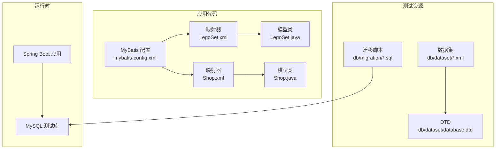
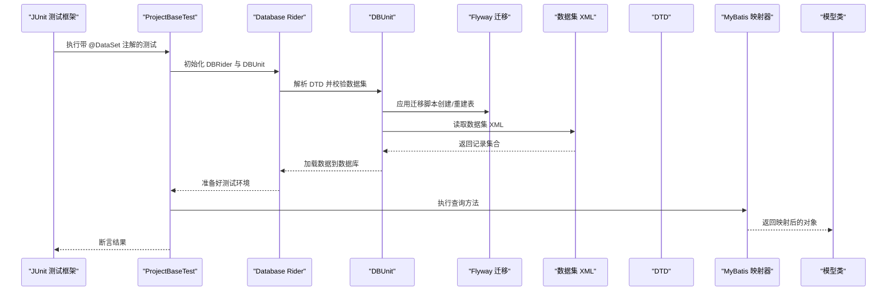
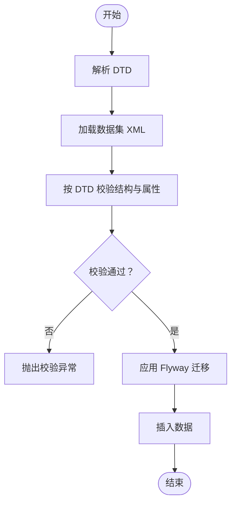
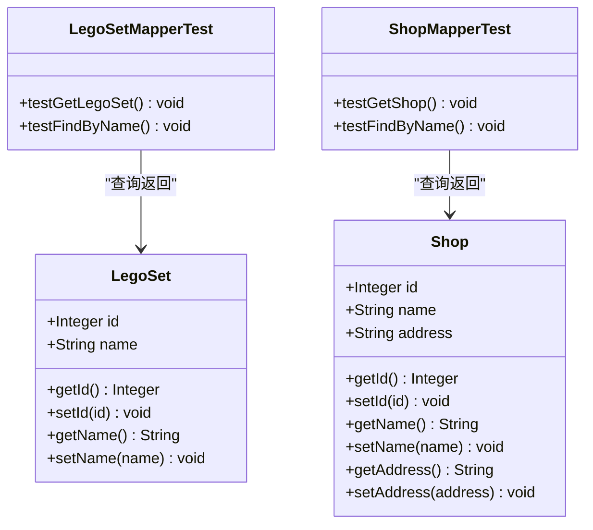
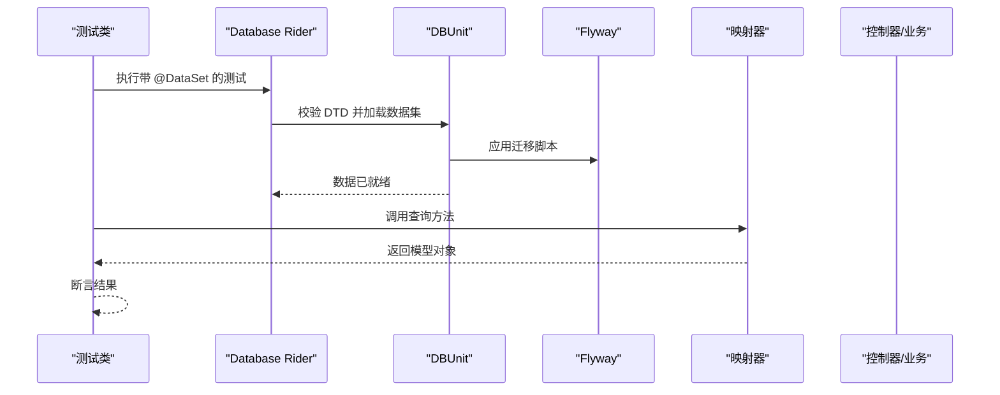
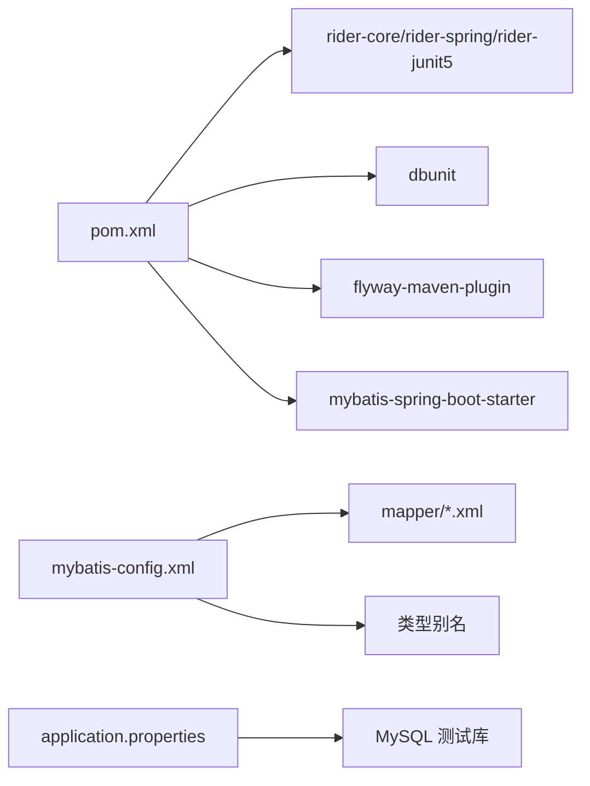

# 测试数据集

<cite>
**本文引用的文件**
- [LegoSet.xml](file://src/main/resources/mapper/LegoSet.xml)
- [Shop.xml](file://src/main/resources/mapper/Shop.xml)
- [lego-set.xml](file://src/test/resources/db/dataset/lego-set.xml)
- [shop.xml](file://src/test/resources/db/dataset/shop.xml)
- [database.dtd](file://src/test/resources/db/dataset/database.dtd)
- [LegoSet.java](file://src/main/java/org/mvnsearch/mybatis/demo/model/LegoSet.java)
- [Shop.java](file://src/main/java/org/mvnsearch/mybatis/demo/model/Shop.java)
- [LegoSetMapperTest.java](file://src/test/java/org/mvnsearch/mybatis/demo/repo/LegoSetMapperTest.java)
- [ShopMapperTest.java](file://src/test/java/org/mvnsearch/mybatis/demo/repo/ShopMapperTest.java)
- [DataBaseTest.java](file://src/test/java/org/mvnsearch/mybatis/demo/DataBaseTest.java)
- [V1__logo_set.sql](file://src/test/resources/db/migration/V1__logo_set.sql)
- [V2__shop.sql](file://src/test/resources/db/migration/V2__shop.sql)
- [application.properties](file://src/main/resources/application.properties)
- [mybatis-config.xml](file://src/main/resources/mybatis-config.xml)
- [pom.xml](file://pom.xml)
- [ProjectBaseTest.java](file://src/test/java/org/mvnsearch/mybatis/demo/ProjectBaseTest.java)
</cite>

## 目录
1. [简介](#简介)
2. [项目结构](#项目结构)
3. [核心组件](#核心组件)
4. [架构总览](#架构总览)
5. [详细组件分析](#详细组件分析)
6. [依赖分析](#依赖分析)
7. [性能考虑](#性能考虑)
8. [故障排查指南](#故障排查指南)
9. [结论](#结论)
10. [附录](#附录)

## 简介
本文件系统化阐述本项目中基于 Database Rider 的测试数据集管理方案，重点说明数据集的组织结构与 XML 格式规范，解析 lego-set.xml 与 shop.xml 数据集文件的结构与字段定义（含主键、可选外键与约束），解释 DTD 文件的作用与数据集验证机制，给出创建与维护测试数据集的流程、一致性检查与版本管理建议，并总结数据量控制、测试覆盖度与数据隐私保护的最佳实践。最后说明数据集在不同测试场景中的复用策略、动态数据生成方法以及测试数据生命周期与清理机制。

## 项目结构
本项目采用 Spring Boot + MyBatis 架构，测试阶段通过 Database Rider 加载扁平 XML 数据集，结合 Flyway 迁移脚本初始化数据库表结构。关键目录与文件如下：
- 测试数据集：src/test/resources/db/dataset/*.xml 与 *.dtd
- MyBatis 映射文件：src/main/resources/mapper/*.xml
- 模型类：src/main/java/.../model/*.java
- 数据库迁移：src/test/resources/db/migration/*.sql
- 配置与依赖：application.properties、mybatis-config.xml、pom.xml
- 基础测试类：ProjectBaseTest.java 及各 Mapper 测试类

**图表来源**
- [lego-set.xml:1-7](file://src/test/resources/db/dataset/lego-set.xml#L1-L7)
- [shop.xml:1-8](file://src/test/resources/db/dataset/shop.xml#L1-L8)
- [database.dtd:1-25](file://src/test/resources/db/dataset/database.dtd#L1-L25)
- [V1__logo_set.sql:1-6](file://src/test/resources/db/migration/V1__logo_set.sql#L1-L6)
- [V2__shop.sql:1-7](file://src/test/resources/db/migration/V2__shop.sql#L1-L7)
- [mybatis-config.xml:1-14](file://src/main/resources/mybatis-config.xml#L1-L14)
- [LegoSet.xml:1-22](file://src/main/resources/mapper/LegoSet.xml#L1-L22)
- [Shop.xml:1-24](file://src/main/resources/mapper/Shop.xml#L1-L24)
- [LegoSet.java:1-23](file://src/main/java/org/mvnsearch/mybatis/demo/model/LegoSet.java#L1-L23)
- [Shop.java:1-32](file://src/main/java/org/mvnsearch/mybatis/demo/model/Shop.java#L1-L32)

**章节来源**
- [application.properties:1-11](file://src/main/resources/application.properties#L1-L11)
- [mybatis-config.xml:1-14](file://src/main/resources/mybatis-config.xml#L1-L14)
- [pom.xml:1-141](file://pom.xml#L1-L141)

## 核心组件
- 数据集 XML：用于声明测试数据，由 Database Rider 在测试前加载到数据库。
- DTD：定义数据集 XML 的元素与属性约束，确保数据集格式正确。
- 迁移脚本：Flyway 负责在测试前创建/重建表结构，保证数据集可插入。
- MyBatis 映射器：将 SQL 查询结果映射为模型对象，驱动测试断言。
- 测试基类：统一启用 Database Rider 与 DBUnit 配置，简化测试样板代码。

**章节来源**
- [lego-set.xml:1-7](file://src/test/resources/db/dataset/lego-set.xml#L1-L7)
- [shop.xml:1-8](file://src/test/resources/db/dataset/shop.xml#L1-L8)
- [database.dtd:1-25](file://src/test/resources/db/dataset/database.dtd#L1-L25)
- [V1__logo_set.sql:1-6](file://src/test/resources/db/migration/V1__logo_set.sql#L1-L6)
- [V2__shop.sql:1-7](file://src/test/resources/db/migration/V2__shop.sql#L1-L7)
- [LegoSet.xml:1-22](file://src/main/resources/mapper/LegoSet.xml#L1-L22)
- [Shop.xml:1-24](file://src/main/resources/mapper/Shop.xml#L1-L24)
- [ProjectBaseTest.java:1-22](file://src/test/java/org/mvnsearch/mybatis/demo/ProjectBaseTest.java#L1-L22)

## 架构总览
下图展示测试执行期间，从加载数据集到查询映射器再到断言的完整流程。

**图表来源**
- [ProjectBaseTest.java:1-22](file://src/test/java/org/mvnsearch/mybatis/demo/ProjectBaseTest.java#L1-L22)
- [DataBaseTest.java:1-27](file://src/test/java/org/mvnsearch/mybatis/demo/DataBaseTest.java#L1-L27)
- [lego-set.xml:1-7](file://src/test/resources/db/dataset/lego-set.xml#L1-L7)
- [shop.xml:1-8](file://src/test/resources/db/dataset/shop.xml#L1-L8)
- [database.dtd:1-25](file://src/test/resources/db/dataset/database.dtd#L1-L25)
- [V1__logo_set.sql:1-6](file://src/test/resources/db/migration/V1__logo_set.sql#L1-L6)
- [V2__shop.sql:1-7](file://src/test/resources/db/migration/V2__shop.sql#L1-L7)
- [LegoSet.xml:1-22](file://src/main/resources/mapper/LegoSet.xml#L1-L22)
- [Shop.xml:1-24](file://src/main/resources/mapper/Shop.xml#L1-L24)

## 详细组件分析

### 数据集 XML 结构与字段定义
- lego-set.xml
  - 根元素：dataset
  - 子元素：lego_set*
  - 字段：
    - id：整数类型，作为主键使用
    - name：字符串类型，非空（根据迁移脚本定义）
- shop.xml
  - 根元素：dataset
  - 子元素：shop*
  - 字段：
    - id：整数类型，作为主键使用
    - name：字符串类型
    - address：字符串类型

上述字段与迁移脚本中的表结构一致，其中 lego_set 的 name 与 shop 的 name/address 对应迁移脚本中的列定义。

**章节来源**
- [lego-set.xml:1-7](file://src/test/resources/db/dataset/lego-set.xml#L1-L7)
- [shop.xml:1-8](file://src/test/resources/db/dataset/shop.xml#L1-L8)
- [V1__logo_set.sql:1-6](file://src/test/resources/db/migration/V1__logo_set.sql#L1-L6)
- [V2__shop.sql:1-7](file://src/test/resources/db/migration/V2__shop.sql#L1-L7)

### DTD 的作用与数据集验证机制
- DTD 定义了数据集 XML 的合法结构与元素/属性约束，确保：
  - dataset 根元素包含指定子元素序列
  - 各表元素（如 lego_set）的属性符合要求（如 id 必填）
- Database Rider 在加载数据集前会依据 DTD 进行校验，若不匹配则抛出异常，从而在早期发现数据集错误。

**图表来源**
- [database.dtd:1-25](file://src/test/resources/db/dataset/database.dtd#L1-L25)
- [lego-set.xml:1-7](file://src/test/resources/db/dataset/lego-set.xml#L1-L7)
- [shop.xml:1-8](file://src/test/resources/db/dataset/shop.xml#L1-L8)
- [V1__logo_set.sql:1-6](file://src/test/resources/db/migration/V1__logo_set.sql#L1-L6)
- [V2__shop.sql:1-7](file://src/test/resources/db/migration/V2__shop.sql#L1-L7)

**章节来源**
- [database.dtd:1-25](file://src/test/resources/db/dataset/database.dtd#L1-L25)
- [DataBaseTest.java:1-27](file://src/test/java/org/mvnsearch/mybatis/demo/DataBaseTest.java#L1-L27)

### MyBatis 映射器与模型类
- LegoSet.xml
  - 定义 LegoSet 的查询语句与结果映射，字段包括 id 与 name
- Shop.xml
  - 定义 Shop 的查询语句与结果映射，字段包括 id、name、address
- 模型类 LegoSet/Shop
  - 提供 id/name/address 的 getter/setter，与映射器字段一一对应

**图表来源**
- [LegoSet.java:1-23](file://src/main/java/org/mvnsearch/mybatis/demo/model/LegoSet.java#L1-L23)
- [Shop.java:1-32](file://src/main/java/org/mvnsearch/mybatis/demo/model/Shop.java#L1-L32)
- [LegoSet.xml:1-22](file://src/main/resources/mapper/LegoSet.xml#L1-L22)
- [Shop.xml:1-24](file://src/main/resources/mapper/Shop.xml#L1-L24)
- [LegoSetMapperTest.java:1-45](file://src/test/java/org/mvnsearch/mybatis/demo/repo/LegoSetMapperTest.java#L1-L45)
- [ShopMapperTest.java:1-30](file://src/test/java/org/mvnsearch/mybatis/demo/repo/ShopMapperTest.java#L1-L30)

**章节来源**
- [LegoSet.xml:1-22](file://src/main/resources/mapper/LegoSet.xml#L1-L22)
- [Shop.xml:1-24](file://src/main/resources/mapper/Shop.xml#L1-L24)
- [LegoSet.java:1-23](file://src/main/java/org/mvnsearch/mybatis/demo/model/LegoSet.java#L1-L23)
- [Shop.java:1-32](file://src/main/java/org/mvnsearch/mybatis/demo/model/Shop.java#L1-L32)
- [LegoSetMapperTest.java:1-45](file://src/test/java/org/mvnsearch/mybatis/demo/repo/LegoSetMapperTest.java#L1-L45)
- [ShopMapperTest.java:1-30](file://src/test/java/org/mvnsearch/mybatis/demo/repo/ShopMapperTest.java#L1-L30)

### 数据集加载与测试执行流程
- 基类 ProjectBaseTest 统一启用 DBRider 与 DBUnit，设置 schema 与数据库类型
- 测试类通过 @DataSet 指定数据集路径，Database Rider 自动完成：
  - 读取 DTD 并校验数据集
  - 应用迁移脚本确保表存在
  - 将数据集插入数据库
  - 执行测试方法并断言

**图表来源**
- [ProjectBaseTest.java:1-22](file://src/test/java/org/mvnsearch/mybatis/demo/ProjectBaseTest.java#L1-L22)
- [LegoSetMapperTest.java:1-45](file://src/test/java/org/mvnsearch/mybatis/demo/repo/LegoSetMapperTest.java#L1-L45)
- [ShopMapperTest.java:1-30](file://src/test/java/org/mvnsearch/mybatis/demo/repo/ShopMapperTest.java#L1-L30)
- [V1__logo_set.sql:1-6](file://src/test/resources/db/migration/V1__logo_set.sql#L1-L6)
- [V2__shop.sql:1-7](file://src/test/resources/db/migration/V2__shop.sql#L1-L7)

**章节来源**
- [ProjectBaseTest.java:1-22](file://src/test/java/org/mvnsearch/mybatis/demo/ProjectBaseTest.java#L1-L22)
- [LegoSetMapperTest.java:1-45](file://src/test/java/org/mvnsearch/mybatis/demo/repo/LegoSetMapperTest.java#L1-L45)
- [ShopMapperTest.java:1-30](file://src/test/java/org/mvnsearch/mybatis/demo/repo/ShopMapperTest.java#L1-L30)

## 依赖分析
- Maven 依赖
  - Database Rider 核心与 Spring/JUnit5 支持
  - DBUnit 用于数据集与数据库交互
  - Flyway 用于迁移脚本管理
- MyBatis 配置
  - 类型别名与映射器注册
- 测试配置
  - application-test.properties 中的数据库连接信息
  - mybatis-config.xml 中的映射器与类型别名

**图表来源**
- [pom.xml:1-141](file://pom.xml#L1-L141)
- [mybatis-config.xml:1-14](file://src/main/resources/mybatis-config.xml#L1-L14)
- [application.properties:1-11](file://src/main/resources/application.properties#L1-L11)

**章节来源**
- [pom.xml:1-141](file://pom.xml#L1-L141)
- [mybatis-config.xml:1-14](file://src/main/resources/mybatis-config.xml#L1-L14)
- [application.properties:1-11](file://src/main/resources/application.properties#L1-L11)

## 性能考虑
- 数据量控制：单个数据集文件仅包含必要最小数据，避免冗余记录导致加载时间增加。
- 查询优化：映射器中仅选择需要的列，减少网络与内存开销。
- 迁移脚本：Flyway 清理与重建策略应在测试环境中启用，确保每次测试从干净状态开始。
- 缓存与连接：测试期间保持短连接生命周期，避免连接池泄漏。

## 故障排查指南
- DTD 校验失败
  - 现象：加载数据集时报结构或属性错误
  - 排查：确认数据集 XML 的根元素与子元素是否符合 DTD；检查属性是否缺失或类型不符
  - 参考：[database.dtd:1-25](file://src/test/resources/db/dataset/database.dtd#L1-L25)
- 表不存在或结构不匹配
  - 现象：插入数据时报错
  - 排查：确认 Flyway 迁移脚本已执行；核对迁移脚本与模型字段定义
  - 参考：[V1__logo_set.sql:1-6](file://src/test/resources/db/migration/V1__logo_set.sql#L1-L6)、[V2__shop.sql:1-7](file://src/test/resources/db/migration/V2__shop.sql#L1-L7)
- 测试未加载数据集
  - 现象：查询为空或断言失败
  - 排查：确认 @DataSet 路径正确；检查基类 DBRider 与 DBUnit 配置
  - 参考：[ProjectBaseTest.java:1-22](file://src/test/java/org/mvnsearch/mybatis/demo/ProjectBaseTest.java#L1-L22)、[LegoSetMapperTest.java:1-45](file://src/test/java/org/mvnsearch/mybatis/demo/repo/LegoSetMapperTest.java#L1-L45)、[ShopMapperTest.java:1-30](file://src/test/java/org/mvnsearch/mybatis/demo/repo/ShopMapperTest.java#L1-L30)
- DTD 动态生成
  - 说明：可通过 DBUnit 工具生成 DTD，便于与数据库结构同步
  - 参考：[DataBaseTest.java:1-27](file://src/test/java/org/mvnsearch/mybatis/demo/DataBaseTest.java#L1-L27)

**章节来源**
- [database.dtd:1-25](file://src/test/resources/db/dataset/database.dtd#L1-L25)
- [V1__logo_set.sql:1-6](file://src/test/resources/db/migration/V1__logo_set.sql#L1-L6)
- [V2__shop.sql:1-7](file://src/test/resources/db/migration/V2__shop.sql#L1-L7)
- [ProjectBaseTest.java:1-22](file://src/test/java/org/mvnsearch/mybatis/demo/ProjectBaseTest.java#L1-L22)
- [LegoSetMapperTest.java:1-45](file://src/test/java/org/mvnsearch/mybatis/demo/repo/LegoSetMapperTest.java#L1-L45)
- [ShopMapperTest.java:1-30](file://src/test/java/org/mvnsearch/mybatis/demo/repo/ShopMapperTest.java#L1-L30)
- [DataBaseTest.java:1-27](file://src/test/java/org/mvnsearch/mybatis/demo/DataBaseTest.java#L1-L27)

## 结论
本项目通过 Database Rider + DBUnit + Flyway 的组合，实现了可验证、可复用、可维护的测试数据集管理方案。数据集 XML 与 DTD 共同保障格式正确性，迁移脚本确保表结构一致，MyBatis 映射器与模型类提供稳定的查询接口。遵循本文的最佳实践与流程，可在保证测试稳定性的同时提升开发效率。

## 附录

### 数据集创建与维护流程
- 设计阶段
  - 明确测试场景与覆盖点，确定所需表与字段
  - 在迁移脚本中定义表结构，确保与模型类一致
- 编写数据集
  - 使用 DTD 作为约束模板，编写 XML 数据集
  - 为每个测试场景准备独立数据集文件，避免交叉污染
- 验证与集成
  - 使用 @DataSet 引入数据集，确保 DTD 校验通过
  - 通过测试断言验证查询结果
- 版本管理
  - 将数据集与迁移脚本纳入版本控制
  - 当表结构变更时，同步更新 DTD 与数据集

**章节来源**
- [V1__logo_set.sql:1-6](file://src/test/resources/db/migration/V1__logo_set.sql#L1-L6)
- [V2__shop.sql:1-7](file://src/test/resources/db/migration/V2__shop.sql#L1-L7)
- [database.dtd:1-25](file://src/test/resources/db/dataset/database.dtd#L1-L25)
- [lego-set.xml:1-7](file://src/test/resources/db/dataset/lego-set.xml#L1-L7)
- [shop.xml:1-8](file://src/test/resources/db/dataset/shop.xml#L1-L8)
- [LegoSetMapperTest.java:1-45](file://src/test/java/org/mvnsearch/mybatis/demo/repo/LegoSetMapperTest.java#L1-L45)
- [ShopMapperTest.java:1-30](file://src/test/java/org/mvnsearch/mybatis/demo/repo/ShopMapperTest.java#L1-L30)

### 最佳实践
- 数据量控制
  - 每个数据集仅包含测试所需的最小数据集
  - 避免重复数据与冗余记录
- 测试覆盖度
  - 针对边界条件与异常分支设计数据集
  - 为每种查询路径准备对应的输入数据
- 数据隐私保护
  - 不在测试数据集中使用真实用户敏感信息
  - 如需模拟数据，使用脱敏或随机生成的占位符
- 复用策略
  - 将通用数据放入基础数据集，按需叠加特定场景数据
  - 使用命名清晰的数据集文件，便于维护与检索
- 动态数据生成
  - 对于需要唯一值的场景（如名称），在测试前生成唯一标识并注入数据集
- 生命周期与清理
  - 测试结束后自动回滚或删除插入的数据，确保下一次测试不受影响
  - 使用 Flyway 的清理能力，在测试前重建干净的数据库状态

### 数据集字段与约束对照
- lego_set
  - id：整数，主键
  - name：字符串，非空（迁移脚本定义）
- shop
  - id：整数，主键
  - name：字符串
  - address：字符串

**章节来源**
- [V1__logo_set.sql:1-6](file://src/test/resources/db/migration/V1__logo_set.sql#L1-L6)
- [V2__shop.sql:1-7](file://src/test/resources/db/migration/V2__shop.sql#L1-L7)
- [lego-set.xml:1-7](file://src/test/resources/db/dataset/lego-set.xml#L1-L7)
- [shop.xml:1-8](file://src/test/resources/db/dataset/shop.xml#L1-L8)