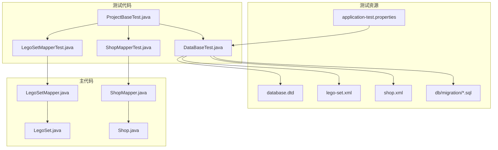
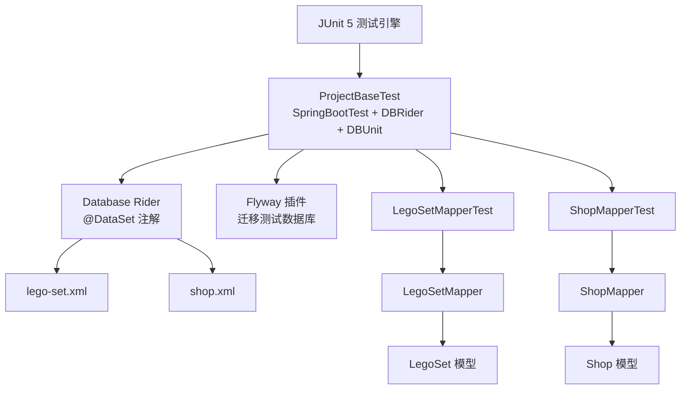
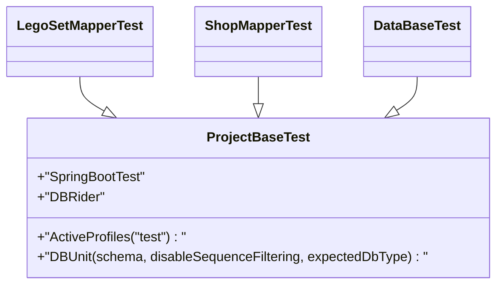
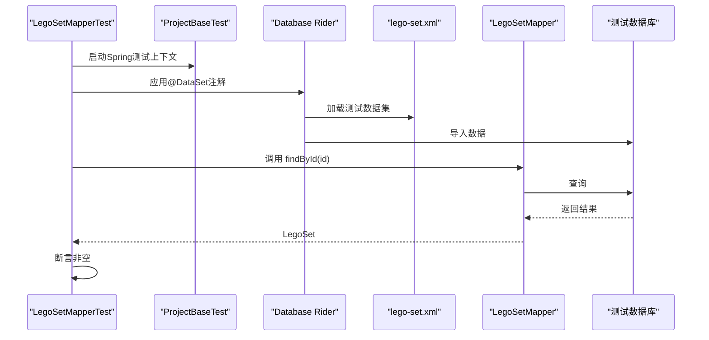
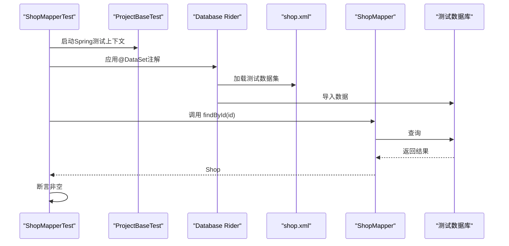
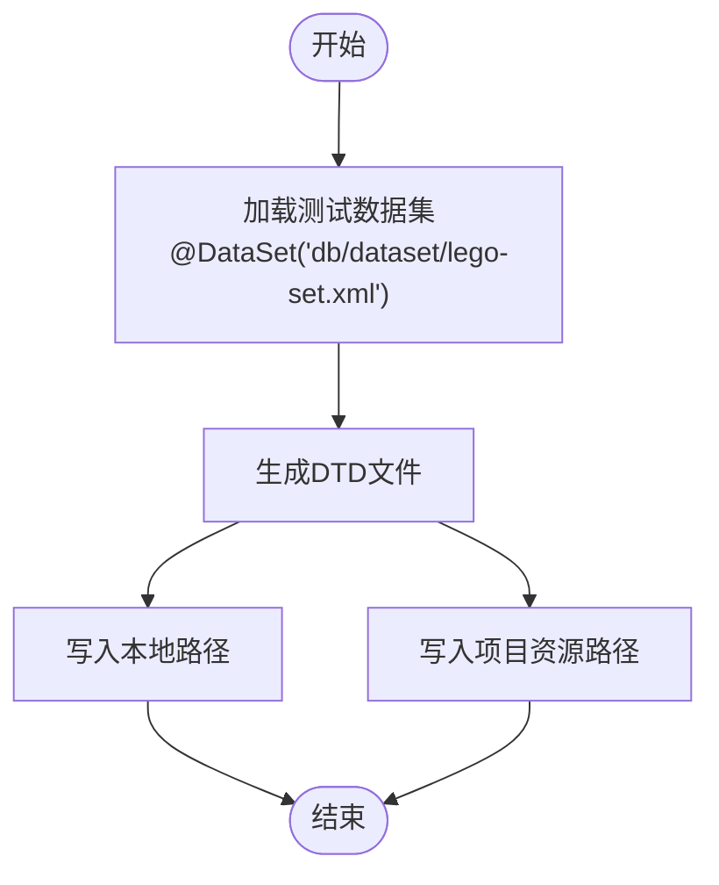
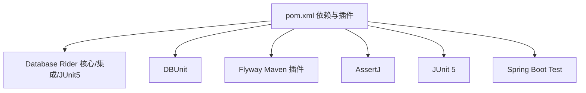

# 测试策略

<cite>
**本文引用的文件**
- [ProjectBaseTest.java](file://src/test/java/org/mvnsearch/mybatis/demo/ProjectBaseTest.java)
- [DataBaseTest.java](file://src/test/java/org/mvnsearch/mybatis/demo/DataBaseTest.java)
- [LegoSetMapperTest.java](file://src/test/java/org/mvnsearch/mybatis/demo/repo/LegoSetMapperTest.java)
- [ShopMapperTest.java](file://src/test/java/org/mvnsearch/mybatis/demo/repo/ShopMapperTest.java)
- [LegoSetMapper.java](file://src/main/java/org/mvnsearch/mybatis/demo/repo/LegoSetMapper.java)
- [ShopMapper.java](file://src/main/java/org/mvnsearch/mybatis/demo/repo/ShopMapper.java)
- [LegoSet.java](file://src/main/java/org/mvnsearch/mybatis/demo/model/LegoSet.java)
- [Shop.java](file://src/main/java/org/mvnsearch/mybatis/demo/model/Shop.java)
- [lego-set.xml](file://src/test/resources/db/dataset/lego-set.xml)
- [shop.xml](file://src/test/resources/db/dataset/shop.xml)
- [database.dtd](file://src/test/resources/db/dataset/database.dtd)
- [V1__logo_set.sql](file://src/test/resources/db/migration/V1__logo_set.sql)
- [V2__shop.sql](file://src/test/resources/db/migration/V2__shop.sql)
- [application-test.properties](file://src/test/resources/application-test.properties)
- [pom.xml](file://pom.xml)
</cite>

## 目录
1. [引言](#引言)
2. [项目结构](#项目结构)
3. [核心组件](#核心组件)
4. [架构总览](#架构总览)
5. [详细组件分析](#详细组件分析)
6. [依赖分析](#依赖分析)
7. [性能考虑](#性能考虑)
8. [故障排查指南](#故障排查指南)
9. [结论](#结论)
10. [附录](#附录)

## 引言
本测试策略文档面向MyBatis Spring Demo项目，系统阐述测试架构与实施方法，重点覆盖以下方面：
- 单元测试与集成测试设计原则
- LegoSetMapperTest与ShopMapperTest的实现模式
- Database Rider的使用与测试数据管理策略
- 测试基类ProjectBaseTest与DataBaseTest的作用与扩展机制
- 测试数据集的组织结构与XML格式规范
- 测试覆盖率与质量标准建议
- 测试环境搭建与数据库迁移在测试中的应用
- 测试最佳实践、断言策略与模拟对象使用
- 持续集成中的测试执行流程与报告生成

## 项目结构
测试相关目录与文件分布如下：
- 测试基类与通用配置：ProjectBaseTest、DataBaseTest
- Mapper层单元测试：LegoSetMapperTest、ShopMapperTest
- 测试数据集：lego-set.xml、shop.xml、database.dtd
- 数据库迁移脚本：V1__logo_set.sql、V2__shop.sql
- 测试配置：application-test.properties
- 依赖与插件：pom.xml（含Database Rider、Flyway、JDBC等）

图表来源
- [ProjectBaseTest.java:1-22](file://src/test/java/org/mvnsearch/mybatis/demo/ProjectBaseTest.java#L1-L22)
- [DataBaseTest.java:1-27](file://src/test/java/org/mvnsearch/mybatis/demo/DataBaseTest.java#L1-L27)
- [LegoSetMapperTest.java:1-45](file://src/test/java/org/mvnsearch/mybatis/demo/repo/LegoSetMapperTest.java#L1-L45)
- [ShopMapperTest.java:1-30](file://src/test/java/org/mvnsearch/mybatis/demo/repo/ShopMapperTest.java#L1-L30)
- [LegoSetMapper.java:1-21](file://src/main/java/org/mvnsearch/mybatis/demo/repo/LegoSetMapper.java#L1-L21)
- [ShopMapper.java:1-21](file://src/main/java/org/mvnsearch/mybatis/demo/repo/ShopMapper.java#L1-L21)
- [lego-set.xml:1-7](file://src/test/resources/db/dataset/lego-set.xml#L1-L7)
- [shop.xml:1-8](file://src/test/resources/db/dataset/shop.xml#L1-L8)
- [database.dtd:1-25](file://src/test/resources/db/dataset/database.dtd#L1-L25)
- [V1__logo_set.sql:1-6](file://src/test/resources/db/migration/V1__logo_set.sql#L1-L6)
- [V2__shop.sql:1-7](file://src/test/resources/db/migration/V2__shop.sql#L1-L7)
- [application-test.properties:1-1](file://src/test/resources/application-test.properties#L1-L1)

章节来源
- [ProjectBaseTest.java:1-22](file://src/test/java/org/mvnsearch/mybatis/demo/ProjectBaseTest.java#L1-L22)
- [DataBaseTest.java:1-27](file://src/test/java/org/mvnsearch/mybatis/demo/DataBaseTest.java#L1-L27)
- [LegoSetMapperTest.java:1-45](file://src/test/java/org/mvnsearch/mybatis/demo/repo/LegoSetMapperTest.java#L1-L45)
- [ShopMapperTest.java:1-30](file://src/test/java/org/mvnsearch/mybatis/demo/repo/ShopMapperTest.java#L1-L30)
- [lego-set.xml:1-7](file://src/test/resources/db/dataset/lego-set.xml#L1-L7)
- [shop.xml:1-8](file://src/test/resources/db/dataset/shop.xml#L1-L8)
- [database.dtd:1-25](file://src/test/resources/db/dataset/database.dtd#L1-L25)
- [V1__logo_set.sql:1-6](file://src/test/resources/db/migration/V1__logo_set.sql#L1-L6)
- [V2__shop.sql:1-7](file://src/test/resources/db/migration/V2__shop.sql#L1-L7)
- [application-test.properties:1-1](file://src/test/resources/application-test.properties#L1-L1)
- [pom.xml:1-141](file://pom.xml#L1-L141)

## 核心组件
- 测试基类ProjectBaseTest：统一的Spring Boot测试配置与Database Rider注解，为所有测试提供共享上下文与数据库行为。
- 测试数据集：lego-set.xml与shop.xml分别对应LegoSet与Shop实体的测试数据；database.dtd定义了数据集元素与属性约束。
- Mapper层测试：LegoSetMapperTest与ShopMapperTest通过@DataSet注解加载对应数据集，验证Mapper接口查询逻辑。
- 数据库迁移：V1__logo_set.sql与V2__shop.sql用于初始化测试表结构，配合Flyway插件在测试前清理与迁移。

章节来源
- [ProjectBaseTest.java:15-21](file://src/test/java/org/mvnsearch/mybatis/demo/ProjectBaseTest.java#L15-L21)
- [LegoSetMapperTest.java:26-44](file://src/test/java/org/mvnsearch/mybatis/demo/repo/LegoSetMapperTest.java#L26-L44)
- [ShopMapperTest.java:11-29](file://src/test/java/org/mvnsearch/mybatis/demo/repo/ShopMapperTest.java#L11-L29)
- [lego-set.xml:1-7](file://src/test/resources/db/dataset/lego-set.xml#L1-L7)
- [shop.xml:1-8](file://src/test/resources/db/dataset/shop.xml#L1-L8)
- [database.dtd:1-25](file://src/test/resources/db/dataset/database.dtd#L1-L25)
- [V1__logo_set.sql:1-6](file://src/test/resources/db/migration/V1__logo_set.sql#L1-L6)
- [V2__shop.sql:1-7](file://src/test/resources/db/migration/V2__shop.sql#L1-L7)

## 架构总览
测试体系采用“基类统一配置 + 数据集驱动 + 迁移初始化”的架构，确保每个测试用例可重复、隔离且可维护。

图表来源
- [ProjectBaseTest.java:15-21](file://src/test/java/org/mvnsearch/mybatis/demo/ProjectBaseTest.java#L15-L21)
- [LegoSetMapperTest.java:26-44](file://src/test/java/org/mvnsearch/mybatis/demo/repo/LegoSetMapperTest.java#L26-L44)
- [ShopMapperTest.java:11-29](file://src/test/java/org/mvnsearch/mybatis/demo/repo/ShopMapperTest.java#L11-L29)
- [LegoSetMapper.java:12-20](file://src/main/java/org/mvnsearch/mybatis/demo/repo/LegoSetMapper.java#L12-L20)
- [ShopMapper.java:12-20](file://src/main/java/org/mvnsearch/mybatis/demo/repo/ShopMapper.java#L12-L20)
- [lego-set.xml:1-7](file://src/test/resources/db/dataset/lego-set.xml#L1-L7)
- [shop.xml:1-8](file://src/test/resources/db/dataset/shop.xml#L1-L8)
- [pom.xml:112-136](file://pom.xml#L112-L136)

## 详细组件分析

### 测试基类与扩展机制
- ProjectBaseTest作为抽象基类，通过@SpringJUnitConfig加载应用配置，@SpringBootTest启用Web环境或服务上下文，@ActiveProfiles("test")切换测试配置文件，@DBRider与@DBUnit启用Database Rider与DBUnit能力，统一数据库行为（如schema、序列过滤、MySQL类型）。
- 所有具体测试类继承该基类，自动获得上述能力，减少重复配置，提升一致性与可维护性。

图表来源
- [ProjectBaseTest.java:15-21](file://src/test/java/org/mvnsearch/mybatis/demo/ProjectBaseTest.java#L15-L21)
- [LegoSetMapperTest.java:27](file://src/test/java/org/mvnsearch/mybatis/demo/repo/LegoSetMapperTest.java#L27)
- [ShopMapperTest.java:12](file://src/test/java/org/mvnsearch/mybatis/demo/repo/ShopMapperTest.java#L12)
- [DataBaseTest.java:12](file://src/test/java/org/mvnsearch/mybatis/demo/DataBaseTest.java#L12)

章节来源
- [ProjectBaseTest.java:15-21](file://src/test/java/org/mvnsearch/mybatis/demo/ProjectBaseTest.java#L15-L21)

### Mapper单元测试模式（LegoSetMapperTest）
- 使用@DataSet("db/dataset/lego-set.xml")在测试前注入测试数据，确保查询条件可用。
- 通过@Autowired注入LegoSetMapper，分别验证findById与findByName两个查询方法，断言返回非空。
- 断言策略采用AssertJ，强调简洁与可读性。

图表来源
- [LegoSetMapperTest.java:26-44](file://src/test/java/org/mvnsearch/mybatis/demo/repo/LegoSetMapperTest.java#L26-L44)
- [lego-set.xml:1-7](file://src/test/resources/db/dataset/lego-set.xml#L1-L7)
- [LegoSetMapper.java:12-20](file://src/main/java/org/mvnsearch/mybatis/demo/repo/LegoSetMapper.java#L12-L20)

章节来源
- [LegoSetMapperTest.java:26-44](file://src/test/java/org/mvnsearch/mybatis/demo/repo/LegoSetMapperTest.java#L26-L44)
- [LegoSetMapper.java:12-20](file://src/main/java/org/mvnsearch/mybatis/demo/repo/LegoSetMapper.java#L12-L20)

### Mapper单元测试模式（ShopMapperTest）
- 使用@DataSet("db/dataset/shop.xml")加载商店数据，验证findById与findByName查询。
- 断言策略与LegoSetMapperTest一致，强调结果非空与基本字段存在。

图表来源
- [ShopMapperTest.java:11-29](file://src/test/java/org/mvnsearch/mybatis/demo/repo/ShopMapperTest.java#L11-L29)
- [shop.xml:1-8](file://src/test/resources/db/dataset/shop.xml#L1-L8)
- [ShopMapper.java:12-20](file://src/main/java/org/mvnsearch/mybatis/demo/repo/ShopMapper.java#L12-L20)

章节来源
- [ShopMapperTest.java:11-29](file://src/test/java/org/mvnsearch/mybatis/demo/repo/ShopMapperTest.java#L11-L29)
- [ShopMapper.java:12-20](file://src/main/java/org/mvnsearch/mybatis/demo/repo/ShopMapper.java#L12-L20)

### 测试数据管理与DTD生成（DataBaseTest）
- 通过@DataSet("db/dataset/lego-set.xml")演示数据集加载。
- 提供testDTDGeneration方法，利用DBUnit生成数据库结构对应的DTD文件，便于维护database.dtd，确保数据集与数据库结构保持一致。

图表来源
- [DataBaseTest.java:14-25](file://src/test/java/org/mvnsearch/mybatis/demo/DataBaseTest.java#L14-L25)
- [lego-set.xml:1-7](file://src/test/resources/db/dataset/lego-set.xml#L1-L7)
- [database.dtd:1-25](file://src/test/resources/db/dataset/database.dtd#L1-L25)

章节来源
- [DataBaseTest.java:12-25](file://src/test/java/org/mvnsearch/mybatis/demo/DataBaseTest.java#L12-L25)

### 测试数据集组织与XML格式
- 数据集文件采用Flat XML格式，根元素为dataset，子元素对应表名（如lego_set、shop），属性映射列值。
- DTD文件定义dataset元素及其子元素的结构与属性，确保数据集与数据库结构一致。
- 示例数据集包含两条记录，分别用于LegoSet与Shop的查询验证。

章节来源
- [lego-set.xml:1-7](file://src/test/resources/db/dataset/lego-set.xml#L1-L7)
- [shop.xml:1-8](file://src/test/resources/db/dataset/shop.xml#L1-L8)
- [database.dtd:1-25](file://src/test/resources/db/dataset/database.dtd#L1-L25)

### 数据库迁移与测试环境
- 迁移脚本位于src/test/resources/db/migration，包含V1__logo_set.sql与V2__shop.sql，分别创建lego_set与shop表。
- Maven Flyway插件在测试阶段自动执行迁移，确保测试数据库结构与脚本一致。
- 配置中指定迁移位置为filesystem:src/test/resources/db/migration，并设置测试数据库连接参数。

章节来源
- [V1__logo_set.sql:1-6](file://src/test/resources/db/migration/V1__logo_set.sql#L1-L6)
- [V2__shop.sql:1-7](file://src/test/resources/db/migration/V2__shop.sql#L1-L7)
- [pom.xml:112-136](file://pom.xml#L112-L136)

## 依赖分析
- Database Rider与DBUnit：提供基于注解的数据集加载、事务回滚与数据库清理能力。
- Flyway：负责测试数据库的迁移与初始化。
- AssertJ：提供流畅的断言API，增强测试可读性。
- JUnit 5：测试运行与生命周期管理。
- Spring Boot Test：提供Spring上下文与Web环境支持。

图表来源
- [pom.xml:62-100](file://pom.xml#L62-L100)
- [pom.xml:112-136](file://pom.xml#L112-L136)

章节来源
- [pom.xml:62-100](file://pom.xml#L62-L100)
- [pom.xml:112-136](file://pom.xml#L112-L136)

## 性能考虑
- 测试数据量控制：尽量精简数据集，仅包含必要记录，避免影响测试执行时间。
- 数据集复用：通过合理拆分数据集文件，减少重复导入与清理成本。
- 迁移脚本优化：合并相近迁移，避免频繁DDL变更导致的迁移耗时。
- 并发测试：在CI环境中合理配置并行度，避免数据库连接争用。

## 故障排查指南
- 数据集不生效：检查@DataSet注解路径是否正确，确认database.dtd与表结构一致。
- DTD不匹配：运行DataBaseTest的testDTDGeneration方法重新生成DTD文件。
- 迁移失败：核对Flyway插件配置与数据库连接参数，确认迁移脚本路径与权限。
- 断言失败：确认Mapper查询条件与数据集字段一致，必要时打印或断言关键字段值。

章节来源
- [DataBaseTest.java:20-25](file://src/test/java/org/mvnsearch/mybatis/demo/DataBaseTest.java#L20-L25)
- [pom.xml:112-136](file://pom.xml#L112-L136)

## 结论
本测试策略以ProjectBaseTest为核心，结合Database Rider与Flyway，构建了稳定、可维护的测试体系。通过明确的数据集组织与迁移机制，确保Mapper层测试的可重复性与准确性。建议在后续迭代中逐步完善覆盖率与质量标准，并在CI中引入报告生成与告警机制。

## 附录

### 测试覆盖率与质量标准（建议）
- 单元测试覆盖率：目标达到关键Mapper方法与核心业务逻辑100%覆盖。
- 集成测试覆盖率：目标覆盖跨Mapper协作与事务边界场景。
- 质量门禁：断言必须明确、可读性强；错误信息具备上下文；异常场景需覆盖。

### 测试最佳实践
- 命名规范：测试方法命名清晰表达前置条件、操作与期望结果。
- 断言策略：优先使用AssertJ，断言应聚焦关键字段与业务语义。
- 模拟对象：在需要隔离外部依赖时，使用Mockito对Service或DAO进行模拟。
- 数据隔离：每个测试独立导入数据集，避免相互污染。

### 持续集成中的测试执行与报告
- 执行流程：编译 → 数据库迁移 → 运行JUnit测试 → 生成报告。
- 报告生成：建议集成Surefire/Failsafe插件输出JUnit XML与HTML报告，便于CI平台展示。