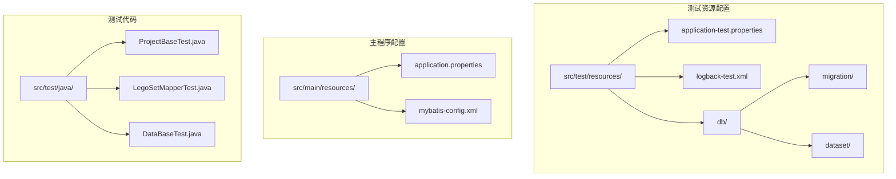
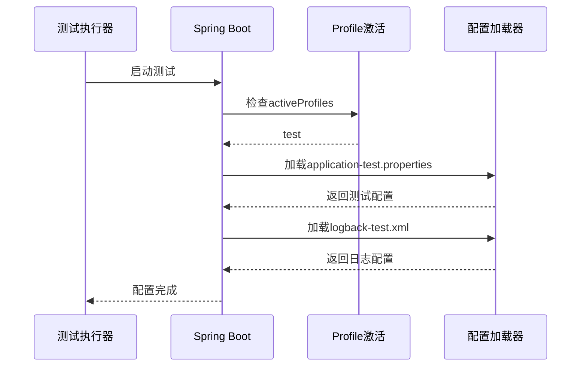
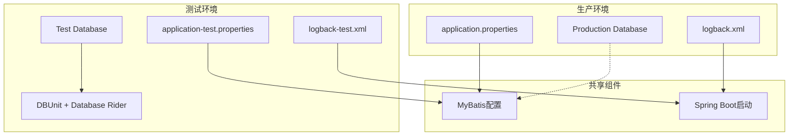
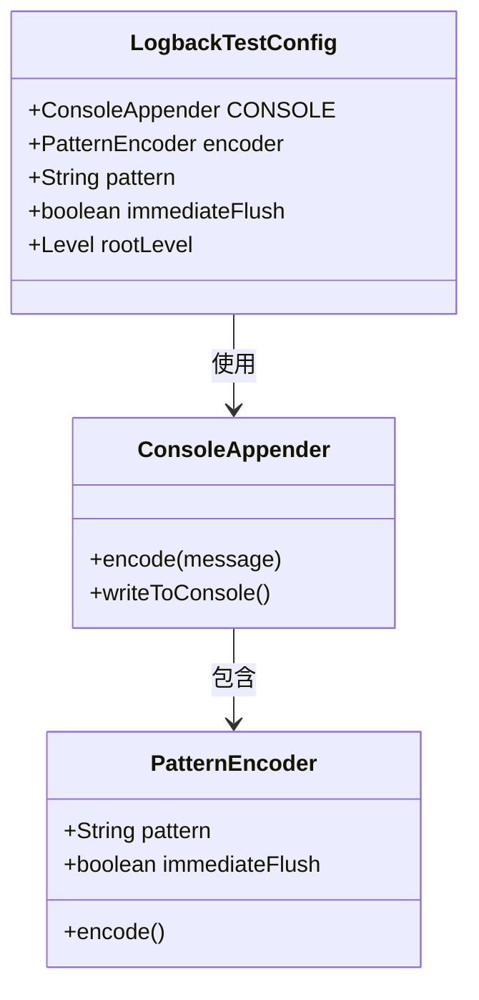
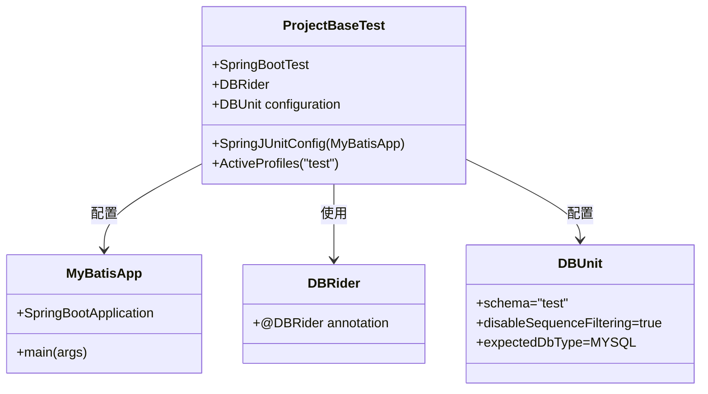
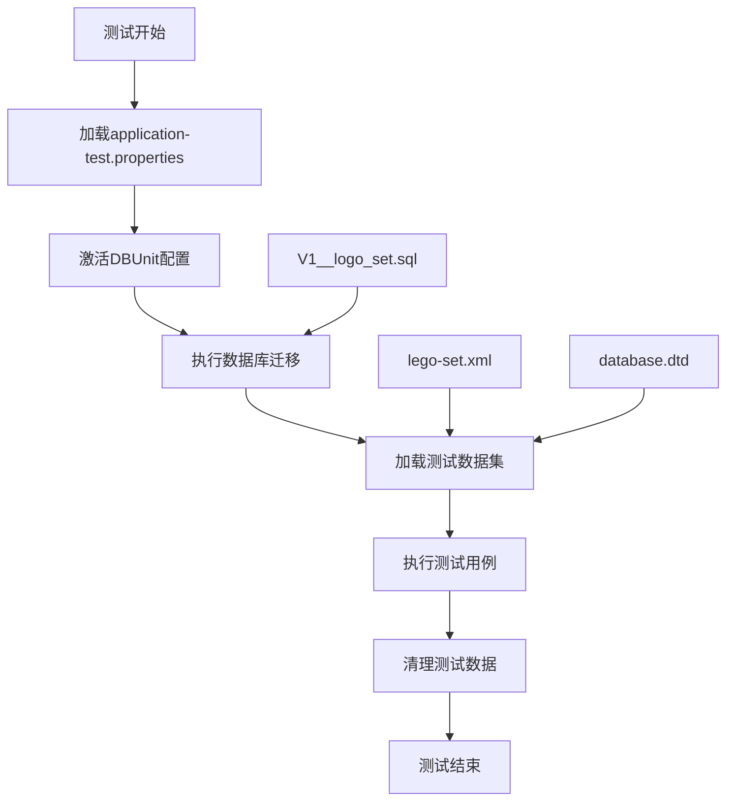
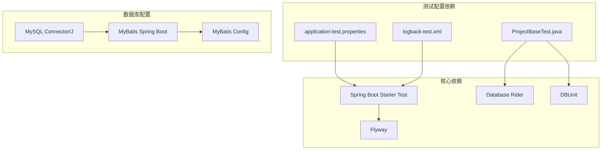

# 测试配置

<cite>
**本文档引用的文件**
- [application-test.properties](file://src/test/resources/application-test.properties)
- [logback-test.xml](file://src/test/resources/logback-test.xml)
- [application.properties](file://src/main/resources/application.properties)
- [ProjectBaseTest.java](file://src/test/java/org/mvnsearch/mybatis/demo/ProjectBaseTest.java)
- [DataBaseTest.java](file://src/test/java/org/mvnsearch/mybatis/demo/DataBaseTest.java)
- [LegoSetMapperTest.java](file://src/test/java/org/mvnsearch/mybatis/demo/repo/LegoSetMapperTest.java)
- [pom.xml](file://pom.xml)
- [V1__logo_set.sql](file://src/test/resources/db/migration/V1__logo_set.sql)
- [lego-set.xml](file://src/test/resources/db/dataset/lego-set.xml)
- [MyBatisApp.java](file://src/main/java/org/mvnsearch/mybatis/demo/MyBatisApp.java)
- [mybatis-config.xml](file://src/main/resources/mybatis-config.xml)
</cite>

## 目录
1. [简介](#简介)
2. [项目结构](#项目结构)
3. [核心组件](#核心组件)
4. [架构概览](#架构概览)
5. [详细组件分析](#详细组件分析)
6. [依赖关系分析](#依赖关系分析)
7. [性能考虑](#性能考虑)
8. [故障排除指南](#故障排除指南)
9. [结论](#结论)

## 简介

本文件详细说明了MyBatis Spring Demo项目中的测试配置管理，重点分析了`application-test.properties`和`logback-test.xml`两个关键配置文件的作用、配置选项以及测试环境与生产环境的配置差异。该文档旨在帮助开发者理解和优化测试配置，确保测试环境的稳定性和可维护性。

## 项目结构

该项目采用标准的Maven项目结构，测试资源配置位于`src/test/resources`目录下，包含以下关键文件：



**图表来源**
- [application-test.properties:1-1](file://src/test/resources/application-test.properties#L1-L1)
- [logback-test.xml:1-13](file://src/test/resources/logback-test.xml#L1-L13)
- [application.properties:1-11](file://src/main/resources/application.properties#L1-L11)

**章节来源**
- [application-test.properties:1-1](file://src/test/resources/application-test.properties#L1-L1)
- [logback-test.xml:1-13](file://src/test/resources/logback-test.xml#L1-L13)
- [application.properties:1-11](file://src/main/resources/application.properties#L1-L11)

## 核心组件

### 测试配置文件组织结构

测试配置采用了Spring Boot的标准约定：
- **application-test.properties**: 测试环境专用属性配置
- **logback-test.xml**: 测试环境日志配置
- **db/**: 数据库测试相关文件
  - **migration/**: Flyway数据库迁移脚本
  - **dataset/**: 测试数据集定义

### 配置文件加载机制

测试配置通过Spring Profile激活机制自动加载：



**图表来源**
- [ProjectBaseTest.java:17-17](file://src/test/java/org/mvnsearch/mybatis/demo/ProjectBaseTest.java#L17-L17)
- [application-test.properties:1-1](file://src/test/resources/application-test.properties#L1-L1)
- [logback-test.xml:1-13](file://src/test/resources/logback-test.xml#L1-L13)

**章节来源**
- [ProjectBaseTest.java:17-17](file://src/test/java/org/mvnsearch/mybatis/demo/ProjectBaseTest.java#L17-L17)
- [application-test.properties:1-1](file://src/test/resources/application-test.properties#L1-L1)
- [logback-test.xml:1-13](file://src/test/resources/logback-test.xml#L1-L13)

## 架构概览

测试配置架构展示了测试环境与生产环境的分离设计：



**图表来源**
- [application-test.properties:1-1](file://src/test/resources/application-test.properties#L1-L1)
- [logback-test.xml:1-13](file://src/test/resources/logback-test.xml#L1-L13)
- [application.properties:1-11](file://src/main/resources/application.properties#L1-L11)

## 详细组件分析

### application-test.properties 分析

当前测试属性文件内容极其精简，仅包含注释行：

```properties
### datasource
```

这表明测试配置目前主要依赖于默认值和生产环境配置的覆盖。

**配置选项说明：**
- **数据源配置**: 当前未定义，使用默认配置
- **MyBatis配置**: 继承主配置中的MyBatis设置

### logback-test.xml 分析

测试日志配置具有以下特点：



**图表来源**
- [logback-test.xml:3-8](file://src/test/resources/logback-test.xml#L3-L8)

**配置特性：**
- **控制台输出**: 使用ConsoleAppender进行实时日志输出
- **日志级别**: root级别设置为WARN，过滤掉DEBUG和TRACE级别的日志
- **格式化**: 使用时间戳、级别、类名和消息的格式模式
- **性能优化**: 设置immediateFlush为false，提高日志写入性能

**章节来源**
- [logback-test.xml:1-13](file://src/test/resources/logback-test.xml#L1-L13)

### 测试基类配置分析

测试基类`ProjectBaseTest`展示了完整的测试配置：



**图表来源**
- [ProjectBaseTest.java:15-19](file://src/test/java/org/mvnsearch/mybatis/demo/ProjectBaseTest.java#L15-L19)

**配置要点：**
- **Profile激活**: 通过`@ActiveProfiles("test")`激活测试配置
- **数据库集成**: 集成DBUnit和Database Rider进行数据库测试
- **Schema配置**: 设置测试数据库schema为"test"
- **MySQL兼容**: 配置预期数据库类型为MySQL

**章节来源**
- [ProjectBaseTest.java:1-22](file://src/test/java/org/mvnsearch/mybatis/demo/ProjectBaseTest.java#L1-L22)

### 测试数据配置分析

测试数据通过多种方式管理：



**图表来源**
- [V1__logo_set.sql:1-6](file://src/test/resources/db/migration/V1__logo_set.sql#L1-L6)
- [lego-set.xml:1-7](file://src/test/resources/db/dataset/lego-set.xml#L1-L7)

**章节来源**
- [V1__logo_set.sql:1-6](file://src/test/resources/db/migration/V1__logo_set.sql#L1-L6)
- [lego-set.xml:1-7](file://src/test/resources/db/dataset/lego-set.xml#L1-L7)

## 依赖关系分析

测试配置与项目其他组件的依赖关系：



**图表来源**
- [pom.xml:62-85](file://pom.xml#L62-L85)
- [ProjectBaseTest.java:3-19](file://src/test/java/org/mvnsearch/mybatis/demo/ProjectBaseTest.java#L3-L19)

**章节来源**
- [pom.xml:1-141](file://pom.xml#L1-L141)
- [ProjectBaseTest.java:1-22](file://src/test/java/org/mvnsearch/mybatis/demo/ProjectBaseTest.java#L1-L22)

## 性能考虑

### 日志性能优化

测试环境的日志配置在性能方面有以下优化：

- **缓冲输出**: `immediateFlush=false`减少磁盘I/O操作
- **级别过滤**: WARN级别过滤掉大量DEBUG日志，降低CPU开销
- **格式简化**: 简化的日志格式减少字符串处理开销

### 数据库测试性能

- **Flyway集成**: 自动管理数据库迁移，避免手动维护成本
- **数据集隔离**: 每个测试使用独立的数据集，避免数据污染
- **连接池配置**: 默认连接池配置适合测试场景

## 故障排除指南

### 常见配置问题

1. **Profile未激活**
   - 确保测试类使用`@ActiveProfiles("test")`
   - 检查application-test.properties文件路径

2. **数据库连接失败**
   - 验证MySQL服务状态
   - 检查数据库URL、用户名和密码配置
   - 确认测试数据库存在且可访问

3. **日志输出异常**
   - 检查logback-test.xml语法
   - 验证日志级别配置
   - 确认控制台权限

### 调试建议

- 使用更详细的日志级别进行问题诊断
- 检查数据库迁移是否成功执行
- 验证测试数据集的完整性和正确性

**章节来源**
- [ProjectBaseTest.java:17-17](file://src/test/java/org/mvnsearch/mybatis/demo/ProjectBaseTest.java#L17-L17)
- [logback-test.xml:10-10](file://src/test/resources/logback-test.xml#L10-L10)

## 结论

本测试配置管理系统展现了良好的分层设计和最佳实践：

1. **清晰的环境分离**: 测试和生产环境配置完全分离
2. **标准化的命名约定**: 遵循Spring Boot标准配置文件命名
3. **高效的日志配置**: 生产环境友好的日志级别和格式
4. **完善的数据库测试支持**: 集成DBUnit和Database Rider
5. **自动化迁移管理**: 使用Flyway进行数据库版本控制

建议的改进方向：
- 扩展application-test.properties包含完整的数据库配置
- 添加更多日志级别选项以支持不同调试需求
- 实现配置参数化，支持多环境部署
- 增加配置验证机制确保配置有效性