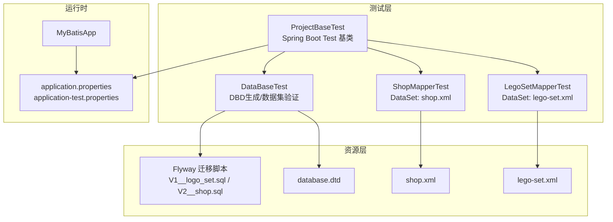
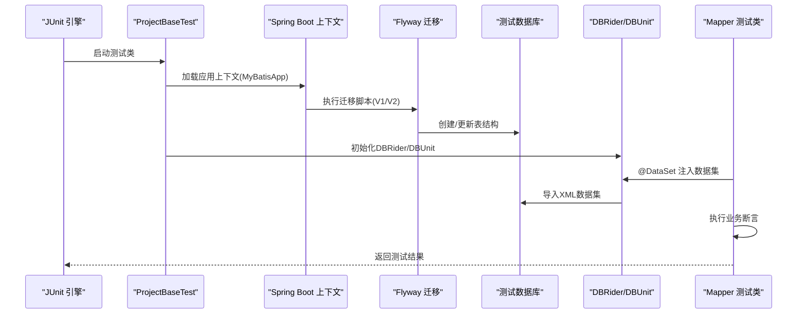
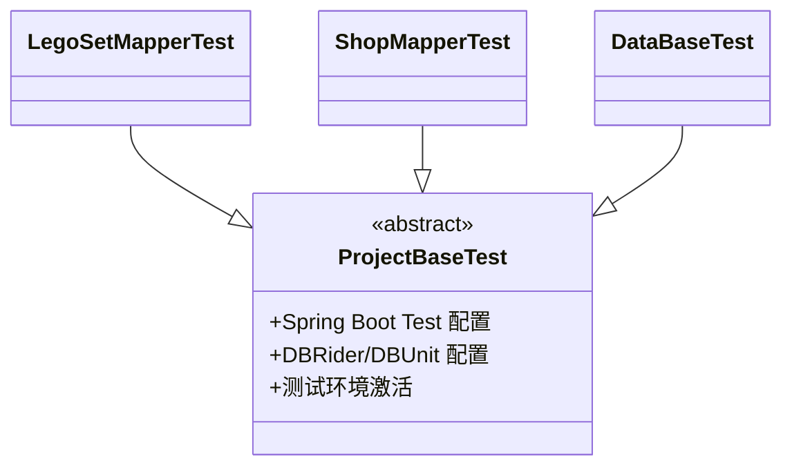
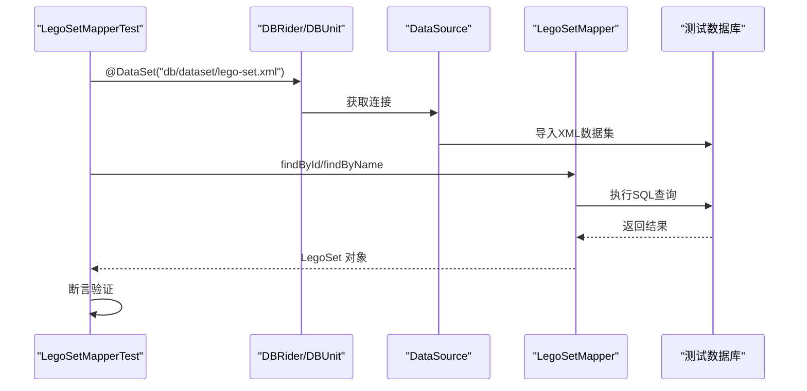
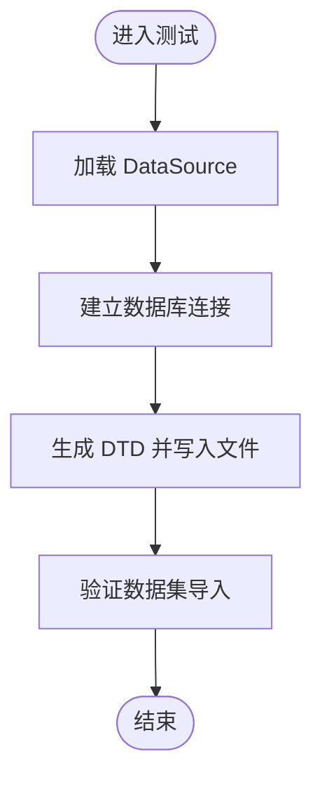
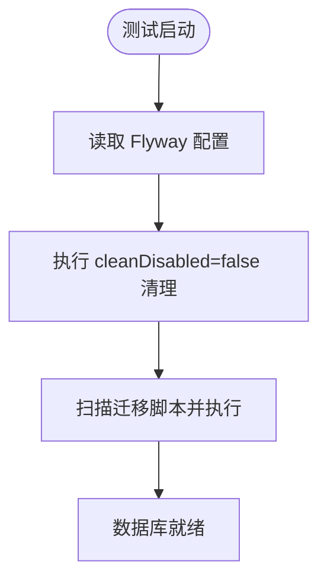
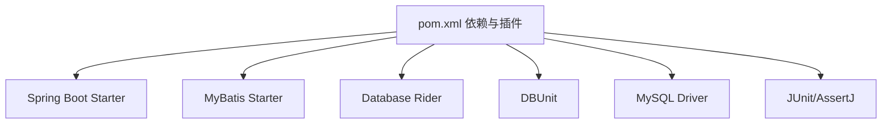

# 集成测试

<cite>
**本文引用的文件**
- [ProjectBaseTest.java](file://src/test/java/org/mvnsearch/mybatis/demo/ProjectBaseTest.java)
- [DataBaseTest.java](file://src/test/java/org/mvnsearch/mybatis/demo/DataBaseTest.java)
- [LegoSetMapperTest.java](file://src/test/java/org/mvnsearch/mybatis/demo/repo/LegoSetMapperTest.java)
- [ShopMapperTest.java](file://src/test/java/org/mvnsearch/mybatis/demo/repo/ShopMapperTest.java)
- [application-test.properties](file://src/test/resources/application-test.properties)
- [application.properties](file://src/main/resources/application.properties)
- [lego-set.xml](file://src/test/resources/db/dataset/lego-set.xml)
- [shop.xml](file://src/test/resources/db/dataset/shop.xml)
- [database.dtd](file://src/test/resources/db/dataset/database.dtd)
- [V1__logo_set.sql](file://src/test/resources/db/migration/V1__logo_set.sql)
- [V2__shop.sql](file://src/test/resources/db/migration/V2__shop.sql)
- [pom.xml](file://pom.xml)
- [MyBatisApp.java](file://src/main/java/org/mvnsearch/mybatis/demo/MyBatisApp.java)
</cite>

## 目录
1. [简介](#简介)
2. [项目结构](#项目结构)
3. [核心组件](#核心组件)
4. [架构总览](#架构总览)
5. [详细组件分析](#详细组件分析)
6. [依赖分析](#依赖分析)
7. [性能考虑](#性能考虑)
8. [故障排查指南](#故障排查指南)
9. [结论](#结论)
10. [附录](#附录)

## 简介
本文件面向集成测试场景，系统性阐述本项目中Database Rider（DBUnit + DBRider）与Spring Boot Test的结合实践，重点覆盖：
- 测试基类ProjectBaseTest的设计理念与扩展机制
- 数据库级别测试策略与DataSet驱动的数据准备
- 测试环境搭建：Flyway迁移脚本在测试中的应用与测试数据库初始化
- 编写集成测试的最佳实践：事务管理、数据清理与测试隔离
- 数据库连接与事务回滚机制的处理方式

## 项目结构
测试相关目录与文件组织如下：
- 测试基类与通用配置：ProjectBaseTest、application-test.properties
- Mapper集成测试：LegoSetMapperTest、ShopMapperTest
- 数据集与模式定义：lego-set.xml、shop.xml、database.dtd
- Flyway迁移脚本：V1__logo_set.sql、V2__shop.sql
- Maven依赖与插件：pom.xml
- 应用入口：MyBatisApp.java

图表来源
- [ProjectBaseTest.java:1-22](file://src/test/java/org/mvnsearch/mybatis/demo/ProjectBaseTest.java#L1-L22)
- [LegoSetMapperTest.java:1-45](file://src/test/java/org/mvnsearch/mybatis/demo/repo/LegoSetMapperTest.java#L1-L45)
- [ShopMapperTest.java:1-30](file://src/test/java/org/mvnsearch/mybatis/demo/repo/ShopMapperTest.java#L1-L30)
- [DataBaseTest.java:1-27](file://src/test/java/org/mvnsearch/mybatis/demo/DataBaseTest.java#L1-L27)
- [lego-set.xml:1-7](file://src/test/resources/db/dataset/lego-set.xml#L1-L7)
- [shop.xml:1-8](file://src/test/resources/db/dataset/shop.xml#L1-L8)
- [database.dtd:1-25](file://src/test/resources/db/dataset/database.dtd#L1-L25)
- [V1__logo_set.sql:1-6](file://src/test/resources/db/migration/V1__logo_set.sql#L1-L6)
- [V2__shop.sql:1-7](file://src/test/resources/db/migration/V2__shop.sql#L1-L7)
- [application.properties:1-11](file://src/main/resources/application.properties#L1-L11)
- [application-test.properties:1-1](file://src/test/resources/application-test.properties#L1-L1)
- [MyBatisApp.java:1-17](file://src/main/java/org/mvnsearch/mybatis/demo/MyBatisApp.java#L1-L17)

章节来源
- [ProjectBaseTest.java:1-22](file://src/test/java/org/mvnsearch/mybatis/demo/ProjectBaseTest.java#L1-L22)
- [LegoSetMapperTest.java:1-45](file://src/test/java/org/mvnsearch/mybatis/demo/repo/LegoSetMapperTest.java#L1-L45)
- [ShopMapperTest.java:1-30](file://src/test/java/org/mvnsearch/mybatis/demo/repo/ShopMapperTest.java#L1-L30)
- [DataBaseTest.java:1-27](file://src/test/java/org/mvnsearch/mybatis/demo/DataBaseTest.java#L1-L27)
- [application.properties:1-11](file://src/main/resources/application.properties#L1-L11)
- [application-test.properties:1-1](file://src/test/resources/application-test.properties#L1-L1)
- [pom.xml:1-141](file://pom.xml#L1-L141)

## 核心组件
- 测试基类ProjectBaseTest：统一承载Spring Boot Test、DBRider与DBUnit配置，为所有集成测试提供共享的上下文与数据库行为约定。
- Mapper集成测试：LegoSetMapperTest与ShopMapperTest通过@DataSet注解加载预置数据，验证MyBatis映射器的行为。
- 数据集与模式：lego-set.xml、shop.xml定义测试所需的基础数据；database.dtd声明期望的表结构元素，辅助DBD生成与校验。
- Flyway迁移：V1__logo_set.sql与V2__shop.sql在测试执行前确保数据库结构处于预期状态。
- 应用配置：application.properties提供MySQL连接信息；application-test.properties用于测试专用配置占位。

章节来源
- [ProjectBaseTest.java:10-22](file://src/test/java/org/mvnsearch/mybatis/demo/ProjectBaseTest.java#L10-L22)
- [LegoSetMapperTest.java:18-27](file://src/test/java/org/mvnsearch/mybatis/demo/repo/LegoSetMapperTest.java#L18-L27)
- [ShopMapperTest.java:3-12](file://src/test/java/org/mvnsearch/mybatis/demo/repo/ShopMapperTest.java#L3-L12)
- [lego-set.xml:1-7](file://src/test/resources/db/dataset/lego-set.xml#L1-L7)
- [shop.xml:1-8](file://src/test/resources/db/dataset/shop.xml#L1-L8)
- [database.dtd:1-25](file://src/test/resources/db/dataset/database.dtd#L1-L25)
- [V1__logo_set.sql:1-6](file://src/test/resources/db/migration/V1__logo_set.sql#L1-L6)
- [V2__shop.sql:1-7](file://src/test/resources/db/migration/V2__shop.sql#L1-L7)
- [application.properties:1-11](file://src/main/resources/application.properties#L1-L11)
- [application-test.properties:1-1](file://src/test/resources/application-test.properties#L1-L1)

## 架构总览
下图展示从测试启动到数据库准备、数据集注入与断言验证的整体流程。

图表来源
- [ProjectBaseTest.java:15-22](file://src/test/java/org/mvnsearch/mybatis/demo/ProjectBaseTest.java#L15-L22)
- [LegoSetMapperTest.java:18-27](file://src/test/java/org/mvnsearch/mybatis/demo/repo/LegoSetMapperTest.java#L18-L27)
- [ShopMapperTest.java:3-12](file://src/test/java/org/mvnsearch/mybatis/demo/repo/ShopMapperTest.java#L3-L12)
- [V1__logo_set.sql:1-6](file://src/test/resources/db/migration/V1__logo_set.sql#L1-L6)
- [V2__shop.sql:1-7](file://src/test/resources/db/migration/V2__shop.sql#L1-L7)

## 详细组件分析

### 测试基类：ProjectBaseTest
设计理念与扩展机制：
- 统一的Spring Boot Test入口：通过@SpringJUnitConfig与@SpringBootTest加载应用上下文，确保测试与生产配置一致。
- 激活测试环境：@ActiveProfiles("test")切换至测试配置文件，便于隔离真实环境。
- DBRider集成：@DBRider启用Database Rider能力，简化数据集注入与数据库清理。
- DBUnit配置：@DBUnit指定schema、序列过滤与期望数据库类型，保证跨数据库一致性与可移植性。
- 抽象基类：所有Mapper集成测试继承该基类，复用上述配置，避免重复样板代码。

图表来源
- [ProjectBaseTest.java:15-22](file://src/test/java/org/mvnsearch/mybatis/demo/ProjectBaseTest.java#L15-L22)
- [LegoSetMapperTest.java:27](file://src/test/java/org/mvnsearch/mybatis/demo/repo/LegoSetMapperTest.java#L27)
- [ShopMapperTest.java:12](file://src/test/java/org/mvnsearch/mybatis/demo/repo/ShopMapperTest.java#L12)
- [DataBaseTest.java:12](file://src/test/java/org/mvnsearch/mybatis/demo/DataBaseTest.java#L12)

章节来源
- [ProjectBaseTest.java:10-22](file://src/test/java/org/mvnsearch/mybatis/demo/ProjectBaseTest.java#L10-L22)

### Mapper集成测试：LegoSetMapperTest 与 ShopMapperTest
测试策略与数据准备：
- @DataSet注解：分别加载lego-set.xml与shop.xml，确保测试开始前数据库包含预期数据。
- 自动装配：通过@Autowired注入Mapper实例，直接调用业务方法进行断言。
- 断言验证：使用AssertJ进行结果断言，确保查询逻辑正确。

图表来源
- [LegoSetMapperTest.java:18-45](file://src/test/java/org/mvnsearch/mybatis/demo/repo/LegoSetMapperTest.java#L18-L45)
- [lego-set.xml:1-7](file://src/test/resources/db/dataset/lego-set.xml#L1-L7)

章节来源
- [LegoSetMapperTest.java:18-45](file://src/test/java/org/mvnsearch/mybatis/demo/repo/LegoSetMapperTest.java#L18-L45)
- [ShopMapperTest.java:3-30](file://src/test/java/org/mvnsearch/mybatis/demo/repo/ShopMapperTest.java#L3-L30)

### 数据库级别测试：DataBaseTest
特殊用途与策略：
- 数据集导入验证：通过@DataSet加载lego-set.xml，验证数据集是否能被正确导入。
- DTD生成：利用DBUnit生成database.dtd，帮助维护与校验数据集结构的一致性。
- 连接与写入：通过DataSource获取连接，使用FlatDtdDataSet写入目标路径，便于版本控制与团队协作。

图表来源
- [DataBaseTest.java:12-27](file://src/test/java/org/mvnsearch/mybatis/demo/DataBaseTest.java#L12-L27)

章节来源
- [DataBaseTest.java:12-27](file://src/test/java/org/mvnsearch/mybatis/demo/DataBaseTest.java#L12-L27)

### 测试环境搭建：Flyway迁移与初始化
- 迁移脚本位置：src/test/resources/db/migration/V1__logo_set.sql与V2__shop.sql。
- 插件配置：pom.xml中flyway-maven-plugin配置了迁移脚本位置、数据库连接参数与cleanDisabled=false，确保每次测试前清理并重建数据库。
- 执行时机：在测试启动阶段由Spring Boot与Flyway协同执行，确保数据库结构与测试数据集匹配。

图表来源
- [pom.xml:113-136](file://pom.xml#L113-L136)
- [V1__logo_set.sql:1-6](file://src/test/resources/db/migration/V1__logo_set.sql#L1-L6)
- [V2__shop.sql:1-7](file://src/test/resources/db/migration/V2__shop.sql#L1-L7)

章节来源
- [pom.xml:113-136](file://pom.xml#L113-L136)
- [V1__logo_set.sql:1-6](file://src/test/resources/db/migration/V1__logo_set.sql#L1-L6)
- [V2__shop.sql:1-7](file://src/test/resources/db/migration/V2__shop.sql#L1-L7)

### 数据集与模式定义
- 数据集：lego-set.xml与shop.xml以XML形式描述初始数据，配合@DataSet在测试前注入。
- 模式：database.dtd声明期望的表结构元素，辅助DBD生成与一致性校验。

章节来源
- [lego-set.xml:1-7](file://src/test/resources/db/dataset/lego-set.xml#L1-L7)
- [shop.xml:1-8](file://src/test/resources/db/dataset/shop.xml#L1-L8)
- [database.dtd:1-25](file://src/test/resources/db/dataset/database.dtd#L1-L25)

## 依赖分析
- Spring Boot Starter：提供Web、Actuator、JDBC与测试支持。
- MyBatis：mybatis-spring-boot-starter与动态SQL支持。
- Database Rider：rider-core、rider-spring、rider-junit5与DBUnit集成。
- JDBC驱动：MySQL Connector/J。
- 断言与测试引擎：AssertJ、JUnit Jupiter。

图表来源
- [pom.xml:30-100](file://pom.xml#L30-L100)

章节来源
- [pom.xml:19-28](file://pom.xml#L19-L28)
- [pom.xml:30-100](file://pom.xml#L30-L100)

## 性能考虑
- 迁移脚本数量与复杂度：尽量保持迁移脚本简洁，减少测试启动时间。
- 数据集规模：优先使用最小必要数据，避免过大数据集导致导入耗时。
- 事务回滚：在单测中建议使用回滚策略，避免频繁重建数据库结构。
- 连接池与并发：测试环境可适当调整连接池大小，避免并发冲突。

## 故障排查指南
常见问题与定位要点：
- 数据库连接失败
  - 检查application.properties中的URL、用户名与密码是否正确。
  - 确认MySQL服务已启动且端口可用。
- 迁移未执行或失败
  - 查看Flyway插件配置与脚本路径是否正确。
  - 确认cleanDisabled设置与数据库权限。
- 数据集导入异常
  - 校验XML数据集与database.dtd结构一致性。
  - 确认@DataSet注解指向的资源路径正确。
- 事务回滚不生效
  - 确认测试类继承ProjectBaseTest并使用DBRider配置。
  - 检查测试方法是否在受控事务范围内执行。

章节来源
- [application.properties:1-11](file://src/main/resources/application.properties#L1-L11)
- [pom.xml:113-136](file://pom.xml#L113-L136)
- [ProjectBaseTest.java:15-22](file://src/test/java/org/mvnsearch/mybatis/demo/ProjectBaseTest.java#L15-L22)
- [lego-set.xml:1-7](file://src/test/resources/db/dataset/lego-set.xml#L1-L7)
- [shop.xml:1-8](file://src/test/resources/db/dataset/shop.xml#L1-L8)
- [database.dtd:1-25](file://src/test/resources/db/dataset/database.dtd#L1-L25)

## 结论
本项目通过ProjectBaseTest统一整合Spring Boot Test与Database Rider，结合Flyway迁移与XML数据集，构建了稳定、可维护的集成测试体系。测试类只需关注业务断言，无需重复配置数据库与上下文，显著提升了开发效率与测试质量。

## 附录

### 编写集成测试最佳实践
- 继承ProjectBaseTest：确保共享配置与DBRider能力。
- 使用@DataSet：按需加载最小数据集，提升可读性与可维护性。
- 断言验证：使用AssertJ进行明确断言，避免模糊判断。
- 事务与隔离：依赖DBRider默认回滚策略，避免污染其他测试。
- 数据清理：通过cleanDisabled与迁移脚本确保测试前后数据库一致。

### 数据库连接与事务回滚机制
- 连接管理：通过DataSource自动获取连接，DBRider负责数据集导入与清理。
- 事务回滚：DBRider在测试结束后自动回滚，确保数据库状态可恢复。
- 隔离策略：每个测试独立加载数据集，避免相互影响。