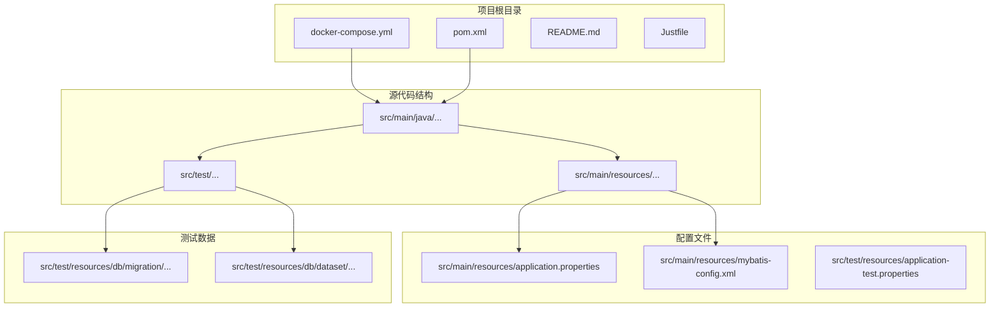
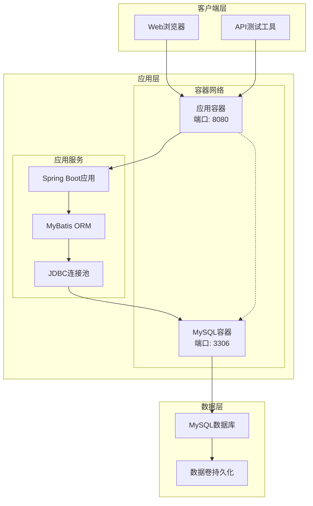
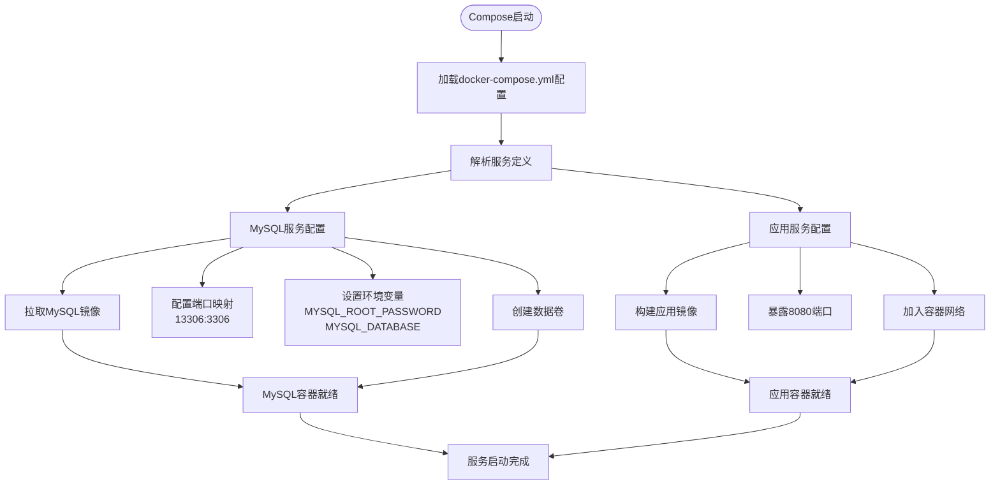
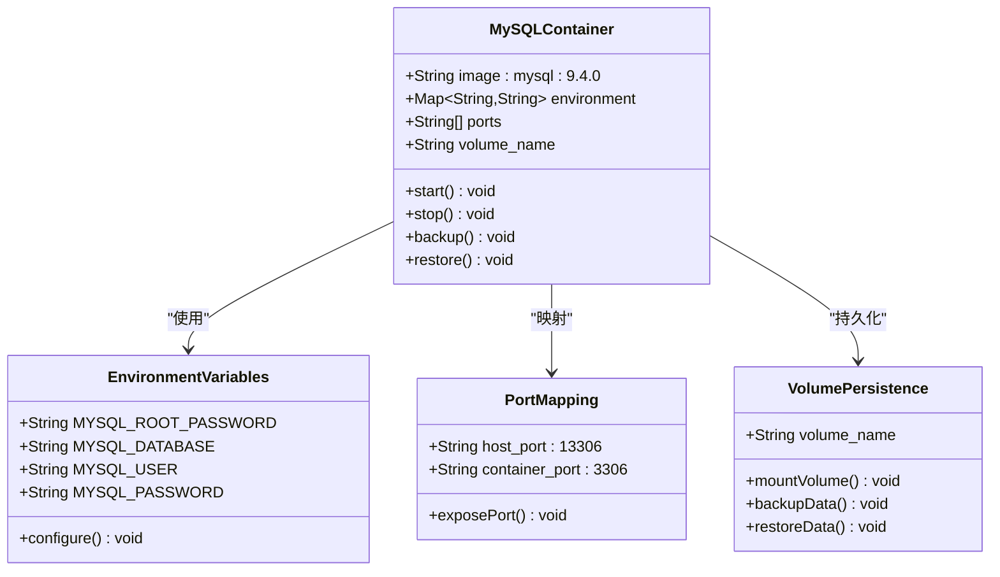
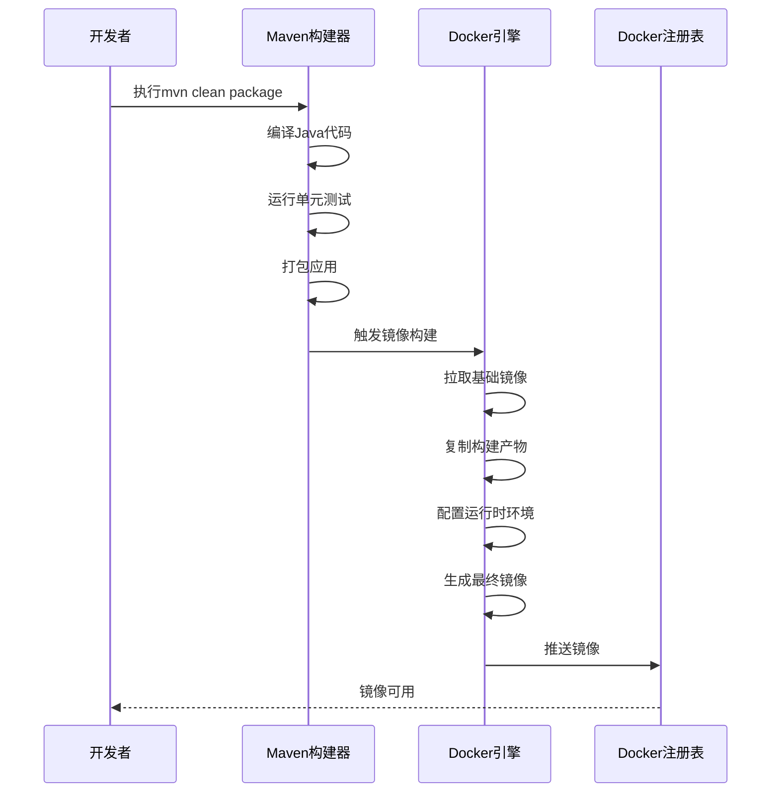
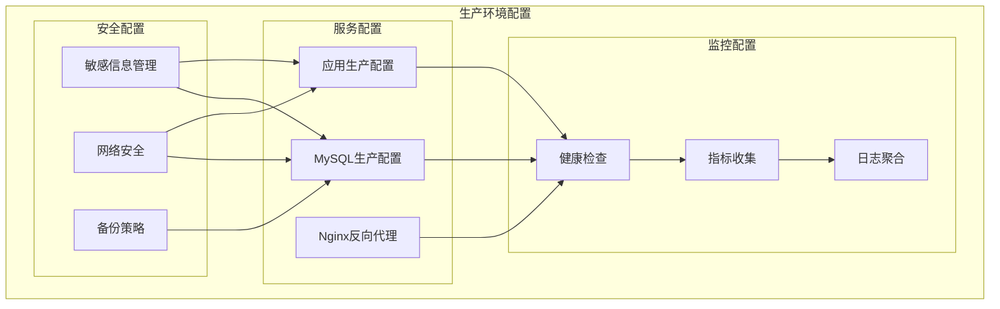
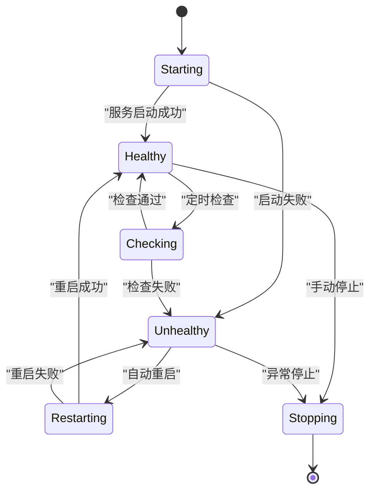
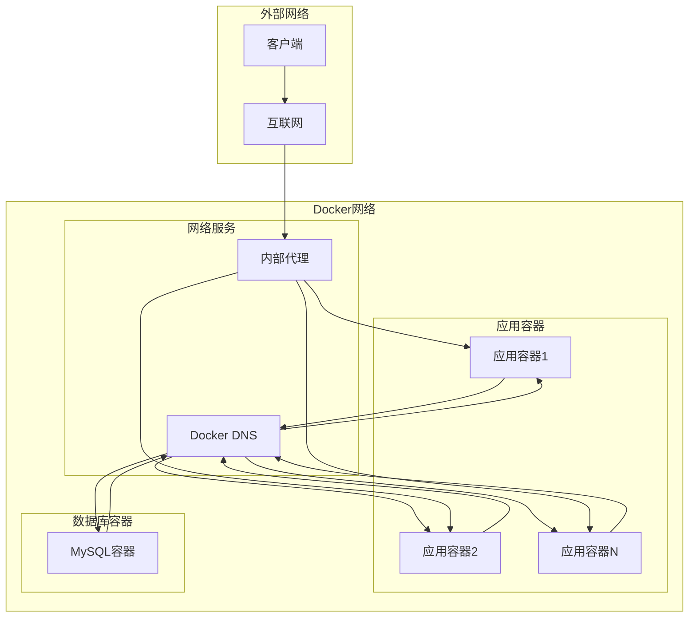
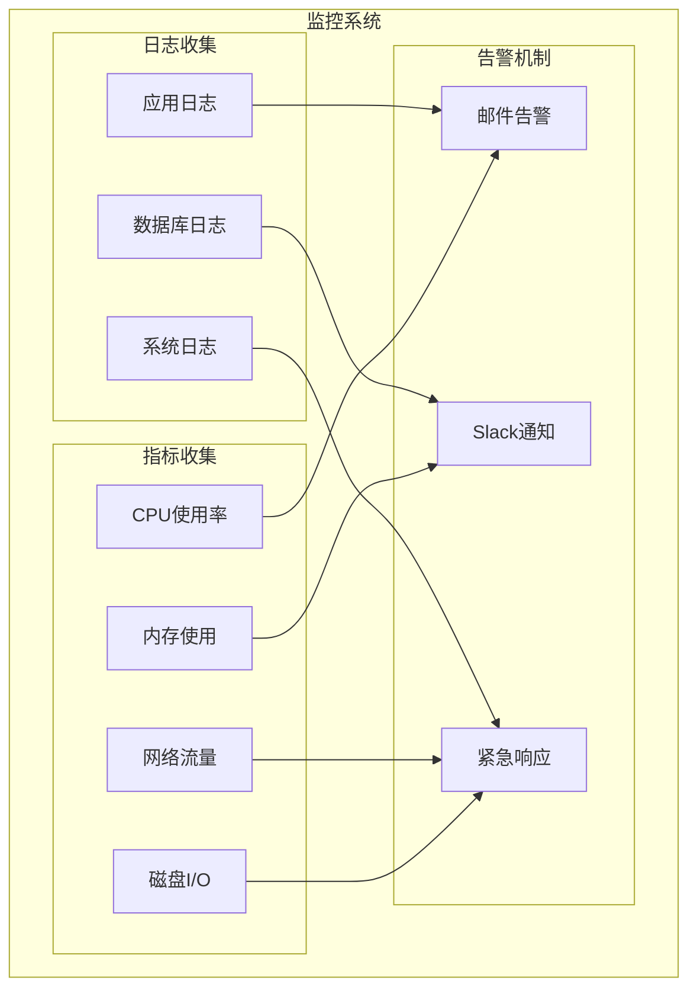
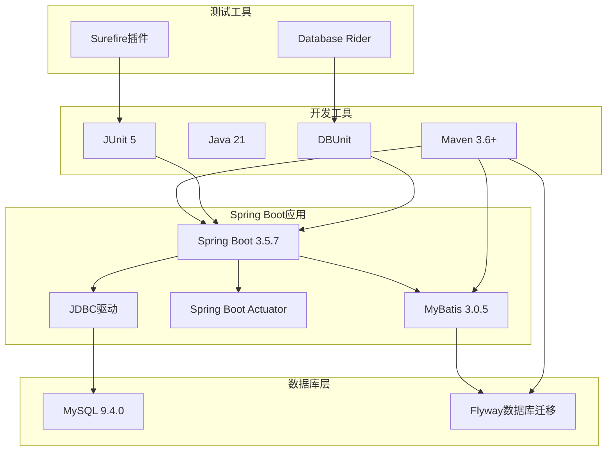

# 容器化部署

<cite>
**本文档引用的文件**
- [docker-compose.yml](file://docker-compose.yml)
- [pom.xml](file://pom.xml)
- [application.properties](file://src/main/resources/application.properties)
- [MyBatisApp.java](file://src/main/java/org/mvnsearch/mybatis/demo/MyBatisApp.java)
- [mybatis-config.xml](file://src/main/resources/mybatis-config.xml)
- [README.md](file://README.md)
- [Justfile](file://Justfile)
- [DataBaseTest.java](file://src/test/java/org/mvnsearch/mybatis/demo/DataBaseTest.java)
- [application-test.properties](file://src/test/resources/application-test.properties)
</cite>

## 目录
1. [简介](#简介)
2. [项目结构](#项目结构)
3. [核心组件](#核心组件)
4. [架构概览](#架构概览)
5. [详细组件分析](#详细组件分析)
6. [依赖关系分析](#依赖关系分析)
7. [性能考虑](#性能考虑)
8. [故障排除指南](#故障排除指南)
9. [结论](#结论)
10. [附录](#附录)

## 简介

本项目是一个基于Spring Boot和MyBatis的Java Web应用程序演示项目，支持容器化部署。项目包含一个MySQL数据库服务和一个Spring Boot应用服务，通过Docker Compose进行编排管理。本文档将详细介绍容器化部署的完整流程，包括Docker容器化、Docker Compose编排配置、MySQL数据库容器配置与数据持久化策略、应用容器构建过程以及生产环境的最佳实践。

## 项目结构

该项目采用标准的Spring Boot项目结构，包含以下关键目录和文件：



**图表来源**
- [docker-compose.yml:1-9](file://docker-compose.yml#L1-L9)
- [pom.xml:1-141](file://pom.xml#L1-L141)
- [application.properties:1-11](file://src/main/resources/application.properties#L1-L11)

**章节来源**
- [README.md:13-29](file://README.md#L13-L29)
- [pom.xml:1-141](file://pom.xml#L1-L141)

## 核心组件

### MySQL数据库服务

当前的Docker Compose配置仅包含MySQL数据库服务，使用官方MySQL 9.4.0镜像。该服务提供了完整的数据库功能，包括：

- **镜像版本**: MySQL 9.4.0（官方稳定版）
- **端口映射**: 将容器的3306端口映射到主机的13306端口
- **环境变量**: 配置了root用户密码和默认数据库名称
- **数据持久化**: 使用Docker卷进行数据持久化

### Spring Boot应用服务

应用服务基于Spring Boot 3.5.7和Java 21，集成了MyBatis ORM框架。主要特性包括：

- **Web框架**: Spring Boot Web Starter
- **数据库访问**: MyBatis Spring Boot Starter
- **数据库连接**: MySQL Connector/J
- **监控**: Spring Boot Actuator
- **测试支持**: Database Rider和DBUnit

**章节来源**
- [docker-compose.yml:1-9](file://docker-compose.yml#L1-L9)
- [pom.xml:30-101](file://pom.xml#L30-L101)
- [application.properties:1-11](file://src/main/resources/application.properties#L1-L11)

## 架构概览

系统采用经典的三层架构模式，通过Docker容器实现服务隔离和可扩展性：



**图表来源**
- [docker-compose.yml:1-9](file://docker-compose.yml#L1-L9)
- [MyBatisApp.java:11-16](file://src/main/java/org/mvnsearch/mybatis/demo/MyBatisApp.java#L11-L16)
- [mybatis-config.xml:1-14](file://src/main/resources/mybatis-config.xml#L1-L14)

## 详细组件分析

### Docker Compose配置分析

当前的docker-compose.yml文件定义了一个简单的双服务架构：



**图表来源**
- [docker-compose.yml:1-9](file://docker-compose.yml#L1-L9)

#### 服务定义详解

**MySQL服务配置**：
- **镜像**: mysql:9.4.0（官方稳定版本）
- **端口映射**: 主机13306端口映射到容器3306端口
- **环境变量**: 
  - MYSQL_ROOT_PASSWORD: 设置root用户的密码
  - MYSQL_DATABASE: 创建默认数据库test

**应用服务配置**：
虽然当前配置中未显式定义应用服务，但根据项目结构可以推断需要添加以下配置：
- **构建**: 基于Maven构建Spring Boot应用
- **端口**: 暴露8080端口供Web服务使用
- **依赖**: 依赖MySQL服务
- **环境变量**: 数据库连接配置

**章节来源**
- [docker-compose.yml:1-9](file://docker-compose.yml#L1-L9)

### MySQL数据库容器配置

MySQL容器的配置体现了生产环境的最佳实践：



**图表来源**
- [docker-compose.yml:2-9](file://docker-compose.yml#L2-L9)

#### 数据持久化策略

MySQL容器的数据持久化通过Docker卷实现：

1. **卷类型**: 使用命名卷确保数据在容器重建时保持不变
2. **数据位置**: MySQL数据存储在容器内的/var/lib/mysql目录
3. **备份策略**: 支持定期备份和恢复操作
4. **数据迁移**: 支持跨主机的数据迁移

#### 环境变量配置

- **MYSQL_ROOT_PASSWORD**: 设置root用户的初始密码
- **MYSQL_DATABASE**: 创建默认数据库test
- **MYSQL_USER**: 可选：创建专用应用用户
- **MYSQL_PASSWORD**: 可选：为应用用户设置密码

**章节来源**
- [docker-compose.yml:6-8](file://docker-compose.yml#L6-L8)

### 应用容器构建过程

应用容器的构建过程涉及多个步骤和优化策略：



**图表来源**
- [pom.xml:102-138](file://pom.xml#L102-L138)
- [Justfile:2-3](file://Justfile#L2-L3)

#### Maven构建配置

应用使用Maven作为构建工具，配置了以下关键特性：

- **Java版本**: 21（使用最新的长期支持版本）
- **Spring Boot版本**: 3.5.7（最新稳定版本）
- **MyBatis集成**: 3.0.5版本的MyBatis Spring Boot Starter
- **测试框架**: JUnit 5和Spring Boot Test
- **数据库迁移**: Flyway数据库版本管理

#### 多阶段构建优化

虽然当前项目未实现多阶段构建，但建议的优化方案包括：

1. **基础镜像选择**: 使用Alpine Linux或Debian Slim作为基础镜像
2. **分层优化**: 合理组织Dockerfile指令以利用缓存
3. **安全扫描**: 在构建过程中集成安全扫描
4. **镜像大小**: 最小化最终镜像体积

**章节来源**
- [pom.xml:19-28](file://pom.xml#L19-L28)
- [pom.xml:102-138](file://pom.xml#L102-L138)

### 生产环境Docker Compose配置

基于当前项目结构，建议的生产环境配置应包含以下增强功能：



#### 负载均衡配置

生产环境中建议添加Nginx反向代理：

- **端口转发**: 80端口映射到8080端口
- **健康检查**: 定期检查后端服务状态
- **SSL支持**: 集成Let's Encrypt证书
- **缓存策略**: 静态资源缓存优化

#### 健康检查机制



#### 资源限制配置

生产环境应设置合理的资源限制：

- **内存限制**: 防止内存泄漏导致的服务崩溃
- **CPU配额**: 控制容器的CPU使用量
- **磁盘空间**: 限制日志和临时文件的占用
- **连接数限制**: 控制数据库连接池大小

**章节来源**
- [docker-compose.yml:1-9](file://docker-compose.yml#L1-L9)

### 容器间通信和网络拓扑

容器间的通信通过Docker的内部网络实现，提供安全和高效的通信机制：



**图表来源**
- [docker-compose.yml:1-9](file://docker-compose.yml#L1-L9)

#### 网络配置策略

- **默认网络**: 使用Docker默认的bridge网络
- **自定义网络**: 建议创建专用的overlay网络
- **服务发现**: 利用Docker的内置DNS服务
- **端口管理**: 避免端口冲突，使用端口范围

#### 端口映射策略

- **内部通信**: 使用容器间直接通信，不暴露额外端口
- **外部访问**: 仅映射必要的端口到宿主机
- **安全考虑**: 限制对外部的端口暴露

**章节来源**
- [docker-compose.yml:4-5](file://docker-compose.yml#L4-L5)

### 容器监控和日志收集

生产环境需要完善的监控和日志收集机制：



#### 监控指标配置

- **应用指标**: 响应时间、吞吐量、错误率
- **系统指标**: CPU、内存、磁盘、网络使用情况
- **数据库指标**: 连接数、查询性能、锁等待
- **业务指标**: 用户活跃度、交易量、转化率

#### 日志管理策略

- **日志级别**: 区分不同级别的日志输出
- **日志轮转**: 避免单个日志文件过大
- **集中存储**: 将日志统一收集到中央存储
- **实时分析**: 实时监控关键业务指标

**章节来源**
- [pom.xml:37-38](file://pom.xml#L37-L38)

## 依赖关系分析

项目的依赖关系展现了清晰的层次结构：



**图表来源**
- [pom.xml:30-101](file://pom.xml#L30-L101)
- [pom.xml:113-136](file://pom.xml#L113-L136)

### 关键依赖分析

**Spring Boot生态系统**：
- **Web支持**: 提供RESTful API和Web服务能力
- **数据访问**: MyBatis集成提供ORM功能
- **监控**: Actuator提供健康检查和指标收集
- **测试**: 完整的测试框架支持

**数据库相关依赖**：
- **MySQL Connector**: 提供JDBC连接支持
- **Flyway**: 自动化数据库版本管理
- **Database Rider**: 测试数据管理
- **DBUnit**: 数据库单元测试支持

**开发工具链**：
- **Maven**: 项目构建和依赖管理
- **Java 21**: 最新的长期支持版本
- **JUnit 5**: 现代化的测试框架
- **Just**: 简化的构建命令

**章节来源**
- [pom.xml:19-28](file://pom.xml#L19-L28)
- [pom.xml:30-101](file://pom.xml#L30-L101)

## 性能考虑

容器化部署中的性能优化是关键考量因素：

### 内存和CPU优化

- **JVM参数调优**: 根据容器内存限制调整JVM堆大小
- **线程池配置**: 合理配置应用的线程池大小
- **数据库连接池**: 优化连接池参数以适应容器环境
- **垃圾回收**: 选择适合容器环境的GC算法

### 网络性能优化

- **连接复用**: 使用HTTP连接池减少连接开销
- **压缩传输**: 启用GZIP压缩减少带宽使用
- **缓存策略**: 实现多级缓存减少数据库访问
- **异步处理**: 使用异步任务处理耗时操作

### 存储性能优化

- **I/O优化**: 合理配置数据库文件系统
- **索引优化**: 为常用查询建立合适的索引
- **查询优化**: 分析慢查询并进行优化
- **数据分区**: 对大数据表进行分区处理

## 故障排除指南

### 常见问题诊断

**数据库连接问题**：
1. 检查MySQL容器是否正常运行
2. 验证网络连接和端口可达性
3. 确认数据库凭据正确性
4. 查看数据库日志文件

**应用启动问题**：
1. 检查应用容器的日志输出
2. 验证数据库连接配置
3. 确认端口未被占用
4. 检查依赖服务的可用性

**性能问题**：
1. 监控容器资源使用情况
2. 分析应用日志中的错误信息
3. 检查数据库查询性能
4. 评估网络延迟和带宽

### 调试工具使用

**Docker调试**：
- 使用`docker logs`查看容器日志
- 使用`docker exec`进入容器进行交互式调试
- 使用`docker stats`监控资源使用情况

**应用调试**：
- 启用Spring Boot的调试模式
- 使用Actuator端点检查应用状态
- 分析数据库连接池状态

**章节来源**
- [docker-compose.yml:1-9](file://docker-compose.yml#L1-L9)
- [application.properties:1-11](file://src/main/resources/application.properties#L1-L11)

## 结论

本项目展示了如何使用Docker和Docker Compose实现Spring Boot应用的容器化部署。当前配置提供了基本的MySQL数据库服务，但为了生产环境的稳定性、可扩展性和安全性，建议实施以下改进：

1. **完善应用服务配置**: 添加完整的应用容器定义
2. **增强监控能力**: 集成健康检查、指标收集和日志管理
3. **优化网络配置**: 实现负载均衡和高可用部署
4. **加强安全措施**: 实施密钥管理和网络安全策略
5. **完善备份策略**: 建立数据备份和灾难恢复机制

通过这些改进，项目将具备生产环境所需的完整容器化基础设施，能够支持高并发、高可用的应用部署需求。

## 附录

### 快速开始指南

```bash
# 启动MySQL数据库
docker-compose up -d

# 构建项目
mvn clean package

# 运行应用
mvn spring-boot:run
# 或
java -jar target/mybatis-spring-demo-1.0.0-SNAPSHOT.jar
```

### 数据库迁移

```bash
# 清理并执行数据库迁移
mvn org.flywaydb:flyway-maven-plugin:11.15.0:clean
mvn org.flywaydb:flyway-maven-plugin:11.15.0:migrate
```

### 数据导出

```bash
# 导出数据库结构
mysql -h 127.0.0.1 -P 13306 -u root -p test > database.dmp
```

**章节来源**
- [README.md:48-59](file://README.md#L48-L59)
- [Justfile:5-8](file://Justfile#L5-L8)