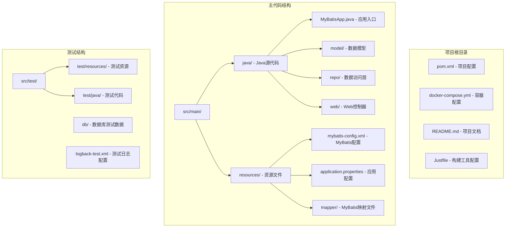
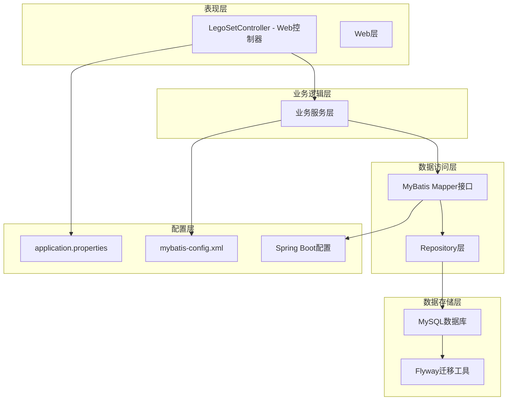
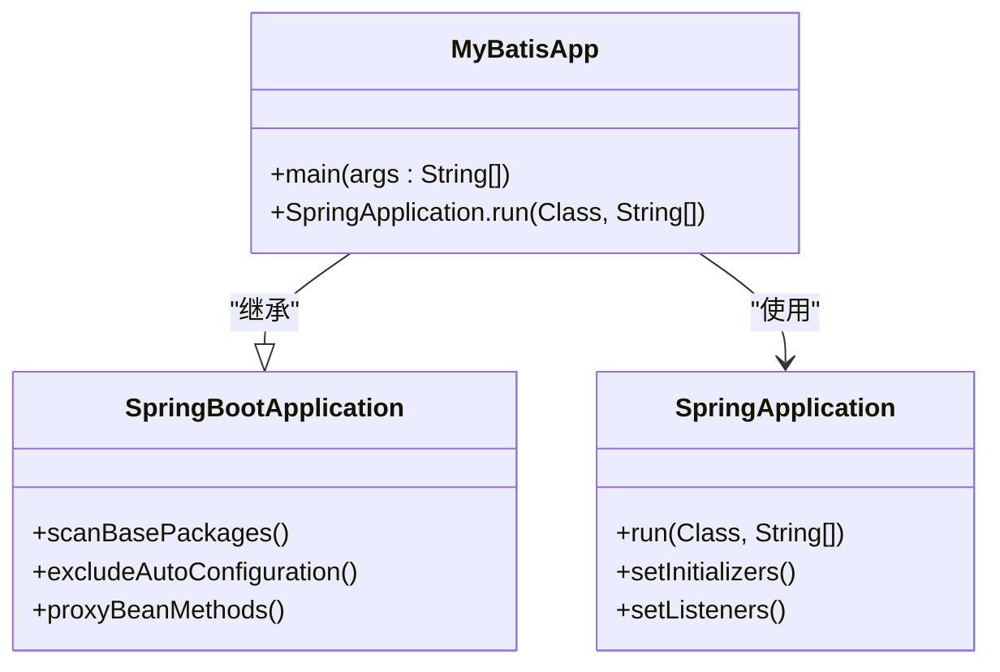
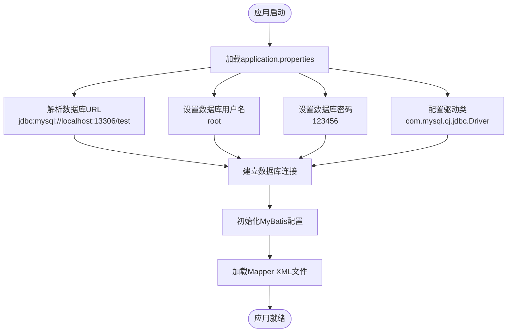
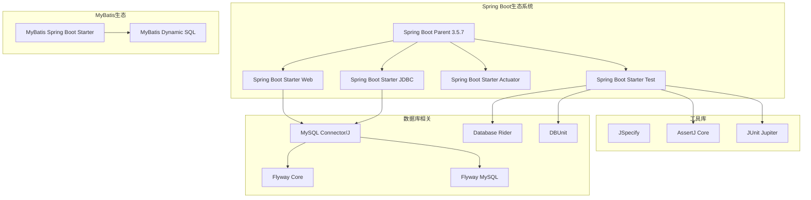

# 应用打包

<cite>
**本文档引用的文件**
- [pom.xml](file://pom.xml)
- [application.properties](file://src/main/resources/application.properties)
- [application-test.properties](file://src/test/resources/application-test.properties)
- [mybatis-config.xml](file://src/main/resources/mybatis-config.xml)
- [MyBatisApp.java](file://src/main/java/org/mvnsearch/mybatis/demo/MyBatisApp.java)
- [docker-compose.yml](file://docker-compose.yml)
- [README.md](file://README.md)
- [Justfile](file://Justfile)
- [LegoSet.xml](file://src/main/resources/mapper/LegoSet.xml)
- [Shop.xml](file://src/main/resources/mapper/Shop.xml)
- [logback-test.xml](file://src/test/resources/logback-test.xml)
</cite>

## 目录
1. [简介](#简介)
2. [项目结构](#项目结构)
3. [核心组件](#核心组件)
4. [架构概览](#架构概览)
5. [详细组件分析](#详细组件分析)
6. [依赖分析](#依赖分析)
7. [性能考虑](#性能考虑)
8. [故障排除指南](#故障排除指南)
9. [结论](#结论)
10. [附录](#附录)

## 简介

本项目是一个基于Spring Boot和MyBatis的Java Web应用程序演示项目。本文档专注于应用的构建和打包流程，详细说明了Maven构建配置、依赖管理、插件配置以及不同环境下的打包策略。项目使用Spring Boot 3.5.7和Java 21，集成了MySQL数据库和Flyway数据库迁移工具。

## 项目结构

该项目采用标准的Maven项目结构，包含源代码、资源文件和测试代码的清晰分离：



**图表来源**
- [pom.xml:1-141](file://pom.xml#L1-L141)
- [MyBatisApp.java:1-17](file://src/main/java/org/mvnsearch/mybatis/demo/MyBatisApp.java#L1-L17)

**章节来源**
- [pom.xml:1-141](file://pom.xml#L1-L141)
- [README.md:13-29](file://README.md#L13-L29)

## 核心组件

### Maven构建配置

项目使用Maven作为构建工具，配置了Spring Boot父级POM以获得统一的版本管理和插件配置。核心配置包括：

- **Java版本**: 使用Java 21作为编译和运行目标
- **Spring Boot版本**: 3.5.7，提供自动配置和Starter依赖
- **MyBatis集成**: 通过mybatis-spring-boot-starter实现ORM框架集成
- **数据库支持**: MySQL Connector/J和Flyway数据库迁移工具

### 依赖管理

项目依赖分为运行时依赖和测试依赖两个层次：

**运行时依赖**:
- Spring Boot Web Starter - 提供Web应用基础功能
- Spring Boot JDBC Starter - 数据库连接支持
- MySQL Connector/J - MySQL数据库驱动
- MyBatis Spring Boot Starter - MyBatis ORM框架集成

**测试依赖**:
- Spring Boot Test Starter - 单元测试框架
- Database Rider - 数据库测试数据管理
- DBUnit - 数据库单元测试支持

### 插件配置

项目配置了两个主要插件：

1. **Maven Compiler Plugin**: 配置Java参数编译支持
2. **Flyway Maven Plugin**: 数据库迁移工具集成

**章节来源**
- [pom.xml:19-101](file://pom.xml#L19-L101)
- [pom.xml:102-138](file://pom.xml#L102-L138)

## 架构概览

应用采用分层架构设计，清晰分离了表现层、业务逻辑层和数据访问层：



**图表来源**
- [MyBatisApp.java:11-16](file://src/main/java/org/mvnsearch/mybatis/demo/MyBatisApp.java#L11-L16)
- [application.properties:1-11](file://src/main/resources/application.properties#L1-L11)
- [mybatis-config.xml:1-14](file://src/main/resources/mybatis-config.xml#L1-L14)

## 详细组件分析

### 应用入口点

应用的启动类位于`MyBatisApp.java`，使用Spring Boot的`@SpringBootApplication`注解启用自动配置：



**图表来源**
- [MyBatisApp.java:11-16](file://src/main/java/org/mvnsearch/mybatis/demo/MyBatisApp.java#L11-L16)

### 数据库配置

应用使用MySQL作为数据存储，配置了完整的数据库连接参数：



**图表来源**
- [application.properties:1-11](file://src/main/resources/application.properties#L1-L11)
- [docker-compose.yml:1-9](file://docker-compose.yml#L1-L9)

### MyBatis配置

MyBatis通过XML配置文件定义类型别名和映射器：

**类型别名配置**:
- LegoSet -> org.mvnsearch.mybatis.demo.model.LegoSet
- Shop -> org.mvnsearch.mybatis.demo.model.Shop

**映射器配置**:
- mapper/LegoSet.xml
- mapper/Shop.xml

### 测试配置

项目提供了专门的测试配置文件和日志配置：

**测试属性配置**:
- 空的application-test.properties文件，用于覆盖生产配置
- 在测试环境中可以添加特定的测试数据库配置

**测试日志配置**:
- 使用Logback测试配置
- 设置根日志级别为WARN
- 控制台输出格式化日志

**章节来源**
- [application.properties:1-11](file://src/main/resources/application.properties#L1-L11)
- [mybatis-config.xml:6-13](file://src/main/resources/mybatis-config.xml#L6-L13)
- [application-test.properties:1-1](file://src/test/resources/application-test.properties#L1-L1)
- [logback-test.xml:1-13](file://src/test/resources/logback-test.xml#L1-L13)

## 依赖分析

### Maven依赖树

项目的主要依赖关系如下：



**图表来源**
- [pom.xml:30-101](file://pom.xml#L30-L101)

### 版本管理

项目使用Maven属性集中管理版本信息：
- Java版本: 21
- Spring Boot版本: 3.5.7
- MyBatis Spring Boot版本: 3.0.5
- Database Rider版本: 1.44.0

**章节来源**
- [pom.xml:19-28](file://pom.xml#L19-L28)
- [pom.xml:30-101](file://pom.xml#L30-L101)

## 性能考虑

### 构建性能优化

1. **并行构建**: Maven默认支持多线程构建，可通过`-T`参数控制线程数
2. **增量编译**: 使用Java 21的改进编译器提高编译速度
3. **缓存利用**: 利用Maven本地仓库缓存依赖包

### 运行时性能

1. **数据库连接池**: Spring Boot自动配置HikariCP连接池
2. **MyBatis缓存**: 启用MyBatis二级缓存机制
3. **日志级别**: 生产环境建议使用INFO级别减少日志开销

## 故障排除指南

### 常见构建问题

**问题1: MySQL连接失败**
- 检查docker-compose是否正确启动
- 验证application.properties中的数据库URL
- 确认MySQL容器端口映射(13306:3306)

**问题2: Flyway迁移失败**
- 确认数据库连接凭据正确
- 检查migration脚本路径配置
- 验证数据库用户权限

**问题3: 编译错误**
- 确认Java 21环境变量设置
- 清理Maven缓存后重新构建
- 检查网络连接以下载依赖

### 运行时问题

**问题1: 应用无法启动**
- 检查端口8080是否被占用
- 验证application.properties配置
- 查看控制台错误日志

**问题2: MyBatis映射错误**
- 确认Mapper XML文件路径正确
- 检查类型别名配置
- 验证数据库表结构与实体类匹配

**章节来源**
- [docker-compose.yml:1-9](file://docker-compose.yml#L1-L9)
- [application.properties:1-11](file://src/main/resources/application.properties#L1-L11)

## 结论

本项目展示了现代Spring Boot应用的标准构建和打包实践。通过使用Spring Boot Maven Plugin，项目能够自动生成可执行JAR文件，简化了部署流程。Maven配置提供了清晰的依赖管理和插件配置，支持多环境部署。

项目的关键优势包括：
- 标准化的Maven项目结构
- 完整的Spring Boot集成
- MyBatis ORM框架的灵活配置
- 数据库迁移工具的自动化支持
- 全面的测试配置和日志管理

## 附录

### 打包命令参考

**基本构建**:
```bash
mvn clean package
```

**跳过测试构建**:
```bash
mvn -DskipTests clean package
```

**数据库迁移**:
```bash
mvn flyway:migrate
```

**SBOM生成**:
```bash
mvn cyclonedx:makeAggregateBom
```

### 环境配置差异

**开发环境**:
- 使用本地MySQL实例
- 开启调试日志级别
- 启用Spring DevTools

**测试环境**:
- 使用独立测试数据库
- 配置专用测试数据
- 严格的数据验证

**生产环境**:
- 使用云数据库服务
- 配置连接池参数
- 启用健康检查端点

### 可执行JAR运行

应用可以通过以下方式运行：

**使用Maven插件**:
```bash
mvn spring-boot:run
```

**直接运行JAR文件**:
```bash
java -jar target/mybatis-spring-demo-1.0.0-SNAPSHOT.jar
```

**指定配置文件**:
```bash
java -jar target/mybatis-spring-demo-1.0.0-SNAPSHOT.jar --spring.profiles.active=production
```

**章节来源**
- [README.md:48-61](file://README.md#L48-L61)
- [Justfile:1-21](file://Justfile#L1-L21)