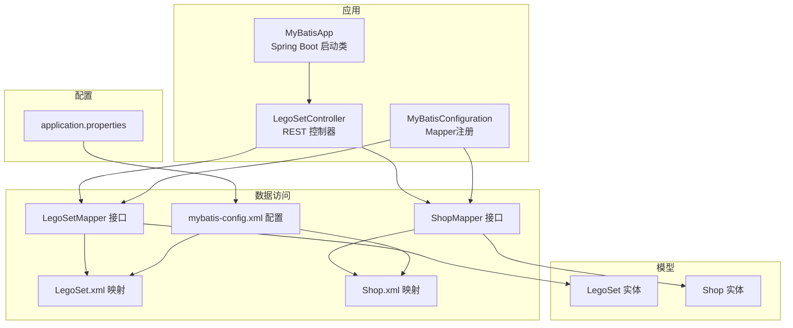
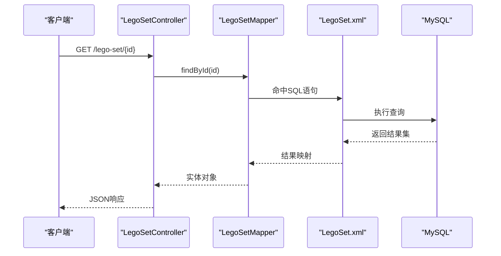
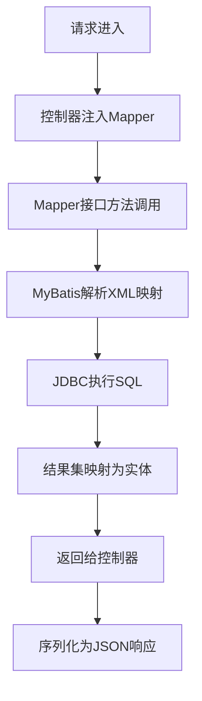
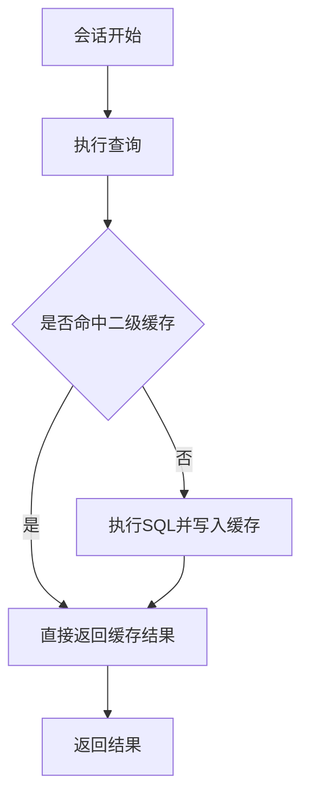
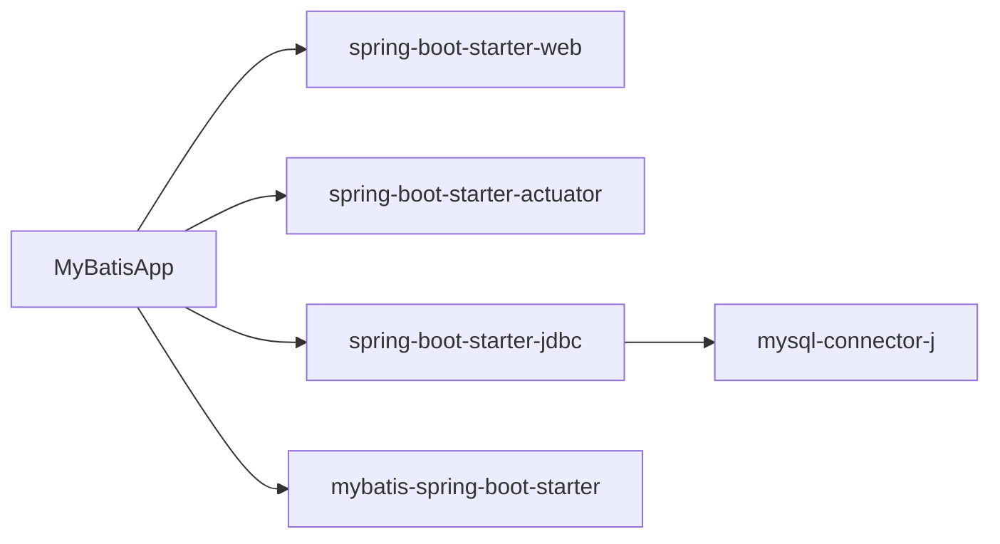

# 性能优化

<cite>
**本文引用的文件**
- [pom.xml](file://pom.xml)
- [application.properties](file://src/main/resources/application.properties)
- [mybatis-config.xml](file://src/main/resources/mybatis-config.xml)
- [MyBatisApp.java](file://src/main/java/org/mvnsearch/mybatis/demo/MyBatisApp.java)
- [MyBatisConfiguration.java](file://src/main/java/org/mvnsearch/mybatis/demo/repo/MyBatisConfiguration.java)
- [LegoSetMapper.java](file://src/main/java/org/mvnsearch/mybatis/demo/repo/LegoSetMapper.java)
- [ShopMapper.java](file://src/main/java/org/mvnsearch/mybatis/demo/repo/ShopMapper.java)
- [LegoSet.xml](file://src/main/resources/mapper/LegoSet.xml)
- [Shop.xml](file://src/main/resources/mapper/Shop.xml)
- [LegoSet.java](file://src/main/java/org/mvnsearch/mybatis/demo/model/LegoSet.java)
- [Shop.java](file://src/main/java/org/mvnsearch/mybatis/demo/model/Shop.java)
- [LegoSetController.java](file://src/main/java/org/mvnsearch/mybatis/demo/web/LegoSetController.java)
- [docker-compose.yml](file://docker-compose.yml)
- [README.md](file://README.md)
- [LegoSetMapperTest.java](file://src/test/java/org/mvnsearch/mybatis/demo/repo/LegoSetMapperTest.java)
- [ShopMapperTest.java](file://src/test/java/org/mvnsearch/mybatis/demo/repo/ShopMapperTest.java)
</cite>

## 目录
1. [简介](#简介)
2. [项目结构](#项目结构)
3. [核心组件](#核心组件)
4. [架构总览](#架构总览)
5. [详细组件分析](#详细组件分析)
6. [依赖分析](#依赖分析)
7. [性能考虑](#性能考虑)
8. [故障排查指南](#故障排查指南)
9. [结论](#结论)
10. [附录](#附录)

## 简介
本文件面向该MyBatis与Spring Boot集成示例项目，系统化梳理可落地的性能优化策略，覆盖JVM参数调优、数据库连接池配置、MyBatis缓存与SQL优化、Spring Boot启动与懒加载、静态资源与CDN、负载与基准测试、以及微服务场景下的性能监控与调优。内容基于仓库现有实现进行提炼与扩展建议，帮助在不改变业务逻辑的前提下提升吞吐、降低延迟与资源占用。

## 项目结构
该项目采用标准Spring Boot多模块布局，包含：
- 应用入口与自动装配：Spring Boot启动类
- 数据访问层：MyBatis配置、Mapper接口与XML映射
- 模型对象：实体类
- Web层：REST控制器
- 资源与配置：application.properties、mybatis-config.xml、Mapper XML
- 测试：基于Database Rider的数据集驱动测试

**图表来源**
- [MyBatisApp.java:1-17](file://src/main/java/org/mvnsearch/mybatis/demo/MyBatisApp.java#L1-L17)
- [MyBatisConfiguration.java:1-25](file://src/main/java/org/mvnsearch/mybatis/demo/repo/MyBatisConfiguration.java#L1-L25)
- [LegoSetController.java:1-22](file://src/main/java/org/mvnsearch/mybatis/demo/web/LegoSetController.java#L1-L22)
- [LegoSetMapper.java:1-21](file://src/main/java/org/mvnsearch/mybatis/demo/repo/LegoSetMapper.java#L1-L21)
- [ShopMapper.java:1-21](file://src/main/java/org/mvnsearch/mybatis/demo/repo/ShopMapper.java#L1-L21)
- [LegoSet.xml:1-22](file://src/main/resources/mapper/LegoSet.xml#L1-L22)
- [Shop.xml:1-24](file://src/main/resources/mapper/Shop.xml#L1-L24)
- [mybatis-config.xml:1-14](file://src/main/resources/mybatis-config.xml#L1-L14)
- [application.properties:1-11](file://src/main/resources/application.properties#L1-L11)

**章节来源**
- [README.md:13-29](file://README.md#L13-L29)
- [pom.xml:1-141](file://pom.xml#L1-L141)

## 核心组件
- Spring Boot启动类负责自动装配与Web容器初始化
- MyBatis配置通过XML集中管理类型别名与Mapper扫描
- Mapper接口定义DAO契约，XML映射文件承载SQL与结果映射
- 控制器通过@Autowired注入Mapper，提供REST端点
- application.properties提供数据源与MyBatis基础配置

**章节来源**
- [MyBatisApp.java:1-17](file://src/main/java/org/mvnsearch/mybatis/demo/MyBatisApp.java#L1-L17)
- [mybatis-config.xml:1-14](file://src/main/resources/mybatis-config.xml#L1-L14)
- [application.properties:1-11](file://src/main/resources/application.properties#L1-L11)
- [LegoSetController.java:1-22](file://src/main/java/org/mvnsearch/mybatis/demo/web/LegoSetController.java#L1-L22)

## 架构总览
下图展示请求从HTTP进入至数据库查询的完整链路，以及可优化的关键节点（连接池、缓存、SQL）。

**图表来源**
- [LegoSetController.java:17-20](file://src/main/java/org/mvnsearch/mybatis/demo/web/LegoSetController.java#L17-L20)
- [LegoSetMapper.java:15-16](file://src/main/java/org/mvnsearch/mybatis/demo/repo/LegoSetMapper.java#L15-L16)
- [LegoSet.xml:10-14](file://src/main/resources/mapper/LegoSet.xml#L10-L14)

## 详细组件分析

### 数据访问层与SQL执行流程
- 控制器接收请求后调用Mapper接口方法
- Mapper接口由MyBatis生成代理，解析XML映射中的SQL
- SQL经由底层JDBC驱动执行，返回结果集并映射为实体对象

**图表来源**
- [LegoSetController.java:17-20](file://src/main/java/org/mvnsearch/mybatis/demo/web/LegoSetController.java#L17-L20)
- [LegoSetMapper.java:15-16](file://src/main/java/org/mvnsearch/mybatis/demo/repo/LegoSetMapper.java#L15-L16)
- [LegoSet.xml:10-14](file://src/main/resources/mapper/LegoSet.xml#L10-L14)

**章节来源**
- [LegoSetController.java:1-22](file://src/main/java/org/mvnsearch/mybatis/demo/web/LegoSetController.java#L1-L22)
- [LegoSetMapper.java:1-21](file://src/main/java/org/mvnsearch/mybatis/demo/repo/LegoSetMapper.java#L1-L21)
- [LegoSet.xml:1-22](file://src/main/resources/mapper/LegoSet.xml#L1-L22)

### MyBatis缓存策略与配置
当前项目未启用二级缓存，仅存在默认的一级缓存（会话级别）。若需开启二级缓存以减少重复查询，可在以下位置进行配置与实体标记：
- 在mybatis-config.xml中启用二级缓存与设置缓存策略
- 在Mapper XML中为相关查询声明缓存
- 在实体类上添加可序列化支持与缓存标识（如需要）

**图表来源**
- [mybatis-config.xml:1-14](file://src/main/resources/mybatis-config.xml#L1-L14)
- [LegoSet.xml:10-20](file://src/main/resources/mapper/LegoSet.xml#L10-L20)
- [Shop.xml:11-21](file://src/main/resources/mapper/Shop.xml#L11-L21)

**章节来源**
- [mybatis-config.xml:1-14](file://src/main/resources/mybatis-config.xml#L1-L14)
- [LegoSet.xml:1-22](file://src/main/resources/mapper/LegoSet.xml#L1-L22)
- [Shop.xml:1-24](file://src/main/resources/mapper/Shop.xml#L1-L24)

### 数据库连接池配置优化
当前项目使用Spring Boot默认数据源。生产环境建议显式配置连接池参数以提升稳定性与性能：
- 连接数：根据并发请求数与数据库最大连接限制设定初始/最大连接数
- 超时：设置连接获取超时、空闲回收时间、事务超时
- 健康检查：启用连接有效性校验，避免使用失效连接
- 泄漏检测：开启泄漏日志或统计，定位未关闭的连接
- 参考实现位置：application.properties中spring.datasource.*相关键值

**章节来源**
- [application.properties:1-11](file://src/main/resources/application.properties#L1-L11)
- [pom.xml:30-51](file://pom.xml#L30-L51)

### Spring Boot启动优化与懒加载
- 启动优化：排除不必要的自动配置、按需引入starter、精简日志级别
- 懒加载：对非关键路径组件启用懒加载，缩短启动时间
- Actuator：已引入spring-boot-starter-actuator，可用于健康检查与指标暴露
- 参考实现位置：MyBatisApp.java、pom.xml

**章节来源**
- [MyBatisApp.java:1-17](file://src/main/java/org/mvnsearch/mybatis/demo/MyBatisApp.java#L1-L17)
- [pom.xml:30-42](file://pom.xml#L30-L42)

### 数据库查询优化最佳实践
- 索引设计：为WHERE条件列建立合适索引；复合索引遵循最左前缀原则
- SQL优化：避免SELECT *，只取必要字段；合理分页，避免大偏移量
- 批处理：批量插入/更新时使用批处理API
- 统计信息：定期更新表统计信息，辅助优化器选择最优执行计划
- 本项目示例SQL位于Mapper XML中，建议结合实际表结构补充索引与字段选择

**章节来源**
- [LegoSet.xml:10-20](file://src/main/resources/mapper/LegoSet.xml#L10-L20)
- [Shop.xml:11-21](file://src/main/resources/mapper/Shop.xml#L11-L21)

### 静态资源优化与CDN配置
- 压缩与合并：启用Gzip/Brotli压缩，合并CSS/JS
- 缓存策略：设置合理的Cache-Control与ETag
- CDN：将静态资源托管至CDN，就近分发
- 本项目为后端示例，静态资源优化建议适用于前端工程或网关层

[本节为通用指导，无需“章节来源”]

### 负载测试与性能基准测试
- 工具：JMeter、Gatling、k6等
- 场景：并发用户数、Ramp-up时间、持续时长、目标错误率
- 指标：吞吐、P99延迟、错误率、CPU/内存/GC
- 基准：对比不同参数组合下的表现，定位瓶颈
- 本项目可作为被测服务，结合Actuator指标进行观测

[本节为通用指导，无需“章节来源”]

### 微服务架构下的性能监控与调优
- 指标：QPS、延迟分布、错误率、线程池/连接池利用率
- 链路追踪：接入分布式追踪（如OpenTelemetry）
- 自动扩缩容：基于CPU/内存或业务指标触发
- 本项目为单体示例，微服务场景下建议拆分服务边界、引入限流与熔断

[本节为通用指导，无需“章节来源”]

## 依赖分析
项目依赖以Spring Boot与MyBatis为主，数据库访问通过JDBC与MySQL Connector/J实现，Actuator用于运行时可观测性。

**图表来源**
- [pom.xml:30-51](file://pom.xml#L30-L51)
- [MyBatisApp.java:1-17](file://src/main/java/org/mvnsearch/mybatis/demo/MyBatisApp.java#L1-L17)

**章节来源**
- [pom.xml:1-141](file://pom.xml#L1-L141)

## 性能考虑
- JVM参数调优
  - 堆内存：根据峰值并发与对象生命周期设定初始与最大堆大小
  - 垃圾回收器：优先选择G1/ZGC以降低停顿；结合延迟目标调整GC参数
  - 监控：开启GC日志与JFR采样，观察晋升失败与老年代回收频率
- 数据库连接池
  - 连接数：参考CPU核数与数据库最大连接上限，设置合理初始/最大连接
  - 超时：短连接获取超时、长事务超时，避免资源阻塞
  - 泄漏检测：开启泄漏日志，定期巡检未关闭连接
- MyBatis缓存
  - 开启二级缓存并设置合适的刷新与过期策略
  - 对热点读场景启用，写多读少场景谨慎使用
- Spring Boot启动与懒加载
  - 移除不必要依赖，启用懒加载，缩短冷启动时间
- 查询优化
  - 为高频查询列建索引；避免全表扫描；使用EXPLAIN分析执行计划
- 静态资源与CDN
  - 启用压缩与缓存；静态资源走CDN
- 负载与基准测试
  - 设定明确SLA与KPI；对比不同配置组合
- 微服务监控
  - 指标与链路追踪并重；建立告警与自愈机制

[本节为通用指导，无需“章节来源”]

## 故障排查指南
- 数据库连接问题
  - 检查application.properties中的URL、用户名与密码
  - 使用docker-compose确认MySQL服务可用
- MyBatis映射问题
  - 校验mybatis-config.xml中的类型别名与Mapper路径
  - 确认Mapper XML命名空间与接口一致
- 控制器无法注入
  - 确保Mapper接口标注@Mapper且被组件扫描到
- 单元测试与数据集
  - 使用Database Rider数据集驱动测试，确保测试数据一致性

**章节来源**
- [application.properties:1-11](file://src/main/resources/application.properties#L1-L11)
- [mybatis-config.xml:1-14](file://src/main/resources/mybatis-config.xml#L1-L14)
- [LegoSetMapper.java:12-12](file://src/main/java/org/mvnsearch/mybatis/demo/repo/LegoSetMapper.java#L12-L12)
- [docker-compose.yml:1-9](file://docker-compose.yml#L1-L9)
- [LegoSetMapperTest.java:26-26](file://src/test/java/org/mvnsearch/mybatis/demo/repo/LegoSetMapperTest.java#L26-L26)
- [ShopMapperTest.java:11-11](file://src/test/java/org/mvnsearch/mybatis/demo/repo/ShopMapperTest.java#L11-L11)

## 结论
本项目提供了清晰的MyBatis与Spring Boot集成范式。通过在连接池、缓存、SQL与JVM层面实施系统化优化，并辅以完善的监控与压测体系，可在保证功能正确性的前提下显著提升性能与稳定性。建议从连接池与缓存入手，逐步推进到JVM与SQL优化，最后完善监控与自动化运维。

## 附录
- 快速启动与数据库准备
  - 使用docker-compose启动MySQL
  - 执行Maven构建与启动命令
- 生产部署建议
  - 显式配置数据源与MyBatis参数
  - 引入Actuator与APM工具
  - 制定压测与灰度发布流程

**章节来源**
- [README.md:46-61](file://README.md#L46-L61)
- [docker-compose.yml:1-9](file://docker-compose.yml#L1-L9)
- [pom.xml:102-136](file://pom.xml#L102-L136)