# 数据库迁移

<cite>
**本文档引用的文件**
- [pom.xml](file://pom.xml)
- [application.properties](file://src/main/resources/application.properties)
- [application-test.properties](file://src/test/resources/application-test.properties)
- [V1__logo_set.sql](file://src/test/resources/db/migration/V1__logo_set.sql)
- [V2__shop.sql](file://src/test/resources/db/migration/V2__shop.sql)
- [docker-compose.yml](file://docker-compose.yml)
- [Justfile](file://Justfile)
- [MyBatisConfiguration.java](file://src/main/java/org/mvnsearch/mybatis/demo/repo/MyBatisConfiguration.java)
- [mybatis-config.xml](file://src/main/resources/mybatis-config.xml)
- [LegoSetMapperTest.java](file://src/test/java/org/mvnsearch/mybatis/demo/repo/LegoSetMapperTest.java)
- [ShopMapperTest.java](file://src/test/java/org/mvnsearch/mybatis/demo/repo/ShopMapperTest.java)
- [DataBaseTest.java](file://src/test/java/org/mvnsearch/mybatis/demo/DataBaseTest.java)
</cite>

## 目录
1. [简介](#简介)
2. [项目结构](#项目结构)
3. [核心组件](#核心组件)
4. [架构概览](#架构概览)
5. [详细组件分析](#详细组件分析)
6. [依赖关系分析](#依赖关系分析)
7. [性能考虑](#性能考虑)
8. [故障排除指南](#故障排除指南)
9. [结论](#结论)
10. [附录](#附录)

## 简介

本项目采用Flyway进行数据库版本管理，通过结构化的迁移脚本实现数据库的版本控制和演进。项目使用MySQL作为数据库后端，结合Spring Boot和MyBatis框架，实现了完整的数据库迁移解决方案。

Flyway数据库版本管理的核心优势在于：
- **自动化迁移**：通过命名规范自动识别和执行迁移脚本
- **版本控制**：确保所有环境使用相同的数据库结构
- **安全性**：提供回滚机制和错误处理策略
- **可重复性**：保证开发、测试、生产环境的一致性

## 项目结构

该项目采用标准的Maven项目结构，数据库迁移相关的文件主要位于测试资源目录中：

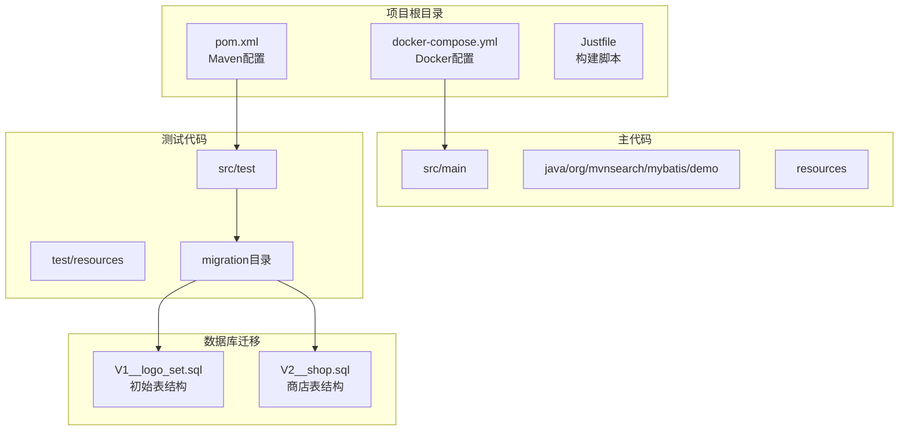

**图表来源**
- [pom.xml:102-138](file://pom.xml#L102-L138)
- [docker-compose.yml:1-9](file://docker-compose.yml#L1-9)

**章节来源**
- [pom.xml:1-141](file://pom.xml#L1-L141)
- [docker-compose.yml:1-9](file://docker-compose.yml#L1-L9)

## 核心组件

### Flyway Maven插件配置

项目使用Maven插件方式集成Flyway，配置了完整的数据库连接信息和迁移脚本位置：

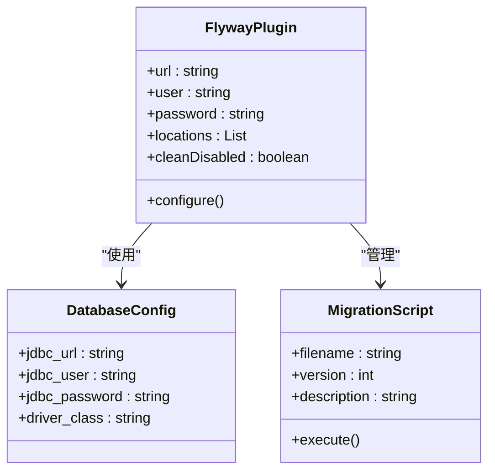

**图表来源**
- [pom.xml:112-136](file://pom.xml#L112-L136)

### 迁移脚本结构

项目包含两个核心迁移脚本，遵循Flyway的标准命名规范：

| 脚本名称 | 版本号 | 描述 | 功能 |
|---------|--------|------|------|
| V1__logo_set.sql | 1 | 初始表结构 | 创建lego_set表 |
| V2__shop.sql | 2 | 商店表结构 | 创建shop表 |

**章节来源**
- [pom.xml:112-136](file://pom.xml#L112-L136)
- [V1__logo_set.sql:1-6](file://src/test/resources/db/migration/V1__logo_set.sql#L1-L6)
- [V2__shop.sql:1-7](file://src/test/resources/db/migration/V2__shop.sql#L1-L7)

## 架构概览

项目采用分层架构设计，数据库迁移在整个系统中扮演着基础设施的角色：

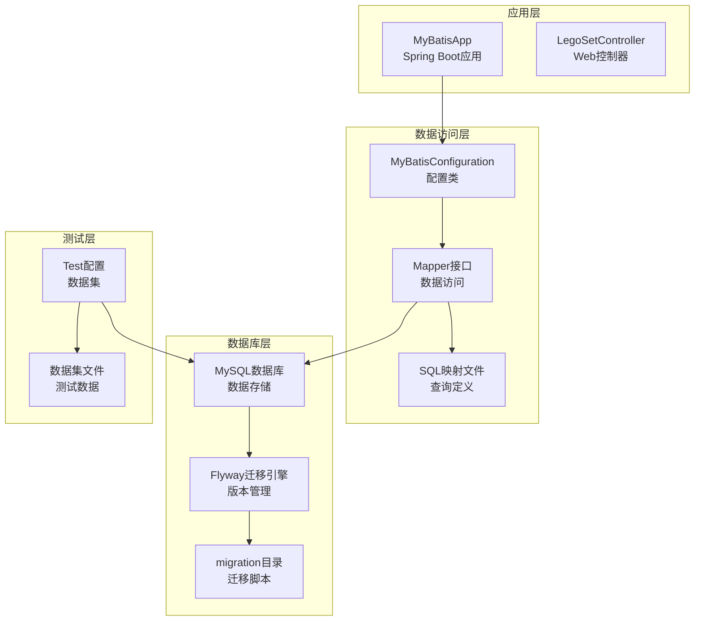

**图表来源**
- [MyBatisConfiguration.java:8-24](file://src/main/java/org/mvnsearch/mybatis/demo/repo/MyBatisConfiguration.java#L8-L24)
- [mybatis-config.xml:5-14](file://src/main/resources/mybatis-config.xml#L5-L14)

## 详细组件分析

### 迁移脚本编写规范

#### 命名规范

Flyway遵循严格的命名规范，确保迁移脚本的有序执行：

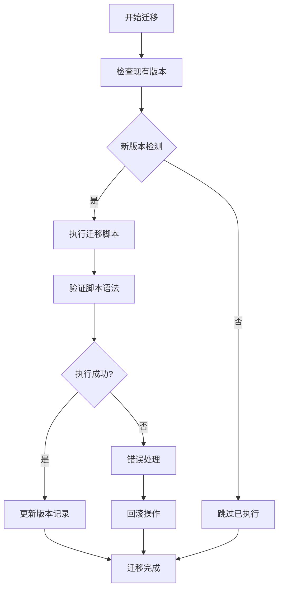

**图表来源**
- [V1__logo_set.sql:1-6](file://src/test/resources/db/migration/V1__logo_set.sql#L1-L6)
- [V2__shop.sql:1-7](file://src/test/resources/db/migration/V2__shop.sql#L1-L7)

#### DDL语句最佳实践

迁移脚本中的DDL语句遵循以下原则：

1. **幂等性**：使用条件判断避免重复执行
2. **完整性约束**：合理设置主键、外键和索引
3. **字符集设置**：统一使用UTF-8编码
4. **事务边界**：每个迁移脚本作为一个独立事务

#### 数据初始化策略

项目通过测试数据集实现数据初始化：

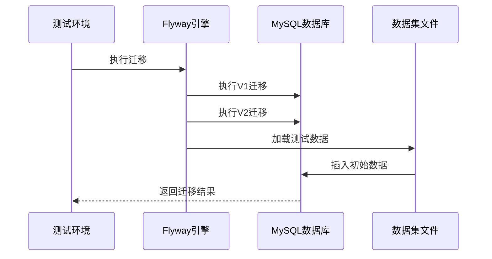

**图表来源**
- [LegoSetMapperTest.java:26-44](file://src/test/java/org/mvnsearch/mybatis/demo/repo/LegoSetMapperTest.java#L26-L44)
- [ShopMapperTest.java:11-29](file://src/test/java/org/mvnsearch/mybatis/demo/repo/ShopMapperTest.java#L11-L29)

**章节来源**
- [V1__logo_set.sql:1-6](file://src/test/resources/db/migration/V1__logo_set.sql#L1-L6)
- [V2__shop.sql:1-7](file://src/test/resources/db/migration/V2__shop.sql#L1-L7)

### 环境配置与部署

#### 开发环境配置

开发环境使用本地MySQL实例，配置参数如下：

| 配置项 | 开发环境值 | 说明 |
|-------|-----------|------|
| 数据库URL | jdbc:mysql://localhost:13306/test | 本地连接 |
| 用户名 | root | 默认管理员 |
| 密码 | 123456 | 默认密码 |
| 驱动类 | com.mysql.cj.jdbc.Driver | MySQL驱动 |

#### Docker化部署

项目提供Docker Compose配置，支持容器化部署：

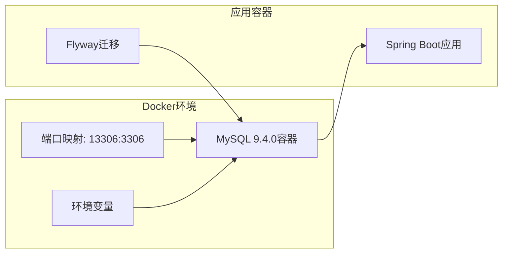

**图表来源**
- [docker-compose.yml:1-9](file://docker-compose.yml#L1-L9)

**章节来源**
- [application.properties:1-11](file://src/main/resources/application.properties#L1-L11)
- [docker-compose.yml:1-9](file://docker-compose.yml#L1-L9)

### 迁移执行流程

#### 命令行执行

项目提供简化的构建脚本，便于执行数据库迁移：

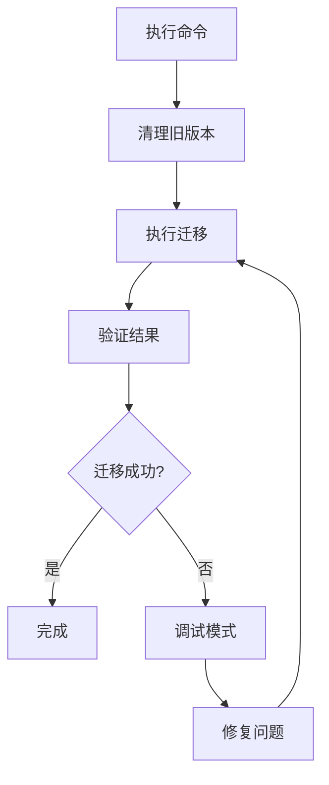

**图表来源**
- [Justfile:5-8](file://Justfile#L5-L8)

#### 自动化测试集成

测试框架与数据库迁移深度集成：

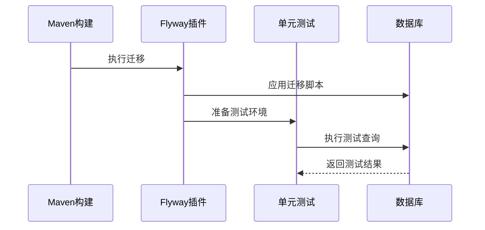

**图表来源**
- [LegoSetMapperTest.java:18-44](file://src/test/java/org/mvnsearch/mybatis/demo/repo/LegoSetMapperTest.java#L18-L44)
- [ShopMapperTest.java:3-29](file://src/test/java/org/mvnsearch/mybatis/demo/repo/ShopMapperTest.java#L3-L29)

**章节来源**
- [Justfile:5-8](file://Justfile#L5-L8)
- [DataBaseTest.java:12-26](file://src/test/java/org/mvnsearch/mybatis/demo/DataBaseTest.java#L12-L26)

## 依赖关系分析

### 外部依赖关系

项目依赖关系图展示了数据库迁移相关的外部组件：

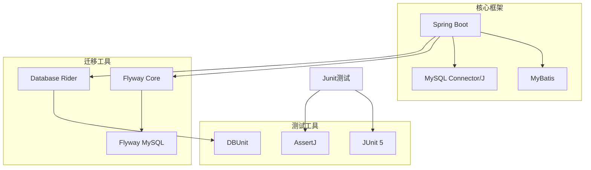

**图表来源**
- [pom.xml:30-101](file://pom.xml#L30-L101)

### 内部组件依赖

内部组件之间的依赖关系体现了清晰的分层架构：

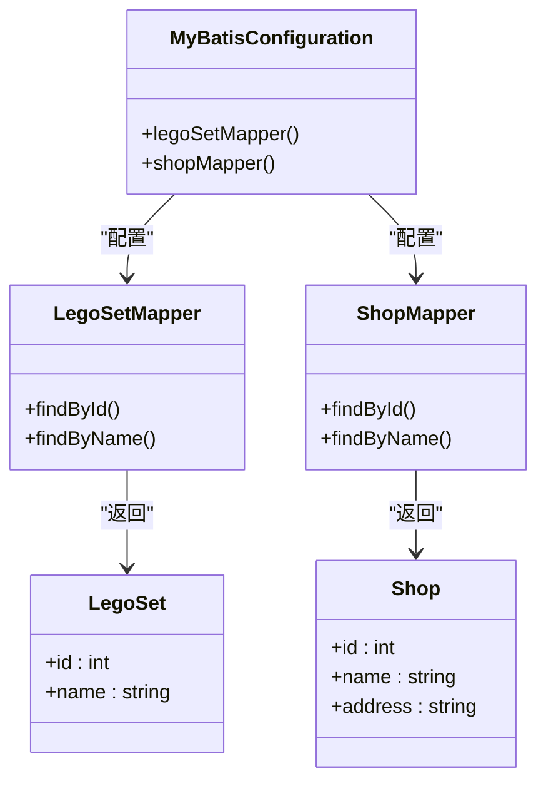

**图表来源**
- [MyBatisConfiguration.java:8-24](file://src/main/java/org/mvnsearch/mybatis/demo/repo/MyBatisConfiguration.java#L8-L24)
- [mybatis-config.xml:6-13](file://src/main/resources/mybatis-config.xml#L6-L13)

**章节来源**
- [pom.xml:30-101](file://pom.xml#L30-L101)
- [MyBatisConfiguration.java:8-24](file://src/main/java/org/mvnsearch/mybatis/demo/repo/MyBatisConfiguration.java#L8-L24)

## 性能考虑

### 迁移性能优化

1. **批量操作**：合并相关的DDL操作减少事务开销
2. **索引优化**：在迁移过程中合理创建和重建索引
3. **数据量控制**：避免在迁移中执行大量数据移动操作
4. **并发控制**：确保迁移过程中的数据一致性

### 监控和日志

项目配置了详细的日志级别，便于监控数据库迁移过程：

- **Spring Data**: INFO级别日志
- **JDBC模板**: DEBUG级别日志  
- **MyBatis**: TRACE级别日志

## 故障排除指南

### 常见问题及解决方案

#### 迁移失败处理

当迁移执行失败时，系统会自动回滚到上一个稳定版本：

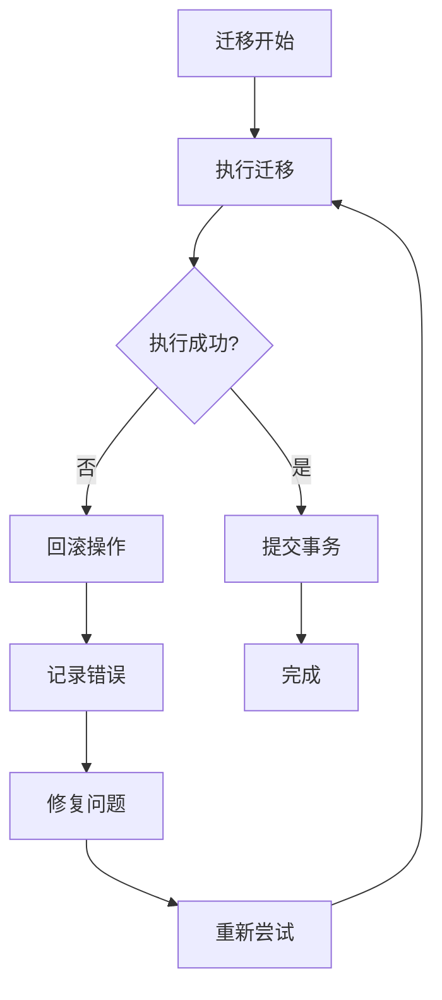

#### 数据库连接问题

如果遇到数据库连接问题，检查以下配置：

1. **连接字符串格式**：确保URL格式正确
2. **网络连通性**：验证MySQL服务状态
3. **认证信息**：确认用户名和密码正确
4. **防火墙设置**：检查端口访问权限

#### 迁移脚本冲突

当多个开发者同时修改数据库结构时：

1. **版本号冲突**：为新的迁移脚本分配更高的版本号
2. **命名规范**：严格遵守VX__描述.sql的命名规则
3. **代码审查**：在合并前审查迁移脚本
4. **测试验证**：在测试环境中验证迁移脚本

**章节来源**
- [Justfile:5-8](file://Justfile#L5-L8)
- [application.properties:1-11](file://src/main/resources/application.properties#L1-L11)

## 结论

本项目成功实现了基于Flyway的数据库版本管理系统，通过标准化的迁移脚本和严格的命名规范，确保了数据库结构的版本控制和环境一致性。项目的主要优势包括：

1. **自动化程度高**：通过Maven插件实现自动化的数据库迁移
2. **环境一致性**：开发、测试、生产环境使用相同的迁移策略
3. **安全性保障**：提供回滚机制和错误处理策略
4. **可维护性强**：清晰的代码结构和详细的文档说明

建议在实际生产环境中进一步完善的方面：
- 增加更详细的日志记录和监控
- 实现更复杂的回滚策略
- 添加数据库备份和恢复机制
- 建立更完善的测试覆盖

## 附录

### 迁移脚本示例

#### 初始表结构迁移

V1版本的lego_set表创建脚本包含了完整的表结构定义，包括主键、字段类型和字符集设置。

#### 商店表结构迁移

V2版本的shop表创建脚本扩展了数据库结构，增加了商店相关信息的存储能力。

### 测试数据管理

项目使用Database Rider框架管理测试数据，通过XML数据集文件提供测试所需的数据。

### 构建和部署

项目提供了简化的构建脚本，支持一键执行数据库迁移和生成DTD文件。