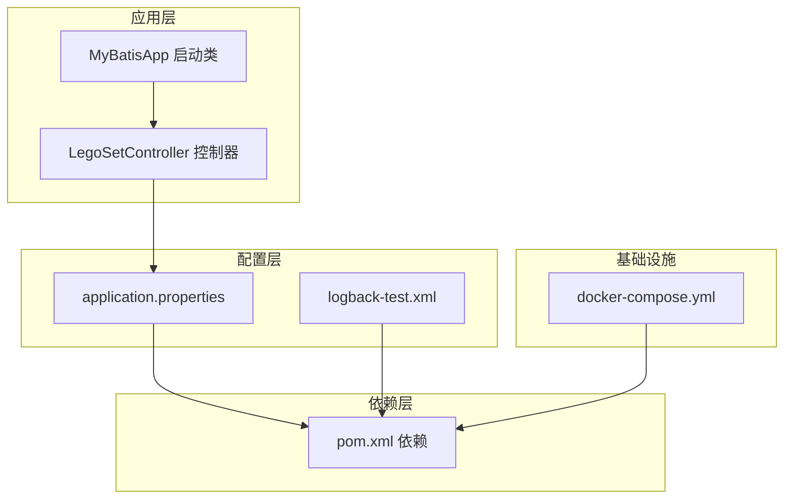
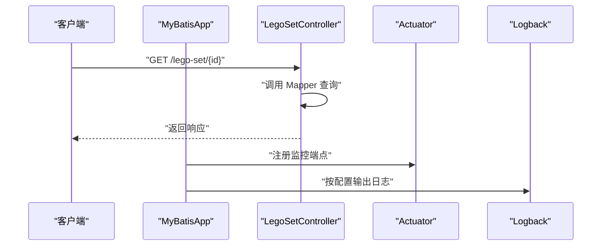
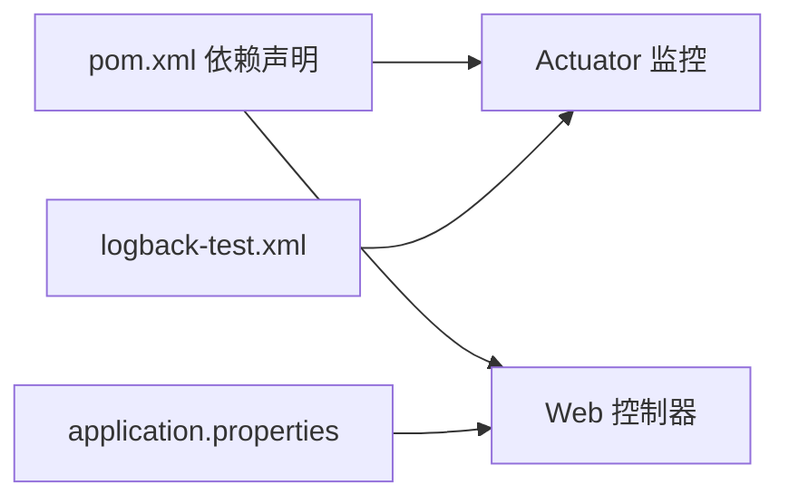

# 监控与日志

<cite>
**本文引用的文件**
- [pom.xml](file://pom.xml)
- [MyBatisApp.java](file://src/main/java/org/mvnsearch/mybatis/demo/MyBatisApp.java)
- [LegoSetController.java](file://src/main/java/org/mvnsearch/mybatis/demo/web/LegoSetController.java)
- [application.properties](file://src/main/resources/application.properties)
- [logback-test.xml](file://src/test/resources/logback-test.xml)
- [docker-compose.yml](file://docker-compose.yml)
- [README.md](file://README.md)
- [AGENTS.md](file://AGENTS.md)
</cite>

## 目录
1. [简介](#简介)
2. [项目结构](#项目结构)
3. [核心组件](#核心组件)
4. [架构总览](#架构总览)
5. [详细组件分析](#详细组件分析)
6. [依赖分析](#依赖分析)
7. [性能考虑](#性能考虑)
8. [故障排查指南](#故障排查指南)
9. [结论](#结论)
10. [附录](#附录)

## 简介
本文件面向运维与开发人员，系统化说明本项目的监控与日志配置现状与最佳实践建议。当前项目已引入 Spring Boot Actuator 监控能力，具备健康检查、指标采集等基础能力；日志方面通过 Logback 控制台输出与测试环境配置体现。本文将基于现有代码与依赖，给出端点启用与配置、日志级别与轮转策略、性能指标采集与分析、Prometheus/Grafana 集成思路、分布式追踪（Micrometer/Zipkin）配置要点、告警规则与通知机制建议，以及日志轮转与归档策略。

## 项目结构
项目采用 Spring Boot 标准目录组织，核心运行入口为应用启动类，资源目录包含数据库映射与应用配置。Actuator 已在依赖中声明，日志相关配置位于 application.properties 与测试环境的 logback 配置。

图表来源
- [MyBatisApp.java:11-16](file://src/main/java/org/mvnsearch/mybatis/demo/MyBatisApp.java#L11-L16)
- [LegoSetController.java:11-21](file://src/main/java/org/mvnsearch/mybatis/demo/web/LegoSetController.java#L11-L21)
- [application.properties:1-11](file://src/main/resources/application.properties#L1-L11)
- [logback-test.xml:1-13](file://src/test/resources/logback-test.xml#L1-L13)
- [docker-compose.yml:1-9](file://docker-compose.yml#L1-L9)
- [pom.xml:30-101](file://pom.xml#L30-L101)

章节来源
- [README.md:13-29](file://README.md#L13-L29)
- [pom.xml:30-101](file://pom.xml#L30-L101)

## 核心组件
- Spring Boot Actuator：已在依赖中声明，提供健康检查、指标、环境变量、应用信息等端点的基础能力。
- 日志系统：生产与测试分别通过 application.properties 与 logback-test.xml 进行日志级别与输出控制。
- 数据库与容器：通过 docker-compose 提供本地 MySQL 服务，便于端到端验证。

章节来源
- [pom.xml:35-38](file://pom.xml#L35-L38)
- [application.properties:7-10](file://src/main/resources/application.properties#L7-L10)
- [logback-test.xml:10-12](file://src/test/resources/logback-test.xml#L10-L12)
- [docker-compose.yml:1-9](file://docker-compose.yml#L1-L9)

## 架构总览
下图展示应用启动、Web 请求处理、Actuator 指标暴露与日志输出的整体流程。

图表来源
- [MyBatisApp.java:13-15](file://src/main/java/org/mvnsearch/mybatis/demo/MyBatisApp.java#L13-L15)
- [LegoSetController.java:17-20](file://src/main/java/org/mvnsearch/mybatis/demo/web/LegoSetController.java#L17-L20)
- [pom.xml:35-38](file://pom.xml#L35-L38)
- [application.properties:7-10](file://src/main/resources/application.properties#L7-L10)

## 详细组件分析

### Spring Boot Actuator 监控端点启用与配置
- 已启用的依赖：spring-boot-starter-actuator
- 默认端点概览：健康检查、指标、环境变量、应用信息等端点可用
- 建议配置项（以路径形式标注，避免直接粘贴配置内容）：
  - 端点暴露策略：management.endpoints.web.exposure.include=health,info,metrics,env
  - 端口分离：management.server.port=9000（避免与业务端口冲突）
  - 安全访问：management.endpoints.web.base-path=/actuator
  - 健康检查分组：management.endpoint.health.show-components=always
  - 指标标签：management.tag.project=mybatis-demo
- 关键实现位置参考：
  - Actuator 依赖声明：[pom.xml:35-38](file://pom.xml#L35-L38)
  - 应用启动类：[MyBatisApp.java:11-16](file://src/main/java/org/mvnsearch/mybatis/demo/MyBatisApp.java#L11-L16)
  - Web 控制器：[LegoSetController.java:11-21](file://src/main/java/org/mvnsearch/mybatis/demo/web/LegoSetController.java#L11-L21)

章节来源
- [pom.xml:35-38](file://pom.xml#L35-L38)
- [MyBatisApp.java:11-16](file://src/main/java/org/mvnsearch/mybatis/demo/MyBatisApp.java#L11-L16)
- [LegoSetController.java:11-21](file://src/main/java/org/mvnsearch/mybatis/demo/web/LegoSetController.java#L11-L21)

### 日志配置与最佳实践
- 生产日志级别：通过 application.properties 设置包级日志级别，便于在不同模块间进行精细化控制
- 测试日志级别：logback-test.xml 将根级别设为 WARN，减少测试噪音
- 最佳实践建议：
  - 生产环境：将业务包设为 INFO 或 WARN，框架调试设为 DEBUG（按需开启），避免过度输出
  - 输出格式：统一使用结构化日志（JSON），便于下游日志平台解析
  - 轮转策略：按大小与时间轮转，保留天数与压缩策略需结合存储成本评估
  - 敏感信息脱敏：对日志中的敏感字段进行脱敏处理
- 参考位置：
  - 生产日志级别：[application.properties:7-10](file://src/main/resources/application.properties#L7-L10)
  - 测试日志级别：[logback-test.xml:10-12](file://src/test/resources/logback-test.xml#L10-L12)

章节来源
- [application.properties:7-10](file://src/main/resources/application.properties#L7-L10)
- [logback-test.xml:10-12](file://src/test/resources/logback-test.xml#L10-L12)

### 性能监控指标采集与分析
- 指标来源：Actuator 自动暴露 HTTP 请求、JVM、进程、数据源连接池等指标
- 建议关注指标：
  - HTTP 请求：请求量、错误率、响应时间（p50/p95/p99）、并发请求数
  - JVM：堆内存、GC 次数与耗时、线程数
  - 数据库：连接池活跃数、等待时间、超时次数
- 分析方法：
  - 使用 Prometheus 抓取 /actuator/prometheus
  - 在 Grafana 中构建仪表盘，关联关键 SLI/SLO 指标
- 参考位置：
  - Actuator 依赖：[pom.xml:35-38](file://pom.xml#L35-L38)

章节来源
- [pom.xml:35-38](file://pom.xml#L35-L38)

### Prometheus 与 Grafana 集成
- Prometheus 抓取配置（以路径形式标注）：
  - targets: localhost:8080/actuator/prometheus
  - scrape_interval: 15s
  - metrics_path: /actuator/prometheus
- Grafana 仪表盘建议：
  - 请求总量与错误率趋势
  - 响应时间分布（直方图）
  - JVM 内存与 GC 指标
  - 数据库连接池健康度
- 参考位置：
  - Actuator 端点暴露：[pom.xml:35-38](file://pom.xml#L35-L38)

章节来源
- [pom.xml:35-38](file://pom.xml#L35-L38)

### 分布式追踪：Micrometer 与 Zipkin
- 配置步骤（以路径形式标注）：
  - 添加 Micrometer Tracing 与 Zipkin 依赖
  - 开启 HTTP 客户端/服务器采样：management.tracing.sampling.probability=1.0
  - Zipkin 地址：management.zipkin.tracing.endpoint=http://zipkin-host:9411/api/v2/spans
- 参考位置：
  - Actuator 依赖：[pom.xml:35-38](file://pom.xml#L35-L38)

章节来源
- [pom.xml:35-38](file://pom.xml#L35-L38)

### 告警规则与通知机制
- 告警维度建议：
  - HTTP 错误率（如 5xx 占比超过阈值）
  - 响应时间 P95 超过阈值
  - JVM GC 频繁或停顿过长
  - 数据库连接池超时或空置率异常
- 通知渠道：邮件、IM（如钉钉/企业微信）、PagerDuty
- 参考位置：
  - Actuator 指标暴露：[pom.xml:35-38](file://pom.xml#L35-L38)

章节来源
- [pom.xml:35-38](file://pom.xml#L35-L38)

### 日志轮转与归档策略
- 轮转策略建议：
  - 按大小轮转：单文件最大 200MB，保留 10 份
  - 按时间轮转：每日生成新文件，保留 30 天
  - 压缩：滚动后压缩，降低存储占用
- 归档策略：
  - 月度归档至对象存储，保留 12 个月
  - 清理过期日志前进行合规性审查
- 参考位置：
  - 生产日志级别：[application.properties:7-10](file://src/main/resources/application.properties#L7-L10)
  - 测试日志级别：[logback-test.xml:10-12](file://src/test/resources/logback-test.xml#L10-L12)

章节来源
- [application.properties:7-10](file://src/main/resources/application.properties#L7-L10)
- [logback-test.xml:10-12](file://src/test/resources/logback-test.xml#L10-L12)

## 依赖分析
Actuator 作为监控与指标采集的核心依赖，贯穿应用生命周期，控制器负责业务逻辑，配置文件决定日志与数据库行为，容器编排提供本地数据库支持。

图表来源
- [pom.xml:35-38](file://pom.xml#L35-L38)
- [LegoSetController.java:11-21](file://src/main/java/org/mvnsearch/mybatis/demo/web/LegoSetController.java#L11-L21)
- [application.properties:1-11](file://src/main/resources/application.properties#L1-L11)
- [logback-test.xml:1-13](file://src/test/resources/logback-test.xml#L1-L13)

章节来源
- [pom.xml:35-38](file://pom.xml#L35-L38)
- [LegoSetController.java:11-21](file://src/main/java/org/mvnsearch/mybatis/demo/web/LegoSetController.java#L11-L21)
- [application.properties:1-11](file://src/main/resources/application.properties#L1-L11)
- [logback-test.xml:1-13](file://src/test/resources/logback-test.xml#L1-L13)

## 性能考虑
- Actuator 指标抓取频率与数量需平衡监控粒度与系统开销
- 日志输出应避免高频写入磁盘，必要时使用异步 Appender
- 数据库连接池参数与查询优化直接影响响应时间与错误率
- 建议在预生产环境先行压测，确定合理阈值与采样概率

## 故障排查指南
- Actuator 端点不可访问
  - 检查端点暴露配置与安全基路径
  - 确认 Actuator 依赖是否正确引入
  - 参考：[pom.xml:35-38](file://pom.xml#L35-L38)
- 日志级别不符合预期
  - 核对 application.properties 的包级日志级别
  - 测试环境确认 logback-test.xml 的根级别
  - 参考：[application.properties:7-10](file://src/main/resources/application.properties#L7-L10)，[logback-test.xml:10-12](file://src/test/resources/logback-test.xml#L10-L12)
- 数据库连接问题
  - 使用 docker-compose 启动本地 MySQL 并确认凭据
  - 参考：[docker-compose.yml:1-9](file://docker-compose.yml#L1-L9)
- 应用启动失败
  - 检查启动类与主包名一致
  - 参考：[MyBatisApp.java:11-16](file://src/main/java/org/mvnsearch/mybatis/demo/MyBatisApp.java#L11-L16)

章节来源
- [pom.xml:35-38](file://pom.xml#L35-L38)
- [application.properties:7-10](file://src/main/resources/application.properties#L7-L10)
- [logback-test.xml:10-12](file://src/test/resources/logback-test.xml#L10-L12)
- [docker-compose.yml:1-9](file://docker-compose.yml#L1-L9)
- [MyBatisApp.java:11-16](file://src/main/java/org/mvnsearch/mybatis/demo/MyBatisApp.java#L11-L16)

## 结论
本项目已具备 Actuator 监控与 Logback 日志的基础能力。建议在现有基础上补充端点安全与暴露策略、Prometheus 抓取与 Grafana 仪表盘、Zipkin 分布式追踪、完善的告警规则与通知机制，以及标准化的日志轮转与归档策略，以形成完整的可观测性闭环。

## 附录
- 快速启动与访问
  - 启动数据库：docker-compose up -d
  - 启动应用：mvn spring-boot:run
  - 访问 Actuator：http://localhost:8080/actuator
- 参考文档
  - Spring Boot Actuator 官方文档
  - Micrometer 与 Zipkin 集成指南
  - Prometheus 与 Grafana 实践指南