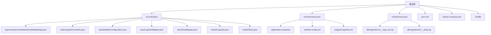
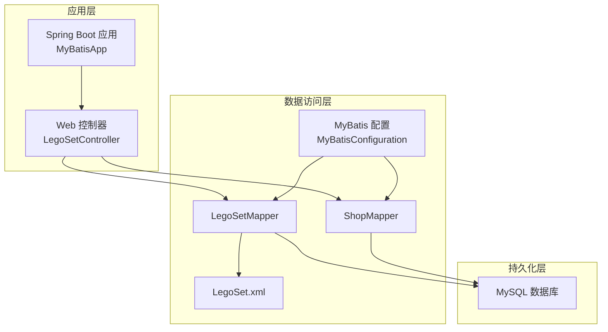
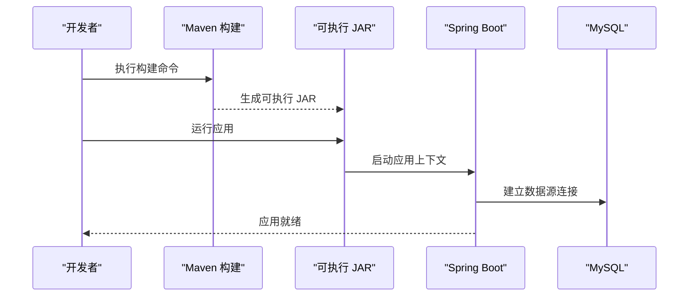
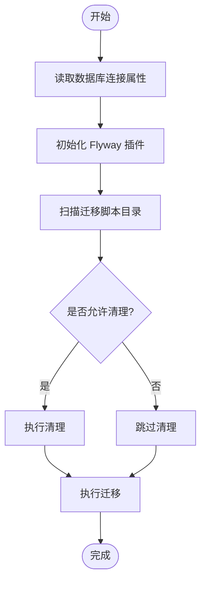
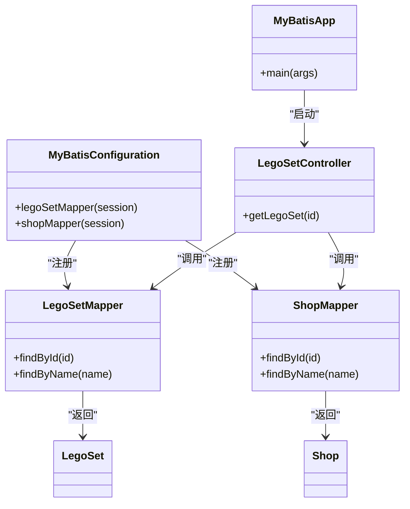
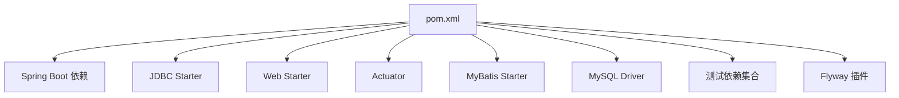

# 部署运维

<cite>
**本文引用的文件**
- [pom.xml](file://pom.xml)
- [docker-compose.yml](file://docker-compose.yml)
- [application.properties](file://src/main/resources/application.properties)
- [MyBatisApp.java](file://src/main/java/org/mvnsearch/mybatis/demo/MyBatisApp.java)
- [LegoSetController.java](file://src/main/java/org/mvnsearch/mybatis/demo/web/LegoSetController.java)
- [MyBatisConfiguration.java](file://src/main/java/org/mvnsearch/mybatis/demo/repo/MyBatisConfiguration.java)
- [mybatis-config.xml](file://src/main/resources/mybatis-config.xml)
- [LegoSet.xml](file://src/main/resources/mapper/LegoSet.xml)
- [LegoSetMapper.java](file://src/main/java/org/mvnsearch/mybatis/demo/repo/LegoSetMapper.java)
- [ShopMapper.java](file://src/main/java/org/mvnsearch/mybatis/demo/repo/ShopMapper.java)
- [V1__logo_set.sql](file://src/test/resources/db/migration/V1__logo_set.sql)
- [V2__shop.sql](file://src/test/resources/db/migration/V2__shop.sql)
- [Justfile](file://Justfile)
- [README.md](file://README.md)
</cite>

## 目录
1. [简介](#简介)
2. [项目结构](#项目结构)
3. [核心组件](#核心组件)
4. [架构总览](#架构总览)
5. [详细组件分析](#详细组件分析)
6. [依赖分析](#依赖分析)
7. [性能考量](#性能考量)
8. [故障排除指南](#故障排除指南)
9. [结论](#结论)
10. [附录](#附录)

## 简介
本项目是一个基于 Spring Boot 与 MyBatis 的示例应用，演示了如何在生产环境中进行打包、发布与运维。本文档覆盖从开发到生产的完整流程，包括 Maven 构建配置、Flyway 数据库迁移、Docker 容器化与 Docker Compose 编排、生产环境配置与安全建议、监控与日志、性能调优、运维脚本与自动化工具，以及故障排除与应急响应流程。

## 项目结构
该项目采用标准的 Spring Boot Maven 工程结构，包含源码、资源、测试与数据库迁移脚本。关键目录与文件如下：
- 源码：Spring Boot 启动类、Web 控制器、MyBatis 映射器与配置
- 资源：应用配置、MyBatis 配置与映射 XML
- 测试：数据库迁移 SQL、测试配置与日志
- 构建与编排：Maven POM、Docker Compose、Justfile

**图表来源**
- [MyBatisApp.java:1-17](file://src/main/java/org/mvnsearch/mybatis/demo/MyBatisApp.java#L1-L17)
- [LegoSetController.java:1-22](file://src/main/java/org/mvnsearch/mybatis/demo/web/LegoSetController.java#L1-L22)
- [MyBatisConfiguration.java:1-25](file://src/main/java/org/mvnsearch/mybatis/demo/repo/MyBatisConfiguration.java#L1-L25)
- [LegoSetMapper.java:1-21](file://src/main/java/org/mvnsearch/mybatis/demo/repo/LegoSetMapper.java#L1-L21)
- [ShopMapper.java:1-21](file://src/main/java/org/mvnsearch/mybatis/demo/repo/ShopMapper.java#L1-L21)
- [application.properties:1-11](file://src/main/resources/application.properties#L1-L11)
- [mybatis-config.xml:1-14](file://src/main/resources/mybatis-config.xml#L1-L14)
- [LegoSet.xml:1-22](file://src/main/resources/mapper/LegoSet.xml#L1-L22)
- [V1__logo_set.sql:1-6](file://src/test/resources/db/migration/V1__logo_set.sql#L1-L6)
- [V2__shop.sql:1-7](file://src/test/resources/db/migration/V2__shop.sql#L1-L7)

**章节来源**
- [README.md:13-29](file://README.md#L13-L29)

## 核心组件
- 应用启动类：负责应用引导与启动
- Web 控制器：提供 REST 接口，访问 MyBatis 映射器
- MyBatis 配置：类型别名、映射器注册与 XML 映射
- 数据源与连接：通过 application.properties 配置 JDBC 连接
- 数据库迁移：使用 Flyway 在测试资源中定义迁移脚本

**章节来源**
- [MyBatisApp.java:11-16](file://src/main/java/org/mvnsearch/mybatis/demo/MyBatisApp.java#L11-L16)
- [LegoSetController.java:11-21](file://src/main/java/org/mvnsearch/mybatis/demo/web/LegoSetController.java#L11-L21)
- [MyBatisConfiguration.java:8-24](file://src/main/java/org/mvnsearch/mybatis/demo/repo/MyBatisConfiguration.java#L8-L24)
- [mybatis-config.xml:6-13](file://src/main/resources/mybatis-config.xml#L6-L13)
- [application.properties:1-11](file://src/main/resources/application.properties#L1-L11)
- [pom.xml:112-136](file://pom.xml#L112-L136)

## 架构总览
应用采用典型的三层架构：Web 层（控制器）、数据访问层（MyBatis 映射器）与数据库层（MySQL）。Spring Boot 自动装配负责依赖注入与配置加载；Flyway 负责数据库迁移；Docker Compose 提供本地数据库服务。

**图表来源**
- [MyBatisApp.java:11-16](file://src/main/java/org/mvnsearch/mybatis/demo/MyBatisApp.java#L11-L16)
- [LegoSetController.java:11-21](file://src/main/java/org/mvnsearch/mybatis/demo/web/LegoSetController.java#L11-L21)
- [MyBatisConfiguration.java:8-24](file://src/main/java/org/mvnsearch/mybatis/demo/repo/MyBatisConfiguration.java#L8-L24)
- [LegoSetMapper.java:12-20](file://src/main/java/org/mvnsearch/mybatis/demo/repo/LegoSetMapper.java#L12-L20)
- [ShopMapper.java:12-20](file://src/main/java/org/mvnsearch/mybatis/demo/repo/ShopMapper.java#L12-L20)
- [LegoSet.xml:3-22](file://src/main/resources/mapper/LegoSet.xml#L3-L22)

## 详细组件分析

### 应用启动与运行
- 应用入口通过 Spring Boot 启动类完成自动装配与主类运行
- 默认端口为 8080，可通过配置调整
- Actuator 已引入，可用于健康检查与指标暴露

**图表来源**
- [MyBatisApp.java:11-16](file://src/main/java/org/mvnsearch/mybatis/demo/MyBatisApp.java#L11-L16)
- [pom.xml:30-101](file://pom.xml#L30-L101)
- [application.properties:1-11](file://src/main/resources/application.properties#L1-L11)

**章节来源**
- [MyBatisApp.java:11-16](file://src/main/java/org/mvnsearch/mybatis/demo/MyBatisApp.java#L11-L16)
- [README.md:46-61](file://README.md#L46-L61)

### 数据库与迁移
- 数据库连接在应用配置中定义，使用 MySQL 驱动
- 迁移脚本位于测试资源目录，使用 Flyway 插件管理
- 迁移脚本包含基础表结构定义

**图表来源**
- [pom.xml:112-136](file://pom.xml#L112-L136)
- [V1__logo_set.sql:1-6](file://src/test/resources/db/migration/V1__logo_set.sql#L1-L6)
- [V2__shop.sql:1-7](file://src/test/resources/db/migration/V2__shop.sql#L1-L7)

**章节来源**
- [application.properties:1-11](file://src/main/resources/application.properties#L1-L11)
- [pom.xml:112-136](file://pom.xml#L112-L136)
- [V1__logo_set.sql:1-6](file://src/test/resources/db/migration/V1__logo_set.sql#L1-L6)
- [V2__shop.sql:1-7](file://src/test/resources/db/migration/V2__shop.sql#L1-L7)

### MyBatis 配置与映射
- MyBatis 配置文件定义类型别名与映射器位置
- 控制器通过映射器访问数据库，返回模型对象
- 映射器接口与 XML 文件一一对应，实现 SQL 与结果映射

**图表来源**
- [MyBatisApp.java:11-16](file://src/main/java/org/mvnsearch/mybatis/demo/MyBatisApp.java#L11-L16)
- [LegoSetController.java:11-21](file://src/main/java/org/mvnsearch/mybatis/demo/web/LegoSetController.java#L11-L21)
- [MyBatisConfiguration.java:8-24](file://src/main/java/org/mvnsearch/mybatis/demo/repo/MyBatisConfiguration.java#L8-L24)
- [LegoSetMapper.java:12-20](file://src/main/java/org/mvnsearch/mybatis/demo/repo/LegoSetMapper.java#L12-L20)
- [ShopMapper.java:12-20](file://src/main/java/org/mvnsearch/mybatis/demo/repo/ShopMapper.java#L12-L20)
- [LegoSet.java:3-22](file://src/main/java/org/mvnsearch/mybatis/demo/model/LegoSet.java#L3-L22)
- [Shop.java:3-31](file://src/main/java/org/mvnsearch/mybatis/demo/model/Shop.java#L3-L31)

**章节来源**
- [mybatis-config.xml:6-13](file://src/main/resources/mybatis-config.xml#L6-L13)
- [LegoSet.xml:3-22](file://src/main/resources/mapper/LegoSet.xml#L3-L22)
- [LegoSetController.java:11-21](file://src/main/java/org/mvnsearch/mybatis/demo/web/LegoSetController.java#L11-L21)

## 依赖分析
- 构建工具：Maven，使用 Spring Boot 父 POM 统一版本管理
- 运行时框架：Spring Boot Web、Actuator、JDBC、MyBatis Spring Boot Starter
- 数据库驱动：MySQL Connector/J
- 测试与迁移：Flyway、Database Rider、JUnit、AssertJ、DbUnit
- 开发辅助：JSR 996 类型注解

**图表来源**
- [pom.xml:30-101](file://pom.xml#L30-L101)
- [pom.xml:112-136](file://pom.xml#L112-L136)

**章节来源**
- [pom.xml:19-28](file://pom.xml#L19-L28)
- [pom.xml:30-101](file://pom.xml#L30-L101)
- [pom.xml:112-136](file://pom.xml#L112-L136)

## 性能考量
- JVM 参数与线程池：根据生产环境 CPU 与内存规模设置堆大小、GC 策略与线程池参数
- 数据库连接池：合理配置最大连接数、空闲超时与连接生命周期
- SQL 优化：避免 N+1 查询，使用批量查询与合适的索引
- 缓存策略：对热点数据启用缓存，结合失效策略
- 监控指标：利用 Actuator 暴露健康检查、指标与线程转储
- 日志分级：生产环境降低日志级别，避免高频 DEBUG/TRACE 写盘

[本节为通用指导，无需特定文件引用]

## 故障排除指南
- 启动失败排查
  - 检查数据库连接参数与可达性
  - 查看应用日志与错误栈
  - 确认 Flyway 迁移是否成功
- 接口异常排查
  - 使用 Actuator 检查健康状态
  - 核对映射器方法签名与 SQL 结果集
  - 检查实体类字段与数据库列是否一致
- 数据库问题排查
  - 使用迁移脚本验证表结构
  - 检查权限与字符集设置
  - 关注慢查询与锁等待

**章节来源**
- [application.properties:1-11](file://src/main/resources/application.properties#L1-L11)
- [pom.xml:112-136](file://pom.xml#L112-L136)
- [LegoSet.xml:3-22](file://src/main/resources/mapper/LegoSet.xml#L3-L22)

## 结论
本项目提供了从开发到生产的完整参考路径：Maven 构建与 Flyway 迁移、Docker Compose 编排、Spring Boot Actuator 监控与日志、以及基本的性能与故障处理思路。在生产环境中，应进一步完善容器化、网络与安全策略、高可用与灾备方案，并建立完善的自动化流水线与应急响应机制。

## 附录

### 1. 构建与发布流程
- 本地构建
  - 使用 Maven 清理并打包，跳过测试以加速构建
  - 生成可执行 JAR，用于本地或 CI 环境运行
- 发布制品
  - 将 JAR 推送到制品库或镜像仓库
  - 生成 SBOM 以便供应链审计

**章节来源**
- [Justfile:2-3](file://Justfile#L2-L3)
- [Justfile:18-21](file://Justfile#L18-L21)
- [pom.xml:102-138](file://pom.xml#L102-L138)

### 2. 生产环境配置与安全
- 数据库连接
  - 使用环境变量或密钥管理服务注入敏感信息
  - 限制数据库用户权限，仅授予必要权限
- 网络与 TLS
  - 通过反向代理或网关启用 HTTPS
  - 限制入站端口与访问控制列表
- Actuator 安全
  - 保护敏感端点，仅允许受信网络访问
  - 仅暴露必要指标与健康检查

**章节来源**
- [application.properties:1-11](file://src/main/resources/application.properties#L1-L11)
- [pom.xml:35-38](file://pom.xml#L35-L38)

### 3. 容器化与编排
- Docker Compose
  - 使用 Compose 启动 MySQL 服务，映射端口与设置密码
  - 在生产中建议使用独立的镜像与编排平台（如 Kubernetes）
- 容器最佳实践
  - 多阶段构建减小镜像体积
  - 设置资源限制与健康检查探针
  - 使用只读根文件系统与最小权限用户

**章节来源**
- [docker-compose.yml:1-9](file://docker-compose.yml#L1-L9)

### 4. 监控与日志
- Actuator
  - 启用健康检查、指标与应用信息端点
  - 结合外部监控系统（如 Prometheus/Grafana）采集指标
- 日志
  - 生产环境使用结构化日志，按级别输出
  - 配置日志轮转与集中收集

**章节来源**
- [pom.xml:35-38](file://pom.xml#L35-L38)
- [application.properties:7-11](file://src/main/resources/application.properties#L7-L11)

### 5. 数据库迁移策略
- 迁移脚本
  - 将迁移脚本置于测试资源目录，便于 CI 执行
  - 保持脚本幂等与可回滚
- 生产执行
  - 在部署前或启动时自动执行迁移
  - 记录迁移历史，失败时回滚并报警

**章节来源**
- [pom.xml:112-136](file://pom.xml#L112-L136)
- [V1__logo_set.sql:1-6](file://src/test/resources/db/migration/V1__logo_set.sql#L1-L6)
- [V2__shop.sql:1-7](file://src/test/resources/db/migration/V2__shop.sql#L1-L7)

### 6. 负载均衡、高可用与灾备
- 高可用
  - 多实例部署，配合数据库主从或集群
  - 使用健康检查与自动重启机制
- 负载均衡
  - 通过反向代理或云负载均衡分发流量
- 灾难恢复
  - 定期备份数据库与配置
  - 制定回滚与切换预案

[本节为通用指导，无需特定文件引用]

### 7. 运维脚本与自动化
- Justfile
  - 提供构建、迁移、SBOM 生成与 MySQL CLI 快捷命令
  - 可扩展为 CI/CD 流水线步骤

**章节来源**
- [Justfile:1-21](file://Justfile#L1-L21)

### 8. 应急响应流程
- 快速定位
  - 通过 Actuator 与日志快速判断问题类型
- 临时处置
  - 降级非关键功能、限流或熔断
- 恢复与复盘
  - 回滚变更、修复缺陷并总结改进措施

[本节为通用指导，无需特定文件引用]