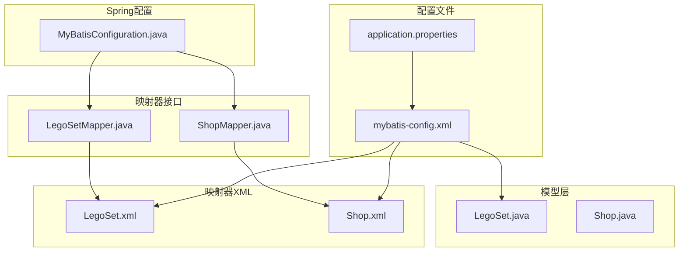
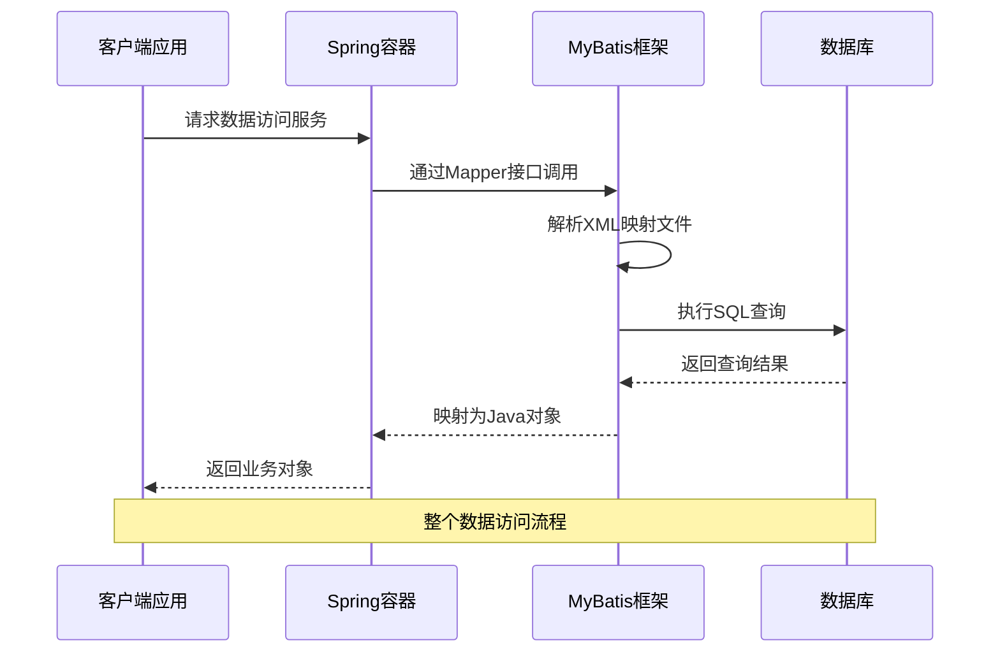
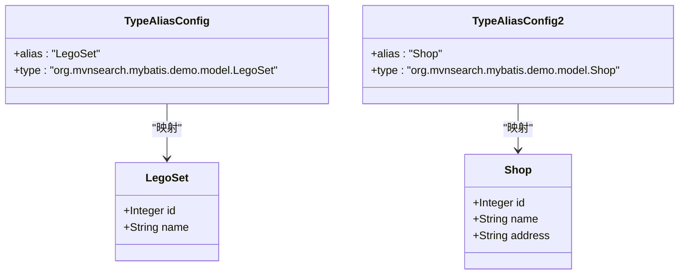
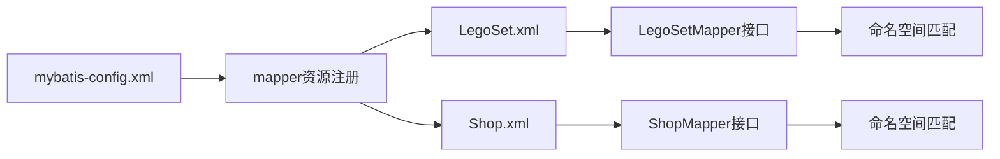
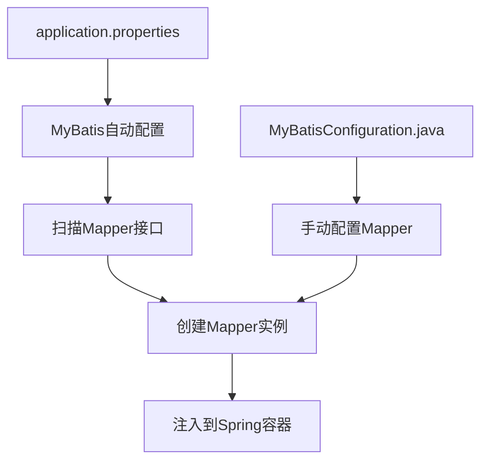
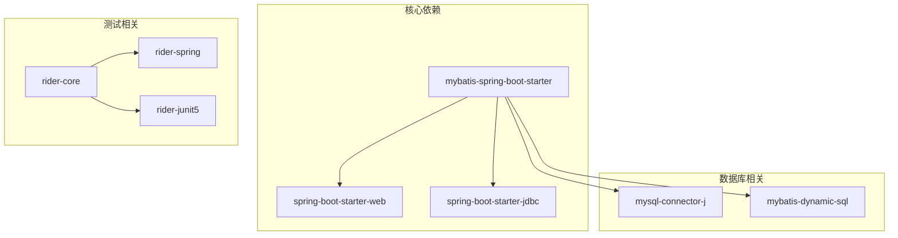

# MyBatis全局配置

<cite>
**本文档引用的文件**
- [mybatis-config.xml](file://src/main/resources/mybatis-config.xml)
- [application.properties](file://src/main/resources/application.properties)
- [MyBatisConfiguration.java](file://src/main/java/org/mvnsearch/mybatis/demo/repo/MyBatisConfiguration.java)
- [LegoSet.xml](file://src/main/resources/mapper/LegoSet.xml)
- [Shop.xml](file://src/main/resources/mapper/Shop.xml)
- [LegoSet.java](file://src/main/java/org/mvnsearch/mybatis/demo/model/LegoSet.java)
- [Shop.java](file://src/main/java/org/mvnsearch/mybatis/demo/model/Shop.java)
- [LegoSetMapper.java](file://src/main/java/org/mvnsearch/mybatis/demo/repo/LegoSetMapper.java)
- [ShopMapper.java](file://src/main/java/org/mvnsearch/mybatis/demo/repo/ShopMapper.java)
- [pom.xml](file://pom.xml)
</cite>

## 目录
1. [简介](#简介)
2. [项目结构](#项目结构)
3. [核心组件](#核心组件)
4. [架构概览](#架构概览)
5. [详细组件分析](#详细组件分析)
6. [依赖分析](#依赖分析)
7. [性能考虑](#性能考虑)
8. [故障排除指南](#故障排除指南)
9. [结论](#结论)
10. [附录](#附录)

## 简介

本项目展示了MyBatis在Spring Boot环境中的完整配置和使用示例。通过分析项目的全局配置文件，我们可以深入了解MyBatis的核心配置元素，包括类型别名、映射器注册和基本设置选项。该项目使用Spring Boot Starter集成MyBatis，提供了完整的数据库访问层实现。

## 项目结构

该项目采用标准的Maven项目结构，重点关注数据访问层的实现：



**图表来源**
- [mybatis-config.xml:1-14](file://src/main/resources/mybatis-config.xml#L1-L14)
- [application.properties:1-11](file://src/main/resources/application.properties#L1-L11)

**章节来源**
- [mybatis-config.xml:1-14](file://src/main/resources/mybatis-config.xml#L1-L14)
- [application.properties:1-11](file://src/main/resources/application.properties#L1-L11)

## 核心组件

### 全局配置文件结构

MyBatis的全局配置文件位于`src/main/resources/mybatis-config.xml`，包含以下核心元素：

#### 类型别名配置 (`<typeAliases>`)
类型别名用于简化实体类的引用，避免在XML映射文件中重复输入完整的类名。

#### 映射器配置 (`<mappers>`)
映射器配置负责注册和加载XML映射文件，建立接口与SQL语句的映射关系。

**章节来源**
- [mybatis-config.xml:5-14](file://src/main/resources/mybatis-config.xml#L5-L14)

### Spring Boot集成配置

项目通过`application.properties`文件进行MyBatis配置：

- 数据库连接配置：MySQL连接参数、用户名、密码
- MyBatis配置位置：`mybatis.config-location=classpath:/mybatis-config.xml`
- 日志级别配置：详细的调试信息

**章节来源**
- [application.properties:1-11](file://src/main/resources/application.properties#L1-L11)

## 架构概览

该项目采用了分层架构设计，展示了MyBatis在实际项目中的完整应用流程：



**图表来源**
- [MyBatisConfiguration.java:11-23](file://src/main/java/org/mvnsearch/mybatis/demo/repo/MyBatisConfiguration.java#L11-L23)
- [LegoSet.xml:10-14](file://src/main/resources/mapper/LegoSet.xml#L10-L14)

## 详细组件分析

### 类型别名系统

#### 配置结构分析

类型别名配置位于全局配置文件的`<typeAliases>`标签内，为每个实体类定义简短的别名：



**图表来源**
- [mybatis-config.xml:6-9](file://src/main/resources/mybatis-config.xml#L6-L9)
- [LegoSet.java:3-23](file://src/main/java/org/mvnsearch/mybatis/demo/model/LegoSet.java#L3-L23)
- [Shop.java:3-32](file://src/main/java/org/mvnsearch/mybatis/demo/model/Shop.java#L3-L32)

#### 使用方式

在XML映射文件中，可以直接使用别名而非完整类名：
- `type="LegoSet"` 而非 `type="org.mvnsearch.mybatis.demo.model.LegoSet"`
- 简化了XML文件的可读性和维护性

**章节来源**
- [mybatis-config.xml:6-9](file://src/main/resources/mybatis-config.xml#L6-L9)
- [LegoSet.xml:5](file://src/main/resources/mapper/LegoSet.xml#L5)
- [Shop.xml:5](file://src/main/resources/mapper/Shop.xml#L5)

### 映射器注册机制

#### XML映射文件注册

映射器通过`<mappers>`标签进行注册，支持多种注册方式：



**图表来源**
- [mybatis-config.xml:10-13](file://src/main/resources/mybatis-config.xml#L10-L13)
- [LegoSet.xml:3](file://src/main/resources/mapper/LegoSet.xml#L3)
- [Shop.xml:3](file://src/main/resources/mapper/Shop.xml#L3)

#### 命名空间匹配

每个XML映射文件都定义了对应的命名空间，必须与Mapper接口的全限定名完全匹配：
- `LegoSet.xml` 的命名空间：`org.mvnsearch.mybatis.demo.repo.LegoSetMapper`
- `Shop.xml` 的命名空间：`org.mvnsearch.mybatis.demo.repo.ShopMapper`

**章节来源**
- [mybatis-config.xml:10-13](file://src/main/resources/mybatis-config.xml#L10-L13)
- [LegoSet.xml:3](file://src/main/resources/mapper/LegoSet.xml#L3)
- [Shop.xml:3](file://src/main/resources/mapper/Shop.xml#L3)

### Spring Boot集成配置

#### 自动配置机制

项目使用Spring Boot Starter自动配置MyBatis，无需手动创建SqlSessionFactory：



**图表来源**
- [application.properties:6](file://src/main/resources/application.properties#L6)
- [MyBatisConfiguration.java:11-23](file://src/main/java/org/mvnsearch/mybatis/demo/repo/MyBatisConfiguration.java#L11-L23)

#### 两种配置方式对比

1. **自动配置方式**（推荐）
   - 通过注解驱动的Mapper接口
   - Spring Boot自动扫描和注册
   - 更简洁的代码结构

2. **手动配置方式**
   - 使用MapperFactoryBean显式创建
   - 提供更精细的控制
   - 适用于复杂场景

**章节来源**
- [MyBatisConfiguration.java:8-24](file://src/main/java/org/mvnsearch/mybatis/demo/repo/MyBatisConfiguration.java#L8-L24)

## 依赖分析

### Maven依赖关系

项目使用MyBatis Spring Boot Starter，集成了完整的MyBatis生态：



**图表来源**
- [pom.xml:30-56](file://pom.xml#L30-L56)

### 版本兼容性

- Spring Boot版本：3.5.7
- MyBatis Spring Boot Starter版本：3.0.5
- Java版本：21
- MySQL Connector版本：8.x

**章节来源**
- [pom.xml:19-28](file://pom.xml#L19-L28)

## 性能考虑

### 配置优化建议

基于当前项目配置，以下是性能优化建议：

#### 连接池配置
```properties
# 建议添加的配置项
spring.datasource.hikari.maximum-pool-size=20
spring.datasource.hikari.minimum-idle=5
spring.datasource.hikari.connection-timeout=30000
```

#### SQL执行优化
- 合理使用索引：确保常用查询字段有适当索引
- 避免SELECT *：只选择需要的列
- 使用批量操作：对于大量数据操作使用批处理

#### 缓存策略
```properties
# 开启二级缓存（如需）
mybatis.configuration.cache-enabled=true
```

### 监控和调试

项目已配置详细的日志级别：
- `logging.level.org.springframework.jdbc.core.JdbcTemplate=DEBUG`
- `logging.level.example.springdata.jdbc.mybatis=TRACE`

**章节来源**
- [application.properties:7-10](file://src/main/resources/application.properties#L7-L10)

## 故障排除指南

### 常见配置问题

#### 1. 类型别名未生效
**症状**：XML映射文件中使用别名时报错
**解决方案**：
- 检查别名配置是否正确
- 确保实体类路径正确
- 验证别名名称唯一性

#### 2. 映射器未找到
**症状**：启动时提示找不到Mapper接口
**解决方案**：
- 检查命名空间与接口全限定名匹配
- 确认XML文件路径正确
- 验证Mapper接口注解配置

#### 3. 数据库连接失败
**症状**：应用启动时报数据库连接错误
**解决方案**：
- 检查数据库URL、用户名、密码
- 确认MySQL服务正常运行
- 验证网络连接

### 配置验证方法

#### 1. 基础验证
- 启动应用检查日志输出
- 验证数据库连接状态
- 测试简单的查询操作

#### 2. 配置文件验证
- 使用XML Schema验证器检查配置文件格式
- 确认所有必需的配置项都已设置
- 验证文件编码为UTF-8

#### 3. 单元测试验证
```java
@Test
public void testMyBatisConfiguration() {
    // 验证Mapper接口可用性
    assertThat(legoSetMapper).isNotNull();
    // 验证基本查询功能
    LegoSet result = legoSetMapper.findById(1);
    assertThat(result).isNotNull();
}
```

**章节来源**
- [LegoSetMapperTest.java:26-44](file://src/test/java/org/mvnsearch/mybatis/demo/repo/LegoSetMapperTest.java#L26-L44)
- [ShopMapperTest.java:11-30](file://src/test/java/org/mvnsearch/mybatis/demo/repo/ShopMapperTest.java#L11-L30)

## 结论

本项目展示了MyBatis在Spring Boot环境中的最佳实践配置。通过合理的全局配置、清晰的类型别名管理和规范的映射器注册机制，实现了高效的数据访问层。项目采用的自动配置方式简化了开发流程，同时保持了足够的灵活性。

主要优势：
- 清晰的配置分离：全局配置、接口定义、XML映射文件职责明确
- 简化的类型引用：通过类型别名提高代码可读性
- 标准化的映射器管理：统一的命名空间和注册机制
- 完善的测试覆盖：验证配置的有效性和功能正确性

## 附录

### 扩展MyBatis配置

#### 添加新的类型别名
```xml
<typeAliases>
    <typeAlias alias="NewEntity" type="com.example.model.NewEntity"/>
</typeAliases>
```

#### 注册新的映射器
```xml
<mappers>
    <mapper resource="mapper/NewEntity.xml"/>
</mappers>
```

#### 配置新的设置选项
```xml
<settings>
    <setting name="mapUnderscoreToCamelCase" value="true"/>
    <setting name="safeRowBoundsEnabled" value="true"/>
</settings>
```

#### 自定义插件配置
```xml
<objectFactory type="org.apache.ibatis.reflection.factory.DefaultObjectFactory">
    <property name="someProperty" value="someValue"/>
</objectFactory>
```

### 最佳实践总结

1. **配置分离**：将不同类型的配置放在相应的配置文件中
2. **命名规范**：保持一致的命名约定，便于维护
3. **测试驱动**：为每个Mapper编写单元测试
4. **文档记录**：为复杂的SQL查询添加注释说明
5. **性能监控**：定期检查慢查询和性能瓶颈