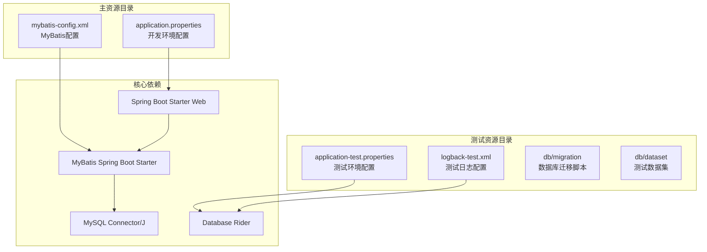
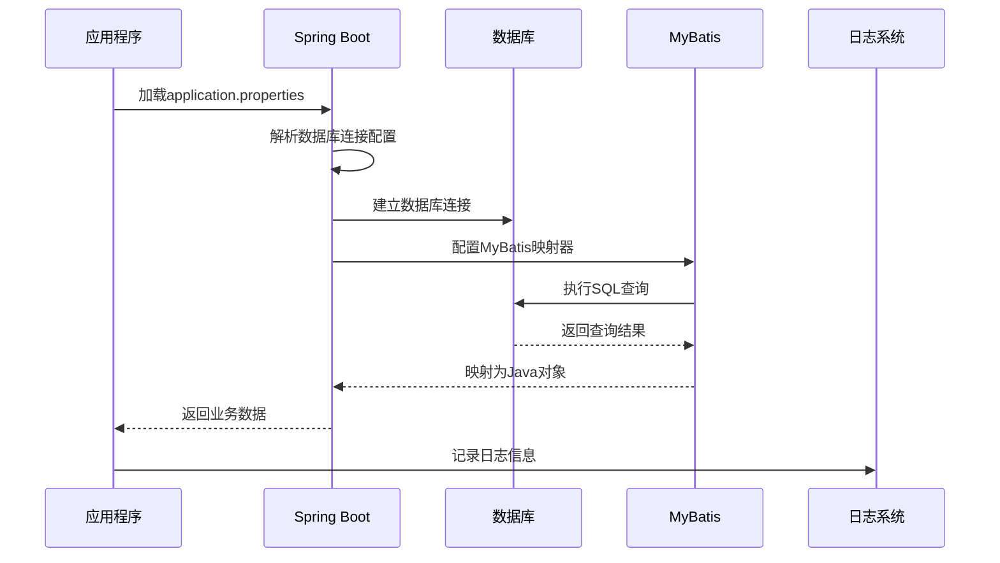
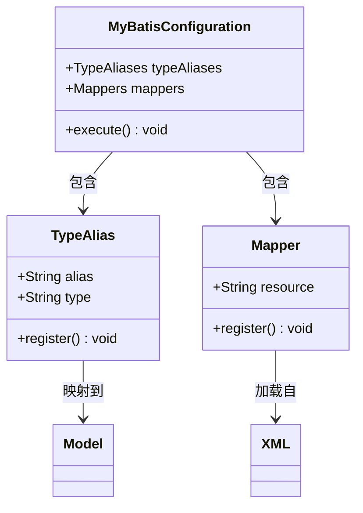
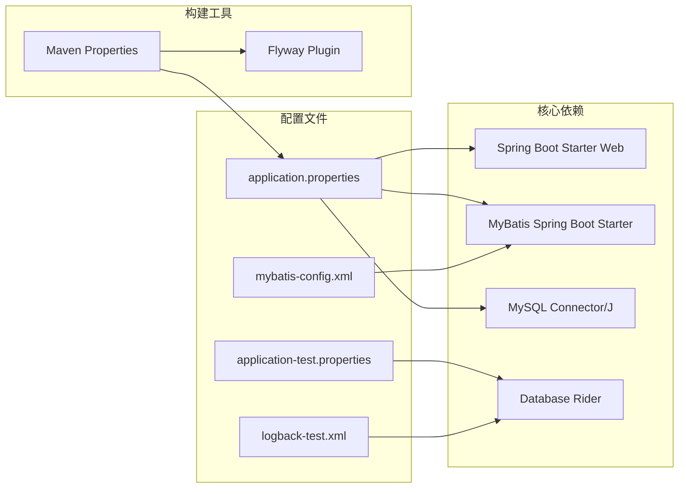

# 应用程序属性配置

<cite>
**本文档引用的文件**
- [application.properties](file://src/main/resources/application.properties)
- [application-test.properties](file://src/test/resources/application-test.properties)
- [mybatis-config.xml](file://src/main/resources/mybatis-config.xml)
- [pom.xml](file://pom.xml)
- [logback-test.xml](file://src/test/resources/logback-test.xml)
- [ProjectBaseTest.java](file://src/test/java/org/mvnsearch/mybatis/demo/ProjectBaseTest.java)
- [DataBaseTest.java](file://src/test/java/org/mvnsearch/mybatis/demo/DataBaseTest.java)
</cite>

## 目录
1. [简介](#简介)
2. [项目结构](#项目结构)
3. [核心配置组件](#核心配置组件)
4. [架构概览](#架构概览)
5. [详细配置分析](#详细配置分析)
6. [依赖关系分析](#依赖关系分析)
7. [性能考虑](#性能考虑)
8. [故障排除指南](#故障排除指南)
9. [结论](#结论)

## 简介

本文件详细说明了MyBatis Spring Demo项目中的应用程序属性配置。该配置系统基于Spring Boot的外部化配置机制，通过application.properties文件定义数据库连接、MyBatis映射器配置和日志级别设置。项目采用MySQL作为默认数据库，使用MyBatis进行数据持久化操作，并通过Logback进行日志管理。

## 项目结构

该项目采用标准的Maven多模块结构，包含开发环境和测试环境的配置分离：

**图表来源**
- [application.properties:1-11](file://src/main/resources/application.properties#L1-L11)
- [pom.xml:30-51](file://pom.xml#L30-L51)

**章节来源**
- [application.properties:1-11](file://src/main/resources/application.properties#L1-L11)
- [pom.xml:1-141](file://pom.xml#L1-L141)

## 核心配置组件

### 数据库连接配置

项目使用Spring Boot的自动配置机制来管理数据库连接。所有数据库相关配置都通过spring.datasource前缀进行管理。

### MyBatis配置

MyBatis框架通过mybatis.config-location属性指定配置文件位置，该文件定义了类型别名和映射器注册。

### 日志配置

应用采用Logback作为日志实现，通过logging.level.*属性控制不同包的日志级别。

**章节来源**
- [application.properties:1-11](file://src/main/resources/application.properties#L1-L11)
- [mybatis-config.xml:1-14](file://src/main/resources/mybatis-config.xml#L1-L14)

## 架构概览

**图表来源**
- [application.properties:1-11](file://src/main/resources/application.properties#L1-L11)
- [mybatis-config.xml:1-14](file://src/main/resources/mybatis-config.xml#L1-L14)

## 详细配置分析

### 数据库连接配置详解

#### spring.datasource.url
- **作用**: 指定MySQL数据库的连接URL
- **格式**: jdbc:mysql://主机:端口/数据库名?连接参数
- **当前值**: jdbc:mysql://localhost:13306/test?useUnicode=true&characterEncoding=utf8&zeroDateTimeBehavior=convertToNull
- **默认值**: 无默认值，必须显式配置
- **可选值**: 任何有效的MySQL连接URL格式

#### spring.datasource.username
- **作用**: 数据库用户名
- **当前值**: root
- **默认值**: 无默认值，必须显式配置
- **安全建议**: 生产环境应使用专用服务账户

#### spring.datasource.password
- **作用**: 数据库密码
- **当前值**: 123456
- **默认值**: 无默认值，必须显式配置
- **安全警告**: 密码应存储在安全的位置，不要硬编码

#### spring.datasource.driver-class-name
- **作用**: JDBC驱动类名称
- **当前值**: com.mysql.cj.jdbc.Driver
- **默认值**: 由Spring Boot自动推断
- **兼容性**: MySQL Connector/J 8.0+

**章节来源**
- [application.properties:2-5](file://src/main/resources/application.properties#L2-L5)

### MyBatis配置详解

#### mybatis.config-location
- **作用**: 指定MyBatis配置文件的路径
- **当前值**: classpath:/mybatis-config.xml
- **默认值**: 无默认值
- **文件内容**: 定义类型别名和映射器注册

MyBatis配置文件包含以下关键元素：

**图表来源**
- [mybatis-config.xml:6-13](file://src/main/resources/mybatis-config.xml#L6-L13)

**章节来源**
- [application.properties](file://src/main/resources/application.properties#L6)
- [mybatis-config.xml:1-14](file://src/main/resources/mybatis-config.xml#L1-L14)

### 日志配置详解

#### logging.level.org.springframework.data
- **作用**: 设置Spring Data相关组件的日志级别
- **当前值**: INFO
- **默认值**: 未设置时使用根日志级别
- **可选值**: TRACE, DEBUG, INFO, WARN, ERROR

#### logging.level.org.springframework.jdbc.core.JdbcTemplate
- **作用**: 设置JDBC模板的日志级别
- **当前值**: DEBUG
- **默认值**: 未设置时使用根日志级别
- **用途**: 调试SQL执行过程

#### logging.level.example.springdata.jdbc.mybatis
- **作用**: 设置自定义包的日志级别
- **当前值**: TRACE
- **默认值**: 未设置时使用根日志级别
- **用途**: 详细跟踪MyBatis操作

**章节来源**
- [application.properties:7-10](file://src/main/resources/application.properties#L7-L10)

### 测试环境配置

#### application-test.properties
- **作用**: 测试环境专用配置文件
- **当前内容**: 仅包含注释行 `### datasource`
- **激活方式**: 通过@ActiveProfiles("test")注解激活
- **优先级**: 高于application.properties

#### 测试日志配置
- **文件**: logback-test.xml
- **根日志级别**: WARN
- **用途**: 减少测试输出，提高测试执行速度

**章节来源**
- [application-test.properties](file://src/test/resources/application-test.properties#L1)
- [logback-test.xml:1-13](file://src/test/resources/logback-test.xml#L1-L13)
- [ProjectBaseTest.java](file://src/test/java/org/mvnsearch/mybatis/demo/ProjectBaseTest.java#L17)

## 依赖关系分析

**图表来源**
- [pom.xml:19-28](file://pom.xml#L19-L28)
- [pom.xml:30-51](file://pom.xml#L30-L51)

**章节来源**
- [pom.xml:1-141](file://pom.xml#L1-L141)

## 性能考虑

### 数据库连接优化
- 使用连接池配置提升性能
- 合理设置连接超时时间
- 监控连接池使用情况

### MyBatis性能调优
- 启用二级缓存（如适用）
- 优化SQL查询语句
- 合理使用延迟加载

### 日志性能影响
- 生产环境建议使用WARN级别
- 避免在高频路径中记录大量调试信息
- 考虑异步日志记录

## 故障排除指南

### 常见配置错误及解决方案

#### 数据库连接失败
**问题症状**: 应用启动时报数据库连接异常
**可能原因**:
- 数据库服务器不可达
- 用户名或密码错误
- 驱动类名不正确

**解决步骤**:
1. 验证数据库服务状态
2. 检查网络连接
3. 确认凭据正确性
4. 验证驱动版本兼容性

#### MyBatis映射器加载失败
**问题症状**: 查询时抛出映射器相关异常
**可能原因**:
- 配置文件路径错误
- 类型别名定义缺失
- XML映射文件路径不正确

**解决步骤**:
1. 检查mybatis.config-location配置
2. 验证类型别名定义
3. 确认XML文件存在且路径正确

#### 日志配置无效
**问题症状**: 日志级别设置不起作用
**可能原因**:
- 配置文件加载顺序问题
- 包名匹配不正确
- Logback配置冲突

**解决步骤**:
1. 检查配置文件命名规范
2. 验证包名路径正确性
3. 确认Logback配置文件优先级

### 配置验证方法

#### 启动时验证
- 使用Spring Boot Actuator监控配置
- 查看应用启动日志确认配置加载
- 验证数据库连接状态

#### 运行时验证
- 通过HTTP接口检查配置信息
- 监控数据库连接池状态
- 观察日志输出级别

**章节来源**
- [DataBaseTest.java:20-25](file://src/test/java/org/mvnsearch/mybatis/demo/DataBaseTest.java#L20-L25)

## 结论

本项目的属性配置系统设计合理，实现了开发、测试和生产环境的有效分离。通过Spring Boot的自动配置机制，简化了数据库和MyBatis的集成配置。建议在生产环境中：

1. 将敏感信息移至环境变量或密钥管理系统
2. 使用连接池配置优化数据库性能
3. 实施适当的日志轮转策略
4. 建立配置变更的审计机制

该配置体系为后续的功能扩展和环境迁移提供了良好的基础。