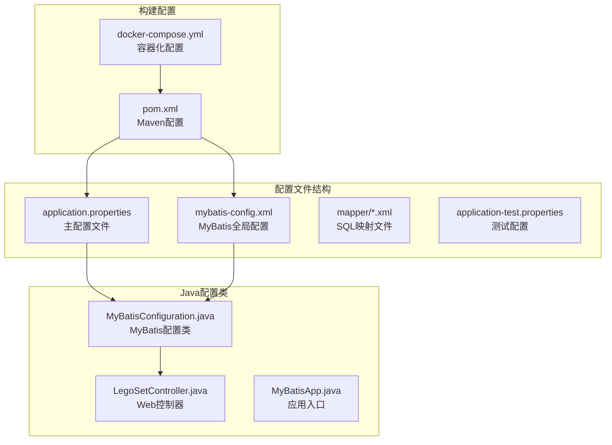
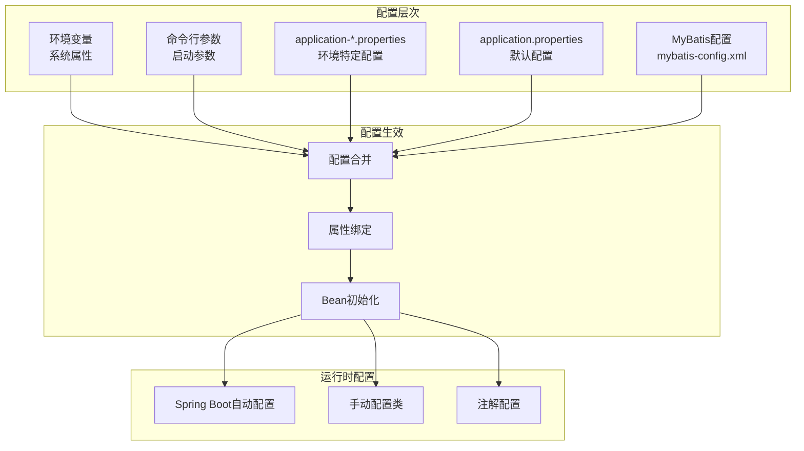
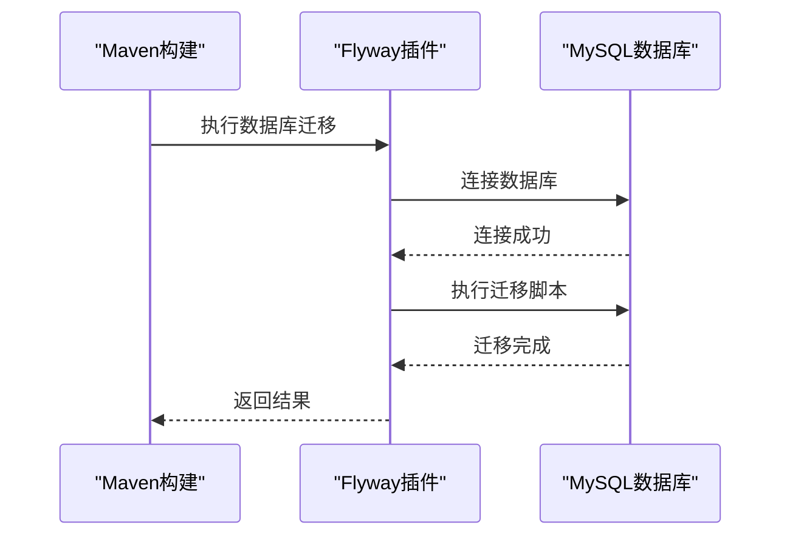
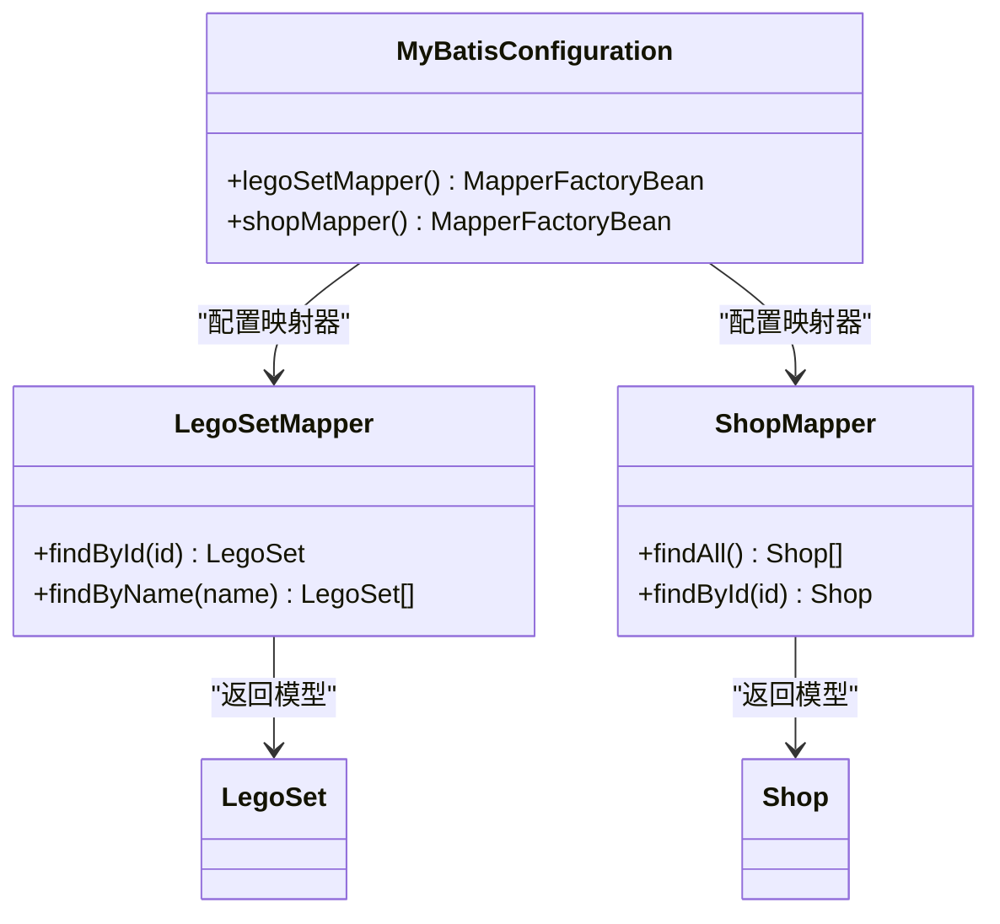
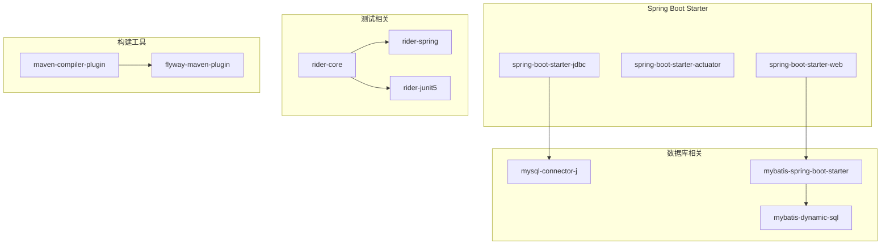
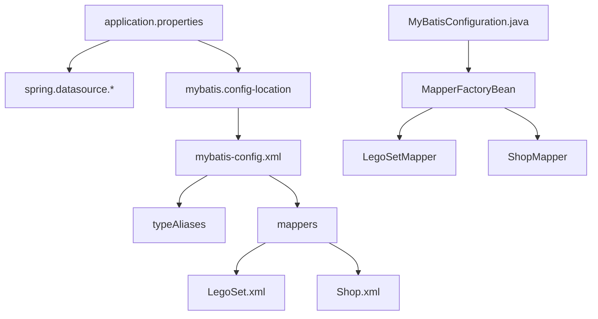

# 配置管理

<cite>
**本文档引用的文件**
- [application.properties](file://src/main/resources/application.properties)
- [mybatis-config.xml](file://src/main/resources/mybatis-config.xml)
- [application-test.properties](file://src/test/resources/application-test.properties)
- [pom.xml](file://pom.xml)
- [MyBatisConfiguration.java](file://src/main/java/org/mvnsearch/mybatis/demo/repo/MyBatisConfiguration.java)
- [LegoSetController.java](file://src/main/java/org/mvnsearch/mybatis/demo/web/LegoSetController.java)
- [MyBatisApp.java](file://src/main/java/org/mvnsearch/mybatis/demo/MyBatisApp.java)
- [LegoSet.xml](file://src/main/resources/mapper/LegoSet.xml)
- [LegoSet.java](file://src/main/java/org/mvnsearch/mybatis/demo/model/LegoSet.java)
- [Shop.java](file://src/main/java/org/mvnsearch/mybatis/demo/model/Shop.java)
- [docker-compose.yml](file://docker-compose.yml)
</cite>

## 目录
1. [简介](#简介)
2. [项目结构](#项目结构)
3. [核心配置组件](#核心配置组件)
4. [架构概览](#架构概览)
5. [详细组件分析](#详细组件分析)
6. [依赖关系分析](#依赖关系分析)
7. [性能考虑](#性能考虑)
8. [故障排除指南](#故障排除指南)
9. [结论](#结论)
10. [附录](#附录)

## 简介

本项目是一个基于Spring Boot和MyBatis的演示应用，展示了现代Java应用程序的配置管理最佳实践。该应用通过多种配置文件实现了灵活的环境管理和配置分离，包括数据库连接配置、MyBatis全局配置、日志配置等。

项目采用分层架构设计，通过application.properties进行主要配置，mybatis-config.xml定义MyBatis全局设置，配合Maven构建系统实现环境隔离和配置管理。

## 项目结构

项目采用标准的Maven目录结构，配置文件主要位于`src/main/resources`目录下：



**图表来源**
- [application.properties:1-11](file://src/main/resources/application.properties#L1-L11)
- [mybatis-config.xml:1-14](file://src/main/resources/mybatis-config.xml#L1-L14)
- [MyBatisConfiguration.java:1-25](file://src/main/java/org/mvnsearch/mybatis/demo/repo/MyBatisConfiguration.java#L1-L25)

**章节来源**
- [application.properties:1-11](file://src/main/resources/application.properties#L1-L11)
- [mybatis-config.xml:1-14](file://src/main/resources/mybatis-config.xml#L1-L14)
- [pom.xml:1-141](file://pom.xml#L1-L141)

## 核心配置组件

### 数据库连接配置

应用通过`application.properties`文件集中管理数据库连接信息：

- **数据源URL**: 指向本地MySQL 9.4.0实例，端口为13306
- **用户名**: root（开发环境默认）
- **密码**: 123456（开发环境默认）
- **驱动类**: MySQL Connector/J 9.4.0
- **自动配置**: Spring Boot自动配置数据源和连接池

### MyBatis全局配置

`mybatis-config.xml`文件定义了MyBatis的核心配置：

- **类型别名**: 为LegoSet和Shop模型类定义简短别名
- **映射器注册**: 自动扫描和注册XML映射文件
- **配置加载**: 通过`spring.datasource.mybatis.config-location`属性启用

### 日志配置

应用配置了多层级的日志输出：

- **Spring Data**: INFO级别
- **JDBC模板**: DEBUG级别  
- **自定义包**: TRACE级别

**章节来源**
- [application.properties:1-11](file://src/main/resources/application.properties#L1-L11)
- [mybatis-config.xml:1-14](file://src/main/resources/mybatis-config.xml#L1-L14)

## 架构概览

应用的配置架构体现了分层和解耦的设计原则：



**图表来源**
- [application.properties:1-11](file://src/main/resources/application.properties#L1-L11)
- [MyBatisConfiguration.java:1-25](file://src/main/java/org/mvnsearch/mybatis/demo/repo/MyBatisConfiguration.java#L1-L25)

## 详细组件分析

### 数据库配置组件

#### 连接池配置分析

应用使用Spring Boot的自动配置机制，无需显式配置连接池参数。默认情况下，Spring Boot会根据检测到的依赖自动配置合适的连接池。

#### 数据库迁移配置

项目集成了Flyway数据库迁移工具，通过Maven插件实现：

- **迁移脚本位置**: `src/test/resources/db/migration`
- **数据库URL**: 使用Maven属性`${jdbc_url}`
- **用户凭据**: 使用Maven属性`${jdbc_user}`和`${jdbc_password}`



**图表来源**
- [pom.xml:112-136](file://pom.xml#L112-L136)

**章节来源**
- [pom.xml:112-136](file://pom.xml#L112-L136)

### MyBatis配置组件

#### 类型别名配置

MyBatis配置文件定义了两个核心类型别名：

| 别名 | 完整类型 |
|------|----------|
| LegoSet | org.mvnsearch.mybatis.demo.model.LegoSet |
| Shop | org.mvnsearch.mybatis.demo.model.Shop |

这些别名简化了XML映射文件中的类型引用。

#### 映射器配置

配置文件中声明了两个映射器：

- **LegoSet.xml**: 对应LegoSet模型的数据库操作
- **Shop.xml**: 对应Shop模型的数据库操作

#### Java配置类替代方案

项目同时提供了基于Java的MyBatis配置类，展示了两种配置方式的对比：



**图表来源**
- [MyBatisConfiguration.java:1-25](file://src/main/java/org/mvnsearch/mybatis/demo/repo/MyBatisConfiguration.java#L1-L25)
- [LegoSetController.java:1-22](file://src/main/java/org/mvnsearch/mybatis/demo/web/LegoSetController.java#L1-L22)

**章节来源**
- [mybatis-config.xml:1-14](file://src/main/resources/mybatis-config.xml#L1-L14)
- [MyBatisConfiguration.java:1-25](file://src/main/java/org/mvnsearch/mybatis/demo/repo/MyBatisConfiguration.java#L1-L25)

### Web层配置

#### 控制器配置

LegoSetController展示了RESTful API的设计模式：

- **基础路径**: `/lego-set`
- **请求映射**: 支持GET请求获取LegoSet信息
- **参数处理**: 使用`@PathVariable`处理路径参数
- **依赖注入**: 自动注入LegoSetMapper接口

#### 应用入口配置

MyBatisApp作为Spring Boot应用入口，启用了自动配置功能。

**章节来源**
- [LegoSetController.java:1-22](file://src/main/java/org/mvnsearch/mybatis/demo/web/LegoSetController.java#L1-L22)
- [MyBatisApp.java:1-17](file://src/main/java/org/mvnsearch/mybatis/demo/MyBatisApp.java#L1-L17)

## 依赖关系分析

### Maven依赖配置

项目使用Maven管理依赖关系，关键依赖包括：



**图表来源**
- [pom.xml:30-101](file://pom.xml#L30-L101)

### 配置依赖关系

配置文件之间的依赖关系如下：



**图表来源**
- [application.properties:1-11](file://src/main/resources/application.properties#L1-L11)
- [mybatis-config.xml:1-14](file://src/main/resources/mybatis-config.xml#L1-L14)
- [MyBatisConfiguration.java:1-25](file://src/main/java/org/mvnsearch/mybatis/demo/repo/MyBatisConfiguration.java#L1-L25)

**章节来源**
- [pom.xml:30-101](file://pom.xml#L30-L101)

## 性能考虑

### 数据库连接优化

1. **连接池配置**: Spring Boot自动配置连接池，可根据需要调整最大连接数、超时时间等参数
2. **连接复用**: 合理配置连接生命周期，避免频繁创建和销毁连接
3. **查询优化**: 使用MyBatis的延迟加载和批量操作功能

### MyBatis性能调优

1. **缓存策略**: 启用二级缓存减少重复查询
2. **批量操作**: 使用批量插入和更新提高性能
3. **结果映射优化**: 减少不必要的字段映射和转换

### 日志性能影响

1. **日志级别控制**: 生产环境中建议使用INFO级别或更高
2. **异步日志**: 考虑使用异步日志框架减少I/O阻塞
3. **日志过滤**: 避免记录敏感信息和大量调试信息

## 故障排除指南

### 常见配置问题

#### 数据库连接失败

**症状**: 应用启动时报数据库连接错误

**排查步骤**:
1. 检查数据库服务是否正常运行
2. 验证数据库URL、用户名、密码配置
3. 确认MySQL驱动版本兼容性
4. 检查防火墙和网络连接

#### MyBatis映射错误

**症状**: 查询时报类型不匹配或映射失败

**排查步骤**:
1. 检查XML映射文件中的类型引用
2. 验证数据库表结构与模型类字段对应关系
3. 确认列名大小写和特殊字符处理
4. 查看MyBatis日志获取详细错误信息

#### 配置文件加载问题

**症状**: 配置未生效或被其他配置覆盖

**排查步骤**:
1. 检查配置文件命名和位置
2. 验证配置键值格式正确性
3. 确认配置文件优先级顺序
4. 使用Spring Boot Actuator检查当前配置

### 配置验证方法

#### 启动参数验证

```bash
# 启动时指定配置文件
java -jar mybatis-demo.jar --spring.profiles.active=dev

# 启动时覆盖配置
java -jar mybatis-demo.jar --spring.datasource.url=jdbc:mysql://localhost:3306/test
```

#### 配置检查工具

1. **Actuator端点**: 访问`/actuator/env`查看当前环境变量
2. **配置映射**: 使用`@ConfigurationProperties`绑定配置类
3. **条件注解**: 使用`@ConditionalOnProperty`进行条件配置

**章节来源**
- [application.properties:1-11](file://src/main/resources/application.properties#L1-L11)

## 结论

本项目展示了现代Java应用配置管理的最佳实践，通过合理的配置分离、环境隔离和自动化配置实现了高可维护性和可扩展性。

关键优势包括：
- **清晰的配置层次**: 从环境变量到具体配置文件的层次化管理
- **灵活的环境切换**: 通过profile实现开发、测试、生产环境的无缝切换
- **自动化的配置管理**: Spring Boot的自动配置减少了大量样板代码
- **完善的测试支持**: 集成测试配置确保配置的正确性

建议在实际项目中进一步完善：
- 添加更详细的配置文档和注释
- 实现配置热更新机制
- 增强配置安全性，特别是敏感信息的保护
- 建立配置变更的审计和回滚机制

## 附录

### 配置文件命名约定

| 文件名 | 用途 | 优先级 |
|--------|------|--------|
| application.properties | 默认配置 | 最低 |
| application-dev.properties | 开发环境配置 | 低 |
| application-test.properties | 测试环境配置 | 中 |
| application-prod.properties | 生产环境配置 | 最高 |
| application-*.properties | 自定义环境配置 | 可变 |

### 环境切换方法

1. **命令行参数**: `--spring.profiles.active=dev`
2. **环境变量**: `SPRING_PROFILES_ACTIVE=dev`
3. **系统属性**: `-Dspring.profiles.active=dev`
4. **配置文件**: 在application.properties中设置`spring.profiles.active=dev`

### 安全配置建议

1. **敏感信息保护**: 将数据库密码等敏感信息存储在环境变量中
2. **配置加密**: 对于生产环境，考虑使用配置加密方案
3. **访问控制**: 限制对配置文件的访问权限
4. **日志脱敏**: 避免在日志中记录敏感配置信息

### 扩展配置示例

如需添加新的配置项，可以按照以下步骤进行：

1. 在`application.properties`中添加新配置
2. 创建对应的配置类使用`@ConfigurationProperties`
3. 在需要的地方注入配置类使用
4. 添加相应的单元测试验证配置正确性