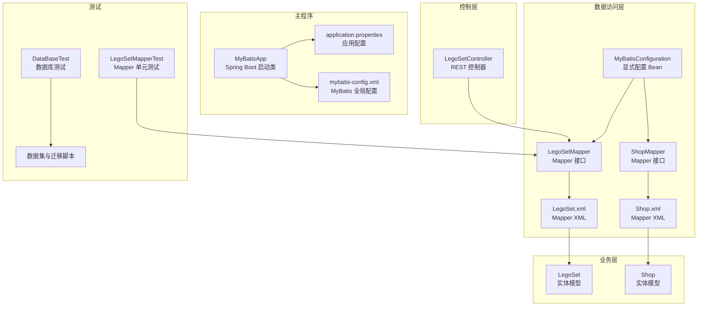
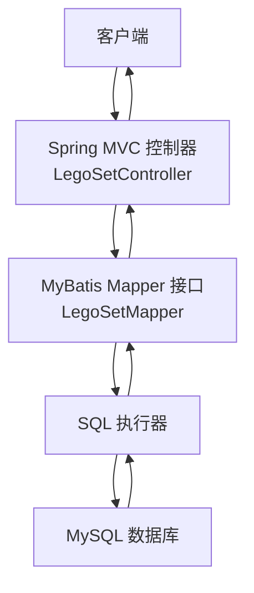
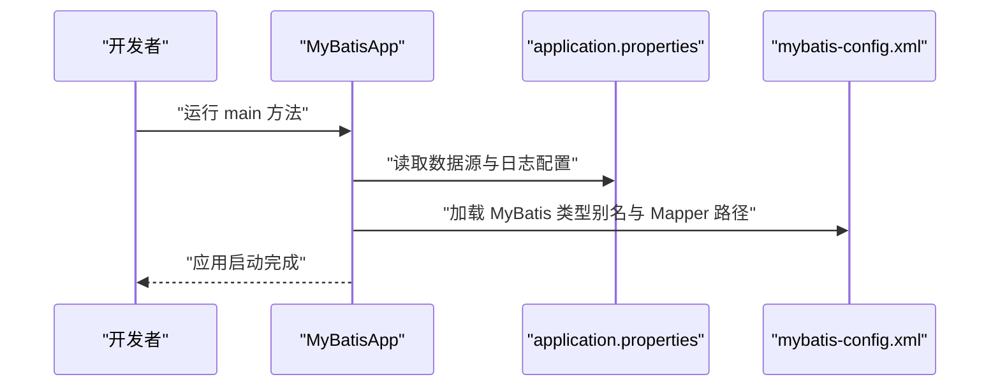
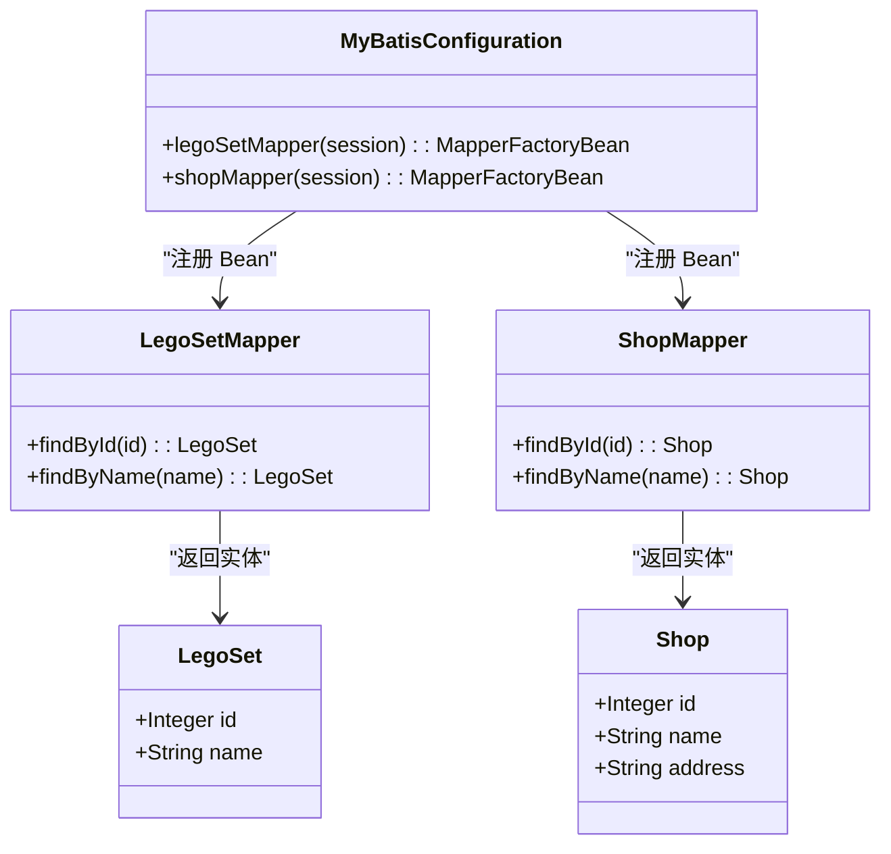
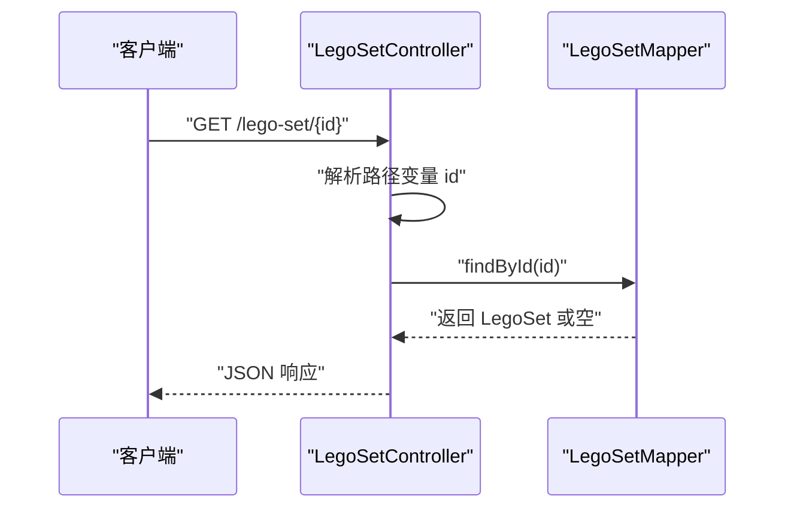
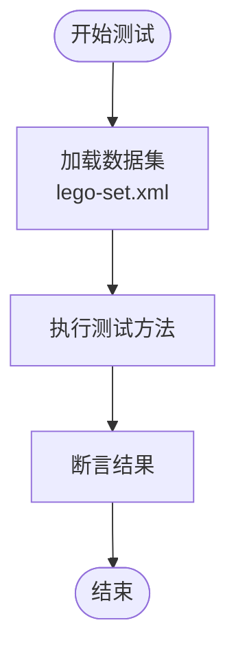
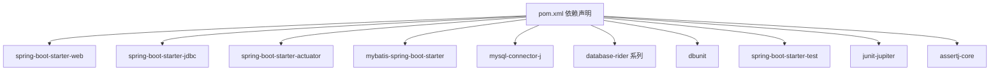

# 项目概述

<cite>
**本文档引用的文件**
- [README.md](file://README.md)
- [pom.xml](file://pom.xml)
- [MyBatisApp.java](file://src/main/java/org/mvnsearch/mybatis/demo/MyBatisApp.java)
- [application.properties](file://src/main/resources/application.properties)
- [mybatis-config.xml](file://src/main/resources/mybatis-config.xml)
- [LegoSet.java](file://src/main/java/org/mvnsearch/mybatis/demo/model/LegoSet.java)
- [Shop.java](file://src/main/java/org/mvnsearch/mybatis/demo/model/Shop.java)
- [LegoSetMapper.java](file://src/main/java/org/mvnsearch/mybatis/demo/repo/LegoSetMapper.java)
- [ShopMapper.java](file://src/main/java/org/mvnsearch/mybatis/demo/repo/ShopMapper.java)
- [LegoSetController.java](file://src/main/java/org/mvnsearch/mybatis/demo/web/LegoSetController.java)
- [LegoSet.xml](file://src/main/resources/mapper/LegoSet.xml)
- [Shop.xml](file://src/main/resources/mapper/Shop.xml)
- [MyBatisConfiguration.java](file://src/main/java/org/mvnsearch/mybatis/demo/repo/MyBatisConfiguration.java)
- [docker-compose.yml](file://docker-compose.yml)
- [LegoSetMapperTest.java](file://src/test/java/org/mvnsearch/mybatis/demo/repo/LegoSetMapperTest.java)
- [DataBaseTest.java](file://src/test/java/org/mvnsearch/mybatis/demo/DataBaseTest.java)
- [application-test.properties](file://src/test/resources/application-test.properties)
</cite>

## 目录
1. [引言](#引言)
2. [项目结构](#项目结构)
3. [核心组件](#核心组件)
4. [架构总览](#架构总览)
5. [详细组件分析](#详细组件分析)
6. [依赖分析](#依赖分析)
7. [性能考虑](#性能考虑)
8. [故障排除指南](#故障排除指南)
9. [结论](#结论)
10. [附录](#附录)

## 引言
本项目是一个基于 MyBatis 与 Spring Boot 的 Java Web 应用演示工程，目标是展示如何在 Spring Boot 环境中集成 MyBatis 作为 ORM 框架。通过最小化的业务模型（乐高套装与商店）和对应的 Mapper 接口及 XML 映射，项目演示了从应用启动、数据源配置、MyBatis 配置到控制器访问数据库的完整流程。项目适合初学者理解 Spring Boot 与 MyBatis 的集成方式，也便于有经验的开发者参考其配置与测试策略。

技术栈选择原因：
- Java 21：现代语言版本，具备更好的性能与语言特性。
- Spring Boot 3.5.7：提供自动配置与开箱即用的生产级能力，简化依赖管理与部署。
- MyBatis Spring Boot Starter 3.0.5：提供与 Spring Boot 的无缝集成，自动扫描 Mapper 与配置。
- MySQL：稳定的关系型数据库，配合 Flyway 进行迁移管理。
- Maven：统一构建与依赖管理工具。

## 项目结构
项目采用标准的 Maven 多模块布局，主要由以下部分组成：
- 主程序入口与配置：Spring Boot 启动类、应用属性、MyBatis 全局配置。
- 业务模型：实体类（Model），对应数据库表结构。
- 数据访问层：Mapper 接口与 XML 映射文件。
- 控制层：REST 控制器，暴露查询接口。
- 测试：单元测试、数据库集成测试与数据集准备。

图表来源
- [MyBatisApp.java:11-16](file://src/main/java/org/mvnsearch/mybatis/demo/MyBatisApp.java#L11-L16)
- [application.properties:1-11](file://src/main/resources/application.properties#L1-L11)
- [mybatis-config.xml:5-14](file://src/main/resources/mybatis-config.xml#L5-L14)
- [LegoSet.java:1-23](file://src/main/java/org/mvnsearch/mybatis/demo/model/LegoSet.java#L1-L23)
- [Shop.java:1-32](file://src/main/java/org/mvnsearch/mybatis/demo/model/Shop.java#L1-L32)
- [LegoSetMapper.java:12-20](file://src/main/java/org/mvnsearch/mybatis/demo/repo/LegoSetMapper.java#L12-L20)
- [ShopMapper.java:12-20](file://src/main/java/org/mvnsearch/mybatis/demo/repo/ShopMapper.java#L12-L20)
- [LegoSet.xml:3-22](file://src/main/resources/mapper/LegoSet.xml#L3-L22)
- [Shop.xml:3-24](file://src/main/resources/mapper/Shop.xml#L3-L24)
- [MyBatisConfiguration.java:8-24](file://src/main/java/org/mvnsearch/mybatis/demo/repo/MyBatisConfiguration.java#L8-L24)
- [LegoSetController.java:11-21](file://src/main/java/org/mvnsearch/mybatis/demo/web/LegoSetController.java#L11-L21)
- [LegoSetMapperTest.java:26-44](file://src/test/java/org/mvnsearch/mybatis/demo/repo/LegoSetMapperTest.java#L26-L44)
- [DataBaseTest.java:12-26](file://src/test/java/org/mvnsearch/mybatis/demo/DataBaseTest.java#L12-L26)

章节来源
- [README.md:13-29](file://README.md#L13-L29)
- [pom.xml:30-101](file://pom.xml#L30-L101)

## 核心组件
- Spring Boot 应用入口：负责应用启动与上下文初始化。
- 数据源与连接：通过 application.properties 配置 MySQL 连接信息。
- MyBatis 配置：mybatis-config.xml 声明类型别名与 Mapper XML 路径。
- 实体模型：LegoSet 与 Shop 对应数据库表字段。
- Mapper 接口与 XML：声明查询方法并通过 XML 定义 SQL 与结果映射。
- 控制器：LegoSetController 提供 REST 接口用于查询乐高套装。
- 测试：Database Rider 与 DBUnit 支持数据集驱动的数据库测试。

章节来源
- [MyBatisApp.java:11-16](file://src/main/java/org/mvnsearch/mybatis/demo/MyBatisApp.java#L11-L16)
- [application.properties:1-11](file://src/main/resources/application.properties#L1-L11)
- [mybatis-config.xml:5-14](file://src/main/resources/mybatis-config.xml#L5-L14)
- [LegoSet.java:1-23](file://src/main/java/org/mvnsearch/mybatis/demo/model/LegoSet.java#L1-L23)
- [Shop.java:1-32](file://src/main/java/org/mvnsearch/mybatis/demo/model/Shop.java#L1-L32)
- [LegoSetMapper.java:12-20](file://src/main/java/org/mvnsearch/mybatis/demo/repo/LegoSetMapper.java#L12-L20)
- [ShopMapper.java:12-20](file://src/main/java/org/mvnsearch/mybatis/demo/repo/ShopMapper.java#L12-L20)
- [LegoSet.xml:3-22](file://src/main/resources/mapper/LegoSet.xml#L3-L22)
- [Shop.xml:3-24](file://src/main/resources/mapper/Shop.xml#L3-L24)
- [LegoSetController.java:11-21](file://src/main/java/org/mvnsearch/mybatis/demo/web/LegoSetController.java#L11-L21)
- [LegoSetMapperTest.java:26-44](file://src/test/java/org/mvnsearch/mybatis/demo/repo/LegoSetMapperTest.java#L26-L44)
- [DataBaseTest.java:12-26](file://src/test/java/org/mvnsearch/mybatis/demo/DataBaseTest.java#L12-L26)

## 架构总览
该系统采用分层架构，遵循“控制器-服务-数据访问-数据库”的职责分离。Spring MVC 控制器接收请求，调用数据访问层的 Mapper 接口，MyBatis 将 SQL 查询映射为实体对象返回给控制器，最终以 JSON 形式响应客户端。

图表来源
- [LegoSetController.java:17-20](file://src/main/java/org/mvnsearch/mybatis/demo/web/LegoSetController.java#L17-L20)
- [LegoSetMapper.java:15-19](file://src/main/java/org/mvnsearch/mybatis/demo/repo/LegoSetMapper.java#L15-L19)
- [LegoSet.xml:10-14](file://src/main/resources/mapper/LegoSet.xml#L10-L14)
- [application.properties:2-5](file://src/main/resources/application.properties#L2-L5)

## 详细组件分析

### 应用启动与配置
- 启动类：通过注解启用 Spring Boot 自动装配，加载应用上下文。
- 应用属性：配置数据源 URL、用户名、密码与驱动类；指定 MyBatis 配置文件位置。
- MyBatis 全局配置：定义类型别名与 Mapper XML 路径，确保实体与映射文件正确绑定。

图表来源
- [MyBatisApp.java:13-15](file://src/main/java/org/mvnsearch/mybatis/demo/MyBatisApp.java#L13-L15)
- [application.properties:1-11](file://src/main/resources/application.properties#L1-L11)
- [mybatis-config.xml:5-14](file://src/main/resources/mybatis-config.xml#L5-L14)

章节来源
- [MyBatisApp.java:11-16](file://src/main/java/org/mvnsearch/mybatis/demo/MyBatisApp.java#L11-L16)
- [application.properties:1-11](file://src/main/resources/application.properties#L1-L11)
- [mybatis-config.xml:5-14](file://src/main/resources/mybatis-config.xml#L5-L14)

### 数据访问层设计
- Mapper 接口：使用注解声明方法签名，返回实体或空值。
- XML 映射：定义 resultMap 与 SQL 查询，参数类型与列映射清晰。
- 类型别名：在全局配置中注册，简化 XML 中的类型引用。
- 显式配置：MyBatisConfiguration 通过工厂 Bean 注册 Mapper，体现可选的编程式配置方式。

图表来源
- [LegoSet.java:3-22](file://src/main/java/org/mvnsearch/mybatis/demo/model/LegoSet.java#L3-L22)
- [Shop.java:3-31](file://src/main/java/org/mvnsearch/mybatis/demo/model/Shop.java#L3-L31)
- [LegoSetMapper.java:12-20](file://src/main/java/org/mvnsearch/mybatis/demo/repo/LegoSetMapper.java#L12-L20)
- [ShopMapper.java:12-20](file://src/main/java/org/mvnsearch/mybatis/demo/repo/ShopMapper.java#L12-L20)
- [MyBatisConfiguration.java:11-23](file://src/main/java/org/mvnsearch/mybatis/demo/repo/MyBatisConfiguration.java#L11-L23)

章节来源
- [LegoSet.java:1-23](file://src/main/java/org/mvnsearch/mybatis/demo/model/LegoSet.java#L1-L23)
- [Shop.java:1-32](file://src/main/java/org/mvnsearch/mybatis/demo/model/Shop.java#L1-L32)
- [LegoSetMapper.java:12-20](file://src/main/java/org/mvnsearch/mybatis/demo/repo/LegoSetMapper.java#L12-L20)
- [ShopMapper.java:12-20](file://src/main/java/org/mvnsearch/mybatis/demo/repo/ShopMapper.java#L12-L20)
- [LegoSet.xml:3-22](file://src/main/resources/mapper/LegoSet.xml#L3-L22)
- [Shop.xml:3-24](file://src/main/resources/mapper/Shop.xml#L3-L24)
- [MyBatisConfiguration.java:8-24](file://src/main/java/org/mvnsearch/mybatis/demo/repo/MyBatisConfiguration.java#L8-L24)

### 控制器与请求处理
- 控制器：基于注解的 REST 控制器，提供路径参数获取的查询接口。
- 依赖注入：通过自动装配获取 Mapper 实例。
- 返回值：直接返回实体对象，交由 Spring MVC 序列化为 JSON。

图表来源
- [LegoSetController.java:17-20](file://src/main/java/org/mvnsearch/mybatis/demo/web/LegoSetController.java#L17-L20)
- [LegoSetMapper.java:15-16](file://src/main/java/org/mvnsearch/mybatis/demo/repo/LegoSetMapper.java#L15-L16)

章节来源
- [LegoSetController.java:11-21](file://src/main/java/org/mvnsearch/mybatis/demo/web/LegoSetController.java#L11-L21)
- [LegoSetMapper.java:12-20](file://src/main/java/org/mvnsearch/mybatis/demo/repo/LegoSetMapper.java#L12-L20)

### 测试策略与数据集
- 数据集驱动：使用 Database Rider 在测试前加载预置数据，保证测试环境一致性。
- DBUnit 支持：生成 DTD 文件，辅助数据集结构校验。
- 断言验证：通过断言库验证查询结果的正确性。

图表来源
- [LegoSetMapperTest.java:26-44](file://src/test/java/org/mvnsearch/mybatis/demo/repo/LegoSetMapperTest.java#L26-L44)
- [DataBaseTest.java:20-25](file://src/test/java/org/mvnsearch/mybatis/demo/DataBaseTest.java#L20-L25)

章节来源
- [LegoSetMapperTest.java:18-44](file://src/test/java/org/mvnsearch/mybatis/demo/repo/LegoSetMapperTest.java#L18-L44)
- [DataBaseTest.java:12-26](file://src/test/java/org/mvnsearch/mybatis/demo/DataBaseTest.java#L12-L26)

## 依赖分析
项目依赖围绕 Spring Boot 与 MyBatis 生态展开，核心依赖包括：
- Spring Boot Web：提供 Web 应用支持与嵌入式服务器。
- Spring Boot JDBC：提供数据源与 JDBC 抽象。
- MyBatis Spring Boot Starter：自动配置 MyBatis，扫描 Mapper 与 XML。
- MySQL Connector/J：数据库驱动。
- Database Rider 与 DBUnit：测试阶段的数据集与数据库操作支持。
- JUnit 5 与 AssertJ：测试框架与断言库。

图表来源
- [pom.xml:30-101](file://pom.xml#L30-L101)

章节来源
- [pom.xml:19-28](file://pom.xml#L19-L28)
- [pom.xml:30-101](file://pom.xml#L30-L101)

## 性能考虑
- 连接池与数据源：建议在生产环境中配置连接池参数（如最大连接数、超时时间）以提升并发性能。
- SQL 优化：合理使用索引与查询条件，避免 N+1 查询问题。
- 结果映射：保持 resultMap 与实体字段的一致性，减少不必要的转换。
- 日志级别：根据需要调整日志级别，平衡可观测性与性能。
- 缓存策略：可结合 MyBatis 缓存或应用层缓存降低数据库压力。

## 故障排除指南
常见问题与排查要点：
- 数据库连接失败：检查 application.properties 中的 URL、用户名与密码是否正确，确认 MySQL 服务已启动。
- Mapper 未被扫描：确认 MyBatis 配置文件路径与 Mapper XML 路径正确，或使用注解扫描方式。
- 类型别名未生效：检查 mybatis-config.xml 中的类型别名注册与实体包路径是否一致。
- 测试数据不一致：使用 Database Rider 加载数据集，确保测试前数据库状态一致。
- Docker 环境：通过 docker-compose 启动 MySQL，确认端口映射与容器状态。

章节来源
- [application.properties:1-11](file://src/main/resources/application.properties#L1-L11)
- [mybatis-config.xml:5-14](file://src/main/resources/mybatis-config.xml#L5-L14)
- [LegoSetMapperTest.java:26-44](file://src/test/java/org/mvnsearch/mybatis/demo/repo/LegoSetMapperTest.java#L26-L44)
- [docker-compose.yml:1-9](file://docker-compose.yml#L1-L9)

## 结论
本项目以简洁的方式展示了 Spring Boot 与 MyBatis 的集成实践，涵盖从应用启动、配置、数据访问到测试的完整链路。对于初学者，它提供了清晰的入门路径；对于有经验的开发者，它体现了可扩展的配置与测试策略。通过实体、Mapper 与 XML 的协作，项目演示了 MyBatis 在 Spring 环境中的典型用法，适合作为学习与参考的范例。

## 附录
- 快速启动：使用 Docker Compose 启动 MySQL，执行 Maven 构建与运行命令后访问本地服务端口。
- 数据库配置：默认连接信息可在应用属性中修改，满足不同环境需求。
- 参考文档：MyBatis、MyBatis Spring Boot Starter、Spring Boot 官方文档与示例仓库。

章节来源
- [README.md:38-61](file://README.md#L38-L61)
- [README.md:63-83](file://README.md#L63-L83)
- [docker-compose.yml:1-9](file://docker-compose.yml#L1-L9)
- [application.properties:2-5](file://src/main/resources/application.properties#L2-L5)